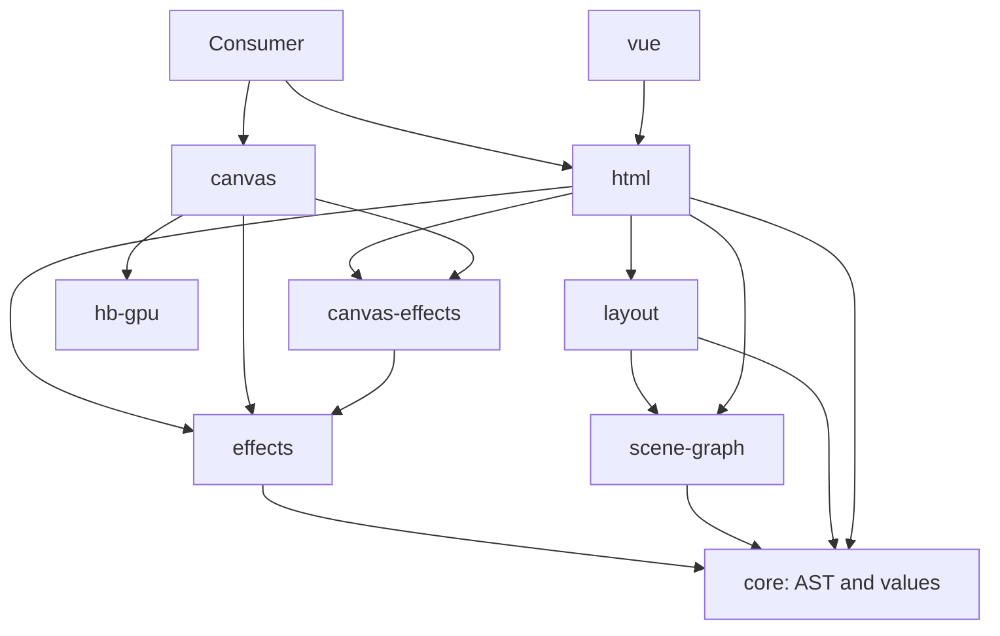

# Architecture

Packages have one-way dependencies and explicit owners. HTML and canvas are parallel rendering
tracks: neither imports the other. A consumer selects and positions scene parts in each renderer.

## Responsibilities

| Package          | Owns                                                                                                                          | Public entrypoints                  |
| ---------------- | ----------------------------------------------------------------------------------------------------------------------------- | ----------------------------------- |
| `core`           | Canonical Godot AST, Variants, resource references, primitives and narrow value conversions                                   | root                                |
| `tscn-parser`    | Text-to-AST parsing, preserving Godot property names                                                                          | root                                |
| `scene-graph`    | Graph types, structural options, visual derivation and external-scene resolution interfaces                                   | root, `/provenance`                 |
| `layout`         | Rectangle-bearing scene trees, Control layout policy and anchor interpretation                                                | root, `/anchors`                    |
| `project`        | Project resource resolution and loading                                                                                       | conditional root, `/node`, `/fetch` |
| `effects`        | Deterministic particle simulation, preprocessing, instance packing, numeric easing, shader frontend and GLSL/WGSL compilation | `/particles`, `/shaders`, `/easing` |
| `canvas-effects` | GPU programs, buffers, texture uploads, targets, drawing, capture and context recovery                                        | `/webgl`, `/webgpu`                 |
| `html`           | HTML/CSS projection, text, resources, DOM placement, observers, fallback paint and presentation lifecycle                     | root, `/runtime`                    |
| `canvas`         | Draw lists, batching, clipping, damage/replay, stage presentation and draw execution                                          | root, `/glyphs`                     |
| `hb-gpu`         | HarfBuzz Slug glyph outlines in a borrowed GL context                                                                         | root                                |
| `vue`            | Reactive components and slots over shared HTML presentation and runtime binding                                               | root                                |
| `test-harness`   | Pure comparisons, browser fact collection and Node parity orchestration                                                       | root, `/browser`, `/parity`         |
| `perf-harness`   | The shared report contract and separate Node orchestration                                                                    | root or `/report`, `/node`          |

The parser imports core types only, with no workspace runtime dependency. `hb-gpu` has no
workspace dependencies. Canvas loads it only through the optional glyph adapter. Core and effects
are typechecked without DOM libraries. Test image metrics live in repository test support;
production correctness tools do not import performance probes.

`scene-graph/provenance` centralizes the existing provenance keys. Loaders annotate resources before
publishing them to consumers. This changes ownership, not the scene-state wire format or the key
values. Structural options belong to scene-graph; layout options describe layout only.

## Effect ownership and composition

Effects take explicit semantic inputs and time. They do not fetch resources, own DOM nodes, schedule
frames or allocate GPU resources. Canvas-effects takes supplied contexts/devices, resolved resources,
targets and frame inputs; it does not discover DOM nodes, interpret CSS or consume canvas draw lists.
Borrowed contexts and textures remain owned by their supplier. Owned targets and buffers have explicit
release and context-loss paths.

HTML's DOM effect binding reads effect attributes and backgrounds, finds paint slots, observes sizes,
loads resources, manages visibility and fallback paint, and attaches canvases or frozen images. An effect
canvas inside DOM output provides HTML rendering completeness; it does not import the canvas scene
renderer. `createHtmlEffectsHost` from `html/runtime` is the common lifecycle used by DOM mounting,
Vue and external hosts. Per-family options allow shader and particle settings to change independently.
`GodotHtmlRenderOptions` describes the model; `GodotHtmlRuntimeOptions` describes the live binding.
`GodotHtmlMountOptions` combines them for hosts that do both. `unmountHtmlScene` releases a DOM mount.
External hosts set `externalRuntimes` on the model mount to avoid duplicate bindings.

Canvas adapters supply the current framebuffer, transform, scissor and painter position to
canvas-effects. They use the stage's existing clock. Stage projection carries exact design dimensions
alongside framebuffer dimensions and matrices, including for glyph rendering.

There is no automatic scene partitioner or universal compositor. Consumers place canvas surfaces
among DOM layers explicitly, and each binding has one lifecycle owner. DOM stacking and canvas draw
list ordering remain independent. A screen-sampling effect receives an explicit accumulated input
from its renderer; mixed rendering does not implicitly produce a shared screen texture. DOM bindings
retain paced scheduling and their existing shared-surface, backend fallback and frozen-image policies.

## Source consumption and enforcement

Every package export has a `development` condition pointing to TypeScript source. Source consumers
should enable that condition, rather than accidentally loading stale `dist`. Browser TypeScript
projects also enable `browser` and `strictNullChecks`; Vite resolves `browser` and `development`.
Project's conditional root selects the fetch resolver in browsers and the filesystem resolver in Node;
use `/fetch` or `/node` when the host is known. Node probes need a TypeScript-aware loader.

Consumer aliases and TypeScript paths must select actual toolkit sources. Handwritten ambient toolkit
declarations hide migration errors and should not shadow those sources. Removed exports have no
deprecated shims: migrate semantic imports to effects, GPU imports to canvas-effects, graph types to
scene-graph, tree types to layout, and DOM runtime imports to html/runtime.

The package-boundary suite enforces declared dependencies, public subpaths, renderer independence and
acyclic imports. Browser bundle probes ensure pure imports do not load GPU implementations or Node
orchestration. The shared `perf-report/1` format remains unchanged.
