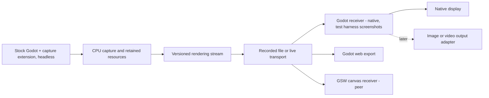

# Handoff for headless Godot rendering streams

Status: research handoff prepared October 8, 2026, revised the same day to
retarget capture at stock-engine RenderingServer interposition. Implementation
starts with gate -1. Complete and verify small increments, committing each
finished capability. Never push or tag without an explicit request.

## Goal and decisions

Run a Godot scene on a CPU-only headless host, capture its evaluated drawing
instructions and resources, and let an independent receiver render the scene.
Build confidence through small, generic Godot fixtures: rectangles, transforms,
textures, clipping, text, and changing geometry. Progress toward complete 2D scenes
at a configured publication rate, or the rate the host and receiver can sustain.

The capture seam is RenderingServer interposition from a GDExtension, so one
capture library serves a game developer who controls the project and a modder
who controls neither engine nor project. It installs three ways against the
same protocol: a `.gdextension` file in the project, a runtime
`GDExtensionManager.load_extension` call from a mod, or compilation into an
engine build by a developer who owns the engine. A patched engine is not the
capture seam: the primary target game forbids modifying its installed
executable, and a modder cannot ship one. A locally patched build remains
useful only as a trace oracle for hook completeness.

Implement a native Godot receiver first as the fidelity oracle. Two browser
receivers are planned peers, chosen per game by feature manifest: a web export
of the native receiver, which compiles captured canvas shaders exactly as the
engine does, and this repository's canvas renderer, which is lighter and
declares an explicit supported subset with typed refusal for the rest.

Every visual capability needs an independent, normally rendered Godot reference.
Compare its actual pixels with the receiver's pixels produced from headless
capture. Geometry equality, successful parsing, and two matching blank images are
insufficient. The headless host does not itself generate the reference screenshot.

Keep this work in `godot-scene-web`. It already owns generic rendering fixtures,
Godot comparisons, resource handling, and browser rendering. Place the experimental
implementation under `experiments/render-stream/`; keep reusable fixtures and
comparison helpers in their established locations when they genuinely fit. Do not
change the existing parser or scene-state contract into a rendering protocol.

A broader repository name makes sense eventually. `godot-render-stream` describes
both capture and receivers more clearly than `godot-client`, although the repository
also contains useful scene parsing and layout packages. Keep the current name and
published package names during this work; renaming is a separate maintenance task.

### Architecture and outputs

Game logic, layout, and CPU animation remain on the host. Receivers consume
presentation data; they must not load the original gameplay scripts or reconstruct
the original scene to make a fixture pass. A native receiver can use RenderingServer
resources directly rather than recreate a matching Control tree.

Headless means no host scene rasterization and no host GPU dependency in the tested
capture path. CPU font shaping and glyph-atlas generation are allowed. Visual assets
must remain available; dedicated-server exports that strip them are unsuitable.
An image or video output still needs a renderer somewhere. That renderer may live
on a client or a separate worker; it is independent of the capture process.

Implement native display first. The test harness takes screenshots of the ordinary
Godot reference and the receiver; this does not require a product image-output
adapter. Bring up the Godot web export and the GSW canvas receiver, both peer
browser receivers chosen per game by feature manifest, once native reconstruction
is established. Standalone image output, video encoding, and alternate transports
are later adapters, not first-stage prerequisites.

### Languages and engine integration

Use C++ for the capture seam and typed GDScript for fixture scripts and receiver
orchestration. The seam is a C-ABI GDExtension shared library with no GSW
dependency, so it can move to its own repository as a file move. A modder's
install shim is a few lines of mod code that loads the extension and holds no
logic itself; STS2 mods are already C# using native-library loading, so the
STS2 shim fits that pattern directly. Require typed members, parameters,
returns, and collections where supported; enable untyped/unsafe-access warnings
as errors and validate dynamic protocol input at its boundary.

C# offers stronger general-purpose language tooling, but it does not expose extra
rendering observability and would require a .NET-enabled host. The shared receiver
also needs web export, which current official Godot 4 C# exports do not support.
A game or mod's C# install shim uses the same rendering protocol without imposing
C# on the receiver. Keep performance-critical capture and copying in native code;
move receiver hot paths only when profiling establishes a need.

Keep the pinned Godot 4.5.1 source checkout, commit
`f62fdbde15035c5576dad93e586201f4d41ef0cb`, for headers, the virtual-method
anchor table, and an optional trace oracle. Do not mutate it and do not vendor
the engine. Capture ships no engine patch series.

Derive vtable slots per target binary, never from compiled headers alone. In an
abstract class's vtable, pure-virtual slots are distinguishable from the handful
of implemented ones; matching that implemented-slot pattern against the pinned
header's non-pure virtuals yields the Object prefix and proves no interior
insertion, read-only and with no code execution. STS2 ships Mega Crit's fork
`MegaDot v4.5.1.m.14.mono.custom_build`, a stripped GCC 13.2 release template;
couch-coop forbids modifying or redistributing that installed executable.
Read-only static analysis of that binary locates the abstract RenderingServer
vtable by RTTI and finds an implemented-slot pattern matching the upstream
4.5.1 release at an Object prefix of 23, 17 of 17 anchors, no interior
insertions. The official 4.5.1 Linux debug template carries the pattern at
prefix 42; the editor build matches no release layout; the 4.6.2 and 4.7.2
release templates carry it at prefix 22. Calibrate only against the flavour
you will run.

Of 1960 loads of the RS singleton in that binary, 1792 are followed by a vptr
load; 856 speculative-devirtualization guards fall back to the indirect call
whenever a slot differs; zero calls are fully devirtualized to an RS slot above
the Object prefix, so a shadow vtable pointer reaches every call site. Linux LTO
does not use `-fwhole-program`; MinGW Windows LTO does
(`platform/windows/detect.py`), so Windows needs its own devirtualization
census before this holds there.

Keep instrumentation opt-in and disabled unless configured. Start with a
single-threaded capture configuration; threaded rendering is a later explicit
test. Hooks forward every call to the original slot: a recording tap, not a
replacement server.

Public CanvasItem draw notifications do not carry command payloads. A public API
addon can wrap opted-in drawing calls, but neither GDScript nor C# can transparently
intercept all existing native Control drawing through that mechanism. The capture
extension must capture ordinary native nodes, scripted `_draw()` calls, direct
RenderingServer calls, and calls from third-party extensions such as spine-godot,
without requiring fixture-specific wrappers: spine-godot is itself a GDExtension,
so its RS calls go through method binds to a runtime vtable lookup and are
interceptable regardless of LTO in the main binary.

### Validation and refusal per binary

Arming order, with no memory written until the last step: match engine version
string, build id and executable hash against a calibration record; confirm the
live vtable against the recorded slot table, including the implemented/pure
pattern of the in-memory abstract vtable; only then install the shadow vtable,
and confirm by behavior that a hooked slot receives a fixture call with its
exact argument bytes and that a packed-array argument decodes exactly, before
the session advertises itself as capturing. An unknown binary refuses and
reports; it never guesses an offset. Never call an unidentified slot to probe
it: a few slots away from the read-only mesh-format getters sit a method taking
a vector reference and one writing through a pointer argument.

Interposition writes one aligned pointer into the server object's heap-resident
vtable pointer. It patches no code, needs no page-protection change, and
therefore has a path to Windows and macOS. Disarm restores that pointer only
after verifying the shadow pointer is still installed, and refuses teardown
otherwise. Read engine objects such as images through GDExtension method binds
rather than replicated member layouts; a failed method-bind lookup is itself a
refusal signal. Game-derived addresses and calibration records for a commercial
binary stay in local ignored research; records for open-source engine builds
may be committed.

Platform scope: Linux x86-64 through gate 6. Windows next, with its own
devirtualization census on the shipped PE and a PE/COFF calibrator for whichever
ABI it uses; macOS last.

## Evidence to reuse

Read these before designing geometry capture or adding another animation runtime:

| Reference                                                                                                                                                                                                    | What it contributes                                                                                                                          |
| ------------------------------------------------------------------------------------------------------------------------------------------------------------------------------------------------------------ | -------------------------------------------------------------------------------------------------------------------------------------------- |
| [Spirectl geoclip baker](../../spirectl/bridge-mod/src/Spirectl.Sts2/Live/Sts2SpineGeoClipBaker.cs) and [headless guard](../../spirectl/bridge-mod/src/Spirectl.Sts2/Live/Sts2SpineGeoClipHeadlessRemint.cs) | Evaluating original runtime content and extracting renderable geometry; the current limits of dummy storage.                                 |
| [Shared geoclip representation and sampler](../../spirectl/presentation/web/src/spine/geoclip.ts)                                                                                                            | Mesh, texture, ordering, and deformation representation independent of a drawing backend.                                                    |
| [Unmerged packer worktree](../../gcpack/spirectl/bridge-mod/src/Spirectl.Sts2/Live/Sts2SpineGeoClipCore.cs)                                                                                                  | Existing producer-to-consumer packing work; inspect without resetting, merging, or changing the worktree.                                    |
| [GSW parity documentation](parity.md), [fixture catalog](../fixtures/README.md), and [image comparison helpers](../packages/test-harness/src/image-diff.ts)                                                  | Existing assets, artifact conventions, and pixel-comparison building blocks.                                                                 |
| [Spirectl native observation probe](../../spirectl/experiments/native-scene-invalidation/README.md)                                                                                                          | Fingerprint gating, refuse-before-write, a bounded dirty ring, reversible shadow-vtable arm and disarm, and absolute-path extension loading. |

The headless geoclip pose repair and animated-output guard are already on spirectl
main. Correct CPU-only single-pose extraction was demonstrated for four rigs.
Subsequent animated samples were stale; multi-frame dummy extraction is refused.
Software-renderer animation evidence is separate and still performs host rendering.
The publication packer remains unmerged and uncommitted as of this audit. Its
single-pose parser success and archived animated encoding test do not establish
fresh headless animation capture.

The native observation probe proved none of: real rendering-server slot
derivation, engine argument decoding, concurrency quiescence, or anything against
a game. Do not carry forward its code-patching trampoline; render capture needs
no code patch.

The original receipts are local research material, not dependencies of public GSW
tests:

- [Headless pose comparison](../../sts2-couch-coop/.sts2/research/data/geoclip-headless-mintmark-20260909T180000Z/results.txt).
- [Animated-output failure and guard](../../sts2-couch-coop/.sts2/research/data/geoclip-mfguard-20260909T170000Z/results.txt).
- [Software-renderer comparison](../../sts2-couch-coop/.sts2/research/data/geoclip-swrast-hardening-20260909T160000Z/results.txt).
- [Publication packer validation](../../sts2-couch-coop/.sts2/research/data/geoclip-packer-20260911T050000Z/results.txt).

Reuse the engineering lessons and generic contracts where appropriate. Do not copy
game internals, game assets, captured game payloads, or the game's runtime into GSW.
Use synthetic changing meshes to test the same failure class. Do not introduce a
Spine dependency merely to exercise mesh updates, and do not move geoclip ownership
out of spirectl as part of this work.

## Capture and receiver contract

The first protocol is an experimental rendering contract, not a stable public API.
Use a named version and explicit supported-feature manifest. Keep it separate from
GSW's AST, semantic scene state, and geoclip file versions.

Provide these minimum boundaries:

- A capture session records engine/build identity, rendering profile, viewport,
  resources, canvas state, and frame sequence/timing.
- A transport-independent decoder accepts recorded or live protocol records.
- A receiver applies a complete frame transaction before making it eligible to draw.
- Native display is the first output. The test harness captures receiver screenshots;
  standalone image/video output interfaces are deferred.
- A result distinguishes unsupported features, capture failure, replay failure,
  pixel mismatch, and successful reconstruction. Never silently omit an operation.

Use explicit operation kinds and stable wire IDs rather than pointers or engine
RIDs. IDs must remain unambiguous after resource deletion and recreation and across
sessions. Version mutable resources; copy update payloads at capture time so a later
mutation of the same CPU image cannot alter an earlier frame.

Start with complete canvas-state snapshots at publication boundaries plus cached,
versioned resource payloads. Maintain that state from mutation hooks, not scene-tree
polling. A snapshot identifies every resource version it needs and contains complete
per-item drawing state. The receiver reconciles identities rather than rebuilding
all GPU objects for every frame. Only changed resource content should be uploaded.

This deliberately makes initial frame replacement and reconnect straightforward.
Record the cost of complete state serialization honestly; incremental draw-state
encoding, compression, and batching are subsequent measured optimizations. Encode
a snapshot as a patch against the receiver's last acknowledged snapshot once
delivery exists, with a full snapshot on connect and on any desync. A full
serialization per publication is the correctness and measurement baseline, not
the wire format for a 1920 by 1080 scene at interactive rates.

Frame the protocol as inspectable JSON metadata plus length-prefixed binary
payload blocks; do not base64 pixels or vertices into the metadata. Deliver
resources out of band, content-addressed by payload hash over HTTP with immutable
caching, so a browser receiver reuses its cache across sessions and the live
stream carries only hashes and versions. Keep inline payloads for small or
rapidly changing resources such as glyph-atlas deltas. A host serves resources
only to clients it has authorized, from the operator's own installation, over
their own network; captured game assets and captured shader source are never
committed, published, or served from shared infrastructure. Keep the codec
independent of file and network handling and verify identical decoded
transactions from both. Use WebSocket as the first live adapter. Do not spend
the initial stages comparing transports or designing a universal GPU-command
wire format.

Install capture before fixture resources load: scene-level extension
initialization runs after the rendering server exists and before the main
scene loads, and a runtime load initializes to the current level immediately.
Publish from the extension's registered main-loop frame callback, which runs
after the deferred-redraw message flush and after rendering-server
synchronization on every iteration, headless included. Do not hook `sync()`
for this and do not rely on `frame_pre_draw` or `frame_post_draw`: headless
skips the draw branch, so neither fires. Preserve texture and mesh updates;
dummy storage retains an initial texture image but discards in-place updates,
replacements, mesh region updates and polygon arrays, including font-atlas
updates. Capture argument bytes on the calling thread: resource loader threads
create textures, and a referenced image can mutate after the call.

Keep simulation time, publication rate, and receiver presentation rate separate.
Expose a positive target publication FPS and an uncapped mode. Do not accelerate
game time to manufacture a higher measured rate. Fixtures use explicit simulation
steps for correctness comparisons; real-time runs use elapsed time normally.

### Slow receivers and resource dependencies

Implement application backpressure before sustained streaming experiments:

- Allow at most one frame transaction in flight per receiver, with one replaceable
  pending target state. Form/serialize the next transaction only when credit exists.
- While the receiver is busy, keep capturing current retained state and coalesce
  obsolete presentation targets. Do not accumulate an unbounded frame/event journal.
- Pin resource versions required by an in-flight transaction. Retire obsolete
  versions after they are no longer referenced; updates needed by a later frame must
  survive skipped presentations.
- Let a slow receiver catch up to current state instead of replaying every missed
  presentation. Reconnect starts a fresh session snapshot and resource inventory.
- Keep the simulation running when a receiver stalls or disconnects. Separate
  per-receiver delivery state from the host's authoritative captured state.
- Arm the hook only while a subscriber is connected, and disarm it when the last
  one leaves. A permanently installed hook with an early return is not zero
  overhead.

Return frame credit from the receiver's paced rendering loop, not immediately upon
socket receipt. Distinguish received, applied, submitted, and presented progress.
Godot draw callbacks and application acknowledgments are not proof of GPU completion
or physical presentation. Bound application queues, use normal native presentation
pacing, and measure actual GPU/display behavior separately where instrumentation
permits it. Do not claim that a one-frame application queue eliminates GPU backlog.

## Configuration for other games

The same capture library must serve another game without code changes. These
are configuration, declared per game and reported in the session manifest:
which viewports and canvas layers are captured and which are excluded; the
logical size, content-scale mode and whether the host or the receiver applies
the stretch transform; publication rate and uncapped mode; resource policy,
including inline versus content-addressed delivery, cache budget, maximum
payload and permitted formats; the material and canvas-shader policy, meaning
transmit source, transmit parameters only, or exclude; per-game node
exclusions; install mode and calibration-record location; and
arm-on-first-subscriber, disarm-on-last-subscriber behavior.

Receivers advertise capabilities and the session negotiates: unsupported
commands are reported as unsupported, with the configured choice between
dropping them with a report and failing the session. Record the
engine-capability floor too: the main-loop frame callback used as the
publication boundary exists from Godot 4.5, and an older engine needs a
different boundary established before it is advertised as supported.

STS2 uses inline `ShaderMaterial`s whose parameters live only in memory, so
capture taps `shader_set_code`, `material_set_shader`, `material_set_param`,
`canvas_item_set_material` and instance shader parameters. Native and
web-export receivers compile captured shader source through RenderingServer,
exactly as the engine does. The GSW receiver transpiles its supported subset
through `packages/effects` and reports typed unsupported for the rest. Shader
source is game content and follows the same no-redistribution rule as other
captured assets.

## Incremental implementation sequence

Each row is a capability gate, often several small commits. Start with its simplest
fixture and add edge cases in separate verified commits. Do not combine all rows
into one implementation round or postpone fidelity checks until the final scene.

| Gate                                       | Capability and required evidence                                                                                                                                                                                                                                                                                                                                                                                                                                                                                                                                                                      |
| ------------------------------------------ | ----------------------------------------------------------------------------------------------------------------------------------------------------------------------------------------------------------------------------------------------------------------------------------------------------------------------------------------------------------------------------------------------------------------------------------------------------------------------------------------------------------------------------------------------------------------------------------------------------- |
| -1. Interposition spike                    | Load the capture extension into an unmodified official 4.5.1 release template under `--headless`. Record the fingerprint, mask-derived slot table and anchors matched. Hook a small slot set; show counts from an engine-internal control, from a native label's glyph path and from a direct script call, exact argument bytes for a known rectangle, exact decode of a known packed array, clean disarm, and identical pixels between an armed and an unarmed rendered run. Prove refusal on a tampered fingerprint and on a deliberately wrong slot table.                                         |
| -0.5. Target binary validation             | Run the same library unmodified against the installed target game in an owned isolated headless instance, validate-only with no memory written, and record its accept or refuse decision with anchors matched. Requires the operator's explicit go-ahead.                                                                                                                                                                                                                                                                                                                                             |
| -0.25. Target binary counters              | Arm counters only on that instance: nonzero rectangle, texture-rect and triangle-array traffic, including a rig drawn by a third-party extension; clean disarm; normal instance readiness; no crash over a sustained run.                                                                                                                                                                                                                                                                                                                                                                             |
| 0. Independent reference and one rectangle | Run an ordinary rendered fixture, a CPU-only capture host — the stock engine template plus the capture extension — and a receiver. Replay a recording of one opaque rectangle. Compare actual pixels and independently expected rectangle/step-marker pixels. Prove the receiver consumed the stream and never loaded the source scene.                                                                                                                                                                                                                                                               |
| 1. Retained canvas state and delivery      | Parent/child transforms and modulation; transform changes without redraw; draw order; visibility; clear/replacement; create/free/recreate. Add the live adapter and a receiver stall with bounded pending state. Require recording/live equivalence and correct newest-state recovery. Compare the headless capture's root viewport size and canvas transform against the rendered reference, since a headless display server can report a degenerate window size. Patch-encoded snapshots begin here; optionally run a one-off diff against the local trace-oracle build to prove hook completeness. |
| 2. Textures                                | One procedural texture, shared references, regions/flips, filtering/repeat, then changing pixels, replacement and lifetime. A transform-only update must not re-upload texture bytes. Exercise a fresh receiver and a fresh asset cache. Deliver resources out of band, content-addressed by payload hash.                                                                                                                                                                                                                                                                                            |
| 3. Clipping                                | Nested axis-aligned Control clipping, moving content and changing clip bounds. Check explicit pixels inside/outside every boundary. Add rotated/scaled parents as a separate fixture that follows Godot's actual clipping semantics.                                                                                                                                                                                                                                                                                                                                                                  |
| 4. Text                                    | A native Label with a pinned redistributable font, initially grayscale bitmap glyphs. Change strings after frame one to introduce new glyphs and atlas updates; then sizes, wrapping/alignment, RichTextLabel spans, and multilingual shaping supported by the pinned fonts. Capture host-evaluated glyph placement and atlas content; do not shape the text again on the receiver.                                                                                                                                                                                                                   |
| 5. Geometry and broader 2D                 | Lines, polygons, textured triangles, then persistent mutable meshes. Change vertices, indices and color data over multiple frames and through dropped presentations. Include a synthetic geoclip-like deforming mesh and resource recreation. Add nine-patch/stylebox coverage needed by the combined scene.                                                                                                                                                                                                                                                                                          |
| 5.5. Materials and canvas shaders          | Canvas-item material blend and light modes, then a shader material with captured source and live parameters. Native and web-export receivers compile the captured source; the GSW browser receiver transpiles its supported subset and reports the rest as typed unsupported. Pixel-compare each supported case.                                                                                                                                                                                                                                                                                      |
| 6. Complete declared 2D scene              | Combine native controls, custom drawing, text, clipped scrolling, texture changes and animated geometry in one scene. Validate all deterministic checkpoints plus live motion, rate control, stalls, reconnect and stable resource usage. Add a 1920 by 1080 `canvas_items`-stretch fixture alongside the 640 by 360 primitives fixture. Publish the exact supported-feature list and measured costs.                                                                                                                                                                                                 |
| 7. Browser receivers                       | Export the receiver project using Godot Compatibility/WebGL 2, and, as an independent peer, run this repository's canvas receiver. Replay the same recordings and live stream through both. Repeat pixel, lifecycle and pacing gates for each; account for browser suspension, startup cost and memory. Publish each receiver's feature manifest; neither substitutes for the other.                                                                                                                                                                                                                  |
| 8. STS2 integration                        | Integrate behind couch-coop's instance rules, with the streaming seat opting out of the headless visual freeze/suspender. Only after the generic gates and measured costs are complete.                                                                                                                                                                                                                                                                                                                                                                                                               |

Use a fixed 2D Compatibility configuration for the initial reference and receivers:
matching viewport dimensions and pixel scale, HDR 2D disabled, fixed texture/font
settings, and no MSAA in the first primitive fixtures. Begin at 640 by 360 physical
pixels and scale workload/resolution explicitly in later measurements.

Gate 6 means a complete scene within its declared feature set, not arbitrary Godot
compatibility. Continue adding one capability at a time: text outlines/MSDF and
fallback fonts; CanvasGroup/masks; offscreen viewports and viewport textures; shader
time and screen-texture dependencies; particles and GPU-dependent effects. Each
requires a reference fixture, protocol coverage, and receiver support before it is
advertised. A feature requiring GPU evaluation on the host is an explicit
architectural finding, not permission to quietly enable a host GPU.

Standalone image/video output, arbitrary existing-game deployment beyond STS2, 3D,
gameplay input, and audio are later work, as are Windows and macOS — see
"Validation and refusal per binary" for their platform scope. STS2 integration is
gate 8: it follows the generic gates and measured costs, and its own validation
legs, gates -0.5 and -0.25, against the installed binary. Passing the generic
fixtures does not by itself establish that an installed commercial game can be
captured.

## Validation and measurement

### Three independent roles

1. **Reference:** an ordinary Godot build at the pinned upstream revision loads and
   renders the original fixture normally. It must not replay the captured stream.
2. **Capture host:** an unmodified official or stock engine binary at the pinned
   revision, with the capture extension installed, loads that fixture under true
   headless execution and records its commands and resources without scene
   rasterization.
3. **Receiver:** an independently launched ordinary Godot receiver renders only the
   captured stream. It has the generic receiver project and transmitted assets,
   never the source fixture logic or gameplay code.

Compare the reference and receiver at the same explicit fixture step, not at similar
wall-clock times. Deterministic fixture scripts expose an advance-and-settle action;
the runner waits for the corresponding capture commit and rendered receiver step.
The render completion wait belongs on rendered processes, not the headless host.

Use normal rendering inside private headless gamescope for the reference and native
receiver. Remove inherited desktop display routes and verify compositor PID/start
identity, selected GPU, process display connection, and compositor liveness. Stop
owned processes if their compositor dies. Never use Xvfb for these Godot instances
or open a window on the user's desktop without explicit permission. Follow the
[existing isolated-display rules](../../sts2-couch-coop/docs/agents/qa-recipes.md#2x-hidden-game-displays).

Verify the capture host's no-op rendering backend by its display server name, not
by rendering driver or method: a headless process still reports the rendering
driver and method it was configured for, so a check keyed on those names matches
nothing and silently proves nothing. Retain process arguments, build hashes,
renderer logs, and relevant process device/library evidence of its lack of
graphics-device use. An empty GPU library list alone is not the whole proof. Do
not allow a raster fallback to make a failed headless fixture appear successful.
Also prove the tap is transparent: the same fixture rendered normally with capture
armed and with capture absent must produce identical pixels.

### Pixel and state checks

Reuse GSW's generated assets, font provisioning, and raw RGBA comparison helpers.
Create a separate remote-render runner: the existing parity runner assumes DOM
layout and its rendered Godot launch inherits display environment. Neither is the
right contract for this receiver.

- Store `reference.png`, `receiver.png`, `diff.png`, the recording/resource manifest,
  fixture-step records, and a machine-readable result under ignored
  `artifacts/render-stream/<fixture>/<run>/`.
- Compare both the full viewport and targeted regions. Normalize dimensions,
  orientation, pixel format, color configuration and alpha treatment first.
- Require exact pixels for initial integer-aligned opaque primitives on the same
  backend. For filtered edges/text, record per-fixture channel and pixel budgets
  justified by a same-build reference repeat. Do not relax a budget to hide a bug.
- Set raw channel limits explicitly: the existing raw comparator's default maximum
  channel delta of 255 is unenforced. Perceptual image diff alone can hide alpha
  errors and small missing elements. Test transparent content over multiple backgrounds.
- Assert independent fixture-specific presence and freshness markers. Include
  multiple intermediate frames, not only the final settled scene.
- Assert sequence, resource versions/counts, draw-state replacement, and lifetime
  alongside images. Missing assets, unsupported commands, and incomplete captures fail.
- Validate the harness by intentionally freezing one frame, omitting an update,
  and perturbing a transform; the corresponding gate must fail.

Any report claiming visual correctness must name the concrete image artifact paths.
Commit fixtures, expected invariants, code and concise findings; keep generated
captures, screenshots, build outputs and private game material uncommitted.

### Cadence and performance

After correctness, measure host simulation separately from capture/copy,
serialization, transport, receiver decode/apply, resource upload, GPU rendering and
presentation where observable. Report requested, published, applied, and actually
presented rates separately; unavailable GPU/presentation measurements remain marked
unavailable. Socket throughput or draw submissions are not displayed FPS.

Run target rates of 15, 30 and 60 FPS, plus uncapped capture. Include host/receiver
rate mismatches, a two-second receiver stall, reconnect, and a constrained transport.
Separate an injected receiver delay from a genuinely GPU-limited workload. Verify
that pending frame count stays bounded and final pixels match the latest state after
recovery, including a resource update that occurred while presentations were skipped.

Record queue depth/bytes/oldest age, coalesced presentations, resource residency,
CPU time distributions and allocation growth. Use one warmup and five measured
repeats for comparisons, with cold and warm asset cases separated. Keep screenshot
readbacks outside timed intervals. State resolution, rendering profile, versions,
hardware and timing provenance with every result.

Use a small experiment-specific result schema such as `render-stream-report/1`.
The existing `perf-report/1` has browser-specific GPU attribution and no native
receiver profile; do not disguise native runs as browser measurements. Generalize
the shared report only when there is a concrete second consumer.

No fixed performance improvement is assumed. Gate 6 delivers a correctness result,
coverage manifest and measured throughput limits; those results determine subsequent
optimization work and whether this approach is worth integrating into CouchCoop.

## Working and reporting rules

Leave shared sibling checkouts on clean main. Implement in isolated worktrees and
run the repository's agent-config installer there. Preserve other agents' edits and
the dirty unmerged geoclip worktrees. Do not automatically merge the packer as a
prerequisite for generic GSW research.

Any leg against the installed commercial game follows that repository's instance
rules: acquire the install lease and an exclusive named game resource inside one
shell invocation, use an absolute private user directory with the platform profile
seeded, use a private bridge socket, never start a second networked host, never
touch the operator's game, profile or cloud saves, and never modify or redistribute
the installed executable. Record hashes of anything you could have perturbed before
the leg, not after. The engine source checkout is shared too; do not modify it.

For each increment: identify one behavior, add a fixture that would catch its
failure, implement it, run its focused correctness checks, and commit the verified
change using the repository convention. Run downstream checks only when shared
production code changes; an isolated experimental addition must not force STS2
deployment. Keep the existing DOM and canvas paths operational.

Record negative findings too. A failed hypothesis can produce a documentation
commit with reproducible evidence pointers, but do not commit broken implementation
or claim a capability that silently falls back. A blocker should name the missing
engine behavior and the smallest next experiment, without broadening the project
into a new renderer rewrite.

At each gate, report the commit subjects, supported behaviors, unsupported features,
test outcome, concrete artifact paths, measured costs if any, and the next bounded
capability.

## Primary technical references

- [Godot 4.5.1 canvas redraw lifecycle](https://github.com/godotengine/godot/blob/4.5.1-stable/scene/main/canvas_item.cpp): deferred redraw generates native and scripted drawing calls independently of scene rasterization.
- [Godot RenderingServer contract](https://docs.godotengine.org/en/stable/classes/class_renderingserver.html): opaque resources and drawing APIs, without a public general command-capture interface.
- [Dummy mesh storage](https://github.com/godotengine/godot/blob/4.5.1-stable/servers/rendering/dummy/storage/mesh_storage.h) and [dummy texture storage](https://github.com/godotengine/godot/blob/4.5.1-stable/servers/rendering/dummy/storage/texture_storage.h): retain the initial texture image (`texture_2d_initialize` duplicates it) but discard `texture_2d_update`, `texture_replace`, mesh region updates, and `request_polygon` arrays.
- [Godot 4.5.1 main loop](https://github.com/godotengine/godot/blob/4.5.1-stable/main/main.cpp): publication must not depend on a draw branch that headless execution can skip.
- [GDExtension main-loop callbacks](https://github.com/godotengine/godot/blob/4.5.1-stable/core/extension/gdextension.cpp): `_register_main_loop_callbacks` registers the frame callback that `GDExtensionManager::frame()` invokes at `main/main.cpp:4839`, after the message-queue flush and `RenderingServer::sync()` at line 4814, every main-loop iteration including headless.
- [`servers/display_server_headless.h`](https://github.com/godotengine/godot/blob/4.5.1-stable/servers/display_server_headless.h): `window_get_size()` returns `Size2i()` (line 129), so the root stretch transform may be degenerate under headless.
- [Itanium C++ ABI, vtable layout](https://itanium-cxx-abi.github.io/cxx-abi/abi.html#vtable): the layout that per-binary slot derivation and the shadow-vtable pointer swap rely on.
- [Typed GDScript](https://docs.godotengine.org/en/stable/tutorials/scripting/gdscript/static_typing.html) and [warnings](https://docs.godotengine.org/en/stable/tutorials/scripting/gdscript/warning_system.html): the fixture and receiver coding discipline.
- [Web export](https://docs.godotengine.org/en/stable/tutorials/export/exporting_for_web.html): Compatibility/WebGL 2, C# limits, and browser transport constraints.
- [Dedicated-server export](https://docs.godotengine.org/en/stable/tutorials/export/exporting_for_dedicated_servers.html): headless execution and visual-resource stripping are separate choices.
- STS2 headless seats freeze Spine/particles and idle the visuals at MaxFps 8
  (couch-coop memories `headless-permanent-spine-freeze`,
  `headless-permanent-particle-freeze`, `headless-idle-visual-suspend`); gate 8's
  streaming seat must disable them, a couch-coop configuration precondition.
