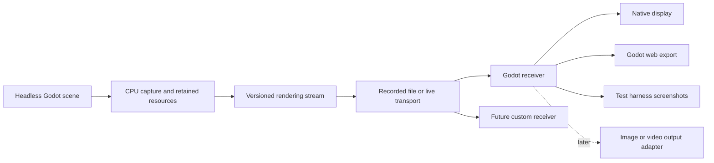

# Handoff for headless Godot rendering streams

Status: research and implementation handoff, prepared October 8, 2026. This is
documentation only; do not start implementation merely because the handoff exists
or has been committed. When implementation is explicitly started,
complete and verify small increments, committing each finished capability. Never
push or tag without an explicit request.

## Goal and decisions

Run a Godot scene on a CPU-only headless host, capture its evaluated drawing
instructions and resources, and let an independent receiver render the scene.
Build confidence through small, generic Godot fixtures: rectangles, transforms,
textures, clipping, text, and changing geometry. Progress toward complete 2D scenes
at a configured publication rate, or the rate the host and receiver can sustain.

The user chose a controlled Godot engine build for the first capture experiments
and a native Godot receiver first. The first browser receiver should be a web
export of that same receiver project. A custom browser renderer remains another
possible consumer, justified later by measured compatibility or performance needs.

Every visual capability needs an independent, normally rendered Godot reference.
Compare its actual pixels with the receiver's pixels produced from headless
capture. Geometry equality, successful parsing, and two matching blank images are
insufficient. The headless host does not itself generate the reference screenshot.

Keep this work in `godot-scene-web`. It already owns generic rendering fixtures,
Godot comparisons, resource handling, and browser rendering. Place the experimental
implementation under `experiments/render-stream/`; keep reusable fixtures and
comparison helpers in their established locations when they genuinely fit. Do not
change the existing parser or scene-state contract into a rendering protocol.

A broader repository name makes sense eventually. `godot-render-stream` describes
both capture and receivers more clearly than `godot-client`, although the repository
also contains useful scene parsing and layout packages. Keep the current name and
published package names during this work; renaming is a separate maintenance task.

### Architecture and outputs

Game logic, layout, and CPU animation remain on the host. Receivers consume
presentation data; they must not load the original gameplay scripts or reconstruct
the original scene to make a fixture pass. A native receiver can use RenderingServer
resources directly rather than recreate a matching Control tree.

Headless means no host scene rasterization and no host GPU dependency in the tested
capture path. CPU font shaping and glyph-atlas generation are allowed. Visual assets
must remain available; dedicated-server exports that strip them are unsuitable.
An image or video output still needs a renderer somewhere. That renderer may live
on a client or a separate worker; it is independent of the capture process.

Implement native display first. The test harness takes screenshots of the ordinary
Godot reference and the receiver; this does not require a product image-output
adapter. Add the Godot web export after native reconstruction is established.
Standalone image output, video encoding, alternate transports, and a custom browser
backend are later adapters, not first-stage prerequisites.

### Languages and engine integration

Use C++ for the narrow engine capture seam and typed GDScript for fixture scripts
and receiver orchestration. Require typed members, parameters,
returns, and collections where supported; enable untyped/unsafe-access warnings
as errors and validate dynamic protocol input at its boundary.

C# offers stronger general-purpose language tooling, but it does not expose extra
rendering observability and would require a .NET-enabled host. The shared receiver
also needs web export, which current official Godot 4 C# exports do not support.
A future C# game/mod adapter can use the same rendering protocol without imposing
C# on the receiver. Keep performance-critical capture and copying in native code;
move receiver hot paths only when profiling establishes a need.

Start against the local Godot 4.5.1 source baseline, commit
`f62fdbde15035c5576dad93e586201f4d41ef0cb`. Store the upstream pin, reproducible patch
series, build instructions, and feature manifest in the experiment. Use an isolated
engine checkout/worktree and ignored build outputs. Do not mutate the shared Godot
source checkout or vendor the whole engine into GSW.

Instrument the canvas mutation and resource creation/update/free boundaries before
the dummy backend discards data. Keep instrumentation opt-in and disabled in normal
builds/runs. Do not replace all of RenderingServer as the first step. Start with a
single-threaded capture configuration; threaded rendering is a later explicit test.

Public CanvasItem draw notifications do not carry command payloads. A public API
addon can wrap opted-in drawing calls, but neither GDScript nor C# can transparently
intercept all existing native Control drawing through that mechanism. The controlled
engine experiment must capture ordinary native nodes, scripted `_draw()` calls, and
direct RenderingServer calls without requiring fixture-specific wrappers.

## Evidence to reuse

Read these before designing geometry capture or adding another animation runtime:

| Reference                                                                                                                                                                                                    | What it contributes                                                                                          |
| ------------------------------------------------------------------------------------------------------------------------------------------------------------------------------------------------------------ | ------------------------------------------------------------------------------------------------------------ |
| [Spirectl geoclip baker](../../spirectl/bridge-mod/src/Spirectl.Sts2/Live/Sts2SpineGeoClipBaker.cs) and [headless guard](../../spirectl/bridge-mod/src/Spirectl.Sts2/Live/Sts2SpineGeoClipHeadlessRemint.cs) | Evaluating original runtime content and extracting renderable geometry; the current limits of dummy storage. |
| [Shared geoclip representation and sampler](../../spirectl/presentation/web/src/spine/geoclip.ts)                                                                                                            | Mesh, texture, ordering, and deformation representation independent of a drawing backend.                    |
| [Unmerged packer worktree](../../gcpack/spirectl/bridge-mod/src/Spirectl.Sts2/Live/Sts2SpineGeoClipCore.cs)                                                                                                  | Existing producer-to-consumer packing work; inspect without resetting, merging, or changing the worktree.    |
| [GSW parity documentation](parity.md), [fixture catalog](../fixtures/README.md), and [image comparison helpers](../packages/test-harness/src/image-diff.ts)                                                  | Existing assets, artifact conventions, and pixel-comparison building blocks.                                 |

The headless geoclip pose repair and animated-output guard are already on spirectl
main. Correct CPU-only single-pose extraction was demonstrated for four rigs.
Subsequent animated samples were stale; multi-frame dummy extraction is refused.
Software-renderer animation evidence is separate and still performs host rendering.
The publication packer remains unmerged and uncommitted as of this audit. Its
single-pose parser success and archived animated encoding test do not establish
fresh headless animation capture.

The original receipts are local research material, not dependencies of public GSW
tests:

- [Headless pose comparison](../../sts2-couch-coop/.sts2/research/data/geoclip-headless-mintmark-20260909T180000Z/results.txt).
- [Animated-output failure and guard](../../sts2-couch-coop/.sts2/research/data/geoclip-mfguard-20260909T170000Z/results.txt).
- [Software-renderer comparison](../../sts2-couch-coop/.sts2/research/data/geoclip-swrast-hardening-20260909T160000Z/results.txt).
- [Publication packer validation](../../sts2-couch-coop/.sts2/research/data/geoclip-packer-20260911T050000Z/results.txt).

Reuse the engineering lessons and generic contracts where appropriate. Do not copy
game internals, game assets, captured game payloads, or the game's runtime into GSW.
Use synthetic changing meshes to test the same failure class. Do not introduce a
Spine dependency merely to exercise mesh updates, and do not move geoclip ownership
out of spirectl as part of this work.

## Capture and receiver contract

The first protocol is an experimental rendering contract, not a stable public API.
Use a named version and explicit supported-feature manifest. Keep it separate from
GSW's AST, semantic scene state, and geoclip file versions.

Provide these minimum boundaries:

- A capture session records engine/build identity, rendering profile, viewport,
  resources, canvas state, and frame sequence/timing.
- A transport-independent decoder accepts recorded or live protocol records.
- A receiver applies a complete frame transaction before making it eligible to draw.
- Native display is the first output. The test harness captures receiver screenshots;
  standalone image/video output interfaces are deferred.
- A result distinguishes unsupported features, capture failure, replay failure,
  pixel mismatch, and successful reconstruction. Never silently omit an operation.

Use explicit operation kinds and stable wire IDs rather than pointers or engine
RIDs. IDs must remain unambiguous after resource deletion and recreation and across
sessions. Version mutable resources; copy update payloads at capture time so a later
mutation of the same CPU image cannot alter an earlier frame.

Start with complete canvas-state snapshots at publication boundaries plus cached,
versioned resource payloads. Maintain that state from mutation hooks, not scene-tree
polling. A snapshot identifies every resource version it needs and contains complete
per-item drawing state. The receiver reconciles identities rather than rebuilding
all GPU objects for every frame. Only changed resource content should be uploaded.

This deliberately makes initial frame replacement and reconnect straightforward.
Record the cost of complete state serialization honestly; incremental draw-state
encoding, compression, and batching are subsequent measured optimizations.

Use inspectable JSON metadata and lossless resource payloads for the first recorded
fixtures. Keep the codec independent of file/network handling and verify identical
decoded transactions from both. Use WebSocket as the first live adapter because it
can serve native and browser receivers. Do not spend the initial stages comparing
transport protocols or designing a universal GPU-command wire format.

Install capture before fixture resources are loaded. Publish after deferred redraw
work and rendering-server synchronization at a deterministic main-loop boundary.
Do not rely on `frame_post_draw` on the capture host: a truly headless process can
skip that draw path. Preserve texture updates as well as mesh updates; dummy storage
can discard both, including updates to an existing font atlas.

Keep simulation time, publication rate, and receiver presentation rate separate.
Expose a positive target publication FPS and an uncapped mode. Do not accelerate
game time to manufacture a higher measured rate. Fixtures use explicit simulation
steps for correctness comparisons; real-time runs use elapsed time normally.

### Slow receivers and resource dependencies

Implement application backpressure before sustained streaming experiments:

- Allow at most one frame transaction in flight per receiver, with one replaceable
  pending target state. Form/serialize the next transaction only when credit exists.
- While the receiver is busy, keep capturing current retained state and coalesce
  obsolete presentation targets. Do not accumulate an unbounded frame/event journal.
- Pin resource versions required by an in-flight transaction. Retire obsolete
  versions after they are no longer referenced; updates needed by a later frame must
  survive skipped presentations.
- Let a slow receiver catch up to current state instead of replaying every missed
  presentation. Reconnect starts a fresh session snapshot and resource inventory.
- Keep the simulation running when a receiver stalls or disconnects. Separate
  per-receiver delivery state from the host's authoritative captured state.

Return frame credit from the receiver's paced rendering loop, not immediately upon
socket receipt. Distinguish received, applied, submitted, and presented progress.
Godot draw callbacks and application acknowledgments are not proof of GPU completion
or physical presentation. Bound application queues, use normal native presentation
pacing, and measure actual GPU/display behavior separately where instrumentation
permits it. Do not claim that a one-frame application queue eliminates GPU backlog.

## Incremental implementation sequence

Each row is a capability gate, often several small commits. Start with its simplest
fixture and add edge cases in separate verified commits. Do not combine all rows
into one implementation round or postpone fidelity checks until the final scene.

| Gate                                       | Capability and required evidence                                                                                                                                                                                                                                                                                                                                                    |
| ------------------------------------------ | ----------------------------------------------------------------------------------------------------------------------------------------------------------------------------------------------------------------------------------------------------------------------------------------------------------------------------------------------------------------------------------- |
| 0. Independent reference and one rectangle | Run an ordinary rendered fixture, a CPU-only capture process, and a receiver. Replay a recording of one opaque rectangle. Compare actual pixels and independently expected rectangle/step-marker pixels. Prove the receiver consumed the stream and never loaded the source scene.                                                                                                  |
| 1. Retained canvas state and delivery      | Parent/child transforms and modulation; transform changes without redraw; draw order; visibility; clear/replacement; create/free/recreate. Add the live adapter and a receiver stall with bounded pending state. Require recording/live equivalence and correct newest-state recovery.                                                                                              |
| 2. Textures                                | One procedural texture, shared references, regions/flips, filtering/repeat, then changing pixels, replacement and lifetime. A transform-only update must not re-upload texture bytes. Exercise a fresh receiver and a fresh asset cache.                                                                                                                                            |
| 3. Clipping                                | Nested axis-aligned Control clipping, moving content and changing clip bounds. Check explicit pixels inside/outside every boundary. Add rotated/scaled parents as a separate fixture that follows Godot's actual clipping semantics.                                                                                                                                                |
| 4. Text                                    | A native Label with a pinned redistributable font, initially grayscale bitmap glyphs. Change strings after frame one to introduce new glyphs and atlas updates; then sizes, wrapping/alignment, RichTextLabel spans, and multilingual shaping supported by the pinned fonts. Capture host-evaluated glyph placement and atlas content; do not shape the text again on the receiver. |
| 5. Geometry and broader 2D                 | Lines, polygons, textured triangles, then persistent mutable meshes. Change vertices, indices and color data over multiple frames and through dropped presentations. Include a synthetic geoclip-like deforming mesh and resource recreation. Add nine-patch/stylebox coverage needed by the combined scene.                                                                        |
| 6. Complete declared 2D scene              | Combine native controls, custom drawing, text, clipped scrolling, texture changes and animated geometry in one scene. Validate all deterministic checkpoints plus live motion, rate control, stalls, reconnect and stable resource usage. Publish the exact supported-feature list and measured costs.                                                                              |
| 7. Same receiver in the browser            | Export the receiver project using Godot Compatibility/WebGL 2. Replay the same recordings and live stream. Repeat pixel, lifecycle and pacing gates; account for browser suspension, startup cost and memory. Do not substitute GSW's custom renderer in order to make this gate pass.                                                                                              |

Use a fixed 2D Compatibility configuration for the initial reference and receivers:
matching viewport dimensions and pixel scale, HDR 2D disabled, fixed texture/font
settings, and no MSAA in the first primitive fixtures. Begin at 640 by 360 physical
pixels and scale workload/resolution explicitly in later measurements.

Gate 6 means a complete scene within its declared feature set, not arbitrary Godot
compatibility. Continue adding one capability at a time: text outlines/MSDF and
fallback fonts; canvas materials; CanvasGroup/masks; offscreen viewports and viewport
textures; shader time and screen-texture dependencies; particles and GPU-dependent
effects. Each requires a reference fixture, protocol coverage, and receiver support
before it is advertised. A feature requiring GPU evaluation on the host is an
explicit architectural finding, not permission to quietly enable a host GPU.

Custom browser rendering, standalone image/video output, arbitrary existing-game deployment, 3D,
gameplay input, and audio are later work. Test integration with CouchCoop only after
generic scene capture/replay is correct and its costs have been measured. A controlled
engine proof does not establish that an installed commercial game can use that build.

## Validation and measurement

### Three independent roles

1. **Reference:** an ordinary Godot build at the pinned upstream revision loads and
   renders the original fixture normally. It must not replay the captured stream.
2. **Capture host:** the instrumented build loads that fixture under true headless
   execution and records its commands/resources without scene rasterization.
3. **Receiver:** an independently launched ordinary Godot receiver renders only the
   captured stream. It has the generic receiver project and transmitted assets,
   never the source fixture logic or gameplay code.

Compare the reference and receiver at the same explicit fixture step, not at similar
wall-clock times. Deterministic fixture scripts expose an advance-and-settle action;
the runner waits for the corresponding capture commit and rendered receiver step.
The render completion wait belongs on rendered processes, not the headless host.

Use normal rendering inside private headless gamescope for the reference and native
receiver. Remove inherited desktop display routes and verify compositor PID/start
identity, selected GPU, process display connection, and compositor liveness. Stop
owned processes if their compositor dies. Never use Xvfb for these Godot instances
or open a window on the user's desktop without explicit permission. Follow the
[existing isolated-display rules](../../sts2-couch-coop/docs/agents/qa-recipes.md#2x-hidden-game-displays).

Verify the capture host's dummy/headless configuration and lack of graphics-device
use. Retain process arguments, build hashes, renderer logs, and relevant process
device/library evidence. An empty GPU library list alone is not the whole proof.
Do not allow a raster fallback to make a failed headless fixture appear successful.

### Pixel and state checks

Reuse GSW's generated assets, font provisioning, and raw RGBA comparison helpers.
Create a separate remote-render runner: the existing parity runner assumes DOM
layout and its rendered Godot launch inherits display environment. Neither is the
right contract for this receiver.

- Store `reference.png`, `receiver.png`, `diff.png`, the recording/resource manifest,
  fixture-step records, and a machine-readable result under ignored
  `artifacts/render-stream/<fixture>/<run>/`.
- Compare both the full viewport and targeted regions. Normalize dimensions,
  orientation, pixel format, color configuration and alpha treatment first.
- Require exact pixels for initial integer-aligned opaque primitives on the same
  backend. For filtered edges/text, record per-fixture channel and pixel budgets
  justified by a same-build reference repeat. Do not relax a budget to hide a bug.
- Set raw channel limits explicitly: the existing raw comparator's default maximum
  channel delta of 255 is unenforced. Perceptual image diff alone can hide alpha
  errors and small missing elements. Test transparent content over multiple backgrounds.
- Assert independent fixture-specific presence and freshness markers. Include
  multiple intermediate frames, not only the final settled scene.
- Assert sequence, resource versions/counts, draw-state replacement, and lifetime
  alongside images. Missing assets, unsupported commands, and incomplete captures fail.
- Validate the harness by intentionally freezing one frame, omitting an update,
  and perturbing a transform; the corresponding gate must fail.

Any report claiming visual correctness must name the concrete image artifact paths.
Commit fixtures, expected invariants, code and concise findings; keep generated
captures, screenshots, build outputs and private game material uncommitted.

### Cadence and performance

After correctness, measure host simulation separately from capture/copy,
serialization, transport, receiver decode/apply, resource upload, GPU rendering and
presentation where observable. Report requested, published, applied, and actually
presented rates separately; unavailable GPU/presentation measurements remain marked
unavailable. Socket throughput or draw submissions are not displayed FPS.

Run target rates of 15, 30 and 60 FPS, plus uncapped capture. Include host/receiver
rate mismatches, a two-second receiver stall, reconnect, and a constrained transport.
Separate an injected receiver delay from a genuinely GPU-limited workload. Verify
that pending frame count stays bounded and final pixels match the latest state after
recovery, including a resource update that occurred while presentations were skipped.

Record queue depth/bytes/oldest age, coalesced presentations, resource residency,
CPU time distributions and allocation growth. Use one warmup and five measured
repeats for comparisons, with cold and warm asset cases separated. Keep screenshot
readbacks outside timed intervals. State resolution, rendering profile, versions,
hardware and timing provenance with every result.

Use a small experiment-specific result schema such as `render-stream-report/1`.
The existing `perf-report/1` has browser-specific GPU attribution and no native
receiver profile; do not disguise native runs as browser measurements. Generalize
the shared report only when there is a concrete second consumer.

No fixed performance improvement is assumed. Gate 6 delivers a correctness result,
coverage manifest and measured throughput limits; those results determine subsequent
optimization work and whether this approach is worth integrating into CouchCoop.

## Working and reporting rules

Leave shared sibling checkouts on clean main. Implement in isolated worktrees and
run the repository's agent-config installer there. Preserve other agents' edits and
the dirty unmerged geoclip worktrees. Do not automatically merge the packer as a
prerequisite for generic GSW research.

For each increment: identify one behavior, add a fixture that would catch its
failure, implement it, run its focused correctness checks, and commit the verified
change using the repository convention. Run downstream checks only when shared
production code changes; an isolated experimental addition must not force STS2
deployment. Keep the existing DOM and canvas paths operational.

Record negative findings too. A failed hypothesis can produce a documentation
commit with reproducible evidence pointers, but do not commit broken implementation
or claim a capability that silently falls back. A blocker should name the missing
engine behavior and the smallest next experiment, without broadening the project
into a new renderer rewrite.

At each gate, report the commit subjects, supported behaviors, unsupported features,
test outcome, concrete artifact paths, measured costs if any, and the next bounded
capability.

## Primary technical references

- [Godot 4.5.1 canvas redraw lifecycle](https://github.com/godotengine/godot/blob/4.5.1-stable/scene/main/canvas_item.cpp): deferred redraw generates native and scripted drawing calls independently of scene rasterization.
- [Godot RenderingServer contract](https://docs.godotengine.org/en/stable/classes/class_renderingserver.html): opaque resources and drawing APIs, without a public general command-capture interface.
- [Dummy mesh storage](https://github.com/godotengine/godot/blob/4.5.1-stable/servers/rendering/dummy/storage/mesh_storage.h) and [dummy texture storage](https://github.com/godotengine/godot/blob/4.5.1-stable/servers/rendering/dummy/storage/texture_storage.h): preserve writes before no-op updates discard them.
- [Godot 4.5.1 main loop](https://github.com/godotengine/godot/blob/4.5.1-stable/main/main.cpp): publication must not depend on a draw branch that headless execution can skip.
- [Typed GDScript](https://docs.godotengine.org/en/stable/tutorials/scripting/gdscript/static_typing.html) and [warnings](https://docs.godotengine.org/en/stable/tutorials/scripting/gdscript/warning_system.html): the fixture and receiver coding discipline.
- [Web export](https://docs.godotengine.org/en/stable/tutorials/export/exporting_for_web.html): Compatibility/WebGL 2, C# limits, and browser transport constraints.
- [Dedicated-server export](https://docs.godotengine.org/en/stable/tutorials/export/exporting_for_dedicated_servers.html): headless execution and visual-resource stripping are separate choices.
