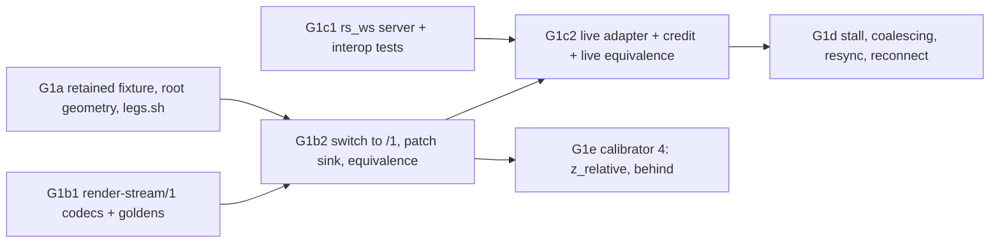

# Gate 1 design: retained canvas state and delivery

Status: contract for gate 1, written 2026-10-09 after gate 0 passed (commit `fa906496`). Nothing in
it is implemented yet. It is meant to be handed out piecewise: each increment (G1a … G1e) below is
one verified commit on `main`, implemented by one agent in its own worktree, against this file,
[render-stream-1.md](render-stream-1.md) (the proposed wire format, finalized by G1b1) and the
gate 0 documents it extends: [gate0-design.md](gate0-design.md) and
[render-stream-0.md](render-stream-0.md). Background is in
[docs/handoff-headless-render-stream.md](../../../docs/handoff-headless-render-stream.md): the
gate 1 row, "Capture and receiver contract", "Slow receivers and resource dependencies" and
"Validation and measurement".

Source citations are `path:line` in the pinned `../godot-4.5.1-stable` checkout (commit
`f62fdbde15035c5576dad93e586201f4d41ef0cb`), relative to its root. Every line cited here was
re-read when this contract was written.

## What gate 1 proves

The handoff's gate 1 row:

> Parent/child transforms and modulation; transform changes without redraw; draw order;
> visibility; clear/replacement; create/free/recreate. Add the live adapter and a receiver stall
> with bounded pending state. Require recording/live equivalence and correct newest-state
> recovery. Compare the headless capture's root viewport size and canvas transform against the
> rendered reference, since a headless display server can report a degenerate window size.
> Patch-encoded snapshots begin here.

Gate 1 keeps gate 0's three independent roles (reference, headless capture host, receiver that
never sees the fixture) and adds:

1. A **retained-state fixture** (`fixtures/gate1/`) whose eleven steps each exercise one retained
   behaviour, checked exactly against the reference and against an image painted from
   `expected.json`, plus state invariants read from the recording.
2. A **root geometry policy**: the session declares the host's logical size, window size, visible
   rect and transforms; the checker compares them with the reference; a degenerate host is a
   declared `unsupported` condition, never a silent fallback.
3. **`render-stream/1`**: patch-encoded transactions against the previous transaction of the same
   stream, a full snapshot on connect and on resync, and a proof that resolving patches equals
   the full snapshots of the same frames.
4. A **WebSocket live adapter** inside the capture library, with credit-based delivery: one
   transaction in flight per receiver, a replaceable pending target, coalescing, a two-second
   receiver stall, newest-state recovery, resync and reconnect.

What gate 1 does **not** do: textures or any resource payloads (gate 2), clipping semantics
(gate 3), arm-on-first-subscriber (deferred, see D6), multiple simultaneous receivers (D5),
publication-rate control or throughput measurement (gate 6), non-loopback serving or
authorization tokens (gate 2, with the HTTP resource server), and the optional trace-oracle
hook-completeness diff (no oracle build exists yet; it stays optional).

## Decisions

| #   | Question                                  | Decision                                                                                                                                                                                                                                                                                                                                                                                                                                                                                                    |
| --- | ----------------------------------------- | ----------------------------------------------------------------------------------------------------------------------------------------------------------------------------------------------------------------------------------------------------------------------------------------------------------------------------------------------------------------------------------------------------------------------------------------------------------------------------------------------------------- |
| D1  | Patches: new version or a /0 record type? | **`render-stream/1`**, magic byte 3 `0x31`. Patches need new transaction keys (`encoding`, `base_seq`, `removed_*`), a nullable `commands`, new session keys (stream identity, root geometry), new enum spellings (unsupported reasons, sabotage kinds). render-stream-0.md "Versioning" makes every one of these a new version, and a /0 decoder rejects unknown record types anyway.                                                                                                                      |
| D2  | Patch base                                | The **previous transaction of the same stream** (`base_seq == seq − 1`). Live delivery never sends transaction n+1 before the credit for n arrives, and the credit stage is at or after "applied", so the base is always the receiver's last acknowledged, applied snapshot (handoff: "patch against the receiver's last acknowledged snapshot"). The first transaction of every stream and every resync is full.                                                                                           |
| D3  | Where the WebSocket server lives          | **In the C++ capture library**, a minimal dependency-free RFC 6455 server on its own I/O thread (`rs_ws`). Reasons in "Q3. Live transport placement".                                                                                                                                                                                                                                                                                                                                                       |
| D4  | Root size / canvas transform              | The stream carries root-canvas space; **the receiver applies its own stretch**. The session declares logical size, stretch settings, host window size, visible rect, final transform and a `host_size_status`. `GRC_ROOT_SIZE=enforce-min-size` makes a headless host match the logical size; otherwise a mismatch is the session-level unsupported condition `degenerate-host-size`. See Q1.                                                                                                               |
| D5  | Receivers per host                        | **One at a time** at gate 1 (`busy` refusal for a second). The host's delivery state is per connection, so more is a configuration change later, not a redesign.                                                                                                                                                                                                                                                                                                                                            |
| D6  | Arm on first subscriber, disarm on last   | **Deferred** past gate 1. The mirror is built from mutation hooks only and cannot adopt items that exist before arming ([gate 0 route (a)](gate0-design.md#q1-arming-root-adoption-and-unknown-rids)); arming on subscription would make every live session `pre-existing-object`. It needs the adoption pass planned for late join (gate 8). Gate 1 arms at load and keeps the mirror running; only delivery is per subscriber. The handoff's "no permanent hook" goal stays open and is recorded as such. |
| D7  | Equal `draw_index` ties                   | **Reported, not reproduced.** The engine's sibling sort is stable only up to 16 children and its result depends on each process's own sort history (Q2c). A tie between two drawing siblings becomes the item-level unsupported entry `draw-index-tie`. Node-driven scenes never produce ties (Q2c).                                                                                                                                                                                                        |
| D8  | Credit point                              | The ack stage the receiver declares in `hello`: `submitted` (after `RenderingServer.frame_post_draw` following the apply) for rendered receivers, `applied` for headless ones, where `frame_post_draw` never fires. `presented` is reported as unavailable: Godot exposes no presentation feedback.                                                                                                                                                                                                         |
| D9  | Runner                                    | A new `run-gate1.sh` with `--legs` groups, sharing process plumbing with `run-gate0.sh` through an extracted `scripts/lib/legs.sh` (G1a). Gate 0's runner keeps its legs and its 19 checks.                                                                                                                                                                                                                                                                                                                 |
| D10 | Where the receiver learns step boundaries | From the runner, as absolute host-frame windows computed from `expected.json` and the fixture's timeline parameters. Live legs delay the timeline (`RS_FIXTURE_START_FRAME`) so a receiver is connected before step 0 settles; the checker fails a leg whose receiver joined late.                                                                                                                                                                                                                          |

## Q1. Root viewport size and canvas transform

### What the engine does

- `DisplayServerHeadless::window_get_size()` returns `Size2i()` (`servers/display_server_headless.h:129`).
  The root window copies it (`scene/main/window.cpp:1531-1533`) and then clamps it to its minimum
  size (`scene/main/window.cpp:1144-1152`, `size = size.max(size_limit)`), which `SceneTree` sets
  to 64×64 (`scene/main/scene_tree.cpp:2035`). Gate 0 measured `host_visible_rect = 0,0,64,64`.
- The project's viewport size reaches the root only as `content_scale_size`
  (`main/main.cpp:4421-4457`, set for every stretch mode, `disabled` included).
- `Window::_update_viewport_size` (`scene/main/window.cpp:1190-1311`):
  - stretch `disabled`: the viewport size is the window size (`:1209-1211`). Headless: 64×64.
    Every `Control` anchored to the root lays out against 64×64 and draws different commands.
  - stretch `canvas_items`: `size_2d_override` is the content size (`:1288-1293`), so
    `get_visible_rect()` reports the logical size (`scene/main/viewport.cpp:1176-1178`) and layout
    is right, but the stretch transform is window/content (`scene/main/viewport.cpp:1064-1070`),
    0.1 for a 64-pixel window and 640-pixel content, and the font oversampling follows it
    (`:1071-1077`). That transform reaches the RenderingServer only through
    `viewport_set_global_canvas_transform` (`scene/main/viewport.cpp:1242-1245`), which is not
    hooked. Oversampling at 0.1 is a gate 4 (text) hazard.
  - stretch `viewport`: the viewport is allocated at content size (`:1295-1305`); layout is right.
- The root canvas transform (`Viewport.get_canvas_transform`, set through the hooked
  `viewport_set_canvas_transform`) is content, not stretch: a `Camera2D` or a script writes it.

### Policy

- The stream is in **root-canvas space**: canvas transforms and item state as the host's root
  viewport sees them. The host's stretch / global canvas transform is never applied by the
  receiver from the stream. The receiver sizes its own root to `viewport.logical_size` and applies
  its own stretch (`viewport.stretch_applied_by: "receiver"`, the only value at gate 1). Gate 1
  fixtures and the receiver use stretch `disabled` at 640×360, so the receiver applies nothing.
- `GRC_ROOT_SIZE` (capture library, read at arm):
  - `observe` (default): read and declare; write nothing.
  - `enforce-min-size`: at arm, after the root query and before the session is written, call
    `Window.set_min_size(content_scale_size)` on the root through its method bind. The clamp at
    `scene/main/window.cpp:1144-1152` then gives the root window the logical size, and
    `_update_viewport_size` (`:1187`) gives the viewport the same size with an identity stretch
    transform, in every stretch mode. This is a declared configuration write into the host, like
    the per-game "logical size … whether the host or the receiver applies the stretch transform"
    configuration the handoff lists; it is off unless configured. Route (a) arms in the autoload's
    `_enter_tree`, so the main scene's `Control`s lay out against the enforced size.
  - anything else: refuse to publish (`stream.status: "refused"`), as an invalid sabotage does.
- `host_size_status`, computed after the policy ran:
  - `match`: window size == logical size **and** visible rect size == logical size;
  - `degenerate-visible`: visible rect size ≠ logical size (layout input differs);
  - `degenerate-window`: visible rect == logical, window ≠ logical (layout right; stretch
    transform and font oversampling differ).
- A status other than `match` adds the session-level unsupported entry
  `{"op":"root_viewport_size","item":null,"reason":"degenerate-host-size"}` to every transaction
  (render-stream-1.md). The leg then classifies `unsupported`. Under `enforce-min-size`, a status
  other than `match` is the sticky capture failure `root-size-enforce-failed` instead: the operator
  asked for a guarantee the library could not give.
- Before G1b2 puts these facts on the wire, G1a writes them to the capture evidence file
  `evidence/root.json` and the gate 1 classifier reads them from there.

### What is compared with the reference

The fixture writes `root.jsonl` itself when `RS_FIXTURE_ROOT_LOG` is set, one line per settle
frame, in both the rendered reference and the headless host:

```
{"step":k,"frame":n,"display_server":<str>,"window_size":[w,h],"visible_rect":[x,y,w,h],
 "canvas_transform":[6],"final_transform":[6],"content_scale_size":[w,h],"content_scale_mode":<int>}
```

Check `root-geometry` (G1a; wire-backed from G1b2):

1. The host's declared logical size equals the reference's `content_scale_size` and the
   reference's `visible_rect` size and `window_size` (640×360).
2. Under `enforce-min-size`: host `host_size_status == "match"`, host visible rect `0,0,640,360`,
   host final transform identity, and the host fixture's own `root.jsonl` agrees with the
   reference line for line except `display_server`.
3. At every step's settle transaction, canvas 1's transform in the recording equals the
   reference's `canvas_transform` at that step, compared as float32.

Leg `root-size-observe` captures the same fixture without the policy. It must classify
`unsupported` (`degenerate-host-size`), declare `degenerate-visible` with a 64×64 visible rect,
and its receiver's pixels must differ from the reference **only** in the regions `corner` and
`corner-degenerate` (the size-anchored `ColorRect` lands at 32,32 instead of 608,328), at every
step. This proves both the declaration and that it was warranted.

## Q2. Engine semantics the fixture and receiver rely on

### Q2a. Modulate, self-modulate and visibility

- Inherited modulate: `_cull_canvas_item` multiplies the item's `modulate` into the inherited one,
  `Color modulate = ci->modulate * p_modulate` (`servers/rendering/renderer_canvas_cull.cpp:316`),
  and passes that product to every child (`:472`, `:479`).
- Self-modulate applies only to the item's own commands:
  `ci->final_modulate = p_modulate * ci->self_modulate` (`:258`), and it is never passed down.
- A subtree whose accumulated alpha is below 0.007 is culled (`:318-320`).
- An invisible item and its whole subtree are skipped (`:296-298`); so is an item whose
  `visibility_layer & canvas_cull_mask` is 0 (`:300-302`). Visibility layer 0 therefore hides an
  item and its subtree under any cull mask.
- Scene side: `CanvasItem::set_modulate` and `set_self_modulate` return early on an unchanged
  value (`scene/main/canvas_item.cpp:474-481`, `:554-561`), so fixtures set non-default values.
  `set_visible(false)` on a parent calls `canvas_item_set_visible` on the parent **and** on every
  visible descendant (`_handle_visibility_change`, `:92-109`, propagating through
  `_propagate_visibility_changed`, `:67-74`). Showing calls `queue_redraw` (`:96-97`), so a
  re-shown item's `content_version` changes: fixtures must not assert it unchanged. Entering the
  tree calls `canvas_item_set_visible(is_visible_in_tree())` (`:354`).

### Q2b. Transforms

- A child's final transform is the parent's final transform times its own (`_cull_canvas_item`,
  `final_xform`, passed to children at `:472`/`:479`). A transform-only change is
  `canvas_item_set_transform` alone (`scene/2d/node_2d.cpp:139`); no redraw, so no
  `canvas_item_clear`/`add_*` and an unchanged `content_version`.

### Q2c. Draw order

- Z first: `p_z = CLAMP(p_z + ci->z_index, Z_MIN, Z_MAX)` when `z_relative`, else `ci->z_index`
  (`renderer_canvas_cull.cpp:420-425`). Items land in per-z lists, concatenated in ascending z
  (`:76-101`). `z_relative` defaults to true (`renderer_canvas_cull.h:93`).
  `CanvasItem::set_z_index` always reaches the server (`scene/main/canvas_item.cpp:646-652`);
  `set_z_as_relative` returns early on an unchanged value (`:655-661`) and is not hooked (G1e).
- Within one z, tree order: parent, then children in child-list order, except `behind` children,
  which are drawn before the parent (`renderer_canvas_cull.cpp:468-480`; `behind` is not hooked
  until G1e).
- Child lists are sorted by `index` (the draw index) lazily, at cull time, only when
  `children_order_dirty` (`:304-307` for items with `ItemIndexSort`, `renderer_canvas_cull.h:109-113`;
  `:490-493` for canvases with `ChildItem::operator<`, `renderer_canvas_cull.h:146-151`).
  `set_parent` and `set_draw_index` set the dirty flag (`renderer_canvas_cull.cpp:595`, `:599`,
  `:1898-1916`).
- The sort is `SortArray`: introsort above 16 elements, then insertion sort
  (`core/templates/sort_array.h:51`, `:202-203`, `:289-301`). Up to 16 siblings it is stable; above
  that it is not. Either way it permutes the engine's own array in place, so the order of equal
  indices depends on the process's sort history, which a receiver that skips presentations cannot
  reproduce. Hence D7.
- Where draw indices come from (scene side, both deferred and flushed before the frame callback,
  see gate 0 Q2):
  - a top-level item (parent is a canvas): `_enter_canvas` resets the viewport's sort index
    (`scene/main/canvas_item.cpp:278-282`, `scene/main/viewport.cpp:3653-3656`); the deferred group
    call `_top_level_raise_self` then gives every top-level item of that canvas a fresh,
    increasing index in tree order (`canvas_item.cpp:224-235`, `:433-442`;
    `viewport.cpp:3658-3661`);
  - a child of a `CanvasItem`: `set_draw_index(get_index())` (`canvas_item.cpp:443-445`), the
    node index among all siblings, so unique.
  - Both run from `Viewport::_process_dirty_canvas_parent_orders` (`viewport.cpp:243-266`),
    requested by `_enter_canvas` (`canvas_item.cpp:241-243`) and by `child_order_changed`, which
    `move_child` emits (`canvas_item.cpp:367`, `viewport.cpp:1183-1189`).
    Node-driven scenes therefore never tie. Ties come from direct `RenderingServer` use (the
    default index is 0, `renderer_canvas_cull.h:94`).
- `canvas_item_set_parent` removes the item from its old parent's list and **appends** it to the
  new one, even when the parent is unchanged (`renderer_canvas_cull.cpp:569-610`). `move_child`
  does **not** call `set_parent`; it only changes draw indices. `_exit_canvas` calls
  `set_parent(item, RID())` (`canvas_item.cpp:290-298`), `_enter_canvas` calls
  `set_parent(item, parent)` (`:247`, `:272`).

### Q2d. Lifetime

- `CanvasItem` construction calls `canvas_item_create` and destruction calls `free`
  (`scene/main/canvas_item.cpp:1731`, `:1734-1736`). `queue_free` deletes at the end of
  `SceneTree::process` (`_flush_delete_queue`, `scene/main/scene_tree.cpp:722`), so the `free`s
  carry the same frame stamp as the step that queued them.
- Freeing an item erases it from its parent's list and sets every child's parent to none, leaving
  the children alive and undrawn (`renderer_canvas_cull.cpp:2585-2601`). Freeing a canvas detaches
  its items the same way (`:2566-2568`).
- RID values are not recycled in practice: a RID is `validator << 32 | slot`, and the validator
  comes from a process-wide incrementing counter (`core/templates/rid_owner.h:93-95`, `:167-170`).
  The slot is reused, the value is not (until 2^31 allocations). The mirror still treats a reused
  value as a new object (gate 0 unit test); the engine fixture cannot produce one.

### Q2e. Frame pacing and the submit signal

- A headless process cannot draw (`servers/display_server_headless.h:149`), so each iteration
  sleeps the low-processor delay or `1/max_fps`, whichever is longer
  (`core/os/os.cpp:697-704`, called at `main/main.cpp:4909`). `--max-fps 60` paces a headless
  capture host at 60 frames per second; without it the host runs at about 145.
- `RenderingServer.frame_post_draw` is emitted at the end of `RenderingServerDefault::_draw`
  (`servers/rendering/rendering_server_default.cpp:205`), after `end_frame` swaps
  (`:97`). It means "Godot submitted the frame", not GPU completion and not presentation. It never
  fires under `--headless`, where `RS::draw()` is skipped (`main/main.cpp:4814-4839`).

### Q2f. Godot's WebSocket client (the receiver side)

- `WebSocketPeer` buffers default to 65535 bytes (`modules/websocket/websocket_peer.h:53`,
  `:70-71`) and `max_queued_packets` to 4096 (`:72`).
- The inbound buffer is allocated at handshake time from `inbound_buffer_size`
  (`modules/websocket/wsl_peer.cpp:405-410` client, `:296-301` server), and wslay's maximum
  message length is set to the same value (`:408`). A message longer than that closes the
  connection (wslay answers 1009). **The receiver must set `inbound_buffer_size` before
  `connect_to_url`**, to at least the largest message it accepts, and it announces that value in
  `hello` so the host never sends more (render-stream-1.md "Live transport").
- Sending fails with `ERR_OUT_OF_MEMORY` when the queued message count reaches
  `max_queued_packets` or the queued bytes would exceed `outbound_buffer_size`
  (`wsl_peer.cpp:783-784`). Receiver control messages are a few hundred bytes; the defaults hold.
- The client requires the response headers `Connection` (exactly `upgrade` after lower-casing),
  `Upgrade: websocket` and a correct `Sec-WebSocket-Accept` (`wsl_peer.cpp:449-451`), and, when it
  requested subprotocols, exactly one of them echoed back (`:454-468`). The server must therefore
  send `Connection: Upgrade` with no other tokens. The client's request is at `:536-554`.

## Q3. Live transport placement

Three placements were weighed:

| Option                                                                                    | For                                                                                                                                                                                                                                                                        | Against                                                                                                                                                                                                                                                                          |
| ----------------------------------------------------------------------------------------- | -------------------------------------------------------------------------------------------------------------------------------------------------------------------------------------------------------------------------------------------------------------------------- | -------------------------------------------------------------------------------------------------------------------------------------------------------------------------------------------------------------------------------------------------------------------------------- |
| **A. Dependency-free RFC 6455 server in the C++ library, on its own I/O thread (chosen)** | One library serves all three install routes; the modder shim stays "load the extension". Needs no project change, no script, no engine module. Network I/O never runs on the game's main thread. Testable without an engine. Moves to its own repository with the library. | About 600 lines to own: SHA-1, base64, HTTP upgrade, framing. A second thread inside the game process. POSIX sockets now, Winsock later.                                                                                                                                         |
| B. Engine `TCPServer` + `WebSocketPeer`, driven through method binds from `on_frame`      | No protocol code.                                                                                                                                                                                                                                                          | Every send and poll on the game's main thread; 64 KiB outbound default to manage; a dozen more method hashes to pin per engine build; depends on the `websocket` module being compiled into a fork (unknown for MegaDot); `Ref<>` lifetimes through the raw C ABI.               |
| C. A GDScript autoload server pulling records from a registered extension class           | Godot-native networking.                                                                                                                                                                                                                                                   | Requires a script in the host project, which a modder of a game they do not own cannot add; the C# mod route would need a second implementation; registering a class through the raw C ABI is more work than A; the codec and the transport end up in two languages on the host. |

The handoff's "the receiver must not need the fixture" is unaffected by the choice: receivers only
ever see the protocol. "The host may be a game where we don't own the project" and "the modder
route" both rule out C, and B would make delivery correctness depend on an engine module and main-
thread polling. A keeps the library GSW-independent and C-ABI: the transport is one more module
behind the existing entry point, with no new dependency.

Constraints on A:

- Bind loopback only (`127.0.0.1` or `::1`). Any other address refuses (`live.status: "refused"`,
  reason `non-loopback`). Authorization arrives with non-loopback serving at gate 2.
- Port 0 means ephemeral; the chosen port is written to `evidence/live.json`, so parallel agents
  never collide on a fixed port.
- The I/O thread owns sockets only. It never touches the mirror or the engine. All encoding
  happens on the main thread at the frame callback, the only point where the mirror is a
  consistent frame boundary (gate 0 "Publication"). The I/O thread hands control messages to the
  main thread and takes encoded messages from it through a mutex-protected mailbox per connection.
- No `mprotect`, no `mmap` imports (gate −1 safety check still applies to the library).

## Q4. Delivery model

### Per-connection state (host)

```
state            await-hello | streaming | closed
stream_id        32 hex, fresh per connection
connection       1, 2, … per capture session
credit_stage     "submitted" | "applied"      (from hello)
max_message      min(hello.inbound_buffer_bytes, GRC_LIVE_MAX_MESSAGE_BYTES)
next_seq         1, 2, …
in_flight        seq | none                    at most one, by construction
credit           bool                          true when nothing is in flight
base             Snapshot                      the last transaction sent (the patch base)
resync           bool                          next transaction must be full
epoch_sent       mirror mutation epoch when base was taken
pending          bool                          mirror changed since base and no credit
coalesced        count of frame callbacks with pending && !credit
```

The host's authoritative captured state is the mirror; per-connection state holds only the last
sent snapshot and counters. The mirror gains a mutation epoch (incremented by every applied
mutation) so "changed since base" is one comparison.

### Frame callback (main thread), after gate 0's steps 1–2

```
if armed at the start of this callback:
    take = any file sink open or any connection is (await-hello with hello received) or (streaming with credit)
    snap = mirror.snapshot() if take                      # one copy, timed
    file sinks: full sink writes full(snap); patch sink writes patch(prev_file_snap, snap)
    for each connection c:
        if c.state == await-hello and c.hello_received:
            send magic+session(c); send full(snap) as seq 1
            c.base = snap; c.in_flight = 1; c.credit = false; c.state = streaming
        elif c.state == streaming:
            if c.credit:
                t = full(snap) if c.resync else patch(c.base, snap)    # base_seq = c.next_seq - 1
                if size(t) > c.max_message: send error "message-too-large"; close 1009; continue
                send t; c.base = snap; c.in_flight = seq; c.credit = false; c.resync = false
            elif mirror.epoch != c.epoch_sent:
                c.pending = true; c.coalesced += 1
        append one line to c's live log
```

- A transaction is sent at every frame callback that has credit, even when nothing changed (an
  empty patch, about 250 bytes). The receiver learns host frame progress from it; idle
  suppression is a later optimization.
- The I/O thread sets `credit` when an `ack` arrives whose `stage` equals `credit_stage` and whose
  `seq` equals `in_flight`, or a `resync` for `in_flight` (which also sets `resync`). Other acks
  only feed timing statistics.
- Nothing is queued per connection beyond one encoded transaction and small control frames, so the
  pending state is bounded by construction: one in flight, one replaceable target (the mirror
  itself). Obsolete targets are never serialized.
- Simulation never waits: no main-thread call blocks on a socket.
- Reconnect: a new connection gets a new `stream_id`, `seq` restarts at 1, and its first
  transaction is full. Wire ids are per capture session and stay stable across connections; the
  receiver discards all its state on disconnect anyway (Q5).
- Shutdown and disarm: write the end record to every file sink and send it to every streaming
  connection whether or not it holds credit, close each with 1000, and join the I/O thread with a 2-second budget. Whatever is
  still queued after that is dropped and logged.

### Receiver progress

| Stage       | When the receiver sends the ack                                                                   |
| ----------- | ------------------------------------------------------------------------------------------------- |
| `received`  | the whole message decoded and validated (framing, meta, blocks, patch resolution)                 |
| `applied`   | every RenderingServer call for it made                                                            |
| `submitted` | the first `frame_post_draw` after `applied` (rendered receivers only)                             |
| presented   | not available in Godot; `applied.json` reports `"presented":"unavailable"`, never a guessed value |

A rendered receiver applies **at most one transaction per `_process`**, and since the host sends
one at a time, there is never more than one waiting. It takes its screenshot, if one is due, after
`frame_post_draw` and before the `submitted` ack, then sends the ack.

## Q5. Receiver (`receiver/`)

Gate 1 extends the gate 0 receiver; the project, typing discipline and "no fixture file" rule are
unchanged.

### Modes and environment

| Variable                      | Mode | Meaning                                                                                                                                        |
| ----------------------------- | ---- | ---------------------------------------------------------------------------------------------------------------------------------------------- |
| `RS_RECEIVER_MODE`            | both | `file` (default) or `live`                                                                                                                     |
| `RS_RECEIVER_RECORDING`       | file | absolute `.rs1` path (G1b2 on; `.rs0` until then)                                                                                              |
| `RS_RECEIVER_OUT`             | both | absolute `applied.json` path; shots in `<dir>/shots/`, state dumps in `<dir>/state/`                                                           |
| `RS_RECEIVER_SHOT_SEQS`       | file | CSV of seqs to screenshot (gate 0)                                                                                                             |
| `RS_RECEIVER_STATE_SEQS`      | file | CSV of seqs whose resolved state is dumped to `state/seq-<n>.json` (G1b2)                                                                      |
| `RS_RECEIVER_URL`             | live | `ws://127.0.0.1:<port>/render-stream`                                                                                                          |
| `RS_RECEIVER_SHOT_WINDOWS`    | live | CSV of `<step>:<from>-<to>` host-frame windows; shoot the first applied transaction whose `frame` is in the window; each shot also dumps state |
| `RS_RECEIVER_RECEIVED_OUT`    | live | where the concatenated received binary messages go; default `<dir>/received.rs1`                                                               |
| `RS_RECEIVER_INBOUND_BYTES`   | live | `WebSocketPeer.inbound_buffer_size`, set before connecting; default 16777216                                                                   |
| `RS_RECEIVER_CREDIT_STAGE`    | live | `submitted` (default) or `applied`; forced to `applied` under `--headless`                                                                     |
| `RS_RECEIVER_CONNECT_TIMEOUT` | live | milliseconds to reach `STATE_OPEN`, default 10000                                                                                              |
| `RS_RECEIVER_STALL`           | live | `<step>:<ms>`: after the shot for `<step>`, block the main loop `<ms>` (`OS.delay_msec`) before the `submitted` ack (G1d)                      |
| `RS_RECEIVER_RECONNECT`       | live | `<step>`: after the shot for `<step>`, close with 1000, free every RID it made, and reconnect (G1d)                                            |
| `RS_RECEIVER_RESYNC`          | live | `<step>`: refuse the first transaction in that step's window unapplied and send `resync` (G1d)                                                 |

Live legs also pass `--max-fps 60` to the receiver, so its loop is paced like a display; real vsync
pacing is measured at gate 6.

### Live behaviour

1. `_ready`: create `WebSocketPeer`, set `inbound_buffer_size`, set
   `supported_protocols = ["render-stream.1"]`, `connect_to_url`. Poll until open or timeout
   (`live-connect-failed`). Send `hello`.
2. `_process`: `poll()`. For each available binary packet: append it to `received.rs1`, frame it,
   decode and resolve it with `Rs1Decoder.Stream` (patch base checks included), and keep it as
   the newest decoded transaction; send `received`. A decode error is replay-failure (as in file
   mode), except under `RS_RECEIVER_RESYNC` handling. A text packet `error` is replay-failure
   `host-error` with its reason.
3. Apply the newest decoded transaction if one is waiting (the applier diffs the resolved state
   against the receiver's current RenderingServer state exactly as in gate 0), send `applied`,
   mark a submit pending. At the next `frame_post_draw`: take a due shot and dump state, run a due
   stall, send `submitted`.
4. The end record: write `applied.json` (`status: "ok"`, `end_seen: true`) and quit 0. The socket
   closing without an end record is replay-failure `live-disconnected`.
5. Reconnect (`RS_RECEIVER_RECONNECT`): close 1000, `Rs1Applier.dispose()` (frees every RID it
   created and counts the frees), start a new `received-<n>.rs1`, a new decoder stream, connect,
   `hello` again.

### `applied.json` (`render-stream-receiver-applied/2`, introduced by G1b2)

```
{"schema":"render-stream-receiver-applied/2",
 "mode":"file"|"live",
 "recording":{"path","sha256","bytes"} | null,            # file mode; live: the received file(s)
 "session_id":<str|null>,
 "streams":[{"stream_id","connection":<int|null>,"received_path","received_sha256","received_bytes",
             "end_seen":<bool>,"closed_by":"host"|"receiver"|null,"close_code":<int|null>}],
 "status":"ok"|"replay-failure",
 "failure":{"seq","reason","detail"}|null,
 "end_seen":<bool>,
 "viewport":{"display_server","size":[w,h],"size_check":"ok"|"skipped-headless"|"mismatch",
             "logical_size":[w,h]|null,"canvas_transform":[6]},
 "transactions":[{"stream":<int>,"seq","frame","encoding","record_sha256","process_frame",
                  "created","freed","reparented","commands_replayed","rs_calls",
                  "received_us":<int|null>,"applied_us":<int|null>,"submitted_us":<int|null>,
                  "skipped":null|"resync"}],
 "shots":[{"stream","seq","step":<int|null>,"path","state_path":<str|null>,"process_frame",
           "applied_through"}],
 "shots_missed":[<step>...],
 "unsupported":[{"seq","item","name","reason"}],
 "live":null | {"url","credit_stage","inbound_buffer_bytes","presented":"unavailable",
                "acks_sent":{"received","applied","submitted"},
                "stall":null|{"step","ms","after_seq","start_us","end_us"},
                "reconnect":null|{"step","after_seq","freed_rids","leftover_rids"},
                "resync":null|{"step","seq"}}}
```

`*_us` are receiver `Time.get_ticks_usec()` values. Size check: the rendered receiver requires its
visible rect to equal `session.viewport.logical_size` (replacing gate 0's hard-coded 640×360).

## Q6. Fixture `fixtures/gate1/` (G1a)

Same project settings as `fixtures/gate0/` (640×360, stretch `disabled`, `gl_compatibility`,
`msaa_2d=0`, `hdr_2d=false`, clear colour `(0.2, 0.2, 0.4, 1)`, the same `[debug]` warning keys,
autoload `GrcLoader`), main scene `res://gate1.tscn`: a root `Node` with `gate1.gd`. Every
`CanvasItem` is created in `_ready` (gate 0 route-(a) rule). `RectNode extends Node2D` draws a list
of `(Rect2, Color)` pairs.

### Colour rule

Every drawn colour component is in {0, .2, .4, .6, .8, 1}. Every `modulate` and `self_modulate`
component is 0 or 1. So every final channel is k·51 exactly, with no rounding question.
`expected.json` is checked for this (`expected-self-consistent`). All alphas are 1.

### Layout (root-canvas pixels, before step 10's canvas shift)

| Group             | Nodes (local position, rect, colour)                                                                                                                                                                                    | Region `[x,y,w,h]` |
| ----------------- | ----------------------------------------------------------------------------------------------------------------------------------------------------------------------------------------------------------------------- | ------------------ |
| hierarchy         | `P` top-level at (80,80), rect (0,0,64,64) white; child `C` at (80,0), rect (0,0,48,48) white; grandchild `G` (child of `C`) at (0,56), rect (0,0,32,32) (.6,.6,.6)                                                     | `[72,72,184,112]`  |
| order             | `Q` top-level at (288,80), no rect; children `Q1` at (0,0) rect (0,0,64,64) (1,.4,0) and `Q2` at (32,32) rect (0,0,64,64) (0,.6,1). `R` top-level at (400,80), no rect; child `R1` at (0,0) rect (0,0,48,48) (.4,.8,.4) | `[280,72,200,112]` |
| visibility        | `V` top-level at (80,216) rect (0,0,64,64) (.2,.8,.2); child `V1` at (80,0) rect (0,0,48,48) (.8,.2,.2)                                                                                                                 | `[72,208,152,80]`  |
| content           | `K` top-level at (240,216); step 0: (0,0,32,32) (1,.6,0) and (40,0,32,32) (.6,0,1); later lists in the timeline                                                                                                         | `[232,208,96,72]`  |
| lifetime          | `L` at (360,216) rect (0,0,32,32) (1,1,.2); `M` at (400,216) rect (0,0,32,32) (.6,.2,1) with child `M1` at (0,40) rect (0,0,16,16) (1,.6,.2); `D` at (440,216) rect (0,0,32,32) (.2,1,1); raw `Y`, `X` (below)          | `[352,208,184,80]` |
| corner            | `Corner`: a `ColorRect`, anchors preset bottom-right, offsets (−32,−32,0,0), colour (.8,.8,.2): pixels (608,328,32,32)                                                                                                  | `[600,320,40,40]`  |
| corner-degenerate | nothing in the reference; the `Corner` lands here on a 64×64 host                                                                                                                                                       | `[24,24,48,48]`    |
| marker            | `Marker` at (592,16) rect (0,0,32,32), colour per step                                                                                                                                                                  | `[584,8,48,48]`    |

Regions include an 8-pixel margin so step 10's (8,4) canvas shift stays inside them. Nothing is
drawn in `[0,0,72,72]` except under the degenerate host.

Raw RenderingServer items (from `gate1.gd`, through the hooked server): `Y` =
`canvas_item_create()`, parent the root canvas (`get_world_2d().canvas`), transform origin
(480,216), `canvas_item_set_draw_index(Y, 1000)` so it never ties with the node items' indices,
rect (0,0,32,32) (1,.2,.6). `X` = `canvas_item_create()`, parent `Y`, rect (0,40,16,16) (.4,.4,1).

### Timeline

`RS_FIXTURE_START_FRAME` = S (default 1), `RS_FIXTURE_STEP_FRAMES` = N (default 10). Step 0 is the
`_ready` state (frame 1); step k ≥ 1 is applied in `_process` at frame `S + N·k`; every step
settles at `S + N·k + 7`. Default quit frame `S + N·10 + 11` (112 with the defaults);
`RS_FIXTURE_QUIT_FRAME` overrides (≥ the default). Every step also sets a new marker colour (a
distinct colour per step, listed in `expected.json`).

| step | change (frame `S+N·k`)                                                                                                                                             | retained behaviour                                                                                       |
| ---- | ------------------------------------------------------------------------------------------------------------------------------------------------------------------ | -------------------------------------------------------------------------------------------------------- |
| 0    | initial                                                                                                                                                            | creation, parenting, top-level draw indices                                                              |
| 1    | `P.modulate = (1,0,1)`; `C.self_modulate = (0,1,1)`                                                                                                                | inheritance: `C` → (0,0,1), `G` → (.6,0,.6), `P` → (1,0,1)                                               |
| 2    | `P.position = (80,96)`; `C.transform = Transform2D(Vector2(0,1), Vector2(-1,0), Vector2(160,0))`; `R1` recoloured (.8,.8,0) (redraw)                               | transform-only for `P`,`C`,`G`; a persistent content change elsewhere                                    |
| 3    | `Q.move_child(Q2, 0)`                                                                                                                                              | draw index swap: `Q1` now over `Q2`; append order unchanged                                              |
| 4    | `Q2.z_index = 1`                                                                                                                                                   | z over index: `Q2` over `Q1` again                                                                       |
| 5    | `Q.remove_child(Q1); R.add_child(Q1)` (local position kept)                                                                                                        | reparent: re-append under `R`, `Q1` covers `R1`                                                          |
| 6    | `V.visible = false`; `K` rects → [(0,0,72,32) (.4,.4,.4)]                                                                                                          | subtree hidden; content replaced (2 → 1 commands)                                                        |
| 7    | `V.visible = true`; `V1.visibility_layer = 0`; `K` rects → []                                                                                                      | re-shown (redraw); layer-0 culling; clear only                                                           |
| 8    | `L.queue_free()`; `M.queue_free()` (with `M1`); `RenderingServer.free_rid(Y)`; `remove_child(D)`; `K` rects → three 16×16 at x 0, 24, 48 ((1,0,0),(0,1,0),(0,0,1)) | frees; raw parent freed leaves `X` alive, detached, undrawn; detach keeps `D`'s id                       |
| 9    | new `L2` (`RectNode`) at (360,216) rect (0,0,32,32) (.2,.4,1); `add_child(D)`; `RenderingServer.free_rid(X)`; `R.remove_child(R1); R.add_child(R1)`                | new id above all earlier ids; `D` re-appended with its old id; same-parent re-append puts `R1` over `Q1` |
| 10   | `get_viewport().canvas_transform = Transform2D(0, Vector2(8,4))`                                                                                                   | canvas transform, no redraw                                                                              |

`expected.json` (`render-stream-gate1-expected/1`) is the only source of these numbers:
`viewport [640,360]`, `clear_rgba8`, `start_frame_default`, `step_frames_default`,
`settle_offset 7`, `regions{name:[x,y,w,h]}`, and `steps[]` of
`{step, draws:[{name, rect_px:[x,y,w,h], rgba8:[r,g,b,a]}], marker_rgba8, canvas_transform:[6],
invariants:{…}}`, where `draws` is in **paint order** (z ascending, then tree order with children
after their parent in draw-index order) and `rect_px` is the final axis-aligned pixel rect after
every transform. The author derives `draws` by hand from the semantics in Q2, independently of the
engine; the reference run then has to agree. `scripts/lib/gate1-expected.ts` exports
`synthesizeGate1(expected, step)`, which fills the clear colour and paints `draws` in order.

The `invariants` per step are what the checker asserts from the recording, named by node (the
checker maps names to wire ids through step 0's first appearance of each rect colour and through
the creation order, recorded in `expected.json` `creation_order`):

- step 1: `P`,`C`,`G` `content_version` unchanged from step 0; modulate floats as set.
- step 2: `P`,`C`,`G` `content_version` unchanged, transforms changed; `R1` version bumped.
- step 3: `Q1`,`Q2` draw indices swapped; `Q`'s `children` (append order) unchanged; versions unchanged.
- step 4: `Q2.z_index == 1`.
- step 5: `Q1.parent == R`; `R.children == [R1, Q1]`; `Q.children == [Q2]`.
- step 6: `V`,`V1` `visible == false`; `K` has 1 command.
- step 7: `V`,`V1` visible; `V1.visibility_layer == 0`; `K` has 0 commands and a higher version.
- step 8: `L`,`M`,`M1`,`Y` ids absent; `X` present with `parent: null`; `D` present with `parent: null`, same id as step 0; `K` 3 commands.
- step 9: `L2`'s id is greater than every id seen before; `D.parent == canvas 1`, same id; `X` absent; `R.children == [Q1, R1]`.
- step 10: canvas 1 transform `(1,0,0,1,8,4)`; no item `content_version` changed from step 9.

### Fixture environment

`RS_FIXTURE_STEP_LOG`, `RS_FIXTURE_SHOT_DIR`, `RS_FIXTURE_QUIT_FRAME` as gate 0; new:
`RS_FIXTURE_ROOT_LOG` (Q1), `RS_FIXTURE_START_FRAME`, `RS_FIXTURE_STEP_FRAMES`. Unknown or invalid
values print an error and quit 2. Output lines start with `[fixture]`.

## Q7. Runner, legs, classification and report

```
experiments/render-stream/scripts/run-gate1.sh --extension <abs> --calibration <abs> \
    [--binary <abs>] [--out <abs dir>] [--legs g1a,g1b,g1c,g1d]
mise exec -- pnpm render-stream:gate1 -- …
```

`--out` defaults to `artifacts/render-stream/gate1/<UTC>/`. `--legs` (default: every group whose
increment has landed) selects groups; the checker only evaluates checks whose legs ran and reports
the others as `not-run` (a full gate run requires all). Rendered legs share one private gamescope
(`lib/gamescope.sh`), headless legs strip display variables, every launch strips every `GRC_*` and
`RS_*` it does not set. `GS_STRIP_VARS` gains every new variable in this document.

Live legs start the capture host first, wait for `evidence/live.json`, then start the receiver
with the port it names. The host runs with `--max-fps 60`, `RS_FIXTURE_START_FRAME=300`,
`RS_FIXTURE_STEP_FRAMES=60` (one second per step), and the receiver's windows are
`[S+N·k+7, S+N·(k+1)−1]` (the last step's window ends at the quit frame).

### Classes

Precedence (first match wins), extending gate 0:

1. `capture-failure` — gate 0's rules, plus `root-size-enforce-failed`, plus `patch-divergence`
   (a patch sink whose resolved state differs from the full sink's state at the same frame).
2. `unsupported` — gate 0's rules, plus a declared `degenerate-host-size` (evidence before G1b2,
   session from G1b2).
3. `replay-failure` — gate 0's rules, plus `live-connect-failed`, `live-disconnected`, `host-error`.
4. `delivery-violation` — new: more than one transaction in flight, a transaction sent without
   credit, queued bytes above one record plus 4 KiB, or a live transaction whose resolved state
   differs from the full recording at its frame (`stale-state`).
5. `pixel-mismatch` — any checkpoint differs from the reference (full frame or region).
6. `success`.

### Report (`<out>/result.json`, `render-stream-gate1-report/1`)

Gate 0's report shape, plus: per checkpoint the `leg` and `stream`; per region the gate 1 region
names; a `live` object per live leg
`{connections:[{connection, stream_id, transactions, full, patch, coalesced, max_in_flight,
max_queued_bytes, resyncs, close_code, closed_by, ack_latency_us:{received,applied,submitted}:
{min,median,max}}]}`; a `stream` object per sink (`full`, `patch`) with the end stats; and
`root_geometry` (host declaration, reference line, status, per-step canvas transform comparison).
Every image path quoted in a result names a file under the run directory.

## Increments

Each increment: one commit on `main` (squashed from its branch), message per
`docs/commit-and-release.md` (`test(render-stream): …` or `feat(render-stream): …` with a
`Changelog: none` trailer — this is experimental code outside the published packages). Before
committing, every increment re-runs:

- `experiments/render-stream/scripts/build-capture.sh` (all ctests),
- `pnpm render-stream:gate-minus1` (28/28; hooks or calibration touched only in G1e, but the
  library is rebuilt every time),
- `pnpm render-stream:gate0` (19/19, all legs at their expected class),
- `pnpm render-stream:gate1 -- --legs <groups landed so far>`,
- the pure self-tests (`self-test-rs0.ts`, `self-test-gate0.ts`, `make_golden.py --check`, and the
  gate 1 ones as they appear).

`pnpm check` is red on baseline (memory: preexisting-check-failures); run biome only on the files
you touch.

### Waves



- **Wave 1, in parallel:** G1a, G1b1, G1c1. They touch disjoint files except
  `capture/CMakeLists.txt` (each adds targets; trivial merge) and `scripts/lib/gamescope.sh`'s
  strip list (G1a only).
- **Wave 2:** G1b2 (needs G1a and G1b1).
- **Wave 3:** G1c2 (needs G1b2 and G1c1). G1e may run alongside it.
- **Wave 4:** G1d (needs G1c2).

---

### G1a — retained-state fixture, root geometry, shared leg plumbing (opus)

Runs on `render-stream/0`. No wire change.

**Files**

- `fixtures/gate1/{project.godot, loader.gd, gate1.tscn, gate1.gd, expected.json, README.md}`.
- `scripts/lib/gate1-expected.ts` (synthesizer and `expected.json` types).
- `scripts/lib/legs.sh`: extracted from `run-gate0.sh` — `write_invocation`, `wait_owned`,
  `run_headless`, `run_capture` (parametrized by fixture dir, recording name and scene),
  `prepare_recording`, `run_receiver_headless`, `run_rendered`. `run-gate0.sh` sources it with no
  behaviour change.
- `scripts/run-gate1.sh`, `scripts/check-gate1.ts`, `scripts/lib/gate1-checks.ts`,
  `scripts/test/self-test-gate1.ts`; `package.json` `render-stream:gate1`; `scripts/README.md`
  section.
- `capture/src/rs0_root_query.{h,cpp}`: the extra read-only binds (`Window.get_content_scale_size`,
  `get_content_scale_mode`, `get_content_scale_aspect`, `get_content_scale_stretch`,
  `get_content_scale_factor`, `Window.get_size`, `Viewport.get_final_transform`) and the one write,
  `Window.set_min_size`, each hash pinned with a comment (dump with the 4.5.1 editor:
  `~/.local/share/mise/installs/godot/4.5.1-stable/godot --dump-extension-api`).
- `capture/src/entry.cpp`: `GRC_ROOT_SIZE`, the policy at arm, `evidence/root.json`, the
  `root-size-enforce-failed` failure (on /0 it is carried as a `root-query-failed` detail
  `root-size-enforce-failed: …` until /1 has its own reason — no new enum spelling on /0).
- Mirror or receiver fixes the fixture exposes, each with a unit test (`rs0_mirror_test.cpp`) or a
  self-test case. Known candidates to check, not presumed bugs: the receiver's bookkeeping when a
  freed parent leaves a live child (`X` at step 8); re-append of an unchanged parent (`R1`, step 9);
  a detached item re-attached with its old id (`D`).
- `capture/test/rs0_mirror_test.cpp`: add cases for detach/re-attach keeping the id and for a
  raw-RS parent free leaving a detached child.

**`evidence/root.json`** (`render-stream-root-geometry/1`):

```
{"schema":"render-stream-root-geometry/1","policy":"observe"|"enforce-min-size",
 "logical_size":[w,h],"stretch":{"mode":<str>,"aspect":<str>,"scale_mode":<str>},
 "content_scale_factor":<float>,
 "before":{"window_size":[w,h],"visible_rect":[4],"canvas_transform":[6],"final_transform":[6]},
 "after":{…same…},
 "host_size_status":"match"|"degenerate-visible"|"degenerate-window",
 "enforce":{"called":<bool>,"ok":<bool>,"detail":<str|null>}}
```

**Legs (group `g1a`)**

| Leg                        | Runs                                                                                                             | Expected                                                                               |
| -------------------------- | ---------------------------------------------------------------------------------------------------------------- | -------------------------------------------------------------------------------------- |
| `import`                   | editor `--import` of `fixtures/gate1` and `receiver`                                                             | exit 0                                                                                 |
| `capture`                  | headless template, `GRC_MODE=arm`, `GRC_ROOT_SIZE=enforce-min-size`, quit 400, strace + maps/fd sample, root log | `success`                                                                              |
| `reference`                | gamescope, extension absent, shots `step-0..10`, root log                                                        | support (11 shots)                                                                     |
| `receiver`                 | gamescope receiver on the capture recording, shots at the 11 settle seqs                                         | `success`                                                                              |
| `receiver-headless-trace`  | headless receiver under `strace -e openat`                                                                       | support (applied ok)                                                                   |
| `sabotage-omit-modulate`   | capture (quit default) with `GRC_SABOTAGE=omit-update`, frame `S+N·1`, then a rendered receiver                  | `pixel-mismatch`, steps {1..10}                                                        |
| `sabotage-omit-transform`  | omit-update at step 2's frame                                                                                    | `pixel-mismatch`, steps {2..10}                                                        |
| `sabotage-omit-order`      | omit-update at step 3's frame                                                                                    | `pixel-mismatch`, steps {3}                                                            |
| `sabotage-omit-visibility` | omit-update at step 7's frame                                                                                    | `pixel-mismatch`, steps {7..10}                                                        |
| `root-size-observe`        | capture with `GRC_ROOT_SIZE` unset, then a rendered receiver                                                     | `unsupported` (`degenerate-host-size`), mismatch only in `corner`, `corner-degenerate` |

The sabotage step sets are predictions from Q2 (for example, at step 3 the dropped
`set_draw_index` calls only matter until step 4's `z_index` puts `Q2` on top in both worlds, and
step 5 moves `Q1` away). A run that disagrees is a finding to explain from engine source before
any expectation changes, never a number to copy.

**Checks** (each with a passing and a failing synthetic case in `self-test-gate1.ts`)

`capture-armed`, `headless-no-gpu`, `recording-decodes` (as gate 0, quit 400);
`manifest-present` (gate 0 arrays); `expected-self-consistent`; `step-alignment` (marker colour
per step at `S+N·k`); `expected-image-reference`, `expected-image-receiver`,
`receiver-vs-reference` (11 steps, full frame and every region, `maxChannelDelta: 0`);
`retained-invariants` (every `expected.json` invariant, on the settle transactions);
`no-draw-index-ties` (no container has two drawing children with equal `draw_index` in any
transaction); `root-geometry` (Q1, 1–3); `receiver-consumed-stream`,
`receiver-never-loaded-fixture` (gate 0's, with `fixtures/gate1/`); `receiver-typed-clean`;
`leg-class-<leg>` for every classified leg, with exact mismatch step sets and, for
`root-size-observe`, the exact region set.

**Pass criteria**: `pnpm render-stream:gate1 -- --legs g1a` passes every check; gate 0 and gate −1
unchanged and green; the README gains a "Gate 1 — G1a" result section quoting the run directory
and image paths, and the measured root geometry (before and after enforcement).

---

### G1b1 — render-stream/1 codecs and goldens (sonnet)

Pure code against [render-stream-1.md](render-stream-1.md). No wiring into `entry.cpp`, the
publisher, `receiver.gd` or any runner. New files only, so it cannot collide with G1a.

**Files**

- `protocol/golden-1/make_golden.py` (`--check`), `index.json`, `full.{rs1,hex,decoded.json}`,
  `patch.{rs1,hex,decoded.json}`, `resolved.json` (shared by both), `invalid/*.rs1`,
  `corrupt-meta.rs1`. Exclude `golden-1/` from biome as `golden/` is.
- `capture/src/rs1_snapshot.h` (the /1 model: gate 0's plus `z_relative`, `behind`, stream and
  root-geometry session fields, patch fields), `capture/src/rs1_codec.{h,cpp}` (no I/O),
  `capture/src/rs1_diff.{h,cpp}` (`Transaction make_patch(const Snapshot &base, const Snapshot
&cur)` per the inclusion rule), `capture/test/rs1_codec_test.cpp` (byte-identical to both
  goldens), `capture/test/rs1_diff_test.cpp` (the golden's patches from its states, byte for byte;
  plus a seeded randomized test: random mutation sequences on a test-local model, resolve(patch
  chain) == every full state).
- `scripts/lib/render-stream-1.ts` (`splitRecords`, `decodeRecord`, `decodeRecording`,
  `validateRecording`, `resolveRecording`, `statesEqual`, `recordSha256`),
  `scripts/test/self-test-rs1.ts`.
- `receiver/rs1_decoder.gd` (`class_name Rs1Decoder`, with `Stream` holding the resolved state),
  `receiver/tests/codec1_selftest.gd`.

**Pass criteria**

- `make_golden.py --check` clean; C++ encoder and diff byte-identical to the goldens; the
  randomized diff test passes 1000 seeded sequences.
- TS: `decodeRecording` deep-equals each `*.decoded.json`; `resolveRecording` of `full.rs1` and of
  `patch.rs1` both deep-equal `resolved.json`; every `invalid/*.rs1` yields its `index.json` code;
  `validateRecording` of both valid vectors is `[]`.
- GDScript (mise editor, headless): the same three properties, printed `[rs1-selftest] ok`, no
  script warnings or errors.
- No existing file changes except `CMakeLists.txt`, `biome.json` and `package.json` (self-test
  script entry, if wanted).

---

### G1c1 — `rs_ws`: dependency-free WebSocket server (sonnet)

Transport only: opaque binary messages out, small text messages in. Knows nothing of the protocol
records or the mirror.

**Files**

- `capture/src/rs_ws.{h,cpp}`, `capture/src/rs_sha1.{h,cpp}` (+ base64 in `rs_ws.cpp`).
- `capture/test/rs_ws_test.cpp` (ctest), `capture/test/rs_ws_echo.cpp` (a test-only executable,
  not linked into the library).
- `scripts/test/self-test-rs-ws.ts` (Node 24's built-in `WebSocket` against `rs_ws_echo`).
- `receiver/tests/ws_selftest.gd` (Godot `WebSocketPeer` against `rs_ws_echo`).

**API** (main-thread calls never block):

```cpp
namespace grc::live {
struct ServerConfig {
  std::string host = "127.0.0.1"; std::uint16_t port = 0;     // 0 = ephemeral
  std::size_t max_clients = 1; std::size_t max_inbound_text = 4096;
  std::string path = "/render-stream"; std::string subprotocol = "render-stream.1";
  std::size_t max_queued_bytes = 64u << 20;                    // safety net, closes 1008
};
struct Event { enum Kind { Opened, Text, Closed } kind; std::uint32_t conn; std::string text;
               std::uint16_t code; std::string reason; };
class Server {
 public:
  bool start(const ServerConfig &, std::string *error);        // refuses non-loopback
  std::uint16_t port() const;
  std::vector<Event> take_events();
  bool send_binary(std::uint32_t conn, std::vector<std::uint8_t> message);
  bool send_text(std::uint32_t conn, std::string message);
  void close(std::uint32_t conn, std::uint16_t code, std::string reason);
  struct ConnStats { std::uint64_t queued_bytes, max_queued_bytes, sent_bytes, sent_messages,
                     received_text; };
  ConnStats stats(std::uint32_t conn) const;
  void stop(int flush_timeout_ms);                              // close 1000 to all, join
};
}
```

**Protocol subset**

- One I/O thread, `poll(2)` over the listener, the clients and a wake pipe; non-blocking sockets;
  `SO_REUSEADDR`; no `mprotect`/`mmap` imports (the gate −1 `nm` check still passes).
- Handshake: `GET <path> HTTP/1.1` with `Upgrade: websocket`, a `Connection` header containing
  the token `upgrade` (case-insensitive token list), `Sec-WebSocket-Version: 13`, a 16-byte base64
  `Sec-WebSocket-Key`, and `Sec-WebSocket-Protocol` listing `render-stream.1`. Headers ≤ 8 KiB.
  Response `101 Switching Protocols` with exactly `Upgrade: websocket`, `Connection: Upgrade`,
  `Sec-WebSocket-Accept`, `Sec-WebSocket-Protocol: render-stream.1` (Q2f). Errors: wrong path 404,
  missing subprotocol 400, a client beyond `max_clients` 503, malformed 400; each closes the TCP
  connection. `Origin` is accepted and logged.
- Outbound: unfragmented, unmasked binary or text frames, 7/16/64-bit lengths.
- Inbound: frames must be masked (else close 1002); text only (binary → 1003); fragmented messages
  → 1002; text above `max_inbound_text` → 1009; ping → pong with the same payload; pong ignored;
  close → echo close, then shut down.
- `max_queued_bytes` exceeded → close 1008 (a safety net; credit keeps real queues tiny, and the
  G1d `ignore-credit` sabotage is expected to show growth well before it).

**Pass criteria**

- ctest: SHA-1 vectors (FIPS 180 `abc` and the empty string); RFC 6455 §1.3's accept key
  (`dGhlIHNhbXBsZSBub25jZQ==` → `s3pPLMBiTxaQ9kYGzzhZRbK+xOo=`); frame headers for payload lengths
  0, 125, 126, 65535, 65536 and 2^24; an in-process raw-socket client covering handshake, masked
  text, a 4 MiB binary, ping/pong, close, each error status, and non-loopback refusal.
- Node interop: subprotocol negotiated, text echo, 1 MiB and 8 MiB binaries byte-exact, clean close.
- Godot interop (mise editor, `--headless`, `--script res://tests/ws_selftest.gd`): with
  `inbound_buffer_size = 16 MiB` set before `connect_to_url`, an 8 MiB binary arrives byte-exact;
  with the default 65535, a 1 MiB message closes the connection with 1009 (records the engine limit
  from `wsl_peer.cpp:408`); prints `[ws-selftest] ok`.

---

### G1b2 — switch to render-stream/1, patch sink, patch/full equivalence (opus)

**Files**

- Capture: the mirror and root query move to version-neutral names (`rs_mirror.*`,
  `rs_root_query.*`) and emit `rs1_snapshot.h` types; `rs1_publish.{h,cpp}` replaces
  `rs0_publish` (two file sinks, full and patch, one snapshot copy per frame); `rs0_codec`,
  `rs0_publish`, `rs0_snapshot.h` and their ctests are removed. Mirror: `z_relative`/`behind` at
  RS defaults (hooked in G1e), draw-index-tie detection (render-stream-1.md), root geometry and
  `root-size-enforce-failed` on the wire, the mutation epoch (used from G1c2), new sabotage kinds
  `omit-op` and `patch-drop-item`.
- Receiver: `rs_applier.gd` (renamed from `rs0_applier.gd`, consuming resolved /1 state),
  `receiver.gd` (file mode on `.rs1`, state dumps, `applied/2`, logical-size check),
  `rs0_decoder.gd` and `tests/codec_selftest.gd` removed (`codec1_selftest.gd` stays).
- Runners and checks: `run-gate0.sh`, `gate0-checks.ts` and `self-test-gate0.ts` move to `.rs1`
  and `render-stream-1.ts`; gate 0 capture legs set `GRC_ROOT_SIZE=enforce-min-size` (otherwise
  the 64×64 host now classifies `unsupported`); `manifest-present` expects the /1 arrays and
  `host_size_status: "match"`. `run-gate1.sh` group `g1b`; gate 1 checks read root geometry from
  the session.
- Docs: render-stream-1.md loses its PROPOSED banner (G1b1 may already have finalized it);
  render-stream-0.md gains a "Superseded by render-stream/1" line. The /0 goldens,
  `make_golden.py` and `self-test-rs0.ts` stay as frozen, still-verified history.

**Environment**: `GRC_STREAM_OUT` (full sink), `GRC_STREAM_PATCH_OUT` (patch sink),
`GRC_SABOTAGE=omit-op` + `GRC_SABOTAGE_OP=<RenderingServer method>` (mirror drops that op from
`GRC_SABOTAGE_FRAME` on; `free` included, unlike `omit-update`), `GRC_SABOTAGE=patch-drop-item`
(the patch sink omits the highest-id changed item entry at exactly that frame; the full sink is
untouched). `RS_RECEIVER_STATE_SEQS`.

**Legs (group `g1b`)**: the `capture` leg writes both sinks.

| Leg                     | Runs                                                                                      | Expected                               |
| ----------------------- | ----------------------------------------------------------------------------------------- | -------------------------------------- |
| `receiver-patch`        | rendered receiver on `capture/recording-patch.rs1`, same settle seqs, state dumps         | `success`                              |
| `sabotage-omit-free`    | capture with `omit-op` `free` at step 8's frame, rendered receiver                        | `pixel-mismatch`, steps {8,9,10}       |
| `sabotage-omit-visible` | `omit-op` `canvas_item_set_visible` at step 6's frame                                     | `pixel-mismatch`, steps {6}            |
| `sabotage-patch-drop`   | both sinks, `patch-drop-item` at step 5's frame, rendered receiver on the patch recording | `capture-failure` (`patch-divergence`) |

**Checks**: `patch-resolves-to-full` (for every frame, `resolveRecording(patch)` state ==
full-recording state, floats bitwise); `patch-first-full` (seq 1 full; every other seq a patch in
the file sink); `patch-transform-only` (in the patch at step 2's frame, `P`,`C`,`G` carry
`commands: null` and `cmd_f32` holds only the marker's and `R1`'s floats; at step 10's frame every
item's `commands` is null); `patch-vs-full-pixels` (receiver-patch shots == receiver shots ==
reference, exact); `patch-vs-full-receiver-state` (state dumps equal, and per-seq `rs_calls` equal:
the receiver's work does not depend on encoding); `patch-bytes` (recorded, not gated: total and
per-transaction bytes for both sinks); the gate 0 and G1a checks on /1; `leg-class-*`.

**Pass criteria**: `--legs g1a,g1b` all green; gate 0 19/19 on /1; gate −1 green; README section.

---

### G1c2 — live adapter, credit and live equivalence (opus)

**Files**

- `capture/src/rs1_live.{h,cpp}`: per-connection delivery (Q4), the control-message parser (flat
  JSON objects only, documented keys, any order, integers), live log and summary; testable against
  a fake transport. `capture/test/rs1_live_test.cpp`: credit (one in flight; credit only on the
  declared stage and the in-flight seq; stale acks ignored), resync, message-too-large, hello
  timeout, the golden control messages in `protocol/golden-1/control/` (valid and invalid).
- `capture/src/entry.cpp`: `GRC_LIVE_*` wiring, the I/O server, shutdown flush, `result.json`
  `live` object, `evidence/live.json`.
- `receiver/rs_live_client.gd` and `receiver.gd` live mode (Q5); `tests/codec1_selftest.gd` gains
  a control-message encode test.
- Fixture: none (timeline parameters landed in G1a).
- `run-gate1.sh` group `g1c`; checks; self-test cases.

**Environment (host)**

| Variable                     | Meaning                                                                                                                                                                                        |
| ---------------------------- | ---------------------------------------------------------------------------------------------------------------------------------------------------------------------------------------------- |
| `GRC_LIVE_LISTEN`            | `127.0.0.1:<port>` or `[::1]:<port>`, port 0 = ephemeral. Enables mirror and root query like `GRC_STREAM_OUT`. Non-loopback refuses                                                            |
| `GRC_LIVE_TAP_DIR`           | absolute directory: `stream-<connection>.rs1` (exact bytes sent) and `live-<connection>.jsonl`                                                                                                 |
| `GRC_LIVE_MAX_MESSAGE_BYTES` | default 16777216; the effective cap is the minimum of this and `hello.inbound_buffer_bytes`                                                                                                    |
| `GRC_LIVE_HELLO_TIMEOUT_MS`  | default 5000; no hello → close 1002                                                                                                                                                            |
| `GRC_SABOTAGE=drop-message`  | at exactly that frame, the transaction is encoded, logged and written to the tap but not sent, and its credit is restored at once, so the next transaction reaches the receiver with a seq gap |

`evidence/live.json` (`render-stream-live/1`), written when the listener is decided:
`{"schema","status":"listening"|"refused"|"failed","address","port","reason"}`.
`live-<n>.jsonl`, one line per frame callback while the connection exists:
`{"frame","t_us","state","credit","in_flight","pending","coalesced","queued_bytes","sent":null|{"seq","encoding","bytes"}}`,
plus event lines `{"frame","t_us","event":"open"|"hello"|"ack"|"resync"|"close"|"error",…}`.
`evidence/live-summary.json` at shutdown: the report's per-connection object.

**Legs (group `g1c`)**: the host runs the fixture with both file sinks, `GRC_LIVE_LISTEN`,
`GRC_LIVE_TAP_DIR`, `--max-fps 60`, S = 300, N = 60.

| Leg                     | Runs                                                                                   | Expected                                      |
| ----------------------- | -------------------------------------------------------------------------------------- | --------------------------------------------- |
| `live`                  | host + rendered live receiver with shot windows for all 11 steps                       | `success`                                     |
| `live-replay`           | rendered file-mode receiver on the `live` leg's `received.rs1`, shooting the same seqs | `success`                                     |
| `live-headless`         | host + headless live receiver (`credit_stage: applied`), no shots                      | `success` (support for the credit-stage path) |
| `sabotage-drop-message` | host with `drop-message` at frame S+N·4+20, rendered live receiver                     | `replay-failure` (`seq-gap`)                  |

**Checks**: `live-listening` (loopback, port from evidence); `live-handshake` (subprotocol
negotiated, no busy/refusal); `live-tap-equals-received` (bytes identical, per connection);
`live-decodes` (`validateRecording(received.rs1)` is `[]`); `live-first-full-then-patch`;
`live-resolves-to-recording` (each live transaction's resolved state == full recording's state at
its `frame`); `live-replay-equals-live` (same seqs, same record hashes, identical shots);
`live-vs-reference` (every step shot, each exactly equal to the reference and to
`synthesizeGate1`); `live-credit-bounded` (every live log line: `in_flight` ≤ 1; no `sent` while
`credit` was false; `queued_bytes` ≤ that connection's largest record + 4096);
`live-acks-staged` (per seq: receiver `received_us ≤ applied_us ≤ submitted_us`; the host saw all
three stages for rendered receivers and `received`/`applied` for headless; `presented` is
`"unavailable"`); `live-receiver-late` (fails the leg when the receiver's first applied
transaction has `frame ≥ S + 7`); `receiver-never-loaded-fixture` on the live receiver;
`leg-class-*`.

**Pass criteria**: `--legs g1a,g1b,g1c` green; gate 0 and gate −1 green; README section with the
measured per-stage ack latencies and patch bytes per transaction.

---

### G1d — stall, coalescing, newest-state recovery, resync, reconnect (opus)

**Files**: `receiver.gd` (`RS_RECEIVER_STALL`, `_RECONNECT`, `_RESYNC`), `rs_applier.gd`
(`dispose` counts frees, leftover check), `rs1_live.{h,cpp}` (sabotages `ignore-credit`: from
`GRC_SABOTAGE_FRAME` on, send at every frame callback regardless of credit; `stale-coalesce`: from
that frame on, when credit returns after at least one missed target, send the snapshot of the
first missed frame, labelled with the current frame), `rs1_live_test.cpp`, runner group `g1d`,
checks, self-test cases.

**Legs (group `g1d`)**, all with the `g1c` host setup:

| Leg                       | Runs                                                                                           | Expected                                  |
| ------------------------- | ---------------------------------------------------------------------------------------------- | ----------------------------------------- |
| `live-stall`              | `RS_RECEIVER_STALL=1:2000`                                                                     | `success` (step 2's window may be missed) |
| `live-reconnect`          | `RS_RECEIVER_RECONNECT=4`                                                                      | `success`                                 |
| `live-resync`             | `RS_RECEIVER_RESYNC=6`                                                                         | `success`                                 |
| `live-receiver-killed`    | SIGKILL the live receiver at frame ≈ S+N·5 (when the host log shows it), host runs to its quit | support: host exit 0, file sinks complete |
| `sabotage-ignore-credit`  | `GRC_SABOTAGE=ignore-credit` at S+N·3                                                          | `delivery-violation`                      |
| `sabotage-stale-coalesce` | `stale-coalesce` at S+N·1, with `RS_RECEIVER_STALL=1:2000`                                     | `delivery-violation` (`stale-state`)      |

The stall after step 1's shot lasts about 120 host frames; step 2 (a transform-only move of the
hierarchy group that persists to the end, plus `R1`'s recolour) is applied inside it, so the first
post-stall transaction must carry an update that happened while presentations were skipped.

**Checks**

- `stall-observed`: the receiver's stall lasted ≥ 2000 ms (`live.stall`), after the step 1 shot.
- `sim-kept-running`: host frames advanced by ≥ 96 (0.8 × 60 × 2) between the send of the stalled
  seq and the arrival of its credit, at an average frame interval ≤ 1.25 × 16.7 ms; the fixture
  applied at least one step inside that interval.
- `pending-bounded`: through the whole leg, `in_flight` ≤ 1 and `queued_bytes` ≤ largest record +
  4096; no transaction sent between the stalled seq and its credit.
- `coalesced`: the connection's `coalesced` grew by at least (stall frames − 2) during the stall.
- `newest-after-stall`: the first transaction after the credit is a patch with
  `base_seq` = the stalled seq, its `frame` is at most 2 frames after the frame at which the credit
  arrived, and its resolved state equals the full recording at its frame.
- `stall-pixels`: the set of missed steps equals exactly the steps whose whole window lies inside
  the stall interval (derived from evidence, not hard-coded); every other step's shot equals the
  reference; the first post-stall shot shows step 2's persistent transforms and `R1`'s colour.
- `reconnect-fresh-session`: connection 2 has a new `stream_id`, the same `session_id`, seq 1
  full, its first state equals the full recording at its frame; the host log shows connection 1
  closed by the receiver with 1000; no transaction of connection 2 has a base from connection 1.
- `reconnect-clean-slate`: after `dispose`, `freed_rids` equals the receiver's created RIDs and
  `leftover_rids` is 0; every shot after reconnect equals the reference.
- `resync-full`: the host logged the `resync` for the refused seq and the next transaction is
  full with `base_seq: null`; the receiver marked that seq `skipped: "resync"`; later shots match.
- `host-survives-receiver-loss`: in `live-receiver-killed`, the host's connection closed
  abnormally (1006 or reset), the fixture reached its quit frame, exit 0, and both file sinks end
  with an end record.
- `leg-class-*`, including the two `delivery-violation` sabotages (and, for `stale-coalesce`,
  `live-resolves-to-recording` failing at the first post-stall transaction; it may also fail where a
  step change fell inside an ordinary one-frame credit gap).

**Pass criteria**: `pnpm render-stream:gate1` (all groups) green; gate 0, gate −1 green; README
"Gate 1 result" with the run directory, image paths, per-leg classes, stall/coalescing numbers,
ack latency distributions and bytes, and an explicit "what this does not prove" list.

---

### G1e — calibrator 4: `z_as_relative` and `draw_behind_parent` (sonnet; optional for the gate)

Hooks `canvas_item_set_z_as_relative_to_parent` (`servers/rendering_server.h:1600`) and
`canvas_item_set_draw_behind_parent` (`:1569`), feeds the /1 item fields `z_relative` and
`behind`, and removes both from the session's `unobserved` list. Files: `capture/tools/calibrate.py`
(`CALIBRATOR_VERSION = "4"`), the re-derived calibration record, `hooks.{h,cpp}`, the mirror and
its test, the receiver applier, the spike fixture (non-default values after arm so the gate −1
counts are positive with identical pixels), and two appended gate 1 fixture steps (11: a child
with `z_as_relative = false` and `z_index = −1` under a parent at z 1; 12: `show_behind_parent` on
a child overlapping its parent), extending the sabotage step sets accordingly. Pass: gate −1 with
44 hooks and none omitted, gate 0, gate 1 all green.

## Deferred, with owners

- Arm on first subscriber / disarm on last (D6): after the late-join adoption pass (gate 8 work),
  measured against "a permanently installed hook with an early return is not zero overhead".
- More than one receiver (D5), publication rate control and uncapped mode, real vsync pacing,
  constrained transports: gate 6.
- Resource pinning for in-flight transactions: gate 2 extends the per-connection base with the
  resource versions it references.
- Non-loopback serving and authorization: gate 2, together with the HTTP resource server.
- `viewport_set_global_canvas_transform`, `canvas_set_modulate`, y-sort, light masks, texture
  filter/repeat: stay in `unobserved` until a gate needs them.
- The trace-oracle completeness diff: optional, needs a locally patched engine build that does not
  exist yet.

There are no open design forks for the user in this gate. Everything above follows from the
handoff or from measured engine behaviour; the predictions marked as such (sabotage step sets) are
checked by running, not decided.
