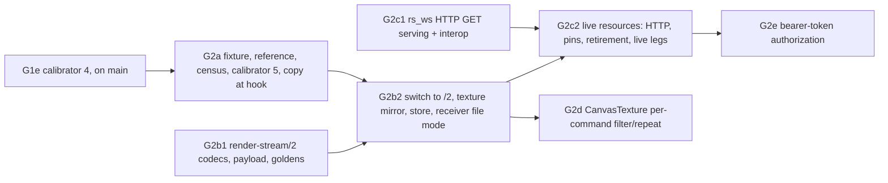

# Gate 2 design: textures

Status: contract for gate 2, written 2026-10-09 after gate 1 passed (G1a–G1d, README "Gate 1
summary"). Nothing here is implemented yet. It is meant to be handed out piecewise. Each increment
below (G2a, G2b1, G2c1, G2b2, G2c2, G2d, G2e) is one verified commit on `main`, implemented by one
agent in its own worktree. Each works against this file and
[render-stream-2.md](render-stream-2.md), the proposed wire format that G2b1 finalizes. The gate 1
documents this extends are [gate1-design.md](gate1-design.md) and
[render-stream-1.md](render-stream-1.md). The background is in
[docs/handoff-headless-render-stream.md](../../../docs/handoff-headless-render-stream.md), in these
sections: the gate 2 row; "Capture and receiver contract", which covers content-addressed
out-of-band resources, versioned mutable resources copied at capture time, dummy storage discarding
updates and loader-thread texture creation; "Configuration for other games" (the resource policy);
"Slow receivers and resource dependencies" (pinning); and "Validation and measurement".

**Dependency on G1e.** G1e is being merged onto `main` concurrently. It adds the
`z_as_relative`/`draw_behind_parent` hooks as calibrator 4, which makes 44 hooks, and gate 1
fixture steps 11–12. This design assumes G1e has landed. G2a's calibrator bump is therefore
**calibrator 5**. If G1e has not landed when G2a starts, G2a waits for it or rebases onto it. It
never takes number 4 itself.

Source citations are `path:line` in the pinned `../godot-4.5.1-stable` checkout (commit
`f62fdbde15035c5576dad93e586201f4d41ef0cb`), relative to its root. Every line cited here was
re-read when this contract was written. Slot numbers are the calibrator's own derivation:
`capture/tools/calibrate.py` `parse_virtuals` over the pinned header with the release define set,
plus the measured Object prefix 23. They match the committed record for every slot already
hooked (for example `texture_2d_create` 24, `free` 549).

## What gate 2 proves

The handoff's gate 2 row:

> One procedural texture, shared references, regions/flips, filtering/repeat, then changing
> pixels, replacement and lifetime. A transform-only update must not re-upload texture bytes.
> Exercise a fresh receiver and a fresh asset cache. Deliver resources out of band,
> content-addressed by payload hash.

Gate 2 keeps the three independent roles of gates 0 and 1 and adds the following:

1. **Texture capture at the hook.** Every `texture_2d_create` and `texture_2d_update` copies the
   image bytes on the calling thread, loader threads included, before the call is forwarded. The
   copy is canonicalized into a `render-stream-texture/1` payload and hashed with SHA-256. Dummy
   storage keeps the initial image but discards updates and replacements
   (`servers/rendering/dummy/storage/texture_storage.h:82-86`, `:94`, `:112`), so the hook is the
   only place the content exists on a headless host.
2. **Resource identity and versions.** Each texture has a wire id that is never reused and a
   per-id version. The content address is the hash of the canonical payload. Snapshots carry the
   whole texture table, so a snapshot names every resource version it needs. Patches carry only
   changed entries.
3. **Out-of-band delivery.** File recordings use a content-addressed store directory. Live streams
   use HTTP `GET /resources/sha256/<hash>` with immutable caching headers, served on the loopback
   listener the WebSocket already uses. Inline resource records carry small payloads under a
   configured threshold.
4. **Receiver residency and cache.** A texture is uploaded only when a command first needs it,
   updated only when its content hash changes, and fetched only on a cache miss. A fresh cache and
   a warm cache are separate legs. Counters prove that a transform-only step fetches and uploads
   nothing.
5. **Pinning.** The versions named by the last transaction sent to a connection stay servable
   until that connection's next transaction. All other superseded versions are retired.
6. **Filtering and repeat.** Per-item defaults, the root viewport's default, and per-command
   values through `CanvasTexture` (G2d), replayed as the same RenderingServer calls.
7. **Typed refusal.** Unsupported formats, unknown textures, oversized payloads and canvas-texture
   lighting channels each produce a named reason, never a silent substitute.

What gate 2 does **not** do: glyph atlases and MSDF text (gate 4), nine-patch, polygons and
meshes with textures (gate 5), layered or 3D textures, proxy textures (`AnimatedTexture`) and
viewport textures (later, as `unknown-texture` until then), `texture_set_size_override` (declared
`unobserved`), lazy hashing and payload spill-to-disk (gate 6 measurements), browser receivers
(gate 7), non-loopback serving (re-deferred to gate 8, D13), and late-join adoption of textures
created before arming (gate 8, as for items).

## Decisions

| #   | Question                       | Decision                                                                                                                                                                                                                                                                                                                                                                                                                                                                                                                                                                                                                                                  |
| --- | ------------------------------ | --------------------------------------------------------------------------------------------------------------------------------------------------------------------------------------------------------------------------------------------------------------------------------------------------------------------------------------------------------------------------------------------------------------------------------------------------------------------------------------------------------------------------------------------------------------------------------------------------------------------------------------------------------- |
| D1  | Protocol version               | **`render-stream/2`** (magic byte 3 `0x32`, subprotocol `render-stream.2`). Textures need a byte block type (`u8`; /1 blocks are `f32` only), a new record type (`resource`), new transaction and item keys, new command shapes and new enum spellings. render-stream-1.md "Versioning" makes each of these a new version. /1, `golden-1/` and `render-stream-1.ts` stay as frozen, still-verified history, as /0 did at G1b2.                                                                                                                                                                                                                            |
| D2  | Resource identity              | Wire **texture id** from one per-session counter shared by images, placeholders and canvas textures, never reused. **`version`** per id, starting at 1 and +1 per content or kind change (it may skip on the wire). **`hash`** is the lowercase hex SHA-256 of the canonical `render-stream-texture/1` payload: magic, then canonical JSON with format, width, height, mipmaps and data length, then the bytes. `(id, version)` is resource-state identity and `hash` is content identity. Two textures with equal bytes and shape share one hash and one fetch, but keep two ids and two uploads.                                                        |
| D3  | When bytes are copied          | **At the hook, on the calling thread, before forwarding.** The copy goes through `Image.get_width/get_height/get_format/has_mipmaps/get_data_size` method binds and the `image_ptr` interface function (`core/extension/gdextension_interface.cpp:1085-1088`, available since 4.3). No engine reference is kept. The hash is computed right after the copy, on the same thread, with `copy_ns` and `hash_ns` recorded. Lazy hashing at publication is a measured gate 6 optimization, not a gate 2 feature. If the binds or `image_ptr` are missing, publishing refuses at arm (`image-access-unavailable`). It never streams textures without bytes.     |
| D4  | What a snapshot lists          | **Every live texture the capture knows** (created after arming through a hooked creator), plus `freed` tombstones that a command or a canvas texture still names. Unreferenced textures are listed too, as metadata (about 200 bytes each). A receiver must not fetch them (D5), but a later reference must not need a table change. Patches make an unchanged table free.                                                                                                                                                                                                                                                                                |
| D5  | Receiver residency and uploads | **Lazy.** A texture becomes resident when a command of an applied state first names it. It stays resident until its entry leaves the table. A resident texture is re-uploaded only when its `hash` or `kind` changes, never for a version-only change or an item-only change. With the same format, size and mipmaps it gets `texture_2d_update`; otherwise `texture_replace(rid, texture_2d_create(image))`. These are exactly `ImageTexture::update` and `ImageTexture::set_image` (`scene/resources/image_texture.cpp:114-124`, `:97-103`). The receiver's RID for an id never changes, so commands never need re-recording because a texture changed. |
| D6  | How payloads travel            | **Out of band by default.** File recordings use a content-addressed store directory (`GRC_RESOURCE_STORE_DIR`). Live streams use **HTTP GET by hash on the same loopback listener as the WebSocket** (`rs_ws` already parses HTTP/1.1 for the upgrade), with `Cache-Control: private, max-age=31536000, immutable`. Resource records carry payloads in band when they are at most `GRC_RESOURCE_INLINE_MAX_BYTES` (default 0 at gate 2; glyph-atlas deltas use it at gate 4). The WebSocket is not used as a first step for large payloads, for three reasons in "Q4".                                                                                    |
| D7  | Pinning and retirement         | The host retains a payload while its hash is in the **current captured state** (the mirror's table) or in the **last transaction sent on any connection**. A connection's next transaction is formed only after the credit for the previous one, and credit comes at or after `applied`, which comes after the fetch. So the pin covers every fetch a correct receiver can make. Everything else is retired at the frame callback, and each retirement is logged. The bound is at most two versions per texture per connection.                                                                                                                           |
| D8  | Receiver cache                 | A content-addressed directory, `RS_RECEIVER_CACHE_DIR/sha256/<hash>.grt`. Mode `fresh` requires it to be empty or absent; `warm` requires it to exist. The receiver verifies every payload's SHA-256 against its name before use and before writing (temporary file + rename). The cold and warm legs are separate runs, and so are the cold and warm live hosts.                                                                                                                                                                                                                                                                                         |
| D9  | Filter and repeat              | Three levels, each replayed as the engine's own call. Per item: `canvas_item_set_default_texture_filter/repeat` → item fields. Per root viewport: `viewport_set_default_canvas_item_texture_filter/repeat` → transaction scalars, initialized at arm from a `Viewport` read-only query. Per command: a `CanvasTexture`'s own filter and repeat (G2d). The engine resolves precedence on both sides (`drivers/gles3/rasterizer_canvas_gles3.cpp:814-828`, `:2282-2286`).                                                                                                                                                                                   |
| D10 | Typed refusal                  | An unsupported texture is a table entry with `status: "unsupported"` and a reason. Commands that name it produce derived item-level `unsupported-texture` entries. A texture argument the capture never saw created becomes an `unsupported` command with reason `unknown-texture`. Receivers **skip** such commands and record them. They never substitute the default white texture for one.                                                                                                                                                                                                                                                            |
| D11 | Freed texture still referenced | A **`freed` tombstone** stays in the table while a command still names it. Receivers free their RID and draw that command with `RID()`. In GLES3 an invalid or null texture binds the default canvas texture, white (`drivers/gles3/rasterizer_canvas_gles3.cpp:2340-2342`, `:2360-2363`, `:2370-2378`), on both sides. This is a prediction, checked by fixture step 8.                                                                                                                                                                                                                                                                                  |
| D12 | Result classes                 | Gate 1's classes, plus **`resource-violation`**: a redundant fetch or upload, resource traffic at a transform-only step, a retained-payload count above the D7 bound, or a GET for a hash never advertised to that connection. It ranks after `delivery-violation` and before `pixel-mismatch`. New capture failure: `texture-log-divergence`, which means the stream's texture versions or hashes disagree with the capture's own hook log. New replay failures: `resource-hash-mismatch`, `resource-unavailable`, `resource-invalid`, `cache-not-fresh`.                                                                                                |
| D13 | Authorization, non-loopback    | **Bearer token** on the WebSocket upgrade and on every resource GET (G2e), compared in constant time. **Non-loopback binding stays refused** at gate 2 and is re-deferred to gate 8. Gate 1 had deferred both to gate 2, but no gate 2 leg can exercise a non-loopback interface without exposing a port on the operator's network. With the token in place, allowing it later is a configuration change.                                                                                                                                                                                                                                                 |
| D14 | Hooks                          | **Calibrator 5** adds 11 optional slots (Q2). `canvas_item_add_texture_rect` and `_region` change from count-only to full capture. Proxy, layered, 3D, RD and external texture creators stay unhooked: their RIDs are unknown to the mirror, so any draw that uses one is typed `unknown-texture` without a hook.                                                                                                                                                                                                                                                                                                                                         |

## Q1. What the engine does

### Q1a. Creation, update, replacement, placeholder, free

| Scene API                                                   | RenderingServer calls                                                                                              | Source                                                                                                                                                                          |
| ----------------------------------------------------------- | ------------------------------------------------------------------------------------------------------------------ | ------------------------------------------------------------------------------------------------------------------------------------------------------------------------------- |
| `ImageTexture.create_from_image(img)` / first `set_image`   | `texture_2d_create(img)`                                                                                           | `scene/resources/image_texture.cpp:75-83`, `:97-99`                                                                                                                             |
| `set_image(img)` on a texture that already has a RID        | `texture_2d_create(img)` → `new`; `texture_replace(old, new)`. No `free(new)` call: the storage frees `new` itself | `image_texture.cpp:100-103`; `drivers/gles3/storage/texture_storage.cpp:1394-1437` (`texture_owner.free(p_by_texture)` at `:1434`); dummy `texture_storage.h:112`               |
| `update(img)`                                               | `texture_2d_update(rid, img, 0)`, guarded to the same size, format and mipmaps; then `emit_changed`                | `image_texture.cpp:114-131`                                                                                                                                                     |
| `get_rid()` before any image                                | `texture_2d_placeholder_create()`                                                                                  | `image_texture.cpp:148-155`; also `CompressedTexture2D::get_rid` (`scene/resources/compressed_texture.cpp:207-212`), the gradient textures (`gradient_texture.cpp:169`, `:399`) |
| deferred generation (gradient, curve and compressed reload) | `texture_2d_create` + `texture_replace(placeholder_or_old, new)`                                                   | `gradient_texture.cpp:107`, `:134`, `:275`; `compressed_texture.cpp:144-147`                                                                                                    |
| last reference dropped                                      | `free(rid)`                                                                                                        | `image_texture.cpp:243-248`                                                                                                                                                     |
| `AnimatedTexture`, viewport textures                        | `texture_2d_placeholder_create` + `texture_proxy_create` (unhooked → `unknown-texture`)                            | `animated_texture.cpp:279-280`; `scene/main/viewport.cpp:104`                                                                                                                   |

Consequences:

- `texture_replace(T, B)` gives T the content of B and frees B **without a `free` call**. The mirror
  must retire B's wire id at the replace, or the id leaks. `T == B` is a no-op
  (`texture_storage.cpp:1402-1404`).
- In GLES3, `texture_2d_update` refuses a format change (`texture_storage.cpp:1572`). A raw RS
  update with a different shape is therefore `update-shape-mismatch`. A layer other than 0 on a 2D
  texture is `layered-update`.
- The GLES3 placeholder is a 4×4 RGBA8 checkerboard of magenta `(1,0,1)` and black, with magenta
  where `(x + y)` is even (`drivers/gles3/storage/texture_storage.cpp:235-242`). It is engine-defined,
  so the wire carries no bytes for it. The receiver calls `texture_2d_placeholder_create()` itself.
- Dummy storage keeps the initial image (`texture_2d_initialize` duplicates it,
  `dummy/storage/texture_storage.h:82-86`). It discards `texture_2d_update` (`:94`), leaves the
  placeholder empty (`:100`) and frees the by-texture on replace (`:112`). A headless host's own
  storage cannot serve as a content source.

### Q1b. Threads

- `RenderingServerDefault` single-threaded: `server_thread = Thread::MAIN_ID`
  (`servers/rendering/rendering_server_default.cpp:261-263`). `texture_2d_create` is
  `FUNCRIDTEX1`, which allocates a RID on any thread. It initializes immediately on the server
  thread, and otherwise **pushes the initialization, holding the `Ref<Image>`, onto the command
  queue** (`servers/rendering/rendering_server_default.h:144-153`).
  `can_create_resources_async()` is false for both GLES3 and dummy
  (`drivers/gles3/rasterizer_gles3.h:136`, `servers/rendering/dummy/rasterizer_dummy.h:113`).
  `texture_2d_update` and `texture_replace` are `FUNC3`/`FUNC2`, which push from a non-server
  thread (`rendering_server_default.h:201`, `:215`; `servers/server_wrap_mt_common.h:265-274`,
  `:340-349`).
- So a texture created on a worker thread is uploaded from whatever the Image holds when the main
  thread flushes the queue. **If the caller mutates that Image before the flush, the engine and a
  hook copy disagree.** That race belongs to the engine. The capture records call-time bytes, and
  fixtures never mutate an Image they handed to a worker-thread create before the next frame. On
  the main thread, initialization is synchronous, so a mutation right after the call is
  deterministic in the reference. Fixture step 8 uses exactly this to prove copy-at-hook.
- The dummy texture owner is `RID_PtrOwner<DummyTexture>` with the non-thread-safe default
  (`dummy/storage/texture_storage.h:44`, `core/templates/rid_owner.h:467-468`). Concurrent creates
  on a headless host are unsafe in the engine itself. The fixture joins its worker before the main
  thread touches textures. The mirror's own lock makes the capture side safe either way.

### Q1c. Draw commands and their arguments

| Scene path                                                          | Call                                                                                                                              | Source                                                            |
| ------------------------------------------------------------------- | --------------------------------------------------------------------------------------------------------------------------------- | ----------------------------------------------------------------- |
| `CanvasItem.draw_texture(tex, pos, mod)`                            | `canvas_item_add_texture_rect(ci, Rect2(pos, tex.size), rid, false, mod, false)`                                                  | `scene/main/canvas_item.cpp:851-858`; `image_texture.cpp:161-166` |
| `draw_texture_rect(tex, rect, tile, mod, transpose)`                | `canvas_item_add_texture_rect(ci, rect, rid, tile, mod, transpose)`                                                               | `canvas_item.cpp:860-866`; `image_texture.cpp:168-173`            |
| `draw_texture_rect_region(tex, rect, src, mod, transpose, clip_uv)` | `canvas_item_add_texture_rect_region(ci, rect, rid, src, mod, transpose, clip_uv)`                                                | `canvas_item.cpp:868-873`; `image_texture.cpp:175-180`            |
| `Sprite2D`                                                          | always `draw_rect_region(ci, dst, src, white, false, region_filter_clip)`; flips are negative `dst` sizes                         | `scene/2d/sprite_2d.cpp:95-130`, `:158-170`                       |
| `TextureRect`                                                       | `draw_texture_rect(tex, Rect2(offset, size), tile)` or `draw_texture_rect_region` (keep-aspect-covered); flips are negative sizes | `scene/gui/texture_rect.cpp:35-99`                                |
| other `Texture2D` subclasses                                        | `Texture2D::draw*` defaults call the same two RS methods with `get_rid()`                                                         | `scene/resources/texture.cpp:63-82`                               |

Argument layout in the header (`servers/rendering_server.h:1583-1584`):
`canvas_item_add_texture_rect(RID item, const Rect2 &rect, RID texture, bool tile, const Color &modulate, bool transpose)`
and `canvas_item_add_texture_rect_region(RID item, const Rect2 &rect, RID texture, const Rect2 &src_rect, const Color &modulate, bool transpose, bool clip_uv)`.
The hooks already have these exact signatures (`capture/src/hooks.cpp:26-33`).

What the server does with them (`servers/rendering/renderer_canvas_cull.cpp`):

- `texture_rect` (`:1513-1542`): `tile` sets the TILE and REGION flags with source = |rect size|.
  A negative width or height sets FLIP_H or FLIP_V and makes the size positive. `transpose` sets
  TRANSPOSE and swaps the size.
- `texture_rect_region` (`:1610-1648`): a negative rect size sets the flip, and a negative source
  size **toggles** it (`^=`). `clip_uv` sets CLIP_UV.
- GLES3 (`drivers/gles3/rasterizer_canvas_gles3.cpp:933-982`): TILE forces repeat `ENABLED` for
  that batch whatever the item's repeat is (`:936-939`). FLIP negates the source size, TRANSPOSE
  and CLIP_UV are per-instance flags, and the source is in texels times `texpixel_size`, which
  comes from the texture's own size.

The capture records the raw arguments, the receiver passes them back unchanged, and the server
normalizes them identically on both sides. No flag decoding exists in the stream.

### Q1d. Filter and repeat

- **Per item.** On entering the tree every `CanvasItem` calls
  `canvas_item_set_default_texture_filter(item, cache)` and `…_repeat(item, cache)`
  (`scene/main/canvas_item.cpp:358-360`, `:1602-1605`, `:1656-1659`). `PARENT_NODE` resolves to the
  parent's cache, or to RS `DEFAULT` for a top-level item (`:1585-1600`, `:1639-1654`). Setting
  `texture_filter`/`texture_repeat` propagates to children that inherit, and each item also queues
  a redraw (`:1607-1631`, `:1661-1684`). The scene enum is cast straight to the RS enum (`:1598`),
  which is 0 `DEFAULT`, 1 `NEAREST`, 2 `LINEAR`, 3/4 the mipmap variants and 5/6 anisotropic
  (`servers/rendering_server.h:925-942`). The server stores the value on the item
  (`renderer_canvas_cull.cpp:2442-2451`).
- **Root viewport default.** `main.cpp` sets the root's defaults from
  `rendering/textures/canvas_textures/default_texture_filter` and `…_repeat` (`main/main.cpp:4478-4483`).
  Their project defaults are Linear and Disable (`core/config/project_settings.cpp:1703-1704`).
  `Viewport::set_default_canvas_item_texture_filter` maps the scene enum to the RS enum: Nearest →
  NEAREST, Linear → LINEAR, Linear Mipmap → LINEAR_WITH_MIPMAPS, Nearest Mipmap →
  NEAREST_WITH_MIPMAPS (`scene/main/viewport.cpp:3903-3925`). Repeat maps Disabled, Enabled and
  Mirror the same way (`:3934-3958`). Both setters return early on an unchanged value. The server
  initializes LINEAR and DISABLED (`servers/rendering/renderer_viewport.h:114-115`) and refuses
  `DEFAULT` (`renderer_viewport.cpp:1541-1554`). This happens before the extension arms, so the
  capture **queries** `Viewport.get_default_canvas_item_texture_filter/_repeat` at arm and hooks the
  RS setters for later changes. Changing the root default issues no item call and no redraw. It is
  pure viewport state, carried per transaction (`renderer_viewport.cpp:685` passes it to
  `render_canvas`).
- **Resolution at draw** (GLES3): an item's `DEFAULT` takes the viewport default
  (`rasterizer_canvas_gles3.cpp:814-828`). A `CanvasTexture`'s own non-default filter or repeat
  overrides the item (`:2282-2286`). A plain texture's internal canvas texture has `DEFAULT`, so
  the item value applies.
- **`CanvasTexture`.** It is created by `canvas_texture_create` (`canvas_item.cpp:1913-1915`) and
  freed in the destructor (`:1916-1919`). Diffuse, normal and specular are set through
  `canvas_texture_set_channel` (`:1741-1781`). Its filter and repeat go through
  `canvas_texture_set_texture_filter/_repeat` (`:1811-1830`), and the specular colour and shininess
  through `canvas_texture_set_shading_parameters` (`:1785-1808`). `get_rid()` returns the canvas
  texture RID, so draw commands name it in place of an image texture. spine-godot passes "the
  renderer object's canvas texture" to `canvas_item_add_mesh` (README "spine-godot's draw path").
  Gate 5 needs it too.

### Q1e. Formats and mipmaps

- `ImageTexture` records the format, size and `has_mipmaps()` of the image it was given
  (`image_texture.cpp:93-96`). `Image::get_mipmap_count()` is 0 without mipmaps (`core/io/image.cpp:462-467`).
  The data size over the mip chain is `Image::_get_dst_image_size` (`:1700-1745`). For uncompressed
  formats the block is 1, and each level halves with a floor of 1 until 1×1.
  `Image::get_data_size()` is `data.size()` (`:3386-3388`), and `Image::ptr()` is the data pointer
  (`:3378-3380`).
- Measured so far: gate −1 saw a 256×256 **LA8** glyph atlas (format 1) and an 800×6 **RGBA8**
  (format 5) image created at frame 1, plus seven atlas updates (README "Scratch verification").
  The target game created 1 526 textures in 4 minutes (README "Gate −0.25 result"). Their formats
  are unknown and are measured at gate 8. Imported 2D textures load as uncompressed images unless
  the project asks for VRAM compression. VRAM-compressed formats (DXT, BPTC, ETC2, ASTC) and float
  formats are refused at gate 2 (`unsupported-format`). Browser receivers decide those per manifest
  at gate 7.
- The gate 2 default policy permits `L8, LA8, R8, RG8, RGB8, RGBA8`. These are the 8-bit
  uncompressed formats, in which texel bytes reach the framebuffer unchanged at 1:1 nearest
  sampling.
- Image method binds, as dumped from the 4.5.1 editor (`--dump-extension-api`): `get_width`,
  `get_height` and `get_data_size` 3905245786 (the three gate −1 already pins), `get_format`
  3847873762, `has_mipmaps` 36873697. Viewport binds: `get_default_canvas_item_texture_filter`
  896601198, `get_default_canvas_item_texture_repeat` 4049774160.

## Q2. Hooks: calibrator 5

`capture/tools/calibrate.py`: `CALIBRATOR_VERSION = "5"`. Append these optional `WANTED_SLOTS`
keys. That is backward compatible (README "Calibration records and hook versions").

| Method                                            | Header line | Slot | Capture                                                                   |
| ------------------------------------------------- | ----------- | ---- | ------------------------------------------------------------------------- |
| `texture_2d_placeholder_create`                   | 150         | 34   | returned RID → texture `kind: placeholder`                                |
| `texture_replace`                                 | 158         | 40   | (texture, by_texture) → content move, by-id retired                       |
| `viewport_set_default_canvas_item_texture_filter` | 1040        | 321  | (viewport, enum) → transaction scalar (root viewport only)                |
| `viewport_set_default_canvas_item_texture_repeat` | 1041        | 322  | as above                                                                  |
| `canvas_texture_create`                           | 1534        | 441  | returned RID → texture `kind: canvas` (G2d; before it, recorded only)     |
| `canvas_texture_set_channel`                      | 1541        | 442  | (canvas texture, channel enum, texture)                                   |
| `canvas_texture_set_texture_filter`               | 1545        | 444  | (canvas texture, enum)                                                    |
| `canvas_texture_set_texture_repeat`               | 1546        | 445  | (canvas texture, enum)                                                    |
| `canvas_item_set_default_texture_filter`          | 1553        | 448  | (item, enum) → item field                                                 |
| `canvas_item_set_default_texture_repeat`          | 1554        | 449  | (item, enum) → item field                                                 |
| `canvas_item_add_lcd_texture_rect_region`         | 1586        | 470  | count + unsupported command (gate 4 text path; makes a silent op visible) |

Enums cross the ABI as 4-byte integers (hooks.cpp convention). Signatures:
`RID (*)(void *)`, `void (*)(void *, RID, RID)`, `void (*)(void *, RID, int32_t)`,
`void (*)(void *, RID, int32_t, RID)`, and
`void (*)(void *, RID, const Rect2 *, RID, const Rect2 *, const Color *)`.

The existing tier-1 hooks gain full capture: `texture_2d_create` and `texture_2d_update` copy the
payload (D3), and `canvas_item_add_texture_rect` and `_region` become mirror taps.
`canvas_item_add_msdf_texture_rect_region` stays an unsupported command (gate 4).

The spike fixture (`fixtures/spike/`) exercises every new hook after arming, with non-default
values, so gate −1 counts are positive and armed/unarmed pixels stay identical, as G1e did. Gate
−1 then passes with 55 hooks (44 + 11) and none omitted.

## Q3. Capture: payloads, the texture mirror, the hook log

### Copy (hooks.cpp, `rs_texture_payload`)

On `texture_2d_create(img)` and `texture_2d_update(rid, img, layer)`, before forwarding:

1. Read width, height, format, `has_mipmaps` and `data_size` through the binds. A failed read
   makes the payload `payload-unavailable`.
2. A format outside `GRC_RESOURCE_FORMATS` gives `unsupported-format`. A canonical payload larger
   than `GRC_RESOURCE_MAX_PAYLOAD_BYTES` gives `payload-too-large`. In both cases nothing is copied.
3. Otherwise copy `data_size` bytes from `image_ptr(img.object)` into a new
   `std::shared_ptr<const Payload>` (GRT1 header + bytes), hash it, and record `copy_ns` and
   `hash_ns`.
4. Forward the call. On create, register the returned RID.

The retained payload bytes are budgeted by `GRC_RESOURCE_BUDGET_BYTES` (default 536870912). The
total covers the mirror's current payloads plus pinned superseded ones. Exceeding it is the sticky
capture failure `resource-budget-exceeded`. Gate 2 does not spill to disk; that is a gate 6
measurement.

### Texture mirror (`rs_mirror`)

New engine-free state under the existing mutex: `textures_` (id → `{rid, kind, status, reason,
version, payload, canvas fields, last_published_version}`), `texture_by_rid_`, and
`next_texture_id_`. Taps and their omit-op names are the RS method names:

| Tap                                          | Effect                                                                                                                                                                                                                                                                                                                         |
| -------------------------------------------- | ------------------------------------------------------------------------------------------------------------------------------------------------------------------------------------------------------------------------------------------------------------------------------------------------------------------------------ |
| `texture_2d_create(rid, payload)`            | new id, `kind: image`, version 1, status from the copy step                                                                                                                                                                                                                                                                    |
| `texture_2d_placeholder_create(rid)`         | new id, `kind: placeholder`, version 1                                                                                                                                                                                                                                                                                         |
| `texture_2d_update(rid, payload, layer)`     | known id: version+1. If the payload shape equals the current one, the new payload replaces it. Otherwise `unsupported` with `update-shape-mismatch` (or `layered-update` for layer ≠ 0). An unknown RID is ignored and counted (`texture_update_unknown`), as an update to an unknown texture changes nothing the stream shows |
| `texture_replace(t, b)`                      | t and b known: t takes b's kind, status, reason and payload, version+1, and b's id leaves the table. If b's id was ever published, it appears in the next patch's `removed_textures`. b unknown, t known: t becomes `unsupported` with `unknown-texture`, version+1. t unknown: b's id is retired. `t == b`: no-op             |
| `free(rid)` (texture)                        | if any command or canvas `diffuse` names the id: status `freed` (tombstone), version unchanged, and the payload is released. Otherwise the id leaves the table                                                                                                                                                                 |
| `canvas_texture_create(rid)` (G2d)           | new id, `kind: canvas`, `{diffuse: null, filter: default, repeat: default}`                                                                                                                                                                                                                                                    |
| `canvas_texture_set_*` (G2d)                 | version+1 on change. A normal or specular channel set to a non-null texture makes the entry `unsupported` with `canvas-texture-channel`. Clearing it back to null makes it `ok` again                                                                                                                                          |
| `canvas_item_set_default_texture_*`          | item field. This changes the item entry but not `content_version`                                                                                                                                                                                                                                                              |
| `viewport_set_default_canvas_item_texture_*` | root viewport: transaction scalar. Any other viewport: the session-level `non-root-viewport` entry, as gate 0                                                                                                                                                                                                                  |
| `canvas_item_add_texture_rect(_region)`      | `tex` = the id of a known RID, `null` for `RID()`. An unknown RID makes an `unsupported` command with `unknown-texture`. Bumps `content_version` like `add_rect`                                                                                                                                                               |

A tombstone leaves the table at the first snapshot in which nothing names it. Snapshots copy the
table with `shared_ptr` payloads, so a snapshot keeps its versions alive for as long as it is a
connection's base. That is how pinning is implemented (D7).

### Hook log (`evidence/resources.jsonl`, `render-stream-resource-log/1`)

Written whenever a stream is enabled, as one line per texture-related tap after the forward, plus
publisher and store events:

```
{"frame","t_us","thread":"main"|"other","op":<RS method>|"publish"|"store"|"inline"|"pin"|"retire"|"http-get",
 "id":<int|null>,"by_id":<int|null>,"rid":<decimal str|null>,"version":<int|null>,"kind":<str|null>,
 "status":<str|null>,"reason":<str|null>,"format":<str|null>,"width":<int|null>,"height":<int|null>,
 "mipmaps":<bool|null>,"data_bytes":<int|null>,"payload_bytes":<int|null>,"hash":<str|null>,
 "copy_ns":<int|null>,"hash_ns":<int|null>,"conn":<int|null>,"http_status":<int|null>}
```

The checker's ground truth for "what happened to textures and when" is this log. It is never the
stream itself.

## Q4. Delivery

### File sinks (G2b2)

- `GRC_RESOURCE_STORE_DIR` (absolute) is required when a file sink is open and `delivery` is not
  `inline`. If it is missing, publishing refuses with `resource-store-missing`. At each
  publication, every `ok` image hash in the snapshot that the store lacks is written as
  `sha256/<hash>.grt` (temporary file + rename) and appended to `index.jsonl`. The `store` log line
  records the write time. A write failure is the sticky capture failure `resource-store-failed`.
- Inline: before a transaction is written to a sink, the sink writes one resource record for every
  hash that this stream has not carried yet and that has `payload_bytes ≤ inline_max_bytes`. The
  full sink and the patch sink each do this for themselves.

### Live: why HTTP on the same listener

The WebSocket is not used as a first step for large payloads, for three reasons:

1. The handoff fixes the design: "out of band, content-addressed by payload hash over HTTP with
   immutable caching, so a browser receiver reuses its cache across sessions and the live stream
   carries only hashes and versions".
2. A multi-megabyte payload sent in the transaction channel delays the next transaction behind it,
   and credit pacing cannot reorder that. HTTP lets a receiver fetch while the stream keeps moving.
   It also lets a warm receiver skip the transfer entirely, which no push channel can know to do.
3. `rs_ws` already accepts loopback TCP and parses HTTP/1.1 request headers for the upgrade
   (G1c1). Answering a `GET` on another path is a small addition. It needs no second port, no
   second thread and no new dependency.

The inline record covers what really is small or rapidly changing. With `inline_max_bytes`, an
operator can set a size threshold rather than a transport choice.

### Live: server, store and pins (G2c1, G2c2)

- `rs_ws` (G2c1) serves `GET <prefix><hash>` through a `ResourceSource` callback, which is
  thread-safe, called on the I/O thread, and returns `shared_ptr<const std::vector<uint8_t>>` or
  null. It returns an `HttpGet` event `{conn, hash, status, bytes, t_ns}` for logging. It knows
  nothing of render-stream.
- `rs_resource_store` (G2b2 adds the directory side, G2c2 the serving side) holds an index of
  hash → payload with a retain count. Retain reasons are "in the mirror's current snapshot" and
  "in connection c's base". The hub (main thread) updates the pins at every send, and retirement
  runs at the end of each frame callback. A retired hash returns 404, and each retirement is
  logged.
- Inline over live: the resource records a transaction needs go out immediately before it, one
  message each, in the same credit window. They are subject to the `max_message` cap, and
  `inline_max_bytes` must be at most 1 MiB, which the configuration enforces.

### Pinning bound, checked from the log

At every frame callback, the following must hold:

```
retained hashes  ⊆  hashes(mirror snapshot)  ∪  ⋃_c hashes(base_c)
```

The two sides must be equal after retirement. `retained_bytes` is logged. There is no other
retention path. A GET for a hash outside `hashes(any transaction sent to that connection)` is a
`resource-violation`.

## Q5. Receiver

### Environment (additions to gate1-design.md Q5)

| Variable                       | Mode | Meaning                                                                                                                                            |
| ------------------------------ | ---- | -------------------------------------------------------------------------------------------------------------------------------------------------- |
| `RS_RECEIVER_CACHE_DIR`        | both | absolute content-addressed cache. Required when the session's `delivery` is not `inline`                                                           |
| `RS_RECEIVER_CACHE_MODE`       | both | `fresh` (default: the directory must be absent or empty, otherwise replay-failure `cache-not-fresh`) or `warm` (the directory must exist)          |
| `RS_RECEIVER_STORE_DIR`        | file | the origin for `fetch: "directory"`: the capture's store. Reading from it counts as a fetch                                                        |
| `RS_RECEIVER_FETCH_TIMEOUT_MS` | live | default 10000; on expiry, `resource-unavailable`                                                                                                   |
| `RS_RECEIVER_FETCH_DELAY_MS`   | both | injected delay before each fetch (G2c2 pinning legs)                                                                                               |
| `RS_RECEIVER_SABOTAGE`         | both | `reupload` (uploads every resident texture at every applied transaction) or `ignore-cache` (fetches even on a hit). Both exist only to fail checks |
| `RS_RECEIVER_TOKEN_FILE`       | live | G2e: bearer token for the upgrade (`WebSocketPeer.handshake_headers`, `modules/websocket/wsl_peer.cpp:551-552`) and for every GET                  |

### Apply order per transaction

The receiver handles each transaction in this order:

1. Decode and resolve the transaction, then ack `received` (live).
2. `needed` is the set of `ok` image entries named by a command of the resolved state that are
   either not resident or resident with a different hash. Every one of them must have its payload
   available before step 3. A payload is available when the in-memory map has it (inline records
   and earlier fetches this process), or when the cache directory holds it, which counts as a
   cache hit. Otherwise the receiver fetches it from the store directory or over HTTP, verifies its
   SHA-256, decodes it (`resource-invalid` on failure) and writes it to the cache. HTTP fetches are
   sequential on one keep-alive `HTTPClient` connection (`core/io/http_client_tcp.h:73`, read chunk
   65536). The rendered loop keeps presenting the previous state meanwhile.
3. Textures. Create or update every needed texture: placeholders with
   `texture_2d_placeholder_create`, canvas textures (G2d) with `canvas_texture_create` and their
   setters, and images per D5. Free the RIDs of entries that left the table or became `freed`.
   Apply `default_texture_filter`/`_repeat` with `viewport_set_default_canvas_item_texture_*` on
   the receiver's root viewport when they change.
4. Canvases and items as gate 1. Item `texture_filter`/`texture_repeat` changes become
   `canvas_item_set_default_texture_*` calls. Commands are recorded with the receiver's RID for
   `tex`, `RID()` for `null` or a `freed` entry, and skipped (and recorded) for `unsupported`
   commands and for commands naming an `unsupported` texture.
5. Ack `applied`, then `submitted`, as gate 1.

### `applied.json` (`render-stream-receiver-applied/3`)

Gate 1's `/2` shape, plus:

```
"cache":{"dir","mode","entries_before","entries_after","bytes_after"},
"transactions":[{…/2 keys…,
  "resources":{"fetched":<int>,"fetched_bytes":<int>,"cache_hits":<int>,"inline_received":<int>,
               "created":<int>,"updated":<int>,"replaced":<int>,"freed":<int>,"upload_bytes":<int>,
               "fetch_us":<int>,"skipped_commands":<int>}}],
"fetches":[{"stream","seq","hash","source":"http"|"directory","status":<int|null>,"bytes",
            "start_us","end_us","verified":<bool>}],
"resources_summary":{"distinct_fetched","fetched_bytes","cache_hits","uploads","upload_bytes"}
```

`upload_bytes` counts payload `data_bytes` passed to `texture_2d_create` and `texture_2d_update`.
Placeholders and canvas textures count 0.

## Q6. Fixture `fixtures/gate2/` (G2a)

The project settings are gate 1's (640×360, stretch `disabled`, `gl_compatibility`, `msaa_2d=0`,
`hdr_2d=false`, clear `(0.2,0.2,0.4,1)`, the same `[debug]` keys, autoload `GrcLoader`), plus
`rendering/textures/canvas_textures/default_texture_filter=0` (Nearest), so default draws are
exact. Every `CanvasItem` and every texture is created in `_ready` or later (gate 0 route-(a)
rule), except the variant's pre-arm texture `PRE` (below).

### Colour rule

Every texel component is in {0, .2, .4, .6, .8, 1}, so its bytes are k·51. Every `modulate` and
`self_modulate` component is 0 or 1, and every alpha is 0 or 1. The exceptions are the regions
listed in `expected.json` `synth_exclude`, which are the semi-transparent `B` after step 7, the
linear-filtered and mipmapped regions, and `ANIM` in live legs. Those are compared receiver ↔
reference only. 0.5 renders as 127 (memory gate0-route-a-fixture-rule) and is never used.

### Textures

| Name      | Made at                                                       | Content                                                                                                                                                |
| --------- | ------------------------------------------------------------- | ------------------------------------------------------------------------------------------------------------------------------------------------------ |
| `A`       | step 0                                                        | A0: RGBA8 16×16, 8×8 quadrants TL (1,0,0) TR (0,1,0) BL (0,0,1) BR (1,1,1). A flip, a transpose and a region each move the quadrants in a distinct way |
| `Atwin`   | step 0                                                        | a separate `ImageTexture` from a copy of A0's image: same hash, different id                                                                           |
| `B`       | step 0                                                        | LA8 4×4: L=1, A=1 where `x+y` is even; L=0, A=0 elsewhere                                                                                              |
| `M`       | step 0, unused until step 9                                   | RGBA8 64×64, a 1-texel black/white checker, `generate_mipmaps()` (7 levels)                                                                            |
| `P1`,`P2` | step 0 (raw RS)                                               | `RenderingServer.texture_2d_placeholder_create()`                                                                                                      |
| `C`       | step 8, main thread                                           | RGBA8 16×16 (.4,.8,1) with a (1,.2,.6) 8×8 top-left. `img.fill(black)` right after `create_from_image`, same `_process`                                |
| `D`       | step 8, worker `Thread`                                       | RGBA8 16×16 (.6,.4,.2) with a (0,1,.4) bottom-right 8×8, created in the thread, joined before use, never mutated                                       |
| `E`       | step 9 (raw RS)                                               | RGBA8 4×4 (.2,1,.8) with a (1,.4,0) top row, `texture_2d_create` then `texture_replace(P2, E)`                                                         |
| `ANIM`    | variant `animate`                                             | RGBA8 8×8 filled with colour `k = frame mod 6` → (k·.2, 1−k·.2, .4), `update()`d every frame                                                           |
| `U1`      | variant `unsupported`                                         | `RGBAF` 4×4 → `unsupported-format`                                                                                                                     |
| `PRE`     | variant `unsupported`, in `loader.gd` before `load_extension` | RGBA8 4×4: a texture the capture never saw created → `unknown-texture`                                                                                 |

### Layout (root-canvas pixels; `expected.json` holds the derived per-step rects)

| Node      | Kind / parent                                         | Placement (step 0)                                                        | Region `[x,y,w,h]`                   |
| --------- | ----------------------------------------------------- | ------------------------------------------------------------------------- | ------------------------------------ |
| `G`       | `Node2D`, top-level, (0,0)                            | parent of `S1`, `S2`                                                      | —                                    |
| `S1`      | `Sprite2D` (A), `centered=false`, scale 2             | (40,40) → 32×32                                                           | `[32,32,80,80]`, moving with `G`     |
| `S2`      | `Sprite2D` (A), scale 2                               | (120,40) → 32×32                                                          | `[112,32,80,80]`, moving with `G`    |
| `TR`      | `TextureRect` (A), stretch scale, size 32×32          | (200,40)                                                                  | `[192,32,64,48]`                     |
| `DR`      | `Node2D` with `_draw`                                 | (264,40): `draw_texture_rect_region(A, Rect2(0,0,32,32), Rect2(4,4,8,8))` | `[256,32,48,48]`                     |
| `S3`      | `Sprite2D` (Atwin), scale 2                           | (320,40)                                                                  | `[312,32,48,48]`                     |
| `BG`      | `Node2D` drawing two `add_rect`s                      | (368,32): (0,0,24,48) (.8,.2,.2) and (24,0,24,48) (.2,.8,.2)              | `[360,24,64,64]`                     |
| `SB`      | `Sprite2D` (B), scale 8, after `BG`                   | (376,40) → 32×32, binary alpha over two backgrounds                       | (inside `BG`'s)                      |
| `RAW1`    | raw RS item on the root canvas, draw index 1000       | (432,40): `canvas_item_add_texture_rect(RAW1, Rect2(0,0,32,32), P1)`      | `[424,32,48,48]`                     |
| `RAW2`    | raw RS item, draw index 1001                          | (480,40): the same with `P2`                                              | `[472,32,48,48]`                     |
| `SD`      | `Sprite2D`, scale 2, texture set at step 8            | (40,120)                                                                  | `[32,112,48,48]`                     |
| `MM`      | `Sprite2D`, scale 0.25, texture `M` at step 9         | (120,120) → 16×16                                                         | `[112,112,32,32]`                    |
| `SC`      | (G2d) `Sprite2D` with a `CanvasTexture`               | (200,120)                                                                 | `[192,112,80,48]`                    |
| `ANIM`    | variant `animate`: `Sprite2D` (ANIM), scale 4         | (280,120) → 32×32                                                         | `[272,112,48,48]`                    |
| `U1`,`U2` | variant `unsupported`: `Sprite2D`s (U1, PRE), scale 8 | (336,120), (392,120)                                                      | `[328,112,48,48]`, `[384,112,48,48]` |
| `Marker`  | as gate 1                                             | (592,16)                                                                  | `[584,8,48,48]`                      |

`S1` and `S2` move with `G` (step 2: `G.position = (0,200)`, step 10: `(0,224)`). Their regions
in `expected.json` follow `G` per step. Nothing is drawn in `[0,0,24,24]`.

### Timeline

`RS_FIXTURE_START_FRAME` = S (default 1) and `RS_FIXTURE_STEP_FRAMES` = N (default 10), with the
same semantics, settle offset 7 and quit rule as gate 1. Live legs use S = 300 and N = 60.

| step | change (frame `S+N·k`)                                                                                                                                                                                            | behaviour                                                                                                                                                      |
| ---- | ----------------------------------------------------------------------------------------------------------------------------------------------------------------------------------------------------------------- | -------------------------------------------------------------------------------------------------------------------------------------------------------------- |
| 0    | initial                                                                                                                                                                                                           | one procedural texture shared by four drawers; an identical twin; LA8 alpha over two backgrounds; placeholders; unused mipmapped `M`                           |
| 1    | `S1.flip_h = true`; `S2.flip_v = true`; `TR.flip_h = true`; `DR` redraws `draw_texture_rect_region(A, Rect2(0,0,32,32), Rect2(8,0,8,8), white, true)` (transpose)                                                 | flips (negative sizes), region, transpose                                                                                                                      |
| 2    | `G.position = (0,200)`; `S3.transform = Transform2D(Vector2(0,2), Vector2(-2,0), Vector2(352,40))`                                                                                                                | **transform-only**: no texture op, no fetch, no upload                                                                                                         |
| 3    | `S2.texture_filter = LINEAR`; `S2.region_enabled = true`, `region_rect = (0,0,16,16)`, `region_filter_clip_enabled = true`                                                                                        | item filter; `clip_uv` on the wire (pixels receiver ↔ reference only)                                                                                          |
| 4    | `get_viewport().canvas_item_default_texture_filter = LINEAR`                                                                                                                                                      | viewport default; no item call; every `default`-filter drawer changes (receiver ↔ reference)                                                                   |
| 5    | viewport default back to `NEAREST`; `TR.stretch_mode = TILE`, `TR.size = (48,32)`; `DR.texture_repeat = MIRROR`, redraw `Rect2(0,0,32,32)` with source `Rect2(0,0,32,32)`                                         | tile (forces repeat), mirror repeat beyond the texture                                                                                                         |
| 6    | `A.update(A1)`: quadrants TL (.2,.4,.6) TR (.8,.6,.4) BL (.4,.8,.2) BR (0,0,0)                                                                                                                                    | **changing pixels**: one version, one fetch, one upload for four drawers; `Atwin` untouched                                                                    |
| 7    | `A.set_image(A2)`: RGBA8 32×32, 16×16 quadrants TL (1,.6,0) TR (.6,0,1) BL (0,.6,.6) BR (.6,.6,.6); `B.set_image(RGBA8 4×4)`, B's checker with alpha .4 on the even texels                                        | **replacement**: same id, version+1, the temporary id never published; a format change (LA8 → RGBA8) through replace                                           |
| 8    | `S3.texture = C` (made on the main thread, image filled black right after); `Atwin` released → `free`; `D` made on a worker thread → `SD.texture = D`; `RenderingServer.free_rid(P1)` while `RAW1` still draws it | **lifetime**: free; new ids above all earlier ones; copy at the hook (C shows its pre-fill content); worker-thread create; `freed` tombstone draws white (D11) |
| 9    | `RenderingServer.texture_replace(P2, RenderingServer.texture_2d_create(E))`; `MM.texture = M`, `MM.texture_filter = LINEAR_WITH_MIPMAPS`                                                                          | placeholder → image through replace (the gradient-texture pattern); first reference of `M` causes its first fetch (lazy residency); mipmaps                    |
| 10   | `G.position = (0,224)`; `get_viewport().canvas_transform = Transform2D(0, Vector2(8,4))`                                                                                                                          | **transform-only** again, after every resource change                                                                                                          |
| 11   | (G2d) `SC.texture = CT` (`CanvasTexture`: diffuse A, `texture_filter = NEAREST`, `texture_repeat = ENABLED`); `SC.texture_filter = LINEAR`; `SC.region_enabled = true`, `region_rect = (0,0,64,64)`               | per-command filter and repeat override the item's                                                                                                              |

Every step also sets a new marker colour. Variants (`RS_FIXTURE_VARIANT`, refused unless one of
these values):

- `animate`: `ANIM` exists from step 0 and is `update()`d at every frame. Its colour is a function
  of the frame, so checkers synthesize its region for the exact frame a shot shows.
- `unsupported`: `U1` (`RGBAF`) and `U2` (`PRE`) draw from step 0.

### `expected.json` (`render-stream-gate2-expected/1`)

Gate 1's shape, plus the following:

- `textures{name: {format, width, height, mipmaps, texels | fill description}}` for every
  content, each as data the synthesizer samples (no image files).
- Per step `draws:[{name, rect_px, sample: {texture, src_px, flip_h, flip_v, transpose, tile,
repeat, modulate} | rgba8}]` in paint order. A draw carries either `sample` or a flat `rgba8`.
- Per step `synth_exclude:[region]`.
- Per step `census{op: count}`: the RS texture calls the step must cause, derived from Q1. For
  example step 6 is `texture_2d_update` 1, and step 7 is `texture_2d_create` 2 and
  `texture_replace` 2.
- Per step `invariants`: the gate 1 kinds plus `tex_same_id`, `tex_version_bumped`,
  `tex_hash_equals` (fixture log), `tex_shared_hash`, `tex_absent`, `tex_freed`, `tex_kind`,
  `tex_new_ids`, `no_texture_entries` (steps 2 and 10), `filter`, `repeat`, `default_filter`.

`scripts/lib/gate2-expected.ts` `synthesizeGate2(expected, step)` paints the clear colour and
then the draws. It uses nearest sampling at pixel centres, flips as mirrored source coordinates,
transpose as swapped axes, tile and enabled repeat as modulo, and mirror repeat as reflection.
The author derives the draws by hand from Q1, independently of the engine. The reference run then
has to agree (`expected-image-reference`), and a disagreement is a finding to explain from the
source, never a number to copy (gate 1 rule).

### Fixture environment

Gate 1's variables, plus:

- `RS_FIXTURE_TEXTURE_LOG`: one line per texture operation the script makes, in the form
  `{"step","frame","op","name","thread","format","width","height","mipmaps","data_bytes","payload_sha256"}`.
  `payload_sha256` is computed in GDScript from a GRT1 payload that `fixtures/gate2/payload.gd`
  builds before any mutation. That file is the fixture's own encoder; it is not shared with the
  receiver.
- `RS_FIXTURE_VARIANT`: as above.

Unknown or invalid values exit 2.

## Q7. Runner, classes, report

```
experiments/render-stream/scripts/run-gate2.sh --extension <abs> --calibration <abs> \
    [--binary <abs>] [--out <abs dir>] [--legs g2a,g2b,g2c,g2d,g2e]
mise exec -- pnpm render-stream:gate2 -- …
```

- `--out` defaults to `artifacts/render-stream/gate2/<UTC>/`. Group selection, `not-run` and
  shared gamescope work as in gate 1, and the runner uses `scripts/lib/legs.sh`.
- The capture store is `<run>/capture/store/`, and each receiver's cache is
  `<run>/<leg>/cache/`. All of it lies under ignored `artifacts/`. Captured payloads are never
  committed (handoff "Capture and receiver contract").
- `GS_STRIP_VARS` gains every new `GRC_*` and `RS_*` variable in this document.

Capture-side checks such as `store-complete`, `texture-versions-current` and
`patch-resolves-to-full` are evaluated on the non-sabotage captures. A sabotage leg is judged by
its own `leg-class-<leg>` check, its expected class and its expected failure reason or step set,
as in gate 1.

Class precedence (first match wins):

1. `capture-failure`: gate 1's rules, plus `texture-log-divergence`, `resource-store-failed`,
   `resource-budget-exceeded`.
2. `unsupported`: gate 1's rules, plus any texture with `status: "unsupported"` that a command
   names, and any `unknown-texture` command.
3. `replay-failure`: gate 1's rules, plus `resource-hash-mismatch`, `resource-unavailable`,
   `resource-invalid`, `cache-not-fresh`.
4. `delivery-violation`: as gate 1.
5. `resource-violation`: D12.
6. `pixel-mismatch`.
7. `success`.

The report is `render-stream-gate2-report/1`. It has gate 1's shape plus `resources`. Per leg that
is `{store:{hashes, bytes}, receiver:resources_summary, per_step:[{step, fetched, fetched_bytes,
uploads, upload_bytes, cache_hits}], host:{copy_ns, hash_ns: {min, median, max}, retained_max,
retained_bytes_max, http_gets, http_bytes}}`. Every image path quoted names a file under the run
directory.

## Increments

Each increment is one commit on `main`, squashed from its branch. The message follows
`docs/commit-and-release.md`: `feat(render-stream): …` or `test(render-stream): …` with
`Changelog: none`, since this is experimental code outside the published packages. Before
committing, every increment re-runs the following:

- `experiments/render-stream/scripts/build-capture.sh` (all ctests);
- `pnpm render-stream:gate-minus1`: 28/28, with the hook count that increment leaves;
- `pnpm render-stream:gate0`: 19/19, every leg at its expected class;
- `pnpm render-stream:gate1`: every group, every check (65 plus G1e's);
- `pnpm render-stream:gate2 -- --legs <groups landed so far>`;
- the pure self-tests: `self-test-rs0.ts`, `self-test-rs1.ts`, `self-test-gate0.ts`,
  `self-test-gate1.ts`, `self-test-rs-ws.ts`, both `make_golden.py --check`, and the gate 2 ones as
  they appear.

`pnpm check` is red on baseline (memory: preexisting-check-failures). Run biome only on the files
you touch.

### Waves



- **Wave 1, in parallel:** G2a (after G1e is on `main`), G2b1, G2c1. Their files are disjoint
  except `capture/CMakeLists.txt`, where each adds targets (a trivial merge).
- **Wave 2:** G2b2 needs G2a and G2b1.
- **Wave 3, in parallel:** G2c2 (needs G2b2 and G2c1) and G2d (needs G2b2). Both touch
  `rs_mirror` and `rs_applier.gd`, so the second to land rebases. G2d's changes are additive taps.
- **Wave 4:** G2e (needs G2c2).

Gate 2 passes with G2a, G2b1, G2b2, G2c1, G2c2 and G2d. G2e closes gate 1's deferred
authorization item and is required before gate 7 serves a browser. It is listed here because it
reuses the HTTP endpoint that G2c1 adds.

---

### G2a — fixture, reference, call census, calibrator 5, copy at the hook (opus)

This increment runs on render-stream/1 with no wire change. Texture draws are still `unsupported`
commands in the recording, so no receiver leg runs.

**Files**

- `fixtures/gate2/{project.godot, loader.gd, gate2.tscn, gate2.gd, payload.gd, expected.json, README.md}`.
- `scripts/lib/gate2-expected.ts` (synthesizer and types), `scripts/run-gate2.sh`,
  `scripts/check-gate2.ts`, `scripts/lib/gate2-checks.ts`, `scripts/test/self-test-gate2.ts`;
  `package.json` `render-stream:gate2`; a `scripts/README.md` section; `GS_STRIP_VARS`.
- `capture/tools/calibrate.py` (version 5, the 11 slots of Q2), the re-derived calibration record
  `calibration/godot-4.5.1-stable-linux-release.json`, and `hooks.{h,cpp}` (the new hooks, count +
  captured arguments in `counters.json`; full argument capture for the two texture-rect hooks).
- `capture/src/rs_sha256.{h,cpp}`: dependency-free FIPS 180-4, with a ctest on the FIPS vectors
  (`abc`, the empty string, the 448-bit message, a million `a`).
  `capture/src/rs_texture_payload.{h,cpp}`: GRT1 encoding (render-stream-2.md), the format-name
  table, and the expected-size computation. Its ctest covers payload bytes for the four shapes
  G2b1's goldens use, written as literal expectations here. G2b2 then asserts byte equality with
  the goldens.
- `capture/src/iface.{h,cpp}`: load `image_ptr`; `hooks_init_image_binds` adds `has_mipmaps`.
- `capture/src/rs_root_query.{h,cpp}`: the two Viewport binds (evidence only in G2a).
- `capture/src/entry.cpp`: `evidence/resources.jsonl` (copy + hash at the hook as Q3, logged; no
  mirror change yet); `GRC_RESOURCE_FORMATS`, `GRC_RESOURCE_MAX_PAYLOAD_BYTES`.
- `fixtures/spike/spike.gd` and `fixtures/spike/expected.json`: exercise the 11 new hooks after
  arming.
- On /1 the new hooks are counted and logged only. They make no mirror tap; in particular,
  `canvas_item_add_lcd_texture_rect_region` adds no `unsupported` command until /2 declares it in
  `observed_unsupported_ops`. The texture-rect hooks keep gate 1's unsupported-command tap.

**Legs (group `g2a`)**

| Leg                   | Runs                                                                                                                             | Expected                                                             |
| --------------------- | -------------------------------------------------------------------------------------------------------------------------------- | -------------------------------------------------------------------- |
| `import`              | editor `--import` of `fixtures/gate2`                                                                                            | exit 0                                                               |
| `capture`             | headless template, `GRC_MODE=arm`, `GRC_ROOT_SIZE=enforce-min-size`, `GRC_STREAM_OUT`, fixture texture log, strace + maps sample | `unsupported` (texture ops are unsupported on /1); recording decodes |
| `reference`           | gamescope, extension absent, shots `step-0..10`, fixture texture log                                                             | support (11 shots)                                                   |
| `reference-repeat`    | the same again                                                                                                                   | support                                                              |
| `reference-armed`     | gamescope, extension armed with `GRC_STREAM_OUT` set (copy and hash at the hook active), shots                                   | support                                                              |
| `capture-unsupported` | capture, `RS_FIXTURE_VARIANT=unsupported`                                                                                        | support (census of `unknown` RIDs)                                   |

**Checks**

- `capture-armed`, `headless-no-gpu`, `recording-decodes`.
- `expected-self-consistent` (colour rule; every `synth_exclude` region named).
- `step-alignment`.
- `expected-image-reference`: every step, every region not in `synth_exclude`, exact
  (`maxChannelDelta: 0`).
- `reference-repeat-budget`: `reference` vs `reference-repeat` per region per step. The measured
  maximum channel delta and pixel count become the recorded budget for each `synth_exclude`
  region. The expected value is 0 everywhere, because both runs are the same build, GPU and
  driver. A non-zero budget is reported with the regions that need it, and later increments use
  it unchanged.
- `armed-transparent`: `reference-armed` shots equal `reference` exactly. The new hooks forward
  untouched.
- `census`: per step, the hook log's texture ops (op, count, thread) equal `expected.json`
  `census` exactly. The item filter/repeat calls on tree entry are counted too (Q1d).
- `hook-bytes-exact`: every create and update in the hook log has a hash equal to the fixture's
  `payload_sha256` for the same operation. The two are independent encoders (C++ hook vs GDScript
  fixture) of the same image. C's hash is its pre-fill content.
- `worker-thread-create`: D's `texture_2d_create` has `thread: "other"`, and its hash matches.
- `replace-retires-temp`: each `set_image` produces create → replace in one frame. The hook log
  shows the `by` RID never used again.
- `viewport-defaults`: the arm-time query reads Nearest and Disabled, and step 4/5's
  `viewport_set_default_canvas_item_texture_filter` calls carry LINEAR (2) and then NEAREST (1).
- `receiver-never-loaded-fixture` does not apply (no receiver). `leg-class-*`.

**Pass criteria**: `pnpm render-stream:gate2 -- --legs g2a` is green. Gate −1 passes with 55
hooks, none omitted, and `armed.png == unarmed.png`. Gates 0 and 1 are unchanged and green. The
README gains "Gate 2a result" with the run directory, the image paths, the measured census, and
`copy_ns`/`hash_ns` per texture size.

---

### G2b1 — render-stream/2 codecs, texture payload, goldens (sonnet)

Pure code against render-stream-2.md. It touches no `entry.cpp`, publisher, receiver main or
runner, and adds new files only.

**Files**

- `protocol/golden-2/make_golden.py` (`--check`) and the vectors listed in render-stream-2.md
  "Golden vectors". Exclude `golden-2/` from biome, as `golden-1/` is excluded.
- `capture/src/rs2_snapshot.h` (the /2 model: /1's plus texture entries, item filter/repeat,
  transaction defaults, resource records), `capture/src/rs2_codec.{h,cpp}`,
  `capture/src/rs2_diff.{h,cpp}`, `capture/test/rs2_codec_test.cpp` (byte-identical to
  `full.rs2`, `patch.rs2`, `inline.rs2`), `capture/test/rs2_diff_test.cpp` (the golden patches from
  the golden states, byte for byte; plus 1000 seeded random mutation sequences that include
  texture create/update/replace/free/tombstone, with resolve(patch chain) == full every time).
- `scripts/lib/render-stream-2.ts`: `splitRecords`, `decodeRecord`, `decodeRecording`,
  `validateRecording`, `resolveRecording`, `statesEqual`, `recordSha256`, `decodeTexturePayload`,
  `payloadSha256`, `expectedDataBytes`. `scripts/test/self-test-rs2.ts`.
- `receiver/rs2_decoder.gd` (`class_name Rs2Decoder` with `Stream`),
  `receiver/rs_texture_payload.gd` (`class_name RsTexturePayload`: decode, verify with
  `HashingContext` SHA-256, make the `Image`), `receiver/tests/codec2_selftest.gd`.

**Pass criteria**

- `make_golden.py --check` is clean. The C++ encoder and diff are byte-identical to the goldens,
  and the randomized test passes.
- TS: `decodeRecording` deep-equals each `*.decoded.json`. All three streams resolve to
  `resolved.json`. Every `invalid/*` and `payload-invalid/*` yields its code. Every
  `payloads/*.grt` hashes to its name and decodes to its listed shape.
- GDScript (mise editor, headless): the same properties, plus an `Image` rebuilt from each payload
  whose `get_data()` equals the payload bytes. It prints `[rs2-selftest] ok` with no script
  warnings.
- No existing file changes except `CMakeLists.txt`, `biome.json` and `package.json`.

---

### G2c1 — `rs_ws` HTTP GET serving (sonnet)

Transport only. It knows nothing of payload formats or render-stream.

**Files**: `capture/src/rs_ws.{h,cpp}`, `capture/test/rs_ws_test.cpp`,
`capture/test/rs_ws_echo.cpp` (a test resource source: hash-named deterministic bodies,
`byte[i] = i % 251`), `scripts/test/self-test-rs-ws.ts` (Node `fetch`),
`receiver/tests/http_selftest.gd` (Godot `HTTPClient`).

**API additions**

```cpp
struct ServerConfig { …; std::string resource_prefix = "/resources/sha256/";
                      std::size_t max_http_clients = 8; };
class ResourceSource { public: virtual ~ResourceSource() = default;
  // I/O thread; must be thread-safe. Null = 404.
  virtual std::shared_ptr<const std::vector<std::uint8_t>> lookup(std::string_view hash) = 0; };
struct Event { enum Kind { Opened, Text, Closed, HttpGet } kind; …;
               std::string hash; std::uint16_t http_status; std::uint64_t bytes; };
bool Server::start(const ServerConfig &, ResourceSource *source, std::string *error);
```

The behaviour is exactly render-stream-2.md "HTTP (live)": 200/304/400/404/405/503, keep-alive,
`Connection: close`, no pipelining, the immutable headers, and bodies sent from the non-blocking
outbound queue, so the I/O thread never blocks. Requests to the WebSocket path keep their gate 1
behaviour. `401` and bearer checking come in G2e. The listener stays loopback-only.

**Pass criteria**

- ctest: 200 bodies byte-exact for 0, 1, 65 536 and 4 MiB; every error status; two requests on one
  keep-alive connection; `Connection: close`; `If-None-Match` → 304; the 9th concurrent HTTP client
  → 503; a WebSocket session running alongside HTTP fetches; non-loopback refused; no
  `mprotect`/`mmap` imports.
- Node: `fetch` of 1 MiB and 8 MiB is byte-exact, and the headers are as specified.
- Godot (`--headless --script res://tests/http_selftest.gd`): an 8 MiB body arrives byte-exact
  through `HTTPClient` polling, its SHA-256 via `HashingContext` matches, and two sequential GETs
  run on one connection. It prints `[http-selftest] ok`.

---

### G2b2 — switch to render-stream/2: texture mirror, store, receiver file mode (opus)

**Files**

- Capture: `rs_mirror` gains the texture state and taps (Q3). `rs1_publish` becomes the
  version-neutral `rs_publish` (both sinks emit /2, store and inline writers), and `rs1_live`
  becomes `rs_live` (emits /2; inline records before transactions; no HTTP yet). New
  `rs_resource_store.{h,cpp}` (directory writer, index). `entry.cpp` gains
  `GRC_RESOURCE_STORE_DIR`, `GRC_RESOURCE_INLINE_MAX_BYTES`, `GRC_RESOURCE_BUDGET_BYTES` and the new
  sabotages. `rs1_codec`, `rs1_diff` and `rs1_snapshot.h` are removed with their ctests.
  **Live before HTTP:** until G2c2, every live connection declares `delivery: "inline"` and
  `fetch: "none"` whatever the configuration, and it carries every payload it needs as resource
  records. Gate 1's live legs have no textures and are unaffected, and no live stream ever
  advertises a fetch path that does not exist yet. G2c2 makes live connections follow the
  configured policy over HTTP.
  `rs_texture_payload_test` asserts byte equality with `golden-2/payloads/`.
- Receiver: `rs_applier.gd` (textures, residency, filter/repeat, D5 upload rule, skipped
  commands, counters), `rs_resource_cache.gd` (`class_name RsResourceCache`: cache directory,
  store-directory fetch, verification), `receiver.gd` (`.rs2`, `applied/3`, cache env), and
  `rs_live_client.gd` (subprotocol `render-stream.2`). `rs1_decoder.gd` and
  `tests/codec1_selftest.gd` are removed.
- Runners and checks: gate 0 and gate 1 move to `.rs2` and `render-stream-2.ts`, with their
  `manifest-present` arrays updated to /2's `features`. `run-gate2.sh` gets group `g2b`.
  `render-stream-1.ts`, `golden-1/` and `self-test-rs1.ts` stay as frozen, verified history.
- Docs: render-stream-2.md loses its PROPOSED banner, and render-stream-1.md gains "Superseded by
  render-stream/2".

**Sabotages (host, `GRC_SABOTAGE`)**

- `stale-texture`: from `GRC_SABOTAGE_FRAME` on, the snapshot keeps the version, hash and payload
  that the lowest-id texture changed at or after that frame had before the change.
- `wrong-hash`: for the first hash first stored at or after the frame, the store's copy has its
  first data byte flipped. That means the file it writes and, from G2c2 on, the bytes it serves.
  The name and the advertised hash are unchanged.
- `spurious-texture-update`: at exactly that frame, the mirror bumps the lowest-id image's version
  and re-copies identical bytes. It also writes the hook-log line for that version (with
  `"sabotage":true`), so `texture-versions-current` still agrees, `census` ignores the line, and the
  leg reaches `resource-violation` rather than `capture-failure`. `stale-texture` writes no such
  line, which is why it is caught as `texture-log-divergence`.
- `omit-op` with `texture_2d_update`, `texture_replace` or `free`: gate 1's mechanism.

**Legs (group `g2b`)**. The `capture` leg writes the full sink, the patch sink and the store.

| Leg                              | Runs                                                                                                     | Expected                                                       |
| -------------------------------- | -------------------------------------------------------------------------------------------------------- | -------------------------------------------------------------- |
| `receiver-cold`                  | rendered receiver, file mode, `fresh` cache, store = capture store, shots at 11 settle seqs, state dumps | `success`                                                      |
| `receiver-warm`                  | a new receiver process with the same cache dir, `warm`                                                   | `success`                                                      |
| `receiver-patch`                 | cold receiver on the patch recording (its own fresh cache)                                               | `success`                                                      |
| `capture-inline`                 | capture with `GRC_RESOURCE_INLINE_MAX_BYTES=16777216`, no store                                          | support                                                        |
| `receiver-inline`                | rendered receiver on it, `fresh` cache, no store dir                                                     | `success`                                                      |
| `receiver-headless-trace`        | headless receiver under `strace -e openat`                                                               | support                                                        |
| `live-inline`                    | host (`GRC_LIVE_LISTEN`, S = 300, N = 60) + headless live receiver (`applied` credit), `fresh` cache     | `success`; every payload arrives as a resource record          |
| `unsupported-textures`           | capture + rendered receiver, `RS_FIXTURE_VARIANT=unsupported`                                            | `unsupported`; mismatch only in regions `u1`, `u2`, every step |
| `sabotage-omit-update`           | `omit-op texture_2d_update` at step 6's frame                                                            | `pixel-mismatch`, steps {6}                                    |
| `sabotage-omit-replace`          | `omit-op texture_replace` at step 7's frame                                                              | `pixel-mismatch`, steps {7,8,9,10} (prediction)                |
| `sabotage-stale-texture`         | `stale-texture` at step 6's frame                                                                        | `capture-failure` (`texture-log-divergence`)                   |
| `sabotage-wrong-hash`            | `wrong-hash` at step 6's frame, cold receiver                                                            | `replay-failure` (`resource-hash-mismatch`) at step 6's seq    |
| `sabotage-spurious-update`       | `spurious-texture-update` at step 2's frame                                                              | `resource-violation` (`transform-only-resource-traffic`)       |
| `sabotage-receiver-reupload`     | cold receiver with `RS_RECEIVER_SABOTAGE=reupload`                                                       | `resource-violation` (`redundant-upload`)                      |
| `sabotage-receiver-ignore-cache` | warm receiver with `RS_RECEIVER_SABOTAGE=ignore-cache`                                                   | `resource-violation` (`warm-cache-fetch`)                      |

The step sets are predictions from Q1. For example, at step 7 the mirror never sees the replace,
so `A` keeps A1's payload at the old version while the drawers' rects grow to A2's size. The
temporary id stays live and unreferenced. A run that disagrees with a prediction is a finding to
explain before anything changes.

**Checks**

- `recording-decodes` (/2, both sinks) and `patch-resolves-to-full` (textures included).
- `store-complete`: every `ok` hash in either sink is in the store, and its file's SHA-256 equals
  its name.
- `inline-equals-store`: the resolved states of `capture-inline` equal those of `capture` at every
  frame, ignoring session `resources`. The inline payload bytes equal the store files.
- `texture-versions-current`: at every transaction, each entry's `version`, `hash` and `kind`
  equal the hook log's latest values at or before its frame.
- `texture-invariants`: every `expected.json` texture invariant holds on the settle transactions.
  That covers the same id across update and replace, the shared hash of `Atwin`, new ids above all
  earlier ones, the `freed` tombstone, `P2` changing from placeholder to image, and the temporary
  replace id never appearing.
- `receiver-vs-reference`, `expected-image-receiver`: exact, full frame and every region. For
  `synth_exclude` regions the receiver must equal the reference within the G2a repeat budget,
  which is expected to be 0.
- `transform-only-no-resource-traffic`: at steps 2 and 10 the hook log has no texture op, the
  patch transactions inside the step window have empty `textures`/`removed_textures`, and every
  receiver transaction in the window has all `resources` counters at 0.
- `upload-accounting`, with exact receiver counts per step, derived in `expected.json`:
  - step 0: fetched = distinct referenced `ok` hashes (A0 once for `A` and `Atwin`, plus B), and
    created = referenced ids (A, Atwin, B, P1, P2). `M` is neither fetched nor created.
  - step 6: 1 fetched, 1 updated.
  - step 7: 2 fetched, 2 replaced.
  - step 8: 2 fetched (C, D), 2 created, 2 freed (Atwin, P1).
  - step 9: 2 fetched (E, M), 1 replaced (P2), 1 created (M).
- `warm-cache`: `receiver-warm` has 0 fetched and cache hits equal to `receiver-cold`'s fetched.
  Uploads, `rs_calls`, shots and state dumps are identical.
- `fresh-cache`: `receiver-cold`'s cache was empty at start, and it holds exactly the fetched set
  at the end.
- `freed-draws-default`: at step 8 the `RAW1` region is white `(255,255,255)` in both the
  reference and the receiver (D11).
- `copy-at-hook`: `S3` at step 8 shows C's pre-fill colours in the reference and the receiver.
- Gate 1's checks on /2, `receiver-consumed-stream`, `receiver-never-loaded-fixture`,
  `receiver-typed-clean`, `leg-class-*`.

**Pass criteria**: `--legs g2a,g2b` is green. Gate 0 is 19/19 on /2, gate 1 has every group green
on /2, and gate −1 is green. The README section "Gate 2b result" gives the run directory, the image
paths, the bytes per transaction for full, patch and inline, the store size, and the receiver's
fetch and upload timings.

**As built (2026-10-09; README "Gate 2b result").** Every g2b leg classified as expected, and the
prediction step sets held on the first run (omit-update {6}, omit-replace {7,8,9,10}). Deviations
and decisions, all recorded here so G2c2/G2d build on them:

- **`payload_bytes` is the whole GRT1 payload length**, as render-stream-2.md's field table says.
  G2b1's golden-2 vectors and both decoders' `resource-payload` rule had used the image data size;
  `golden-2/` was regenerated (`make_golden.py`), and the TS and GDScript decoders now compare the
  resource record's whole payload length.
- **omit-op on texture calls.** The hooks drop an omitted texture call from the mirror _and_ from
  the hook log's registry; the log still writes the line, marked `"sabotage":true,"omitted":true`.
  Without this the omit legs would classify `capture-failure` (texture-log-divergence) instead of
  `pixel-mismatch`; `stale-texture` stays the sabotage that diverges.
- **Store failure and budget** have no wire `FailureReason` (G2b1 added none), so
  `resource-store-failed` and `resource-budget-exceeded` end the stream with the reason in
  result.json `stream.reason`; the classifier reads it as capture-failure. Publisher events go to
  the hook log as `store`/`inline` lines.
- **A replaced-away by-texture a command still names** becomes a `freed` tombstone rather than
  leaving the table, so `texture-ref` holds (not exercised by the fixture).
- **`capture-inline`** sets `GRC_RESOURCE_MAX_PAYLOAD_BYTES=16777216` as well, because 16 MiB
  inline under a 64 MiB maximum is `mixed` delivery, which needs a store.
- **`unsupported-textures`** compares against a new support leg, `reference-unsupported` (the
  variant rendered without the extension): the main reference has no U1/U2 to differ from.
- The receiver-only sabotages and the stale-texture, wrong-hash and spurious-update receivers run
  headless (their classes need no pixels); the omit-op receivers are rendered.
- `applied.json` `/3` adds `uploads[]` (`{stream, seq, id, hash, op, data_bytes}`), which the
  redundant-upload rule reads. The receiver requires `RS_RECEIVER_CACHE_DIR` at the session for any
  non-inline delivery; `RS_RECEIVER_FETCH_TIMEOUT_MS` is validated and waits for G2c2.
- Live connections declare `inline_max_bytes` = the maximum payload size (64 MiB) and `fetch:
"none"`; the 1 MiB cap for inline-over-live is G2c2's configuration rule. `rs_ws` keeps its
  transport default subprotocol; `entry.cpp` sets `render-stream.2`, and the hub's control parser
  refuses a hello for another protocol (golden-2 `hello-wrong-protocol`).
- The G2a capture leg now classifies `success` (texture draws are commands).
- The receiver's applier and cache tests moved to `receiver/tests/applier2_selftest.gd`
  (`codec2_selftest.gd` stays G2b1's pure codec test).

What G2c2 needs: an HTTP fetcher behind `RsResourceCache.obtain()` (the `directory` branch is the
template), `rs_resource_store` serving and pins (the publisher's `last_published()` payload map
is today's pin), per-connection `fetch: "http"` sessions instead of the forced inline policy, and
the live checks of Q7. G2d adds canvas taps to the mirror (`TextureKind::Canvas`, the
`texture_referenced` walk must include `diffuse`) and the applier's canvas-texture branch.

---

### G2c2 — live resources: HTTP, pins, retirement (opus)

**Files**: `rs_resource_store` gains serving (`ResourceSource`), retain reasons, retirement and
the budget. `rs_live` gains per-connection pins on the base copy, `http-get` log lines and the
summary's `resources`. `entry.cpp` wires the store as the server's `ResourceSource` and adds the
sabotages `drop-resource` and `unpin`. On the receiver side, `rs_resource_fetcher.gd`
(`class_name RsResourceFetcher`: one keep-alive `HTTPClient`, sequential GETs, timeout, delay
injection) and `receiver.gd` (live fetch-before-apply). Runner group `g2c` with checks and
self-test cases.

**Sabotages**

- `drop-resource`: the store answers 404 for the first hash first published at or after the frame.
- `unpin`: from the frame on, superseded versions are retired at the next frame callback even when
  a connection's base still names them.

**Legs (group `g2c`)**. The host runs with both file sinks, the store, `GRC_LIVE_LISTEN`,
`GRC_LIVE_TAP_DIR`, `--max-fps 60`, S = 300 and N = 60.

| Leg                        | Runs                                                                      | Expected                                    |
| -------------------------- | ------------------------------------------------------------------------- | ------------------------------------------- |
| `live`                     | host + rendered live receiver, `fresh` cache, shot windows for 11 steps   | `success`                                   |
| `live-warm`                | a new host + a new rendered receiver on `live`'s cache dir (`warm`)       | `success`; host GETs 0                      |
| `live-replay`              | file-mode receiver on `live`'s `received.rs2`, store = `live`'s cache dir | `success`                                   |
| `live-headless`            | host + headless receiver (`applied` credit)                               | `success`                                   |
| `live-stall`               | `RS_RECEIVER_STALL=5:2000`: step 6's update lands inside the stall        | `success`                                   |
| `live-reconnect`           | `RS_RECEIVER_RECONNECT=7`                                                 | `success`                                   |
| `live-animate`             | `RS_FIXTURE_VARIANT=animate`, `RS_RECEIVER_FETCH_DELAY_MS=100`            | `success`                                   |
| `sabotage-unpin`           | as `live-animate` with `GRC_SABOTAGE=unpin` at S+N                        | `replay-failure` (`resource-unavailable`)   |
| `sabotage-drop-resource`   | `drop-resource` at step 6's frame                                         | `replay-failure` (`resource-unavailable`)   |
| `sabotage-wrong-hash-live` | `wrong-hash` at step 6's frame, served over HTTP                          | `replay-failure` (`resource-hash-mismatch`) |

**Checks**

- Gate 1's live checks on /2: `live-tap-equals-received`, `live-resolves-to-recording`,
  `live-credit-bounded`, `live-acks-staged`, `live-vs-reference` (the `anim` region against
  `synthesizeGate2` at the shot's frame), `live-replay-equals-live`.
- `http-gets-match-fetches`: the host's GET log equals the receiver's fetch list, hash for hash.
  Every hash is fetched at most once per receiver process, and each fetch is a 200 with the
  specified headers.
- `gets-advertised`: every GET names a hash in a transaction already sent on that connection.
- `fetch-before-applied`: every fetch for seq n ends before n's `applied` ack.
- `pins-bounded`: at every live log frame line, the retained hashes equal the mirror's hashes
  united with each connection's base hashes, and retained bytes never exceed the budget.
- `obsolete-retired`: every superseded hash that no base names is retired by the next frame
  callback. In `live-animate`, the hashes ever fetched are a subset of the hashes of sent
  transactions, which are far fewer than the updates. Both counts are reported.
- `stall-newest-texture`: the first post-stall transaction carries A1's hash, it is fetched once,
  and the next shot equals the reference.
- `reconnect-no-refetch`: connection 2 starts full, its first transaction fetches 0 (everything
  comes from the disk cache), and its uploads equal its resident count. Step 8's new hashes are
  then fetched once each on connection 2.
- `transform-only-no-resource-traffic` (live): no GET and no upload inside step 2's and step 10's
  windows.
- `warm-host-no-gets`: `live-warm` has host GETs 0, and its pixels equal `live`'s.
- `leg-class-*`.

**Pass criteria**: `--legs g2a,g2b,g2c` is green, and gates 0, 1 and −1 are green. The README
"Gate 2c result" gives fetch latency per size, HTTP bytes, retained-store maxima, and the
`live-animate` update, publish and fetch counts.

---

### G2d — `CanvasTexture`: per-command filter and repeat (sonnet)

**Files**: `rs_mirror` (canvas taps, Q3), `rs_applier.gd` (`canvas_texture_create`,
`canvas_texture_set_channel(DIFFUSE)`, filter, repeat; version-driven updates),
`fixtures/gate2/gate2.gd` + `expected.json` (step 11 and its quit frame; the sabotage step sets
extended where step 11 adds a step), checks, and the session `features.resources` adding
`canvas_texture`. Fixture variant `canvas-normal`: `CT.normal_texture = B` → `unsupported`
(`canvas-texture-channel`).

**Legs (group `g2d`)**: `capture` + `receiver-cold` with step 11; `canvas-normal` → `unsupported`
with mismatch only in region `sc`; `sabotage-omit-canvas-filter`
(`omit-op canvas_texture_set_texture_filter` at step 11's frame) → `pixel-mismatch`, steps {11}.

**Checks**: `canvas-texture-override`: the `SC` region at step 11 equals `synthesizeGate2` with
nearest and enabled repeat, although `SC.texture_filter` is LINEAR. Also `texture-invariants`
(`tex_kind: canvas`, a `diffuse` naming `A`'s id, the version bumping per setter) and
`upload-accounting` (step 11: 1 canvas created, 0 fetched).

**Pass criteria**: groups `g2a`–`g2d` are green. The README gives a "Gate 2d result" section.

---

### G2e — bearer-token authorization (sonnet)

**Files**: `rs_ws` (an `Authorization: Bearer` check on the upgrade and on GET, constant-time
compare, `401`), `entry.cpp`, `rs_live_client.gd`, `rs_resource_fetcher.gd`, ctest and interop
cases, and runner group `g2e`.

**Environment**: `GRC_LIVE_AUTH` is `none` (default) or `token`. With `token`, the host generates
32 random bytes as hex, writes them to `evidence/live-token` with mode 0600, and declares
`resources.auth: "bearer"`. `RS_RECEIVER_TOKEN_FILE` gives the receiver the token.

**Legs**

- `live-auth` (as `live` with tokens) → `success`.
- `sabotage-no-token` (the receiver sends none) → `replay-failure` (`live-connect-failed`, HTTP
  401).
- `sabotage-bad-http-token` (correct on the upgrade, wrong on GET) → `replay-failure`
  (`resource-unavailable`, 401).

**Checks**: `auth-required` (the host log shows 401s exactly for the sabotage requests),
`token-not-logged` (the token string appears in no evidence or log file except `live-token`), and
`leg-class-*`.

**Pass criteria**: every gate 2 group is green, and the README "Gate 2 summary" gives the run
directory, image paths, per-leg classes, the measured copy, hash, fetch and upload costs, the bytes
per transaction, the cold and warm comparison, and an explicit "what this does not prove" list.

## Deferred, with owners

- Glyph atlases, MSDF and LCD text, and inline atlas deltas: gate 4. The `inline` path and
  `canvas_item_add_lcd_texture_rect_region`'s typed refusal exist from gate 2.
- Textured polygons, triangle arrays, meshes and nine-patch: gate 5. They reuse the texture table
  and `tex` ids. `CanvasTexture` (G2d) is already what spine-godot passes.
- Lazy hashing, payload spill-to-disk, receiver cache eviction and budgets, and parallel fetches:
  gate 6, measured.
- Browser receivers' HTTP cache behaviour, and token transport without headers: gate 7.
- Non-loopback serving (D13), and adoption of textures created before arming (late join): gate 8.
- `texture_set_size_override`, `canvas_texture_set_shading_parameters` and proxy, layered, 3D,
  external and viewport textures stay declared (`unobserved` or `unknown-texture`) until a gate
  needs them.

There are no open design forks for the user in this gate. Every decision above follows from the
handoff or from engine source cited here. One choice departs from earlier text: D13 re-defers
non-loopback serving, which gate 1's "Deferred" list had put at gate 2, and states why. The
predictions marked as such (sabotage step sets, D11's white tombstone, the synthesis of flips,
transpose and mirror repeat) are checked by running, not decided.
