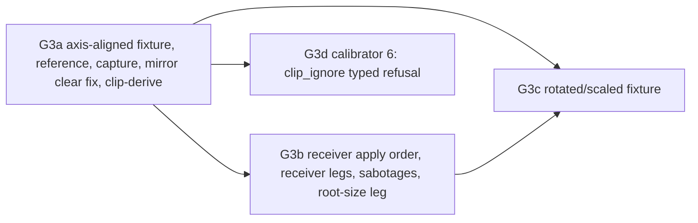

# Gate 3 design: clipping

Status: contract for gate 3, written 2026-10-09 after gate 2 passed (README "Gate 2 summary",
85/85). Nothing here is implemented yet. Hand it out piecewise. Each increment below (G3a, G3b,
G3c, G3d) is one verified commit on `main`, implemented by one agent in its own worktree. Each
works against this file and [render-stream-2.md](render-stream-2.md), the current wire format,
which gate 3 keeps (D1). The documents this extends are [gate2-design.md](gate2-design.md) and
[gate1-design.md](gate1-design.md). Background is in
[docs/handoff-headless-render-stream.md](../../../docs/handoff-headless-render-stream.md): the
gate 3 row and "Validation and measurement".

Source citations are `path:line` in the pinned `../godot-4.5.1-stable` checkout (commit
`f62fdbde15035c5576dad93e586201f4d41ef0cb`), relative to its root. Every cited line was re-read
when this contract was written. Slot numbers come from the calibrator's own derivation:
`capture/tools/calibrate.py` `parse_virtuals` over the pinned header with the release define set,
plus the measured Object prefix 23. That derivation reproduces the committed slots of the hooks
gate 3 builds on: `canvas_item_set_clip` 454, `canvas_item_set_custom_rect` 456 and
`canvas_item_add_lcd_texture_rect_region` 470.

## What gate 3 proves

The handoff's gate 3 row:

> Nested axis-aligned Control clipping, moving content and changing clip bounds. Check explicit
> pixels inside/outside every boundary. Add rotated/scaled parents as a separate fixture that
> follows Godot's actual clipping semantics.

Gate 3 keeps the three independent roles (rendered reference, headless capture host, receiver
that never sees the fixture) and adds the following:

1. **Engine clip semantics, established from source (Q1) and checked by running.** A clip is a
   scissor rectangle: the axis-aligned bounding box of the item's rect after its full transform,
   intersected with the nearest clipping ancestor's already rounded scissor, then rounded
   position-and-size-separately. The item's rect is its custom rect, or else the bounds of its
   commands. Under rotation the clip is the bounding box, not the rotated rectangle.
2. **Two correctness fixes the fixtures expose.** `canvas_item_clear` resets an item's clip flag
   in the engine. Today the capture mirror does not model that, and the receiver sets `clip`
   before it clears, so a clipping Control loses its clip on the receiver at its first redraw.
   Gate 0–2 fixtures never set a clip, which is why this never showed (Q3, Q5).
3. **An axis-aligned fixture** (`fixtures/gate3/`) with nested clips, a non-clipping
   intermediate, a child sorted into a higher z list, moving content, clip windows that slide
   without a redraw, resizes that redraw, clip toggles, the raw-RS clear/custom-rect cases, the
   custom rect as a visibility (cull) rect, and an anchored clip that depends on the root size.
   Every image is compared exactly. Every clip boundary carries named 1 px inside/outside probes
   at every step.
4. **A rotated/scaled fixture** (`fixtures/gate3-xform/`), whose expected pixels follow the
   engine's model. The fixture also carries probes on which three plausible alternative models
   disagree with it, so a reference run that matches the engine's model refutes each of them.
5. **An independent clip derivation over the wire state** (`scripts/lib/clip-derive.ts`). It
   computes every item's final scissor from a resolved recording, checks it against the
   hand-derived `expected.json`, and is the reference implementation for gate 7's browser
   receiver.
6. **Typed refusal of `canvas_item_add_clip_ignore`** (calibrator 6). Until gate 3 the mirror
   dropped that command without a trace.

What gate 3 does **not** do: `CanvasItem.clip_children` (canvas groups and masks, D5), supporting
`clip_ignore` as a command (D4), scroll containers with themed scrollbars (gate 5 styleboxes, then
gate 6), `Label.clip_text` (gate 4, Q1h), clipping under `canvas_items` stretch or a receiver-side
stretch (gates 6 and 7), extra canvases and sub-viewports (still `extra-canvas` /
`non-root-viewport`), live legs (D10), and late-join adoption of clip state (gate 8).

## Decisions

| #   | Question                              | Decision                                                                                                                                                                                                                                                                                                                                                                                                                                                                                                                                                                                                                                                                                                                                                                                                                                                                                                                                                                                                                                                                                      |
| --- | ------------------------------------- | --------------------------------------------------------------------------------------------------------------------------------------------------------------------------------------------------------------------------------------------------------------------------------------------------------------------------------------------------------------------------------------------------------------------------------------------------------------------------------------------------------------------------------------------------------------------------------------------------------------------------------------------------------------------------------------------------------------------------------------------------------------------------------------------------------------------------------------------------------------------------------------------------------------------------------------------------------------------------------------------------------------------------------------------------------------------------------------------- |
| D1  | Protocol version                      | **Stay on `render-stream/2`; no /3.** The final scissor is a pure function of state /2 already carries: item `clip`, `custom_rect` and its four floats, item and canvas transforms, the parent chain, visibility and modulate, the command list (its bounds), and the receiver's own viewport rect (`servers/rendering/renderer_canvas_cull.cpp:322-418`, `servers/rendering/renderer_viewport.cpp:387`). Gate 3 changes no key, key order, block layout or enum spelling. Its capture changes are a semantic fix inside an existing field (D3) and one more RenderingServer method name: in the existing `unsupported` command, in `observed_unsupported_ops`, and in `unobserved` (D4, D6). Those values are RS method names, an open set, as `canvas_item_add_lcd_texture_rect_region` was at G2a. Host sabotages reuse /1's `omit-op`, `freeze-frame` and `perturb-transform`; the new sabotages live in the receiver, off the wire. What would need /3 is deferred with owners: `clip_ignore` as a supported command, canvas-group item state, and a host-derived clip rect on the wire. |
| D2  | Who computes clip rects               | **The receiver's engine**, from replayed state. The capture host never computes one: `RS::draw()` is skipped under `--headless` (`main/main.cpp:4814-4839`, gate1-design.md Q2e), so the cull that computes `final_clip_rect` (`renderer_canvas_cull.cpp:402-418`) never executes there. The checker computes them independently twice: `make_expected.py` from fixture parameters, and `clip-derive.ts` from the recording (Q6, Q7).                                                                                                                                                                                                                                                                                                                                                                                                                                                                                                                                                                                                                                                         |
| D3  | `canvas_item_clear` and `clip`        | **Clear resets clip, on both sides.** The engine's `Item::clear()` sets `clip = false` (`servers/rendering/renderer_canvas_render.h:455`), and Control re-asserts the clip at every redraw (Q1b). The mirror's `clear` tap sets `clip = false` (G3a), so the wire's `clip` is the engine's flag at the end of the frame for raw-RS items too. The receiver rebuilds content before it applies `clip`, and its shadow state treats its own `canvas_item_clear` as a reset to false (G3b). This is a fix inside the existing field. render-stream-2.md gains a normative note (G3b).                                                                                                                                                                                                                                                                                                                                                                                                                                                                                                            |
| D4  | `canvas_item_add_clip_ignore`         | **Hooked (calibrator 6, slot 479) and refused, typed.** It becomes an `unsupported` command `canvas_item_add_clip_ignore` with reason `unsupported-op`, in place, and the name joins `observed_unsupported_ops`. Supporting it needs a new command op, which means /3. Only focus outlines of `Tree`, `ItemList` and `RichTextLabel` emit it (`scene/gui/tree.cpp:5082-5084`, `scene/gui/item_list.cpp:1699-1702`, `scene/gui/rich_text_label.cpp:2473-2475`), always around a stylebox draw, which is gate 5 content. Support rides the first wire bump after gate 3; gate 5 owns it.                                                                                                                                                                                                                                                                                                                                                                                                                                                                                                        |
| D5  | `clip_children` / `canvas_group_mode` | **Stays `unobserved`; not gate 3.** `CanvasItem.clip_children` calls `canvas_item_set_canvas_group_mode` (`scene/main/canvas_item.cpp:1688-1705`). That is an alpha mask rendered through a canvas group and the default clip-children material (`renderer_canvas_cull.cpp:186-246`, `drivers/gles3/rasterizer_canvas_gles3.cpp:608-619`), not the scissor that Control clipping uses. It needs item state that /2 cannot validate: /2 decoders accept `unsupported-state` only for `canvas_item_set_material` (`scripts/lib/render-stream-2.ts:2236-2239`, `receiver/rs2_decoder.gd:1541-1543`). It also needs a backbuffer path on receivers. The handoff's "CanvasGroup/masks" capability owns it.                                                                                                                                                                                                                                                                                                                                                                                         |
| D6  | `canvas_item_set_visibility_notifier` | **Not hooked; declared `unobserved` (G3d).** A notifier's area is merged into the item rect that culling and clipping use (`renderer_canvas_cull.cpp:324-327`). That affects pixels only for a raw-RS item that also clips. The scene API never combines the two: `VisibleOnScreenNotifier2D` is a Node2D that never sets a clip (`scene/2d/visible_on_screen_notifier_2d.cpp:83`, `:108`, `:119`). Separately, notifier callbacks only fire from `RS::draw()` (`servers/rendering/rendering_server_default.cpp:106`), so they never fire on a headless host. That is a host-behaviour finding for gate 8, not a clipping one.                                                                                                                                                                                                                                                                                                                                                                                                                                                                |
| D7  | Rotated and scaled parents            | **Expected pixels follow the engine's model**: bounding box, intersection with the rounded ancestor scissor, a drop below 0.5 px, then position and size rounded separately, half away from zero (Q1c). `fixtures/gate3-xform/` puts probes where three alternative models disagree with it: a rotated-rectangle clip, rounding each edge separately, and a pixel-centre scissor. The reference must match the engine's model at every probe, and each alternative must miss at least one probe (`semantic-probes`).                                                                                                                                                                                                                                                                                                                                                                                                                                                                                                                                                                          |
| D8  | Exactness and budgets                 | **Exact everywhere the synthesizer can be exact.** Every gate 3 draw is a non-antialiased `add_rect` with an opaque colour from the 0.2 grid. There is no MSAA, no texture and no filtering, so no filtered edges arise. Scissor edges are integers by construction (`renderer_canvas_cull.cpp:412-413`, `drivers/gles3/rasterizer_canvas_gles3.cpp:700`). The one inexact class is a rotated content edge inside a scissor. Pixels whose centre lies within 1 px of a non-axis-aligned edge are left out of synthesis and compared receiver ↔ reference, under a budget measured by a same-build reference repeat (expected 0). The budget is never relaxed to hide a bug.                                                                                                                                                                                                                                                                                                                                                                                                                   |
| D9  | Root size                             | **`GRC_ROOT_SIZE=enforce-min-size` for every gate 3 capture.** Anchored Controls take their size from the root (`scene/gui/control.cpp:1727-1750`), and their custom rect, which becomes their clip, is that size (`:3900`). A 64×64 headless root would therefore record wrong clips. The `root-size-observe` leg shows this: `unsupported` (`degenerate-host-size`, gate 1 policy), with a mismatch only in the anchored region.                                                                                                                                                                                                                                                                                                                                                                                                                                                                                                                                                                                                                                                            |
| D10 | Delivery                              | **File recordings, full and patch.** Clip state travels in the same item fields and the same diff as every other item field, and g1c/g1d/g2c already prove live equivalence for /2. The combined scene runs clipping live at gate 6.                                                                                                                                                                                                                                                                                                                                                                                                                                                                                                                                                                                                                                                                                                                                                                                                                                                          |
| D11 | Result classes                        | **Gate 2's, unchanged** (gate2-design.md Q7). Gate 3 adds no failure reason and no class.                                                                                                                                                                                                                                                                                                                                                                                                                                                                                                                                                                                                                                                                                                                                                                                                                                                                                                                                                                                                     |
| D12 | Probes                                | **Generated, not hand-placed.** `make_expected.py` emits, for every visible final scissor at every step, a pixel pair 1 px either side of each edge (Q6c). A pair is _decisive_ when the unclipped scene has a different colour at the outside pixel. Every edge of every clip owner needs a decisive pair at two or more steps, or an entry in `non_decisive_edges` with a reason.                                                                                                                                                                                                                                                                                                                                                                                                                                                                                                                                                                                                                                                                                                           |

## Q1. What the engine does

### Q1a. How a Control's clip reaches the RenderingServer

| Event                                           | Calls                                                                                                                       | Source                                                                      |
| ----------------------------------------------- | --------------------------------------------------------------------------------------------------------------------------- | --------------------------------------------------------------------------- |
| any redraw of a `CanvasItem`                    | `canvas_item_clear(ci)`, then, only if visible in the tree, `NOTIFICATION_DRAW`, the `draw` signal and `_draw`              | `scene/main/canvas_item.cpp:133-160` (clear `:140`, visibility gate `:142`) |
| `NOTIFICATION_DRAW` on a `Control`              | `canvas_item_set_custom_rect(ci, !disable_visibility_clip, Rect2(0, size))`, then `canvas_item_set_clip(ci, clip_contents)` | `scene/gui/control.cpp:3898-3902`                                           |
| `set_clip_contents(v)`                          | early return when unchanged; otherwise `queue_redraw()`                                                                     | `control.cpp:2868-2875`                                                     |
| size change                                     | `item_rect_changed(true)` → `queue_redraw()`                                                                                | `control.cpp:1779-1789`; `canvas_item.cpp:638-642`                          |
| position-only change                            | `_update_canvas_item_transform()` → `canvas_item_set_transform`, **no redraw**                                              | `control.cpp:1791-1793`, `:716-726`                                         |
| `set_scale`, `set_rotation`, `set_pivot_offset` | `queue_redraw()`; the transform is re-sent at `NOTIFICATION_DRAW` (`:3899`)                                                 | `control.cpp:1557-1574`, `:1581-1591`, `:1608-1618`                         |
| ancestor `Node2D` transform, canvas transform   | the ancestor's or the viewport's transform only; no call on the clipping Control                                            | `renderer_canvas_cull.cpp:355` composes the parent's transform at cull time |

So, as the orchestrator suspected, **every redraw of a Control re-sends both its custom rect and
its clip flag**, after a `canvas_item_clear` in the same flush. A clip window moves _without_ any
redraw when the clipping Control's position changes, or when an ancestor or the canvas transform
changes. It changes _with_ a redraw when the Control's size, scale, rotation, pivot or
`clip_contents` changes. `disable_visibility_clip` is not bound to scripts; only `GraphEdit` sets
it (`scene/gui/graph_edit.cpp:3200`). The raw-RS group (Q6) reproduces its effect, a clip with no
custom rect.

Controls that clip by default: `ScrollContainer`, `ItemList`, `GraphEdit`, `Tree`, `TextEdit` and
`RichTextLabel` (`scene/gui/scroll_container.cpp:845`, `item_list.cpp:2416`, `graph_edit.cpp:3349`,
`tree.cpp:6736`, `text_edit.cpp:9280`, `rich_text_label.cpp:8078`). With `clip_text`, `Label`
also calls `canvas_item_set_clip(ci, true)` in its own `NOTIFICATION_DRAW`
(`scene/gui/label.cpp:725-728`). Notifications run base class first, so this comes after
Control's call.

The engine's server-side setters store the values and nothing else
(`renderer_canvas_cull.cpp:660-665`, `:674-680`). `canvas_item_set_custom_rect(false, r)` still
overwrites the stored rect with `r` (`:679`).

### Q1b. Clear resets the clip flag

`RendererCanvasCull::canvas_item_clear` calls `Item::clear()` (`renderer_canvas_cull.cpp:1888-1892`).
That frees the commands and sets `clip = false`, `rect_dirty = true` and `final_clip_owner =
nullptr` (`renderer_canvas_render.h:430-460`, `clip` at `:455`). It does **not** reset
`custom_rect`. Consequences:

- A Control's net clip after a redraw is `clip_contents`, because Q1a's set comes after the clear.
- A raw-RS item that calls `canvas_item_clear` and does not call `canvas_item_set_clip` again
  stops clipping. Fixture step 6 checks this.
- A hidden Control's redraw clears without re-asserting (the `:142` gate). Its clip is false while
  it is hidden, which draws nothing either way, and showing it again redraws it.
- Today's mirror keeps `clip` across `clear` (`capture/src/rs_mirror.cpp:561-570`), and today's
  receiver applies `clip` before its own `canvas_item_clear` (`receiver/rs_applier.gd:487-491`
  and then `:536-540`), skipping the call when the wire value is unchanged. On the receiver,
  every content rebuild of a clipping item therefore leaves it unclipped. These are the two fixes
  of D3.

### Q1c. The clip rectangle (`_cull_canvas_item`)

For each visible item with modulate alpha ≥ 0.007 (`renderer_canvas_cull.cpp:296-320`):

1. `rect = ci->get_rect()` (`:322`). That is the custom rect when `custom_rect` is set; otherwise
   the union of the command bounds, each mapped through any `add_set_transform`, or `Rect2()` when
   there are no commands (`servers/rendering/renderer_canvas_render.cpp:36-132`). Clip-ignore and
   other non-geometry commands fall through the `default` case and add nothing (`:111-114`). The
   bounds are recomputed only while `rect_dirty`. With `custom_rect` false and the rect clean,
   `get_rect` returns the stored rect, so a `set_custom_rect(false, r)` on a clean item makes `r`
   the rect until the next command change (`:37-38`). Fixtures never rely on that: every
   `custom_rect = false` transition comes with a content rebuild in the same frame (Q6b step 7).
2. A visibility-notifier area is merged in (`:324-327`, D6).
3. `final_xform = parent_xform * self_xform`, composed from the canvas transform down
   (`:334-356`). `snap_2d_transforms_to_pixel` floors the origins here (`:350-353`). It is a
   viewport setting, default false (`scene/main/scene_tree.cpp:2098-2099`).
4. `global_rect = final_xform.xform(rect)` (`:372-377`). `Transform2D::xform(Rect2)` is the
   **axis-aligned bounding box** of the four transformed corners, built with `expand_to`, so
   negative scales normalize (`core/math/transform_2d.h:223-234`). The viewport clip rect's
   position is added, and it is `(0, 0)` for the root (`:397`; `renderer_viewport.cpp:387`).
5. If `ci->clip`: `final_clip_rect = (nearest clipping ancestor's final_clip_rect, or else the
viewport rect) ∩ global_rect` (`:402-407`). `Rect2::intersection` returns `Rect2()` for
   non-overlapping rects (`core/math/rect2.h:147-162`). If either side is below 0.5 px, the item
   **and its whole subtree** are skipped (`:408-411`). Otherwise `position = position.round()`
   and `size = size.round()`, each separately (`:412-413`), with `Math::round` =
   `std::round`, half away from zero (`core/math/math_funcs.h:625-630`). So the right edge is
   `round(x) + round(w)`, **not** `round(x + w)`. Then `final_clip_owner = ci` (`:414`). Without a
   clip, the item inherits its parent's owner (`:417`).
6. Children are culled with `final_clip_owner` passed down, whatever their z index, behind flag
   or y-sort (`:448`, `:472`, `:479`). The ancestor's rect that a descendant intersects is the
   **already rounded** one.
7. The item is attached for drawing only if it has commands and `viewport_rect.intersects(global_rect,
include_borders = true)` (`:249`, `rect2.h:59-71`). **The custom rect is also the visibility
   rect**: a Control whose `Rect2(0, size)` lies off-screen is not drawn even if its commands draw
   on-screen, and one whose rect merely touches the viewport edge is drawn. That cull test uses
   the viewport rect, never an ancestor's clip.

### Q1d. The scissor (GLES3 Compatibility)

- Batches break whenever an item's `final_clip_owner` differs from the current batch's
  (`drivers/gles3/rasterizer_canvas_gles3.cpp:601-605`). At render time the scissor is enabled
  with `glScissor(final_clip_rect.position, final_clip_rect.size)` of the owner, or disabled for
  owner `nullptr` (`:679`, `:695-704`). The render target is drawn upside down and flipped at the
  blit (`drivers/gles3/rasterizer_gles3.cpp:390`), which is why top-left canvas coordinates work
  as scissor coordinates.
- So a clip is a **hard, integer, axis-aligned pixel rectangle**. There is no antialiasing, no
  stencil and no rotated clip. A child in a higher z list keeps its ancestor's scissor, because
  the owner travels with the item.
- `canvas_item_add_clip_ignore(ci, true)` appends a command (`renderer_canvas_cull.cpp:1796-1803`).
  While the item has an owner, GLES3 breaks the batch and clears the batch's clip until
  `clip_ignore(false)` (`rasterizer_canvas_gles3.cpp:1260-1274`, `:1290-1293`). Commands between
  the two draw unclipped. Without an owner the command does nothing.

### Q1e. Root size and canvas transform

- The receiver's and the reference's scissors are computed against their own viewport rect
  `(0, 0, size)` (`renderer_viewport.cpp:387`, passed to `render_canvas` at `:685`). Both are
  640×360.
- The headless root only affects the **values captured**. Anchored Controls' sizes, and with them
  their custom rects, follow the root's size (`control.cpp:1727-1738`). Below the combined minimum
  size the width or height clamps to it, which is 0 for a plain Control (`:1740-1750`). A 64×64
  host makes Q6's `AN` zero-wide, so its whole subtree is skipped (Q1c step 5). D9.
- The canvas transform is the outermost factor of `final_xform` (Q1c step 3), so changing it moves
  every clip without any redraw. The wire carries it per transaction (/1).
- `gui/common/snap_controls_to_pixels` (default true, `core/config/project_settings.cpp:1677`;
  applied at `main/main.cpp:4472-4473`) floors a Control's origin when its rotation is a multiple
  of 90° (`control.cpp:720-723`). This is host-side and already part of the captured transform.
  `gate3-xform` disables it so fractional Control positions survive (Q6d).

### Q1f. Canvas groups and `clip_children`

`set_clip_children_mode` calls `canvas_item_set_canvas_group_mode` (`canvas_item.cpp:1688-1705`).
That allocates a canvas group (`renderer_canvas_cull.cpp:2015-2032`), which renders the subtree
into a backbuffer and masks it with the clip-children material (`:186-246`, `:451-458`;
`rasterizer_canvas_gles3.cpp:608-619`). It is independent of `clip`, and no Control sets it by
default. D5.

### Q1g. `top_level`

A `top_level` item is parented to the canvas in RS, not to its scene parent
(`canvas_item.cpp:237-273`). It therefore escapes every ancestor clip through the parent chain
the wire already carries. Gate 3 has no probe for it: entering the canvas at runtime ties a
draw index for one frame (memory: gate1-top-level-draw-index-lag). Gate 6's scene covers it if it
uses it.

### Q1h. Text

`Label.clip_text` (Q1a) and the glyph draws of clipped text controls are gate 4's. Gate 4 inherits
D3, because a Label's clip flag is re-set at every redraw like any Control's.

## Q2. Hooks: calibrator 6 (G3d)

`capture/tools/calibrate.py`: `CALIBRATOR_VERSION = "6"`. Append one optional `WANTED_SLOTS` key,
which is backward compatible (README "Calibration records and hook versions").

| Method                        | Header line | Slot | Capture                                                                                            |
| ----------------------------- | ----------- | ---- | -------------------------------------------------------------------------------------------------- |
| `canvas_item_add_clip_ignore` | 1595        | 479  | count; mirror tap: an `unsupported` command `canvas_item_add_clip_ignore`, reason `unsupported-op` |

The signature is `void (*)(void *, RID, bool)`, the existing `FnRidBool` (`hooks.cpp`, used by
`canvas_item_set_clip`). The bool crosses the ABI as one byte, as `set_clip`'s does. Derived for
reference but **not hooked**: `canvas_item_set_visibility_notifier` 494 (header 1617) and
`canvas_item_set_canvas_group_mode` 495 (header 1626).

`fixtures/spike/` exercises the new hook after arming (a raw item with `clip_ignore(true)`, a
rect, `clip_ignore(false)`), as G2a did for its hooks, so gate −1's counts are positive and the
armed and unarmed pixels stay identical. Gate −1 then passes with **56 hooks** (55 + 1), none
omitted.

## Q3. Capture

### Mirror fix (G3a)

`Mirror::clear` sets `item->state.clip = false` beside clearing the commands and bumping
`content_version` (`capture/src/rs_mirror.cpp:561-570`). It does not touch `custom_rect` (Q1b).
`capture/test/rs_mirror_test.cpp` gains three cases:

- `set_clip(true)`, `clear`: the snapshot shows `clip: false`;
- `set_clip(true)`, `clear`, `set_clip(true)` in one frame: `clip: true`, and a diff against the
  previous snapshot carries no `clip` change;
- `omit-op canvas_item_set_clip` from a frame, then `clear`: `clip: false`, with nothing of the
  dropped call applied.

### Clip-ignore tap (G3d)

`canvas_item_add_clip_ignore(item, ignore)` appends `{"op":"unsupported","name":
"canvas_item_add_clip_ignore","reason":"unsupported-op"}` in command order. It bumps
`content_version` like any add, honours `omit-op`, and makes an unknown item a
`pre-existing-object` failure, like every other item tap. The derived item-level entry is /2's
existing rule. The tap ignores the `ignore` value; it is recorded only in `counters.json`
`captured`.

### Evidence

There is no new evidence file. `counters.json` already keeps `captured.canvas_item_set_clip` and
`captured.canvas_item_set_custom_rect` per distinct (item, value) with call counts. By this
contract's count, the main fixture stays under the 32-entry cap (`kMaxEntries` in `hooks.cpp`),
with about 17 and 18 distinct entries. `captured_dropped` must be 0, which the census check
asserts.

## Q4. Delivery and wire

No wire change (D1). render-stream-2.md is amended as follows:

- **G3b, "Item":** "`clip` is the engine's clip flag at the end of the frame. `canvas_item_clear`
  resets it to false in the engine (`renderer_canvas_render.h:455`), and the capture models that.
  A receiver applies `clip` after rebuilding an item's commands, and treats its own
  `canvas_item_clear` as having reset it."
- **G3d, "Session record" features:** `observed_unsupported_ops` adds
  `canvas_item_add_clip_ignore` from calibrator 6 on. `unobserved` adds
  `canvas_item_set_visibility_notifier`. Both arrays stay sorted by byte value.

The gate 0, 1 and 2 checkers' `manifest-present` arrays change with the second amendment (G3d).

## Q5. Receiver

### Apply order (G3b)

In `rs_applier.gd`'s per-item pass (`:460-577`), the `clip` setter moves after the content block.
When the content block calls `canvas_item_clear`, it first sets `state.clip = false`. The setter
then compares the wire value with that shadow and calls `canvas_item_set_clip(rid, true)` after
every rebuild of a clipping item. A new item keeps today's path, with no clear. Every other setter
is unchanged. `custom_rect` is not reset by a clear and keeps its place.

`tests/applier2_selftest.gd` gains the following cases, asserted through the recorded RS call
sequence:

- an existing item with `clip: true` whose content changed and whose `clip` did not: `clear`,
  the adds, then `set_clip(true)`;
- the same item with only its transform changed: no `set_clip` and no `clear`;
- `clip` true → false together with a content change: `clear`, adds, and no `set_clip` call,
  because the shadow is already false.

### Sabotages (`RS_RECEIVER_SABOTAGE`, G3b)

| Value               | Behaviour                                                                                    |
| ------------------- | -------------------------------------------------------------------------------------------- |
| `ignore-clip`       | every `canvas_item_set_clip` call passes `false`                                             |
| `clip-before-clear` | the pre-gate-3 order: the `clip` setter before content, no shadow reset (Q1b's receiver bug) |

They exist only to fail checks. The receiver refuses any other value as it does today.
`applied.json` is unchanged.

## Q6. Fixtures

Both projects use gate 1's settings: 640×360, stretch `disabled`, `gl_compatibility`,
`msaa_2d=0`, `hdr_2d=false`, clear colour `(0.2,0.2,0.4,1)`, the same `[debug]` warning keys and
autoload `GrcLoader`. The main scene root is a plain `Node`, and every `CanvasItem` is created in
`_ready` (gate 0 route-(a) rule). Every capture uses `GRC_ROOT_SIZE=enforce-min-size`.

### Q6a. Colour rule

Every colour component is in {0, .2, .4, .6, .8, 1} and every alpha is 1. Every `modulate` is
white. Every channel is therefore k·51 exactly. Nothing is drawn in `[0,0,72,72]`: on a 64×64 host
nothing lands there either, because `AN` collapses (D9).

### Q6b. `fixtures/gate3/` (axis-aligned)

Nodes (step 0). Positions are local to the parent; "global" values are root-canvas pixels
`[x0,y0,x1,y1)`. Every `*F` node is a `ColorRect` filler that overhangs its clip owner on the
sides the probes test.

| Node     | Kind, parent                                                                                                                                              | Local position, size | Colour     | Global rect / final scissor at step 0      |
| -------- | --------------------------------------------------------------------------------------------------------------------------------------------------------- | -------------------- | ---------- | ------------------------------------------ |
| `A`      | `Control`, `clip_contents`, top-level                                                                                                                     | (96,88), (160,120)   | —          | scissor `[96,88,256,208)`                  |
| `AF`     | `ColorRect` in `A`                                                                                                                                        | (−16,−16), (192,152) | (1,.6,0)   | `[80,72,272,224)`                          |
| `S1`     | `ColorRect` in `A` (moving content)                                                                                                                       | (20,8), (24,24)      | (1,1,1)    | `[116,96,140,120)`                         |
| `B`      | `Control`, `clip_contents`, in `A`                                                                                                                        | (100,60), (100,80)   | —          | scissor `[196,148,256,208)` (A ∩ B)        |
| `BF`     | `ColorRect` in `B`                                                                                                                                        | (−20,−20), (140,120) | (0,.6,1)   | `[176,128,316,248)`                        |
| `N`      | `Control`, **no** clip, in `B`                                                                                                                            | (−60,30), (10,10)    | —          | —                                          |
| `NF`     | `ColorRect` in `N` (inherits `B`'s scissor through a non-clipping parent)                                                                                 | (0,0), (200,16)      | (.6,1,.2)  | `[136,178,336,194)`                        |
| `C`      | `Control`, `clip_contents`, in `B` (third level)                                                                                                          | (40,40), (40,40)     | —          | scissor `[236,188,256,208)`                |
| `CF`     | `ColorRect` in `C`                                                                                                                                        | (−8,−8), (56,56)     | (1,.2,.6)  | `[228,180,284,236)`                        |
| `BZ`     | `ColorRect` in `B`, `z_index = 1` (keeps `B`'s scissor in another z list)                                                                                 | (40,−10), (40,30)    | (.2,1,.8)  | `[236,138,276,168)`                        |
| `D`      | `ColorRect`, `clip_contents`, top-level (a clip owner that draws)                                                                                         | (344,88), (64,48)    | (.2,.6,.2) | scissor `[344,88,408,136)`                 |
| `DF`     | `ColorRect` in `D`                                                                                                                                        | (32,−12), (48,72)    | (.8,.8,.2) | `[376,76,424,148)`                         |
| `RC`     | raw item: `canvas_item_create`, parent root canvas, draw index 1000, origin (464,88), `set_custom_rect(true, (0,0,64,48))`, `set_clip(true)`, no commands | —                    | —          | scissor `[464,88,528,136)`                 |
| `RCF`    | raw item, parent `RC`, `add_rect((−16,−8,96,64))`                                                                                                         | —                    | (.4,.2,.8) | `[448,80,544,144)`                         |
| `CU`     | `Control` (`CullProbe`: `_draw` → `draw_rect((56,0,32,32))`), top-level, no clip                                                                          | (−48,264), (40,40)   | (.6,.4,1)  | custom rect `[−48,264,−8,304)`: **culled** |
| `AN`     | `Control`, `clip_contents`, anchors (0,1,1,1), offsets (88,−40,−24,−16)                                                                                   | → (88,320), (528,24) | —          | scissor `[88,320,616,344)`                 |
| `ANF`    | `ColorRect` in `AN`                                                                                                                                       | (−8,−4), (544,32)    | (.8,.4,.6) | `[80,316,624,348)`                         |
| `Marker` | as gate 1, a `Node2D` drawing one rect, colour per step                                                                                                   | (592,16), 32×32      | per step   | —                                          |

Regions, `[x,y,w,h]`, each with room for step 9's (8,4) canvas shift: `nested` `[72,64,256,200]`,
`redraw` `[328,64,112,96]`, `raw` `[440,64,120,96]`, `cull` `[0,256,64,48]`, `anchored`
`[80,312,560,44]`, `marker` `[584,8,48,48]`, and (variant) `ri` `[464,176,88,64]`.

**Timeline.** S = `RS_FIXTURE_START_FRAME` (default 1) and N = `RS_FIXTURE_STEP_FRAMES` (default
10), with gate 1's semantics: step k at frame `S+N·k`, settle at +7, default quit `S+N·9+11` (102).
Every step also sets a new marker colour.

| step | change (frame `S+N·k`)                                                                                                                                 | what it proves                                                                                                             | redraws (`content_version` bumps) |
| ---- | ------------------------------------------------------------------------------------------------------------------------------------------------------ | -------------------------------------------------------------------------------------------------------------------------- | --------------------------------- |
| 0    | initial                                                                                                                                                | three-level nesting, a non-clipping intermediate, z escape, custom-rect cull, anchored clip                                | all                               |
| 1    | `S1.position = (148,8)`                                                                                                                                | **moving content** across `A`'s right edge; transform only                                                                 | marker only                       |
| 2    | `B.position = (80,50)`; `BF.position = (0,−10)`; `CU.position = (−40,264)`                                                                             | **the clip window slides with no redraw** (`BF` stays put globally); a custom rect that touches the viewport edge is drawn | marker only                       |
| 3    | `B.size = (60,50)`                                                                                                                                     | the **clip changes through a redraw** (clear → custom rect → clip): the receiver's D3 trap                                 | `B`                               |
| 4    | `A.clip_contents = false`                                                                                                                              | toggle off: `B`'s scissor now comes from the viewport alone                                                                | `A`                               |
| 5    | `A.clip_contents = true`; `D.color = (.6,.2,.2)`                                                                                                       | toggle on; **a clipping item redraws with `clip` unchanged**                                                               | `A`, `D`                          |
| 6    | `canvas_item_clear(RC)`; `canvas_item_add_rect(RC, (8,8,16,16), (1,1,.2))` (no `set_clip`)                                                             | **clear resets clip** (Q1b): `RCF` is drawn whole                                                                          | `RC`                              |
| 7    | `canvas_item_clear(RC)`; `canvas_item_add_rect(RC, (8,8,16,16), (1,1,.2))`; `canvas_item_set_custom_rect(RC, false)`; `canvas_item_set_clip(RC, true)` | **a clip without a custom rect uses the command bounds**: `RCF` only in `[472,96,488,112)`                                 | `RC`                              |
| 8    | `canvas_item_clear(RC)`; `canvas_item_set_clip(RC, true)`                                                                                              | **empty rect → zero-area clip → subtree skipped** (Q1c step 5): `RCF` vanishes                                             | `RC`                              |
| 9    | `get_viewport().canvas_transform = Transform2D(0, Vector2(8,4))`                                                                                       | every scissor moves without a redraw                                                                                       | marker only                       |

Final scissors per step. These were derived by hand for this contract; `make_expected.py` must
reproduce them, and a disagreement is a finding to explain before either changes. `—` means no
scissor (clip off). `∅` means skipped.

| step | `A`                | `B`                 | `C`                 | `D`                | `RC`               | `AN`               |
| ---- | ------------------ | ------------------- | ------------------- | ------------------ | ------------------ | ------------------ |
| 0, 1 | `[96,88,256,208)`  | `[196,148,256,208)` | `[236,188,256,208)` | `[344,88,408,136)` | `[464,88,528,136)` | `[88,320,616,344)` |
| 2    | same               | `[176,138,256,208)` | `[216,178,256,208)` | same               | same               | same               |
| 3    | same               | `[176,138,236,188)` | `[216,178,236,188)` | same               | same               | same               |
| 4    | —                  | same as 3           | same as 3           | same               | same               | same               |
| 5    | `[96,88,256,208)`  | same as 3           | same as 3           | same               | same               | same               |
| 6    | same               | same                | same                | same               | —                  | same               |
| 7    | same               | same                | same                | same               | `[472,96,488,112)` | same               |
| 8    | same               | same                | same                | same               | ∅                  | same               |
| 9    | `[104,92,264,212)` | `[184,142,244,192)` | `[224,182,244,192)` | `[352,92,416,140)` | ∅                  | `[96,324,624,348)` |

`CU` is culled at steps 0–1, then drawn at `[16,264,48,296)` from step 2 and at `[24,268,56,300)`
at step 9.

**Variant `clip-ignore`** (`RS_FIXTURE_VARIANT`, G3d). A raw item `RI` with draw index 1002 and
origin (472,184), `set_custom_rect(true, (0,0,48,32))` and `set_clip(true)`. Its commands are
`add_rect((0,0,48,32), (.4,.8,.4))`, `add_clip_ignore(true)`, `add_rect((32,16,32,32), (1,.4,0))`
and `add_clip_ignore(false)`. The reference draws the second rect unclipped,
`[504,200,536,232)` (Q1d). A receiver skips the two unsupported commands and clips it to
`[504,200,520,216)`. Any other value of the variant exits 2.

### Q6c. `expected.json` (`render-stream-gate3-expected/1`) and `make_expected.py`

`make_expected.py` (standard library only, `--check`) is the derivation. It models Q1c over the
fixture's own parameters, never reads the engine, and writes the following:

- gate 1's top-level keys (`viewport`, `clear_rgba8`, `start_frame_default`,
  `step_frames_default`, `settle_offset`, `regions`, `creation_order`) and `fixture`
  (`gate3` | `gate3-xform`);
- per step: `draws:[{name, rect_px | quad, rgba8, clip_px:[x0,y0,x1,y1]|null}]` in paint order.
  `clip_px` is the draw's effective scissor; a draw whose owner is skipped is omitted. Also
  `marker_rgba8`, `canvas_transform:[6]`, `clip_rects:{owner:[x0,y0,x1,y1]|null|"skipped"}`, and
  `probes:[{name, owner, edge, side, xy, rgba8, unclipped_rgba8, decisive}]`, where `name` is
  `<owner>.<edge>.<side>.<i>`, for example `B.right.outside.0`;
- per step `invariants`, typed as gate 1's (`scripts/lib/gate1-expected.ts`) plus `clip`
  (item, bool), `custom_rect` (item, bool, `[x,y,w,h]`), `commands` (item, count) and
  `content_unchanged` (items, from the previous step; `Marker` excluded);
- `non_decisive_edges:[{owner, edge, reason}]`;
- `census_totals`: `canvas_item_set_clip` calls by value, `canvas_item_set_custom_rect` calls by
  enabled, and `canvas_item_clear` calls, over the whole run, derived from Q1a. Each `Control`
  redraw is one clear, one custom rect and one clip; each `Node2D` redraw is one clear. Raw calls
  are as scripted;
- `predictions:{leg: {steps:[…]} | {regions:[…]} | {probes:[…]}}` for every sabotage and
  unsupported leg. They are computed by re-running the same model with the sabotage applied (Q7).

**Probe rule.** For every step and every non-null final scissor `[x0,y0,x1,y1)`, take each edge at
the quarter, half and three-quarter points along it and form the pixel pairs inside/outside:
left `(x0,y)`/`(x0−1,y)`, right `(x1−1,y)`/`(x1,y)`, top `(x,y0)`/`(x,y0−1)`, bottom
`(x,y1−1)`/`(x,y1)`. A pair whose pixels another clip owner's edge also bounds is named after
the innermost owner. A pair is `decisive` when the outside pixel's `unclipped_rgba8` (the scene
painted with every clip off) differs from its `rgba8`. Pairs are kept whether decisive or not.
`expected-self-consistent` fails unless every owner edge has a decisive pair at two or more steps
or is listed in `non_decisive_edges`. Only `D.left` is listed, with "DF starts inside D; nothing
reaches past D's left edge". Every other owner's filler overhangs all four sides. `B.left` from
step 2 on, where `BF`'s left edge coincides with it, is still decisive through `NF`.

`scripts/lib/gate3-expected.ts` exports `synthesizeGate3(expected, step)`, which paints the clear
colour and then each draw intersected with its `clip_px`, and `probesOf(expected, step)`.

### Q6d. `fixtures/gate3-xform/` (rotated and scaled)

Same settings plus `gui/common/snap_controls_to_pixels=false`, so fractional Control positions
reach the engine unfloored (Q1e). Timeline as Q6b with steps 0–4, quit `S+N·4+11` (52).

| Group     | Nodes (step 0)                                                                                                                                                                                                                                                                                                                                                    | Region             |
| --------- | ----------------------------------------------------------------------------------------------------------------------------------------------------------------------------------------------------------------------------------------------------------------------------------------------------------------------------------------------------------------- | ------------------ |
| `rot`     | `Node2D` `RP` at (128,120), rotation 30°. `Control` `RQ` (clip) at (−40,−20), size (80,40), `pivot_offset` (40,20). Fillers in `RQ`: `RQF` (−40,−40) (160,120) (1,.6,0), which covers the whole bounding box at every step (margin 40 ≥ corner distance 34.64, scaled 1.25 at step 2); `RQI` (24,8) (24,24) (0,.6,1), whose diagonal edges lie inside the scissor | `[64,64,128,112]`  |
| `rotnest` | `Control` `OA` (clip) at (232,64), size (96,96). `Node2D` `RP2` in `OA` at (48,48), rotation 20°. `Control` `RQ2` (clip) at (−64,−12), size (128,24). `RQ2F` in `RQ2` at (−48,−48), size (224,120), colour (.6,1,.2) (margin 48 ≥ 41.14)                                                                                                                          | `[224,56,112,112]` |
| `half`    | `Node2D` `SP` at (360,40), scale 1.5. `Control` `SQ` (clip) at (7,7), size (21,15). `SQF` in `SQ` at (−8,−8), size (40,32), colour (.8,.8,.2). `Control` `SR` (clip) in `SQ` at (20.0625, 2), size (0.5, 8). `SRF` in `SR` at (−4,−4), size (16,16), colour (1,.2,.6). All values are exact in float32                                                            | `[352,32,80,72]`   |
| `flip`    | `Node2D` `FP` at (520,200), scale (−1,1). `Control` `FQ` (clip) at (8,8), size (64,48). `FQF` in `FQ` at (−8,−8), size (80,64), colour (.4,.2,.8). `FQI` in `FQ` at (0,0), size (16,48), colour (0,.6,1)                                                                                                                                                          | `[440,200,160,64]` |

| step | change                                                                  | engine-model scissors (exact float, then rounded)                                                                                                                                                                                                                        |
| ---- | ----------------------------------------------------------------------- | ------------------------------------------------------------------------------------------------------------------------------------------------------------------------------------------------------------------------------------------------------------------------ |
| 0    | initial                                                                 | `RQ`: box (83.359, 82.680, 89.282, 74.641) → `[83,83,172,158)`. `RQ2`: box ∩ `OA` = (232, 78.834, 96, 66.331) → `[232,79,328,145)`. `SQ`: (370.5, 50.5, 31.5, 22.5) → `[371,51,403,74)`. `SR`: (400.594, 53.5, 0.75, 12) → `[401,54,402,66)`. `FQ` → `[448,208,512,256)` |
| 1    | `RP.rotation_degrees = 60` (Node2D, no redraw)                          | `RQ`: (90.680, 75.359, 74.641, 89.282) → `[91,75,166,164)`                                                                                                                                                                                                               |
| 2    | `RP.rotation_degrees = 30`; `RQ.scale = (1.25,1.25)` (Control, redraws) | `RQ`: (72.199, 73.349, 111.603, 93.301) → `[72,73,184,166)`. The redraw re-asserts the clip after a clear (D3)                                                                                                                                                           |
| 3    | `SP.scale = (2,2)` (Node2D, no redraw)                                  | `SQ` → `[374,54,416,84)`; `SR`: (414.125, 58, 1, 16) → `[414,58,415,74)`                                                                                                                                                                                                 |
| 4    | `FP.scale = (1,1)` (unflip, no redraw)                                  | `FQ` → `[528,208,592,256)`                                                                                                                                                                                                                                               |

`RQ2` and the unchanged owners keep their step 0 scissors. Every fractional coordinate the model
rounds is at least 0.1 from a rounding threshold (the closest is `RQ`'s step 2 width, 111.603),
except the deliberate exact-float values of `SQ` and `SR`. `make_expected.py` asserts a margin of
at least 0.01 for every non-deliberate value, so float32 composition in the engine cannot flip a
result.

**Semantic probes** (`semantic_probes` in `expected.json`), each with the colour every model
predicts:

| Probe                                                                  | engine model | `rotated-exact` | `edge-round`      | `pixel-centre` |
| ---------------------------------------------------------------------- | ------------ | --------------- | ----------------- | -------------- |
| `rot.corner` (84,84), step 0: inside the box, outside the rotated rect | `RQF`        | clear           | `RQF`             | `RQF`          |
| `rot.bottom` (100,157), step 0: box bottom 157.32, rounded 83+75 = 158 | `RQF`        | clear           | clear (→ 157)     | clear          |
| `rot.bottom` (100,166), step 2: box bottom 166.65, rounded 73+93 = 166 | clear        | clear           | `RQF` (→ 167)     | `RQF`          |
| `half.right` (402,60), step 0: right edge 402.0, rounded 371+32 = 403  | `SQF`        | clear           | clear             | clear          |
| `half.bottom` (380,73), step 0: bottom 73.0, rounded 51+23 = 74        | `SQF`        | clear           | clear             | clear          |
| `half.sliver` (401,60), step 0: `SR` ∩ `SQ` = 0.75 px wide at 400.59   | `SRF`        | `SQF`           | `SQF` (401 → 401) | `SQF`          |

`rotated-exact` clips to the transformed rect itself, rasterized by pixel centre. `edge-round`
rounds `x` and `x + w` separately. `pixel-centre` keeps the pixels whose centre lies inside the
exact, unrounded intersection. `RQF` covers the whole bounding box (Q6d), so every `rot` cell is
the colour of the scissor decision alone. `make_expected.py` evaluates the four models over the
same scene, so each table cell is derived, not typed. The values above are this contract's hand
derivation. `semantic-probes` requires the reference to equal the engine model at every probe, and
each alternative to differ from the reference at one probe or more. The full-frame probes of Q6c
also apply here, on every scissor edge (all axis-aligned integers).

**Diagonal edges.** `RQI`'s and `RQ2F`'s edges inside a scissor are rotated. `synthesizeGate3x`
decides coverage by pixel centre inside the transformed quad. It reports a `band` mask, the pixels
whose centre lies within 1.0 px of any non-axis-aligned edge, and excludes them from
`expected-image-*`. The band pixels are compared receiver ↔ reference, under the
`reference-repeat-budget` of D8.

## Q7. Runner, legs, checks, report

```
experiments/render-stream/scripts/run-gate3.sh --extension <abs> --calibration <abs> \
    [--binary <abs>] [--out <abs dir>] [--legs g3a,g3b,g3c,g3d]
mise exec -- pnpm render-stream:gate3 -- …
```

`--out` defaults to `artifacts/render-stream/gate3/<UTC>/`. Group selection, `not-run`, shared
gamescope sessions and `scripts/lib/legs.sh` work as in gates 1 and 2. The report is
`render-stream-gate3-report/1`: gate 1's shape plus `probes`, per leg and step `{total, decisive,
failed:[names]}`, and `clip_rects`, per fixture and step, the `clip-derive.ts` table. Every image
path it quotes names a file under the run directory.

Sabotage step sets are predictions that `make_expected.py` computes by re-running its model with
the sabotage applied: a frozen state, a +1 origin x on every item, a dropped call, or a receiver
rule. The step sets quoted in Q7's leg tables are the author's derivation of the same thing. A run
that disagrees with either is a finding to explain from source before anything changes.

Class precedence is gate 2's (D11). A sabotage leg is judged by its own `leg-class-<leg>` check,
with its expected class and its exact step, region or probe set.

## Increments

Each increment is one commit on `main`, squashed from its branch, with message
`feat(render-stream): …` or `test(render-stream): …` and `Changelog: none`
(`docs/commit-and-release.md`; this is experimental code outside the published packages). Before
committing, every increment re-runs:

- `experiments/render-stream/scripts/build-capture.sh` (all ctests);
- `pnpm render-stream:gate-minus1`: 28/28, with 55 hooks before G3d and 56 after;
- `pnpm render-stream:gate0`: 19/19; `pnpm render-stream:gate1`: every group; and
  `pnpm render-stream:gate2`: g2a–g2e, 85/85;
- `pnpm render-stream:gate3 -- --legs <groups landed so far>`;
- the pure self-tests (`self-test-rs2.ts`, `self-test-gate{0,1,2}.ts`, `self-test-rs-ws.ts`,
  `golden-2/make_golden.py --check`, `fixtures/gate2/make_expected.py --check`), plus the gate 3
  ones as they appear.

`pnpm check` is red on baseline (memory: preexisting-check-failures). Run biome only on the files
you touch.

### Waves



- **Wave 1:** G3a.
- **Wave 2, in parallel:** G3b, G3c and G3d. G3c's fixture, expected derivation and reference legs
  have no dependency on G3b. Its receiver legs need G3b's apply order (its step 2 redraws a
  clipping Control), so G3c lands after G3b and rebases onto it. G3d touches the hooks,
  calibration, spike, mirror tap, features list and its own fixture variant, which is disjoint
  from G3b's receiver files and G3c's new fixture. All three add a group to `run-gate3.sh` and
  `check-gate3.ts` (a trivial merge).

Gate 3 passes when G3a–G3d have landed and `pnpm render-stream:gate3` is green across all four
groups.

---

### G3a — axis-aligned fixture, reference, capture, mirror clear fix (opus)

Runs on render-stream/2 with no receiver legs (the receiver's apply order is G3b's).

**Files**

- `fixtures/gate3/{project.godot, loader.gd, gate3.tscn, gate3.gd, cull_probe.gd, make_expected.py,
expected.json, README.md}`. The `clip-ignore` variant is G3d's; G3a refuses every
  `RS_FIXTURE_VARIANT` (exit 2).
- `scripts/lib/gate3-expected.ts` (types, `synthesizeGate3`, `probesOf`) and
  `scripts/lib/clip-derive.ts`. `deriveClipRects(state, viewport)` takes a /2 resolved state and
  returns each visible item's final scissor, null or `skipped`, by Q1c: transforms composed from
  the canvas down, rect = custom rect or command bounds (`add_rect`, both texture rects, flips
  normalized), bounding box, intersection with the rounded ancestor scissor, the drop below
  0.5 px, and round-half-away on position and size separately. No engine code is used.
- `scripts/run-gate3.sh`, `scripts/check-gate3.ts`, `scripts/lib/gate3-checks.ts`,
  `scripts/test/self-test-gate3.ts` (each check with a passing and a failing synthetic case;
  `deriveClipRects` with hand cases for nesting, the non-clipping intermediate, zero-area skip,
  half rounding, negative scale and rotation); `package.json` `render-stream:gate3`; a
  `scripts/README.md` "Gate 3" section.
- `capture/src/rs_mirror.cpp` (Q3 fix) and `capture/test/rs_mirror_test.cpp` (the three cases).

**Legs (group `g3a`)**

| Leg                | Runs                                                                                                      | Expected                     |
| ------------------ | --------------------------------------------------------------------------------------------------------- | ---------------------------- |
| `import`           | editor `--import` of `fixtures/gate3`                                                                     | exit 0                       |
| `capture`          | headless template, `GRC_MODE=arm`, `enforce-min-size`, full + patch sinks, quit 102, strace + maps sample | `success`; recording decodes |
| `reference`        | gamescope, extension absent, shots `step-0..9`                                                            | support (10 shots)           |
| `reference-repeat` | the same again                                                                                            | support                      |
| `reference-armed`  | gamescope, extension armed with `GRC_STREAM_OUT` set                                                      | support                      |

**Checks**

- `capture-armed`, `headless-no-gpu`, `recording-decodes` (both sinks), `patch-resolves-to-full`,
  `step-alignment`, `no-draw-index-ties` (G1b2's harmless rule).
- `expected-self-consistent`: the colour rule, regions, probe pairs 1 px apart across their edge,
  the decisive-coverage rule (Q6c), and the hand table of Q6b equal to the derived `clip_rects`.
- `expected-image-reference`: every step, full frame and every region, `maxChannelDelta: 0`.
- `probes-reference`: every probe exact, reported by name.
- `reference-repeat-budget`: expected 0 everywhere.
- `armed-transparent`: `reference-armed` equals `reference` exactly.
- `clip-state-invariants`: every `expected.json` invariant on the settle transactions of both
  sinks. In particular, `RC` has `clip: false` at step 6 (the mirror fix), and `custom_rect:
false` with 1 command at step 7 and 0 commands at step 8. No `content_version` changes at
  steps 1, 2 and 9 apart from the marker. `B`, `A`, `D` and `RC` bump exactly where Q6b says.
- `clip-rects-derived`: `deriveClipRects` over each settle transaction equals `clip_rects` for
  every owner and step.
- `clip-call-census`: `counters.json` `captured.canvas_item_set_clip` and
  `canvas_item_set_custom_rect` call totals by value, and `counts.canvas_item_clear`, equal
  `census_totals`, with `captured_dropped` 0 for both. This proves at the hook that every Control
  redraw re-sends both (Q1a). An extra engine redraw (a deferred layout pass, say) is a finding
  to explain from source, not a number to copy.
- `leg-class-capture`.

**Pass criteria**: `--legs g3a` is green, gates −1, 0, 1 and 2 are unchanged and green, and
`fixtures/gate3/make_expected.py --check` is clean. The README gains "Gate 3a result" with the
run directory, image paths, the census, and the reference's agreement with every probe.

---

### G3b — receiver apply order, receiver legs, sabotages (sonnet)

**Files**: `receiver/rs_applier.gd` and `receiver/receiver.gd` (Q5: order, shadow reset, the two
sabotages), `receiver/tests/applier2_selftest.gd` (Q5 cases), render-stream-2.md "Item" note
(Q4), group `g3b` in the runner and checks, and self-test cases.

**Legs (group `g3b`)**

| Leg                                   | Runs                                                                         | Expected                                                                      |
| ------------------------------------- | ---------------------------------------------------------------------------- | ----------------------------------------------------------------------------- |
| `receiver`                            | rendered receiver on `capture`'s full recording, shots at the 10 settle seqs | `success`                                                                     |
| `receiver-patch`                      | rendered receiver on the patch recording                                     | `success`                                                                     |
| `receiver-headless-trace`             | headless receiver under `strace -e openat`                                   | support                                                                       |
| `sabotage-freeze`                     | capture with `freeze-frame` at step 2's frame, rendered receiver             | `pixel-mismatch`, steps {2..9}                                                |
| `sabotage-perturb`                    | `perturb-transform` at step 1's frame                                        | `pixel-mismatch`, steps {1..9}                                                |
| `sabotage-omit-clip`                  | `omit-op canvas_item_set_clip` at step 3's frame                             | `pixel-mismatch`, steps {3..9} (prediction, below)                            |
| `sabotage-omit-custom-rect`           | `omit-op canvas_item_set_custom_rect` at step 7's frame                      | `pixel-mismatch`, steps {7,8,9}                                               |
| `sabotage-receiver-ignore-clip`       | receiver with `RS_RECEIVER_SABOTAGE=ignore-clip`                             | `pixel-mismatch`, steps {0..9}; failing probes = every decisive outside probe |
| `sabotage-receiver-clip-before-clear` | receiver with `clip-before-clear`                                            | `pixel-mismatch`, steps {3..9}                                                |
| `root-size-observe`                   | capture with `GRC_ROOT_SIZE` unset, rendered receiver                        | `unsupported` (`degenerate-host-size`), mismatch only in region `anchored`    |

How the predictions follow from Q1:

- **omit-clip.** With the mirror fix, every clear at or after frame 31 resets `clip` and the
  re-assertion is dropped. So `B` (step 3), `A` and `D` (step 5) and `RC` (steps 7 and 8) go
  unclipped. Step 4's dropped `set_clip(false)` happens to be right. Without the fix, `B` and `D`
  would have kept `true`, and the set would be {4, 6}: `A`'s dropped `false` at step 4, and `RC`
  still clipping after its step 6 clear. **The step set therefore also pins D3.**
- **omit-custom-rect** at step 7: `RC` keeps its 64×48 custom rect, so it clips to that rect
  instead of the command bounds at step 7 and is not skipped at step 8. Step 9 keeps the stale
  rect.
- **clip-before-clear**: `B`'s redraw at step 3 leaves it unclipped for good, since its wire
  `clip` never changes again. Steps 5, 7 and 8 add `A`, `D` and `RC`.
- **root-size-observe**: on the 64×64 host, `AN`'s width clamps to 0 (Q1e), so its subtree is
  skipped on the receiver. Nothing else is anchored.

**Checks**: `receiver-vs-reference` and `expected-image-receiver` (exact, full frame and every
region, every step), `probes-receiver`, `clip-rects-derived` on `receiver-patch`'s resolved input,
gate 1's `receiver-consumed-stream`, `receiver-never-loaded-fixture` (with `fixtures/gate3/`) and
`receiver-typed-clean`, and `leg-class-*` with exact step sets. `ignore-clip`'s also has the
exact failing-probe set from `predictions`, and `root-size-observe`'s the exact region set.

**Pass criteria**: `--legs g3a,g3b` is green; gates −1 to 2 are green, including gate 1's and
gate 2's receiver legs on the reordered applier. The README gains "Gate 3b result".

---

### G3c — rotated/scaled fixture (opus)

**Files**: `fixtures/gate3-xform/` (as G3a's set, with `gate3x.{tscn,gd}`), its
`make_expected.py` with the four models and the band, `scripts/lib/gate3x-expected.ts`
(`synthesizeGate3x` with pixel-centre quad coverage and the band mask), `gate3x-checks.ts`,
self-test cases (a rotated quad's coverage and band on a hand-computed 8×8 case; each model on
the six semantic probes), and group `g3c`.

**Legs (group `g3c`)**: `import-xform`; `capture-xform` (`success`); `reference-xform`,
`reference-xform-repeat` and `reference-xform-armed` (support, shots `step-0..4`);
`receiver-xform` and `receiver-xform-patch` (`success`); `sabotage-xform-perturb` (perturb at
step 1's frame → `pixel-mismatch` {1..4}); `sabotage-xform-receiver-ignore-clip` (→
`pixel-mismatch` {0..4}).

**Checks**: `expected-image-reference` and `expected-image-receiver` (exact outside the band),
`band-budget` (band pixels, reference vs repeat; the measured maximum channel delta and pixel
count become the budget, expected 0), `receiver-vs-reference` (exact outside the band, within the
budget inside it), `semantic-probes` (D7), `probes-reference`/`-receiver`, `clip-rects-derived`
(rotation, negative scale and half rounding through `deriveClipRects`), `clip-state-invariants`
(`content_version` unchanged at steps 1, 3 and 4; `RQ` bumps at step 2 with `clip` still true),
`armed-transparent`, and `leg-class-*`.

**Pass criteria**: `--legs g3a,g3b,g3c` is green. The README gains "Gate 3c result" with the
semantic-probe table as measured, the band size per step, and the budget.

---

### G3d — calibrator 6: `clip_ignore` refused, typed (sonnet)

**Files**: `capture/tools/calibrate.py` (version 6, Q2), the re-derived
`calibration/godot-4.5.1-stable-linux-release.json`, `hooks.{h,cpp}` (hook, count, `captured`
with the bool), `rs_mirror` (Q3 tap) with a mirror test, `rs_publish.cpp` (both feature
amendments of Q4), render-stream-2.md (the feature-list amendment), `fixtures/spike/` (Q2), the
gate 0, 1 and 2 checkers' `manifest-present` arrays, `fixtures/gate3/` (variant `clip-ignore`,
region `ri`, its expected draws and predictions), and group `g3d`.

**Legs (group `g3d`)**: `reference-clip-ignore` (the variant rendered without the extension;
support), `capture-clip-ignore`, and `receiver-clip-ignore` (rendered) → `unsupported`, with a
mismatch only in region `ri`.

**Checks**: `expected-image-reference` on `reference-clip-ignore`, which shows the second rect
drawn unclipped (Q1d); `clip-ignore-typed`, meaning the recording has the two `unsupported`
commands in place between the two `add_rect`s and the item-level `unsupported-op` entry;
`manifest-present` in all gates; and `leg-class-receiver-clip-ignore` with the exact region set.
The main variant's capture keeps classifying `success`.

**Pass criteria**: gate −1 is 28/28 with 56 hooks and none omitted, `armed.png == unarmed.png`;
gates 0–2 are green with the new feature arrays; `--legs g3a,g3d` is green. The README gains
"Gate 3d result" and, after the last increment lands, "Gate 3 summary": the run directory, image
paths, per-leg classes, the measured probe and semantic-probe tables, the census, and an explicit
"what this does not prove" list.

## Deferred, with owners

- **`clip_ignore` as a supported command**: the first wire bump after gate 3, owned by gate 5 (the
  focus styleboxes of `Tree`, `ItemList` and `RichTextLabel`). It stays typed `unsupported-op`
  until then (D4).
- **`clip_children` / `canvas_group_mode`**: the handoff's CanvasGroup/masks capability. It stays
  `unobserved` (D5).
- **Scroll containers** (clip plus themed scrollbars): gate 5 for styleboxes, then the clipped
  scrolling of gate 6's combined scene.
- **`Label.clip_text`** and clipped text controls: gate 4 (Q1h).
- **Clipping under `canvas_items` stretch**, the 1920×1080 fixture and a receiver that applies its
  own stretch to scissors: gates 6 and 7.
- **`viewport_set_snap_2d_transforms_to_pixel` / `_vertices_to_pixel`** are receiver-side project
  settings that change scissors (Q1c step 3). They are set before arming and unhooked. Gate 6's
  declared feature list must name them, or the session must carry them.
- **Browser receivers' clip** (scissor, bounding box, rounding of Q1c): gate 7, with
  `clip-derive.ts` as the reference implementation and both gate 3 fixtures as its conformance
  set.
- **`VisibleOnScreenNotifier2D` never firing on a headless host** (D6): measured at gate 8 against
  the target game.
- **Late-join adoption** of clip and custom-rect state for Controls that exist before arming: gate 8. A forced redraw re-sends both (Q1a).
- **`top_level` escape** (Q1g): no gate 3 probe; covered by gate 6 if its scene uses it.

There are no open design forks for the user in this gate. Two items in the known state turned out
to be wrong once the source and the code were read together: the mirror's clip after a clear, and
the receiver's order of clip and clear. D3 fixes both, and the sabotage `omit-clip`'s step set
pins the fix. The predictions marked as such (sabotage step sets, the census, culling by a
touching custom rect, the zero-area skip, and the semantic-probe outcomes) are checked by
running, not decided.
