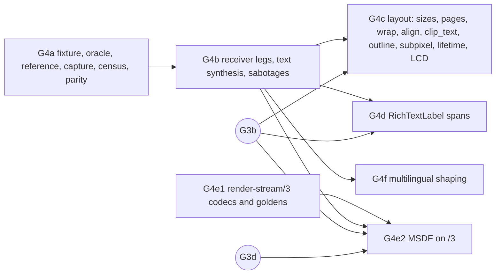

# Gate 4 design: text

Status: contract for gate 4, written 2026-10-09 while gate 3 is being implemented (G3a–G3d,
[gate3-design.md](gate3-design.md)). Nothing here is implemented yet. Hand it out piecewise. Each
increment below (G4a, G4b, G4c, G4d, G4e1, G4e2, G4f) is one verified commit on `main`,
implemented by one agent in its own worktree. Grayscale text needs no wire change and runs on
[render-stream-2.md](render-stream-2.md). MSDF text needs `render-stream/3`, specified here as a
delta in Q4 and finalized by G4e1 (D1). The documents this extends are gate3-design.md,
[gate2-design.md](gate2-design.md) and [gate1-design.md](gate1-design.md). Background is in
[docs/handoff-headless-render-stream.md](../../../docs/handoff-headless-render-stream.md): the
gate 4 row and "Validation and measurement".

Source citations are `path:line` in the pinned `../godot-4.5.1-stable` checkout (commit
`f62fdbde15035c5576dad93e586201f4d41ef0cb`), relative to its root. Every cited line was re-read
when this contract was written. `ts_adv` abbreviates `modules/text_server_adv/text_server_adv.cpp`
and `ts_adv.h` its header. Slot numbers come from the committed calibration record
(`calibration/godot-4.5.1-stable-linux-release.json`, calibrator 5).

**Contract probe.** One scratch run backs the measured statements below. It was not committed and
lives in the session scratchpad. It used the official template (`linux_release.x86_64`, sha256
`54cc2284…`) under `--headless`, the capture library built from `main` armed with the committed
record and no stream, and a probe project. That project is 640×360 with stretch `disabled`. The
probe loaded the pinned Open Sans bytes (D2) as runtime `FontFile`s with grayscale antialiasing,
light hinting, no system fallback and no mipmaps, and gave Labels new text at fixed frames.
Its `counters.json` showed the following:

| Probe case (frame)                                                   | RenderingServer calls in that frame                                                                   |
| -------------------------------------------------------------------- | ----------------------------------------------------------------------------------------------------- |
| any (1)                                                              | `texture_2d_create` 800×6 RGBA8, the engine's ColorPicker strip (memory: rs-g2a-texture-census-facts) |
| Label A, 16 px, subpixel **disabled**, `"Spike Ag"` (5)              | 1 `texture_2d_create` 256×256 **LA8** (131 072 data bytes), 0 updates                                 |
| A → `"Spike Ag Quartz"` (10)                                         | 1 `texture_2d_update` of that atlas                                                                   |
| A → `"Spike"`, later back to `"Spike Ag Quartz"` (25, 38)            | 0 texture calls                                                                                       |
| Label B, 16 px, subpixel **auto**, `"Spike Ag"`, own `FontFile` (15) | 1 create + **6 updates** of B's atlas, all in frame 15                                                |
| hidden Label D, `"Wyvern"` (20); A's later redraws (25, 38)          | 0 texture calls. `font_get_glyph_list` at the end has no W/y/v/n: a hidden Label never shapes         |
| Label C, MSDF, `FontFile.new()` defaults, 32 px, `"MSDF Ag"` (30)    | 1 create **1024×1024 RGBA8** (4 194 304 bytes), 0 updates; `add_msdf_texture_rect_region` 12          |
| Label E, 48 px, same font as A (35)                                  | 1 create 512×512 LA8 (524 288 bytes)                                                                  |
| whole run                                                            | `add_texture_rect_region` 96 = 2 × the 48 ink glyphs drawn across six text changes                    |

The captured glyph commands had integer rects whose sizes equal their source sizes, for example
`rect [-1,5,11,14]`, `source [1,1,11,14]` for `S`. The headless primary TextServer was
`ICU / HarfBuzz / Graphite (Built-in)`.

## What gate 4 proves

The handoff's gate 4 row:

> A native Label with a pinned redistributable font, initially grayscale bitmap glyphs. Change
> strings after frame one to introduce new glyphs and atlas updates; then sizes,
> wrapping/alignment, RichTextLabel spans, and multilingual shaping supported by the pinned fonts.
> Capture host-evaluated glyph placement and atlas content; do not shape the text again on the
> receiver.

Gate 4 keeps the three independent roles and adds the following:

1. **Text needs no new capture machinery for grayscale glyphs.** A grayscale glyph is an
   `add_texture_rect_region` naming an `ImageTexture` atlas (Q1). /2 already captures both, so the
   gate is mostly evidence: fixtures, an engine-side oracle, censuses and checks.
2. **Atlas parity across roles.** The headless capture host must rasterize glyph atlases
   byte-identical to the rendered reference. Each step checks this by hash against atlas images
   the reference dumps through the public TextServer API. This is the gate's core finding about
   CPU rasterization under `--headless`.
3. **Host-evaluated placement.** Every glyph quad on the wire must equal the quad the reference's
   own TextServer computes for that glyph and pen position. The receiver has no fonts and never
   shapes (D6).
4. **An atlas census derived independently** from fixture strings and engine rules: atlas
   creates, uploads, versions, pages and formats per step. It is checked against the hook log and
   the wire.
5. **MSDF text** (`canvas_item_add_msdf_texture_rect_region`), the path the target game uses
   (247 calls at gate −0.25), as a supported command on `render-stream/3`.
6. **Layout, spans and shaping**: sizes and atlas pages, wrapping and alignment, `clip_text`,
   outlines and shadows, `RichTextLabel` spans, and multilingual shaping with font fallback,
   bidi, marks, conjuncts and a missing-glyph box.

What gate 4 does **not** do: LCD subpixel text (typed `unsupported`, D1), colour/emoji fonts,
bitmap (`.fnt`) and fixed-size fonts, `TextEdit`/`LineEdit` carets and selection, underline and
strikethrough (`add_line`, gate 5), `clip_ignore` (gate 5, D1), atlas deltas (D9), text under
`canvas_items` stretch (gate 6, Q1e), browser receivers (gate 7), live legs (D11), and late-join
adoption of atlases that exist before arming (gate 8).

## Decisions

| #   | Question                         | Decision                                                                                                                                                                                                                                                                                                                                                                                                                                                                                                                                                                                                                                                                                                                                                                                                                                                                                                                                                                                                                                                                                                                                                                                                                                                                                                          |
| --- | -------------------------------- | ----------------------------------------------------------------------------------------------------------------------------------------------------------------------------------------------------------------------------------------------------------------------------------------------------------------------------------------------------------------------------------------------------------------------------------------------------------------------------------------------------------------------------------------------------------------------------------------------------------------------------------------------------------------------------------------------------------------------------------------------------------------------------------------------------------------------------------------------------------------------------------------------------------------------------------------------------------------------------------------------------------------------------------------------------------------------------------------------------------------------------------------------------------------------------------------------------------------------------------------------------------------------------------------------------------------- |
| D1  | Protocol version                 | **Grayscale text stays on `render-stream/2`. MSDF text needs `render-stream/3`.** Grayscale and mono glyphs are `add_texture_rect_region` on an LA8 `ImageTexture` (`ts_adv:4060`, `:1137`), and colour and LCD atlases are RGBA8. All of these are permitted /2 formats and /2 commands. Outlines and shadows are more of the same (Q1d). Missing-glyph boxes are `add_rect` (`servers/text_server.cpp:757-790`). MSDF carries three extra arguments, an int `outline_size`, `px_range` and `scale` (`servers/rendering_server.h:1585`). That is a new op and a new command shape, which /2 "Versioning" makes a new version. /3 is /2 plus that op and one host sabotage kind, `perturb-glyph` (Q4). It adds nothing else. LCD stays `unsupported`/`unsupported-op` (Deferred). Gate 3 D4 had `clip_ignore` riding "the first wire bump after gate 3". It moves to gate 5's own bump (/4) instead: gate 5 must bump for lines, polygons, meshes and nine-patch anyway, so it costs nothing there and keeps /3 small. G4e1 amends gate3-design.md D4 and its Deferred entry.                                                                                                                                                                                                                                     |
| D2  | Pinned font                      | **Open Sans SemiBold 1.10, `OpenSans_SemiBold.woff2`, 46 392 bytes, sha256 `661e2d9975d3029aeb32bf37b1b963c31c7c3ce08ac1bab2c8ebe27e135c4ec2`, Apache License 2.0.** It is already vendored here at `packages/html/vendor/OpenSans_SemiBold.woff2`, with `LICENSE-OpenSans` and `VENDOR.md`. It is byte-identical to the pinned engine's `thirdparty/fonts/OpenSans_SemiBold.woff2` (`thirdparty/README.md:325-328`) and to Godot's built-in default theme font (`scene/theme/default_theme.cpp:1352`). One set of bytes therefore covers both an explicit `FontFile` and the no-override default-theme Label, the commonest native case. FreeType decodes WOFF2 identically in every role (one binary). The checker never parses the font, because the oracle is engine-side (D7). G4f adds three OFL-1.1 fonts from the same engine checkout (Q6f). No font binary is committed a second time: each fixture's `fonts.lock.json` names the source path, size, sha256 and licence, and the runner copies the files into the fixture's ignored `fonts/` directory and refuses on any mismatch. The rejected alternative was `LiberationSansNarrow-Regular.ttf` (OFL, in `packages/canvas/msdf-generator/test/fixtures/`). It is a test asset of another package, and it would be a second font where one suffices. |
| D3  | Font and project settings        | **Pinned explicitly, never left to defaults** (Q1e table). Every fixture `FontFile` is configured before its first use: antialiasing grayscale, hinting light, subpixel positioning **disabled** (G4c adds one `auto` font on purpose), `allow_system_fallback = false`, `generate_mipmaps = false`, `disable_embedded_bitmaps = true`, `oversampling = 0`, `keep_rounding_remainders = true`, and for MSDF `msdf_size = 48` and `msdf_pixel_range = 24`. A runtime `FontFile.new()` defaults to 128 and 14 (`scene/resources/font.cpp:1428-1429`): the probe's 1024² atlas. Changing antialiasing or an MSDF parameter later clears the whole cache and frees its atlases (`ts_adv:2365-2371`, `:2446-2471`). Project settings pin the default-theme font, locale, layout direction, text driver, theme scale and stretch.                                                                                                                                                                                                                                                                                                                                                                                                                                                                                       |
| D4  | Grayscale bitmap first           | **G4a/G4b: grayscale, subpixel disabled, integer placement.** With subpixel off, shaping rasterizes every glyph the text needs (`ts_adv:6870-6872`). The first glyph drawn from a dirty atlas uploads it once (`:4002-4018`), and the quad is floored to whole pixels at scale 1 (`:4034-4037`), with size equal to its source size (`:1210-1212`). Uploads are then predictable from the strings alone (Q1c), and every glyph texel maps 1:1 to a pixel. Subpixel `auto` (at most 16 px: quarter pixel; at most 20 px: half, `servers/text_server.h:171-172`) rasterizes x-shifted variants lazily at draw time, one upload each (`ts_adv:3976-3987`; probe: 6 updates in one frame). G4c covers it as a measured, bounded census.                                                                                                                                                                                                                                                                                                                                                                                                                                                                                                                                                                               |
| D5  | MSDF                             | **Its own increments, G4e1 (wire) and G4e2 (capture, receiver, fixture), with the target game's parameters**: `msdf_size = 48` and `msdf_pixel_range = 24`, the STS2 Kreon import values (memory: title-quality-gap-diagnosis). MSDF skips oversampling and subpixel (`ts_adv:3944`, `:3966`). It keys its cache on `msdf_size`, not the draw size (`ts_adv.h:407-415`), so a size change never uploads. Its atlas is RGBA8 and starts at 512² for `msdf_size` 48 (`ts_adv:858-865`). Its quads are fractional (`:4022-4024`), and its coverage comes from a shader using `fwidth` (`drivers/gles3/shaders/canvas.glsl:601-619`).                                                                                                                                                                                                                                                                                                                                                                                                                                                                                                                                                                                                                                                                                 |
| D6  | Who shapes and places            | **Only the host.** Placement is fully evaluated before the RenderingServer call: shaping (`ts_adv:6794-6907`), line layout (`scene/gui/label.cpp:794-816`), pen plus offset (`label.cpp:420-426`), bearing and floor (`ts_adv:4027-4056`). The rect, source rect and modulate are all in the command. The receiver gets commands and atlas payloads, never strings or fonts. A static check and an `openat` check prove it never loads a font and never calls TextServer (Q5).                                                                                                                                                                                                                                                                                                                                                                                                                                                                                                                                                                                                                                                                                                                                                                                                                                    |
| D7  | Independent expectations         | **Five, none of them a replay of the capture.** (1) A **reference-side glyph oracle**: the rendered reference's fixture, with no extension loaded, dumps each visible text node's shaped glyphs, its glyph metrics, and its atlas pages through the public TextServer API (Q6c). (2) A **hand census** in `make_expected.py`, computed from the strings and Q1c's rules. (3) **Atlas hash parity**: the GRT1 hash of the oracle's page images against the capture's payload hashes. (4) **Atlas append-only**: a new version only writes texels that were empty. (5) **Ink presence and freshness** per text region, plus a **synthesized text image** composed from the oracle's quads and atlas pages (D8). The oracle and the hand census must agree before the capture is compared with either.                                                                                                                                                                                                                                                                                                                                                                                                                                                                                                               |
| D8  | Pixel budgets                    | **Exact where the synthesizer can be exact, budgeted where it cannot, and never relaxed.** Outside text regions, synthesis is exact (`maxChannelDelta 0`). Receiver against reference is exact everywhere for grayscale, with budget 0 measured by the reference repeat (expected 0, since both run the same build on the same GPU). For MSDF and any fractional quad, the budget is the measured reference-against-repeat maximum per region (expected 0). Synthesized grayscale ink (oracle quads × atlas alpha × colour, straight-alpha blend `GL_SRC_ALPHA, GL_ONE_MINUS_SRC_ALPHA`, `drivers/gles3/rasterizer_canvas_gles3.cpp:755-761`) is compared at `maxChannelDelta 1`, because UNORM8 blend rounding is implementation-defined. The measured maximum is reported, and a delta of 2 or more is a bug. Comparisons are raw per channel. pixelmatch is never used (memory: pixelmatch-hides-alpha-errors). Semi-transparent ink is drawn over both a dark and a light background.                                                                                                                                                                                                                                                                                                                         |
| D9  | Atlas payloads                   | **Whole versions, content-addressed, exactly as gate 2. No deltas at gate 4.** gate2-design.md D6 had pencilled in "glyph-atlas deltas" for gate 4. They need base-relative resources: a new payload format, pins on bases and a hash chain. The engine itself re-uploads the whole image (`scene/resources/image_texture.cpp:114-124`). At fixture scale a version is 128 KiB (256² LA8) to 1 MiB (512² RGBA8, MSDF 48). The report records atlas bytes per step and `copy_ns`/`hash_ns` per hook from `resources.jsonl`. Gate 6 decides deltas and hash-at-publish (Deferred) on those numbers.                                                                                                                                                                                                                                                                                                                                                                                                                                                                                                                                                                                                                                                                                                                 |
| D10 | Hooks                            | **No calibrator 7.** Every RenderingServer method on the text path is already hooked (Q2). MSDF becomes a mirror tap inside the existing hook (slot 469), whose function already receives every argument (`capture/src/hooks.cpp:889-895`). After G3d, gate −1 stays at 56 hooks.                                                                                                                                                                                                                                                                                                                                                                                                                                                                                                                                                                                                                                                                                                                                                                                                                                                                                                                                                                                                                                 |
| D11 | Delivery and classes             | **File recordings, full and patch. Gate 2's classes, unchanged.** Atlases are ordinary textures in the table, and live equivalence of /2 textures is already proven (g2c). Live text runs in gate 6's combined scene. Atlas-parity and census failures are named checks, not new classes.                                                                                                                                                                                                                                                                                                                                                                                                                                                                                                                                                                                                                                                                                                                                                                                                                                                                                                                                                                                                                         |
| D12 | Root size, stretch, oversampling | **`GRC_ROOT_SIZE=enforce-min-size` and stretch `disabled` for every capture.** With stretch disabled, viewport font oversampling is 1.0 in every role (`scene/main/viewport.cpp:1064-1082`), and the draw passes it through (`scene/main/canvas_item.cpp:146`). The glyph cache key is therefore `font_size × 64` on the host, the reference and the receiver alike (`ts_adv:3931-3957`). Under `canvas_items` stretch, the headless host's oversampling would follow its own window. That is gate 6's problem (Deferred).                                                                                                                                                                                                                                                                                                                                                                                                                                                                                                                                                                                                                                                                                                                                                                                        |
| D13 | Gate 3 dependency                | **Only text that clips waits for G3b**: `Label.clip_text` (`label.cpp:726-728`), and `RichTextLabel`, which clips by default (`scene/gui/rich_text_label.cpp:8078`). A plain Label re-asserts `clip = false` at every redraw (gate3-design.md Q1a), so the receiver's pre-G3b order of clip and clear is harmless for it. G4a, G4b, G4e1 and G4f can start before G3b lands. G4c and G4d wait for it. G4e2 also waits for G3d, whose feature lists /3 inherits.                                                                                                                                                                                                                                                                                                                                                                                                                                                                                                                                                                                                                                                                                                                                                                                                                                                   |

## Q1. What the engine does

### Q1a. From a Label's text to a RenderingServer call

| Stage                     | What happens                                                                                                                                                                                                                                                                                                                                                                                                                                                                                      | Source                                                                                    |
| ------------------------- | ------------------------------------------------------------------------------------------------------------------------------------------------------------------------------------------------------------------------------------------------------------------------------------------------------------------------------------------------------------------------------------------------------------------------------------------------------------------------------------------------- | ----------------------------------------------------------------------------------------- |
| `set_text`                | Returns early when the text is unchanged. Otherwise it marks the text dirty, calls `queue_redraw()`, then `update_minimum_size()`. The latter is deferred, and it does nothing while the Label is hidden                                                                                                                                                                                                                                                                                          | `scene/gui/label.cpp:1085-1099`; `scene/gui/control.cpp:1643-1676` (hidden: `:1666-1668`) |
| redraw                    | `canvas_item_clear`. Only if visible: TextServer oversampling is set from the viewport, then `NOTIFICATION_DRAW`                                                                                                                                                                                                                                                                                                                                                                                  | `scene/main/canvas_item.cpp:133-160` (clear `:140`, gate `:142`, oversampling `:146`)     |
| `NOTIFICATION_DRAW`       | With `clip_text`: `canvas_item_set_clip(ci, true)`. Then `_ensure_shaped()` and the `normal` stylebox, which is `StyleBoxEmpty` and draws nothing (`scene/theme/default_theme.cpp:379`). Per line it draws shadow outline, shadow, stacked shadows, stacked outlines and outline, then the text, each pass only if enabled                                                                                                                                                                        | `label.cpp:725-886`                                                                       |
| shaping                   | `hb_shape`, then per glyph: **`_ensure_glyph(glyph \| lcd bits)`, which rasterizes the variant with no x shift**, and advances and offsets in pixels. These are rounded, with the remainder carried, unless subpixel positioning applies                                                                                                                                                                                                                                                          | `ts_adv:6794-6907` (`:6872`, rounding `:6873-6901`, `subpos` `:6763`)                     |
| minimum size from shaping | `_shape` calls `update_minimum_size()`. A changed minimum resizes a free Control (its size grows from its offsets to the minimum), and a size change queues another redraw. The probe saw each text change draw its glyphs twice                                                                                                                                                                                                                                                                  | `label.cpp:369-371`; `control.cpp:1627-1641`, `:1742-1786`; `canvas_item.cpp:638-642`     |
| per glyph                 | `TS->font_draw_glyph(font, ci, size, ofs + (x_off, y_off), index, colour)`. A glyph with no font draws a hex-code box from `add_rect`s                                                                                                                                                                                                                                                                                                                                                            | `label.cpp:420-426`; `servers/text_server.cpp:757-790`                                    |
| `_font_draw_glyph`        | oversampling factor (`:3931-3950`), cache key size (`:3952-3957`), LCD and x-shift bits in the index (`:3966-3982`), `_ensure_glyph` (`:3987`), **upload if the glyph's page is dirty** (`:4001-4019`), then the command: MSDF (`:4021-4025`), otherwise `cpos = pos (+0.125 or +0.25 with subpixel), floored when scale == 1, + bearing` (`:4027-4056`) and `add_lcd_texture_rect_region` or `add_texture_rect_region(Rect2(cpos, csize), page, uv_rect, modulate, false, false)` (`:4057-4061`) | `ts_adv:3922-4066`                                                                        |

The `rect` floats on the wire are therefore the host's final glyph quad in item space, and `src`
is the glyph's texel rectangle in its page. A space or any other glyph with an empty bitmap gets
`texture_idx = -1` and draws nothing (`ts_adv:1104-1109`, `:3994`). The quad includes a 1-texel
margin on every side (`rect_range = 1`, `ts_adv.h:198`; `ts_adv:1210-1212`), so neighbouring quads
overlap where the margins hold transparent texels.

### Q1b. Rasterization and atlas pages

- **Format.** `rasterize_bitmap` writes **LA8**, with L = 255 and A = coverage, for gray and mono
  glyphs. It writes **RGBA8** for colour (BGRA bitmaps) and LCD glyphs (`ts_adv:1111-1137`,
  `:1152-1201`). `rasterize_msdf` writes RGBA8 with the true distance in alpha (`ts_adv:1045`,
  `:1067-1080`). Both formats are in gate 2's permitted six, so a text atlas is never
  `unsupported-format` under the default policy.
- **Pages.** `find_texture_pos_for_glyph` shelf-packs into the first existing page of the same
  format with room (`ts_adv:838-854`; `ShelfPackTexture::pack_rect`, `ts_adv.h:241-274`). Only when
  none fits does it create a new page. Its side is `max(size.x × 0.125, 256)` rounded up to a power
  of two, capped at 1024 for bitmaps and 2048 for MSDF, and enlarged for a glyph wider than that
  (`ts_adv:856-871`). Here `size.x` is the cache key, `font_size × 64` (`ts_adv.h:407-415`). So a
  page is 256² for sizes up to 32 px, 512² up to 64 px, and 1024² above. The probe saw 256² at
  16 px and 512² at 48 px. New pages start white with alpha 0, or all zero for MSDF
  (`ts_adv:879-899`). Packing is append-only: a glyph's texels are written once and never move
  (`ts_adv:1145-1206`).
- **One cache per font, size and outline.** Each `FontFile`, and each `FontVariation` with its own
  TextServer font RID, has its own size caches and pages (`ts_adv:1388-1402`). A bitmap outline is
  a separate cache keyed `(size × 64, outline_size)` and filled by the FreeType stroker
  (`ts_adv.h:417-425`; `ts_adv:1244`, `:1349-1376`). MSDF has one cache per `msdf_size` whatever
  the draw size (`ts_adv.h:407-409`; `ts_adv:1454-1457`).

### Q1c. When atlas bytes reach the RenderingServer

- A page's `ImageTexture` is created on its **first draw** (`ImageTexture::create_from_image`,
  then `texture_2d_create`). Later draws of a dirty page call `ImageTexture::update`, which is
  `texture_2d_update` of the **whole** page (`ts_adv:4013-4017`;
  `scene/resources/image_texture.cpp:75-83`, `:97-99`, `:114-124`). Atlases never use `set_image`,
  and so never `texture_replace`. Uploads happen inside the redraw, during `MessageQueue::flush`,
  which still runs headless (memory: rs-interposition-megadot-facts), before the command that
  names the page.
- **Rasterize-then-upload rule.** A page becomes dirty when a glyph is rasterized into it
  (`ts_adv:1082`, `:1206`). It is uploaded at the next `_font_draw_glyph` of any glyph on that page.
  With subpixel positioning off and no outline, every glyph a Label draws was rasterized while that
  Label was shaped. Shaping happens at the start of its draw (`label.cpp:744`). So **each Label
  draw that introduced new glyphs into a page uploads that page exactly once**, and every other
  draw uploads nothing. Two Labels introducing glyphs into the same page in one frame give two
  uploads in that frame. The wire publishes one coalesced version, because versions need not be
  contiguous (/2 "Texture").
- **Hidden Labels never shape** (the redraw's visibility gate and `update_minimum_size`'s early
  return, Q1a). Text set on a hidden Label rasterizes nothing until it is shown. The probe confirmed
  this: 0 calls, and no glyphs in the cache.
- **Subpixel variants** (`auto` at small sizes, or forced) are rasterized at draw time, so each
  new `(glyph, x shift)` pair rasterizes and uploads on its own (`ts_adv:3976-3987`). The probe saw
  1 create and 6 updates in one frame for `"Spike Ag"` at 16 px.
- **Two TextServer getters also upload.** `font_get_glyph_texture_rid` and
  `font_get_glyph_texture_size` create or update a dirty page (`ts_adv:3445-3495`, `:3497-3545`).
  The oracle must never call them (Q6c). Gate 8's adoption pass will (Deferred).
  `font_get_texture_image` returns the live CPU image without side effects (`ts_adv:3081-3093`).
- **Lifetime.** A cache is freed by `_font_clear_cache` (`ts_adv:1994-2006`), which any
  antialiasing, hinting or MSDF setter calls (`:2365-2371`, `:2569-2577`, `:2446-2471`), and by
  `remove_size_cache` (`ts_adv:2816-2830`). Freeing it drops each page's `ImageTexture`, whose
  destructor calls `free` (`image_texture.cpp:243-248`). The next draw makes a new page, with a new
  RID and so a new wire id.

### Q1d. Which command each glyph kind produces

| Font configuration                    | Page format    | Command                                                                                            | /2 status (G4a)                    |
| ------------------------------------- | -------------- | -------------------------------------------------------------------------------------------------- | ---------------------------------- |
| gray / mono antialiasing              | LA8            | `add_texture_rect_region(..., transpose=false, clip_uv=false)`                                     | supported                          |
| bitmap outline (`outline_size > 0`)   | LA8, own cache | the same, from `_font_draw_glyph_outline` (`ts_adv:4200-4202`)                                     | supported                          |
| shadow                                | as text        | the same command at `ofs + shadow_ofs`, with the shadow colour (`label.cpp:428-432`)               | supported                          |
| colour glyphs (BGRA)                  | RGBA8          | `add_texture_rect_region`; modulate RGB forced to 1 (`ts_adv:3997-3999`)                           | supported (not in fixtures)        |
| LCD (antialiasing LCD, layout ≠ none) | RGBA8          | `add_lcd_texture_rect_region` (`ts_adv:4057-4058`)                                                 | typed `unsupported` (calibrator 5) |
| MSDF                                  | RGBA8          | `add_msdf_texture_rect_region(rect, page, uv, modulate, outline_size, msdf_range, size/msdf_size)` | typed `unsupported` → /3 op (G4e2) |
| no font has the codepoint             | —              | `add_rect` hex box                                                                                 | supported                          |

On the server, MSDF and LCD rects are region rects with a flag. MSDF also stores
`outline = outline_size / scale / 4` and `px_range`, and flips negative sizes like the plain
region (`servers/rendering/renderer_canvas_cull.cpp:1544-1608`). GLES3 passes `px_range` and
`outline` to the shader (`rasterizer_canvas_gles3.cpp:999-1007`). It switches LCD to its own blend
mode with a per-batch blend colour (`:916-930`). The shader takes the median of three channels and
scales coverage by `fwidth(uv)` (`drivers/gles3/shaders/canvas.glsl:601-619`). On desktop GL, LA8
is uploaded as `GL_RG8`, and as `GL_LUMINANCE_ALPHA` on GLES/WebGL (`drivers/gles3/storage/texture_storage.cpp:352-360`).
That matters to gate 7.

### Q1e. What must be pinned so all roles rasterize identically

The capture host, the reference and the receiver run one binary (README "The pinned binary"). The
same FreeType, HarfBuzz, ICU and msdfgen therefore produce the same bytes for the same inputs. The
inputs are these settings:

| Input                          | Effect                                                     | Pin                                                                                                                      | Source                                                                               |
| ------------------------------ | ---------------------------------------------------------- | ------------------------------------------------------------------------------------------------------------------------ | ------------------------------------------------------------------------------------ |
| text driver                    | chosen by feature count, independent of the display server | `internationalization/rendering/text_driver=""`; `fixture-env` asserts `ICU / HarfBuzz / Graphite (Built-in)`            | `main/main.cpp:3545-3600`                                                            |
| antialiasing                   | FreeType render mode, format, LCD bits                     | `FontFile.antialiasing = 1`; `gui/theme/default_font_antialiasing=1`                                                     | `ts_adv:1296-1329`; `servers/text_server.cpp:2351`                                   |
| LCD layout                     | only with LCD antialiasing                                 | `gui/theme/lcd_subpixel_layout=1` (default; pinned for the G4c LCD variant)                                              | `servers/text_server.cpp:2358`; `ts_adv:8207-8209`                                   |
| hinting, autohinter            | FreeType load flags                                        | light (1); `force_autohinter=false`; `gui/theme/default_font_hinting=1`                                                  | `ts_adv:1245-1258`; `text_server.cpp:2352`                                           |
| subpixel positioning           | variants, advance rounding, `+0.125`/`+0.25`               | disabled (0); `gui/theme/default_font_subpixel_positioning=0`                                                            | `ts_adv:1276-1284`, `:6763`, `:4029-4033`; `text_server.cpp:2353`                    |
| MSDF and its size and range    | rasterizer, cache key, page size                           | per D5; `gui/theme/default_font_multichannel_signed_distance_field=false`                                                | `ts_adv:1338-1340`, `ts_adv.h:407-415`; `font.cpp:1428-1429`; `text_server.cpp:2355` |
| mipmaps                        | duplicated image with a mip chain                          | `false`; `gui/theme/default_font_generate_mipmaps=false`                                                                 | `ts_adv:4009-4012`; `text_server.cpp:2356`                                           |
| embolden, transform, spacing   | outline edits, advances                                    | fixture-set, recorded by the oracle                                                                                      | `ts_adv:1286-1294`, `:6759-6760`                                                     |
| system fallback                | a host-dependent font for uncovered codepoints             | `allow_system_fallback=false` on every `FontFile`; strings checked with `has_char`                                       | `scene/resources/font.h:202`                                                         |
| viewport oversampling          | cache key `size × 64 × oversampling`                       | stretch `disabled`, `display/window/stretch/scale=1.0`; `fixture-env` asserts `get_viewport().get_oversampling() == 1.0` | `viewport.cpp:1064-1082`; `ts_adv:3931-3957`                                         |
| theme scale, default font size | default-theme font size, 16 at scale 1                     | `gui/theme/default_theme_scale=1.0`; `gui/theme/custom=""`; `gui/theme/custom_font=""`                                   | `scene/theme/theme_db.cpp:50-60`; `default_theme.cpp:50`, `:97`                      |
| locale                         | HarfBuzz language (`locl`) and line-break rules            | `internationalization/locale/test="en"`, `fallback="en"`; text nodes set `language` only where Q6 says                   | `ts_adv:6780-6786`; `core/string/translation_server.cpp:445-453`, `:470-489`         |
| layout direction               | RTL layout from the OS locale                              | `internationalization/rendering/root_node_layout_direction=1` (LTR)                                                      | `core/config/project_settings.cpp:1668`                                              |
| Control snapping               | floors Control origins                                     | default `gui/common/snap_controls_to_pixels=true`                                                                        | gate3-design.md Q1e                                                                  |

### Q1f. Headless

- The TextServer is chosen without reference to the display server (`main/main.cpp:3545-3600`).
  The probe ran headless with the Advanced server.
- Under `--headless` a RenderingServer singleton exists with dummy storage. Atlases are therefore
  created and updated through the hooked virtuals: `ts_adv:4001` only checks that the singleton is
  non-null. Gate −1 saw this, and the probe measured it per case. Dummy storage keeps a create's
  image and discards updates (gate2-design.md Q1a). The capture's copy at the hook is the only
  place an updated atlas exists on the host, and gate 2 already does that copy.
- Rasterization is CPU-only: FreeType for bitmaps, and msdfgen on `WorkerThreadPool` rows
  (`ts_adv:1062-1063`). It does not depend on the renderer. Gate 4 checks byte parity between
  roles; it does not assume it.

### Q1g. Glyph position inputs on the wire

| Float on the wire (`add_texture_rect_region`) | Host computation                                                                                         |
| --------------------------------------------- | -------------------------------------------------------------------------------------------------------- |
| `rect.position`                               | `floor(line origin + pen + x_off, baseline + y_off) + glyph rect position` (bearing − margin) at scale 1 |
| `rect.size`                                   | `uv_rect.size × p_data->scale` (= `src.size` for scalable fonts at oversampling 1)                       |
| `src`                                         | `uv_rect`: page texel rect including the margin                                                          |
| `modulate`                                    | font, outline or shadow colour (RGB whitened for colour glyphs)                                          |
| MSDF `rect` (/3)                              | `pos + fgl.rect.position × size / msdf_size`, size `fgl.rect.size × size / msdf_size`, unfloored         |
| MSDF `px_range`, `scale`, `outline` (/3)      | `msdf_range`, `size / msdf_size`, the outline size in pixels (0 for the fill pass)                       |

## Q2. Hooks: no calibrator 7

| RenderingServer method                     | Slot     | Status before gate 4                        | Gate 4                                                  |
| ------------------------------------------ | -------- | ------------------------------------------- | ------------------------------------------------------- |
| `texture_2d_create`, `texture_2d_update`   | 24, 30   | copy + hash at the hook, mirror (gate 2)    | unchanged                                               |
| `free`                                     | 549      | mirror (gates 0, 2)                         | unchanged (page lifetime, Q1c)                          |
| `canvas_item_add_texture_rect_region`      | 468      | full mirror tap (gate 2)                    | unchanged: grayscale, outline, shadow and colour glyphs |
| `canvas_item_add_rect`                     | —        | full (gate 0)                               | unchanged: hex boxes, `[bgcolor]`                       |
| `canvas_item_add_msdf_texture_rect_region` | 469      | count + typed `unsupported`                 | **G4e2: mirror tap to the /3 op** (same slot)           |
| `canvas_item_add_lcd_texture_rect_region`  | 470      | count + typed `unsupported` (calibrator 5)  | unchanged                                               |
| `canvas_item_add_line`                     | 462      | typed `unsupported`                         | unchanged (RichTextLabel underline, gate 5)             |
| `canvas_item_set_clip`, `_set_custom_rect` | 454, 456 | mirror; clear fix in G3a                    | unchanged                                               |
| `canvas_item_add_clip_ignore`              | 479      | typed `unsupported` from G3d (calibrator 6) | unchanged (focus outlines; gate 5)                      |

`counters.json` keeps only 32 distinct entries for `texture_2d_create`/`_update`. Gate 4
censuses therefore read the unbounded hook log `evidence/resources.jsonl`, which has one line per
texture call with `frame`, `op`, `id`, `version`, format, size and `copy_ns`/`hash_ns`. They never
read the `captured` arrays. G4e2 makes the existing MSDF hook record its full arguments in
`counters.json` `captured.canvas_item_add_msdf_texture_rect_region`, in the shape of
`_texture_rect_region` (256 entries) plus `outline_size`, `px_range` and `scale` with their float32
bits. That is additive.

## Q3. Capture

### Grayscale (G4a–G4d, G4f): no capture change

Pages are textures, and glyphs are region commands. The mirror and publisher are used as they are.
A fixture-side requirement follows from Q1c: every `FontFile` is fully configured before the
extension arms or before its first use. In practice it is built in `_ready` before any Label that
uses it is added, so no settings change clears a cache that was already captured. G4c's lifetime
step does exactly that on purpose.

### MSDF tap (G4e2)

`canvas_item_add_msdf_texture_rect_region(item, rect, tex, src, modulate, outline_size, px_range,
scale)` appends `{"op":"add_msdf_texture_rect_region","tex":<id|null>,"outline":<int>,"f":<int>}`
with 14 floats: rect, src, modulate, `px_range`, `scale`. A texture RID the mirror never saw
created gives `unsupported`/`unknown-texture`, as for the other texture commands. The tap bumps
`content_version`, honours `omit-op`, and treats an unknown item as `pre-existing-object`. The name
leaves `observed_unsupported_ops` and the op joins `features.ops`. `capture/test/rs_mirror_test.cpp`
gains cases for an msdf command with outline, an `unknown-texture` msdf command, `omit-op` on it,
and `perturb-glyph`.

### `perturb-glyph` (host sabotage, /3, G4e2)

From `GRC_SABOTAGE_FRAME` on, the mirror adds +0.25 to `rect.x` of every `add_texture_rect_region`
and `add_msdf_texture_rect_region` it records. The engine still gets the true arguments. This
proves that a quarter-pixel glyph displacement fails the zero budgets of D8, in both the integer
(grayscale) and the fractional (MSDF) path. Item-level `perturb-transform` remains, and it moves
whole Labels.

### Evidence

There is no new evidence file. The report derives per-step atlas bytes and copy and hash costs
from `resources.jsonl`. `captured_dropped` for the region and msdf captures must be 0 wherever a
check reads them.

## Q4. Delivery and wire

### G4a–G4d, G4f: render-stream/2, unchanged

The text-specific statements in /2 are already true. The only amendment G4a makes to
render-stream-2.md is one informative sentence under "Texture": "Glyph atlas pages are ordinary
`image` entries (LA8 or RGBA8). A page grows by whole-page `texture_2d_update`s, so a step that
adds glyphs publishes a new version of each touched page and nothing else." Atlas payloads travel
like any texture: through the store in recordings, and over HTTP live.

### G4e1: render-stream/3 (`protocol/render-stream-3.md`)

/3 is /2 with exactly these changes:

- **Magic** `47 52 53 33 0D 0A 1A 0A` (`GRS3`). Subprotocol `render-stream.3`, hello
  `"protocol":"render-stream/3"`. Decoders refuse `GRS2` with `bad-magic`. The texture payload
  format stays `render-stream-texture/1`, so hashes and stores carry over unchanged.
- **Command** `{"op":"add_msdf_texture_rect_region","tex":<int>|null,"outline":<int ≥ 0>,"f":<int>}`,
  14 floats in `cmd_f32`: rect (x, y, w, h), source rect (x, y, w, h), modulate (r, g, b, a),
  `px_range`, `scale`. Floats are the engine's arguments exactly, negative sizes included, as for
  the other texture commands. `outline` is the engine's `int outline_size`. `cmd-offset` counts 14.
  `texture-ref` and the derived item-level `unsupported-texture` entry
  (`canvas_item_add_msdf_texture_rect_region`) apply as for `add_texture_rect_region`.
- **Resolved form** `{"op":"add_msdf_texture_rect_region","tex","outline","rect":[4],"src":[4],
"modulate":[4],"px_range","scale"}`.
- **Features**: `ops` gains `add_msdf_texture_rect_region`, and `observed_unsupported_ops` loses
  it. Otherwise /2's lists as amended by G3d apply.
- **Sabotage kind** `perturb-glyph` (Q3). `op` is null.
- **Golden vectors** `protocol/golden-3/` (`make_golden.py --check`): /2's six states re-encoded
  as /3, plus seq 7 with three msdf commands. One has `outline` 0, one has `outline` 4 with a
  negative width (a flip), and one names an RID the capture never saw (→ `unsupported` /
  `unknown-texture`). Seq 7 also has a new 512² RGBA8 page. `invalid/` vectors cover an msdf
  command with 12 floats (`cmd-offset`), a negative `outline` (`meta-schema`), a `tex` naming no
  entry (`texture-ref`), a missing derived `unsupported-texture` entry (`unsupported-mismatch`),
  and a `GRS2` stream (`bad-magic`).

G4e1 implements /3 in the existing /2 codec modules behind a protocol-version parameter
(`capture/src/rs2_codec.*`, `rs2_diff.*`, `scripts/lib/render-stream-2.ts`,
`receiver/rs2_decoder.gd`). `golden-2/` must keep passing unchanged. Renaming files is not part of
this contract. G4e2 switches the capture, the receiver and every gate runner to /3. From then on,
/2 decoding remains only for `golden-2/`, as /1's did.

## Q5. Receiver

- **Grayscale: no change.** It already uploads LA8 pages lazily, replays `add_texture_rect_region`
  with the wire's floats, and re-uploads a page only when its hash changes (gate2-design.md D5).
- **`receiver-never-shapes`** (G4b) has two parts. (1) Whole-run `openat` traces of the receiver
  legs open no `*.ttf`, `*.otf`, `*.woff`, `*.woff2`, `*.fnt` or `*.fontdata`. (2) A static scan of
  `receiver/**/*.gd` finds no `TextServer`, `TextServerManager`, `Font`, `FontFile`, `Label`,
  `RichTextLabel`, `draw_string` or `draw_char`. The receiver project contains no font.
- **MSDF (G4e2).** `rs_applier.gd` replays
  `RenderingServer.canvas_item_add_msdf_texture_rect_region(rid, rect, tex_rid, src, modulate,
outline, px_range, scale)`. Residency rules are the ones for the other texture commands.
  `applied.json` gains `msdf_commands`.
- **Receiver sabotage** `RS_RECEIVER_SABOTAGE=drop-msdf` (G4e2) skips every msdf command, the
  pre-/3 behaviour without its typed record. It exists only to fail checks.
- Receiver apply order for clipping text is G3b's (D13).

## Q6. Fixtures

Every gate 4 fixture uses gate 3's project settings plus Q1e's pins: 640×360, stretch
`disabled`, `gl_compatibility`, `msaa_2d=0`, `hdr_2d=false`, clear colour `(0.2,0.2,0.4,1)`, the
`[debug]` warning keys and the `GrcLoader` autoload. The main-scene root is a plain `Node`. **Every
CanvasItem and every Font is created in `_ready`** (memory: gate0-route-a-fixture-rule), and every
capture uses `GRC_ROOT_SIZE=enforce-min-size`. Colours follow gate 3's rule: components in {0, .2,
…, 1}. Alphas are 1, except where a row says `.6` on purpose. A `Marker` per step works as in gate 1.
S, N, the settle offset (+7) and `RS_FIXTURE_VARIANT` follow gate 3.

### Q6a. Fonts (`fonts.lock.json`, provisioning)

Each fixture has `fonts.lock.json`:
`[{"file","source","bytes","sha256","license","license_file","upstream"}]`. Sources are repo-relative
for in-repo files and `../godot-4.5.1-stable/...` for the engine checkout. `scripts/lib/provision-fonts.sh <fixture>`
copies each file into `<fixture>/fonts/`, whose `.gitignore` ignores everything except itself and
`.gdignore`. The `.gdignore` stops the editor importing fonts, so no `.fontdata` or pre-rendered
cache ever exists. Provisioning verifies the size and sha256 and exits 2 on any mismatch or
missing source. Fixtures load fonts with `FontFile.load_dynamic_font("res://fonts/<file>")` (the
probe: `err=0` with `.gdignore` present) and set D3's properties right after. Each fixture also
writes `env.json` when `RS_FIXTURE_ENV_LOG` is set. It records the TextServer name, the sha256 of
each font's bytes as `FileAccess` reads them, every `FontFile` property in D3, the pinned project
settings, `get_viewport().get_oversampling()`, and `TranslationServer.get_tool_locale()`.

### Q6b. `fixtures/gate4/` (G4a): Latin, grayscale, subpixel off

Fonts: `OS` = `OpenSans_SemiBold.woff2` from `packages/html/vendor/` (D2). `F16` and `F24` are one
`FontFile` used at 16 and 24 px. `DF` is the default theme font with no override (16 px, the same
bytes, a different `FontFile` and so its own pages).

| Node     | Kind, font                      | Position                 | Colour        | Region `[x0,y0,x1,y1)` | Background |
| -------- | ------------------------------- | ------------------------ | ------------- | ---------------------- | ---------- |
| `P`      | `ColorRect` panel               | (320,24), size (248,240) | (1,1,.8)      | —                      | —          |
| `L1`     | `Label`, F16                    | (24,32)                  | (1,1,1)       | `[16,24,312,64)`       | dark       |
| `L3`     | `Label`, F24                    | (24,88)                  | (1,.8,.2)     | `[16,80,312,128)`      | dark       |
| `LD`     | `Label`, no overrides (DF)      | (24,152)                 | theme (1,1,1) | `[16,144,312,184)`     | dark       |
| `LT`     | `Label`, F16                    | (24,208)                 | (1,1,1,.6)    | `[16,200,312,240)`     | dark       |
| `L2`     | `Label`, F16                    | (344,32)                 | (0,0,.2)      | `[336,24,568,64)`      | panel      |
| `LA`     | `Label`, F16                    | (344,88)                 | (0,0,0,.6)    | `[336,80,568,120)`     | panel      |
| `LH`     | `Label`, F16, `visible = false` | (344,152)                | (0,0,.2)      | `[336,144,568,184)`    | panel      |
| `Marker` | as gate 3                       | (592,16)                 | per step      | `[584,8,632,56)`       | dark       |

Timeline (step k at frame `S+N·k`; quit `S+N·9+11` = 102). The census columns are
`make_expected.py`'s hand derivation from Q1c. "F16 up." counts F16 page uploads in the step's
frame.

| step | change                                                                                       | ink glyphs (L1/L2/L3/LD/LT/LA/LH) | new F16 glyphs | F16 up. | other pages           | proves                                                          |
| ---- | -------------------------------------------------------------------------------------------- | --------------------------------- | -------------- | ------- | --------------------- | --------------------------------------------------------------- |
| 0    | `L1 "Hello"`, `L2 "Hello"`, `L3 "Sphinx"`, `LD "Default"`, `LT "Hole"`, `LA "Hole"`, `LH ""` | 5/5/6/7/4/4/0                     | H e l o        | create  | F24 create, DF create | first atlases; shared glyphs reuse one page                     |
| 1    | `L1 "Hello Quartz"`                                                                          | 11/5/6/7/4/4/0                    | Q u a r t z    | 1       | 0                     | **new glyphs after frame one → one page update**                |
| 2    | `L3.position.x += 8`                                                                         | same                              | —              | 0       | 0                     | transform only: no texture traffic, no content change           |
| 3    | `LH.text = "Wyvern"` (hidden)                                                                | same                              | —              | 0       | 0                     | a hidden Label shapes nothing (Q1c)                             |
| 4    | `LH.visible = true`                                                                          | 11/5/6/7/4/4/6                    | W y v n        | 1       | 0                     | deferred rasterization becomes one upload when shown            |
| 5    | `L1.text = ""`                                                                               | 0/5/6/7/4/4/6                     | —              | 0       | 0                     | glyph commands removed; page unchanged                          |
| 6    | `L1.text = "Quartz Hello"`                                                                   | 11/5/6/7/4/4/6                    | —              | 0       | 0                     | new placement, no new glyphs                                    |
| 7    | `L2.text = "Jump!"`; `L1.text = "Fjord"`                                                     | 5/5/6/7/4/4/6                     | J m p ! F j d  | **2**   | 0                     | two Labels, one page, one frame: 2 hook versions, 1 on the wire |
| 8    | `L3` font colour → (.4,1,.6)                                                                 | same                              | —              | 0       | 0                     | modulate-only redraw                                            |
| 9    | `LD.text = "Default 2"`                                                                      | 5/5/6/8/4/4/6                     | —              | 0       | DF: 1 (`2`)           | the default-theme font's own page                               |

Strings avoid `fi`/`fl`/`ff` and combining marks, so ink glyphs equal non-space codepoints. F16 ends
with 21 glyphs on one 256² LA8 page. Expected hook versions are F16 1, 2, 3, 4+5, then DF 1→2 and
F24 1. Wire versions are F16 1, 2, 3, 5. The oracle (Q6c) must agree with every count here before
anything is compared with the capture (`oracle-agrees`).

Intermediate shots: besides the settle shots, the reference and receivers shoot frame `S+N·k+1` for
k ∈ {1, 4, 7}, the first frame after an upload. Settle-only comparison would miss an atlas
published one frame late.

### Q6c. The glyph oracle (`glyph_oracle.gd`, `render-stream-gate4-glyphs/1`)

The oracle is enabled by `RS_FIXTURE_GLYPH_LOG=<abs path>`. It runs **only on reference legs**
(no extension; refused with exit 2 if `GRC_*` is set). At each settle frame, after drawing, it
writes one JSON line:

- `step`, `frame`;
- `nodes`: for each **visible** text node in tree order: `name`, `font_key`, `size`, `colour`,
  `global_xform`, and the glyphs of the node's own shaped lines in draw order:
  `[{index, font_key, x, y, quad:[x,y,w,h], uv:[x,y,w,h], page}]`. For G4a's single-line,
  left-aligned Labels the oracle re-shapes the node's text with `TS.create_shaped_text` and
  `shaped_text_add_string(text, font.get_rids(), size, features, language)`, then adds line
  geometry from `shaped_text_get_ascent` and the Label's `asc+dsc < font height` adjustment
  (`label.cpp:799-816`). `quad` applies Q1g's arithmetic with `font_get_glyph_offset`, `_size`,
  `_uv_rect` and `_texture_idx` (`ts_adv:3257`, `:3309`, `:3361`, `:3403`). G4c extends this with
  `shaped_text_get_line_breaks` and the alignment offsets of `label.cpp:_get_line_rect`. A
  disagreement with the capture is a finding to explain from `label.cpp` before either side
  changes. For `RichTextLabel` (G4d) the oracle reports glyph sets and counts per span, not quads.
- `pages`: for each `(font_key, size, outline)` cache in `font_get_size_cache_list`, each page's
  `{index, width, height, format, sha256}`. `sha256` is the GRT1 hash (/2 "Texture payload") of
  `font_get_texture_image` bytes. The oracle writes the raw bytes to `<log dir>/pages/<sha256>.grt`
  so that the synthesizer can read them.

It must never call `font_get_glyph_texture_rid` or `font_get_glyph_texture_size` (Q1c), and never
shape hidden nodes. Its metric getters look the cache up with oversampling 0, which removes that
cache from its oversampling level (`ts_adv:1391-1401`). That is harmless here, because oversampling
never changes (D12). It reads glyphs whose variants were already rasterized: subpixel off, or the
draw-time variant index for G4c's `auto` font. `reference-armed` runs with the oracle **off**, so
`armed-transparent` compares the fixture with and without the extension, not with and without the
oracle. `reference` and `reference-repeat` both run with it on, so the repeat budget also covers
the oracle.

### Q6d. `expected.json` (`render-stream-gate4-expected/1`) and `make_expected.py`

This is gate 3's shape (top-level keys, `regions`, `creation_order`, `fixture`) plus:

- per step: `texts:{node:{text, font_key, size, colour, visible}}`, `ink_glyphs:{node:int}`,
  `new_glyphs:{font_key@size:[codepoints]}`, `page_uploads:{font_key@size:int}`,
  `page_creates:{font_key@size:int}`, `text_regions:{node:[x0,y0,x1,y1]}`,
  `background:{node:rgba8}`, `fresh:{node:bool}` (whether its region must differ from the previous
  step), and `marker_rgba8`;
- `engine_textures`: the ColorPicker strip at frame 1 (memory: rs-g2a-texture-census-facts);
- `predictions` for every sabotage leg (step sets and the failing `atlas-hash-parity` cells).

`make_expected.py --check` uses only the standard library. It derives the census columns from the
strings with Q1c's rules: one upload per Label draw that introduces glyphs into a page, hidden
nodes never shape, empty bitmaps for whitespace. It never reads the engine.
`scripts/lib/gate4-expected.ts` exports `synthesizeGate4(expected, step)` for the non-text pixels
and `synthesizeText(oracleLine, pages, background)` for D8's ink.

### Q6e. Later fixtures (outlines; each increment owns its exact tables)

- **`fixtures/gate4-layout/` (G4c).**
  - **Sizes**: F at 12, 16, 24 and 40 px, so 40 px gets a 512² page. A step changes one Label
    16 → 40 px, creating a new cache and page while the old page stays.
  - **Pages**: `LP` at 320 px with `"ABCDEFGHIJKLMNOPQRSTUVWXYZ"`, `clip_text`, in a 600×120 box.
    The prediction is at least 2 pages of 1024² LA8 (Q1b); the oracle gives the exact page
    assignment.
  - **Wrapping**: `AUTOWRAP_WORD` and `AUTOWRAP_ARBITRARY` at a fixed width, with a text change
    that rewraps.
  - **Alignment**: horizontal left, centre, right and fill; vertical top, centre and bottom.
  - **`clip_text`** on overflowing text (needs G3b).
  - **Bitmap outline and shadow**: `outline_size 4` gets its own cache and page; `shadow_offset
(2,2)` reuses the text page.
  - **Subpixel `auto`** at 14 px, for multiple uploads in one frame. The census bound is the number
    of distinct `(glyph, x shift)` pairs the oracle reports.
  - **Lifetime**: `F_life.hinting = NONE` at a step clears the cache. It gives `free` of the page,
    a tombstone or removal, and a new page id in the same frame.
  - **Variant `lcd`**: one LCD Label. Its RGBA8 page is captured `ok`; its commands are typed
    `unsupported`.
- **`fixtures/gate4-rich/` (G4d).** A `RichTextLabel` with `bbcode_enabled`, `fit_content`,
  `scroll_active=false` and clipping by default. It has normal, bold (a `FontVariation` with
  embolden 1.2 over F), italics (a `FontVariation` transform with skew 0.2) and mono overrides, all
  on the pinned bytes. Spans: `[color]`, `[font_size=24]`, `[b]`, `[i]`, `[bgcolor]` (an `add_rect`)
  and `[outline_size=2][outline_color]`. One step is an `append_text`. Variant `underline` uses
  `[u]`, which gives `add_line`, typed `unsupported`.
- **`fixtures/gate4-msdf/` (G4e2).** `FM` is MSDF on the pinned bytes, `msdf_size 48` and
  `msdf_pixel_range 24`. Labels at 16, 24 and 40 px, one with `outline_size 4` and one under a
  `Node2D` rotated by 20° and scaled by 1.5. Steps:
  - new glyphs: one upload of the 512² RGBA8 page;
  - a size change 24 → 56: **0 uploads**, since the cache key is `msdf_size`;
  - an outline toggle: 0 uploads (same page, `ts_adv:4167`);
  - a colour change;
  - a parent rotation: transform only.
- **`fixtures/gate4-i18n/` (G4f).** Fonts: `OS`, which covers Latin, Greek, Cyrillic and
  Vietnamese, with fallbacks `Vazirmatn_Regular.woff2` (sha256 `ce58edf0377c327417034a10ba7274cc61b61999552fcb992c33f87539942bbf`,
  50 596 B, OFL-1.1, `LICENSE.Vazirmatn.txt`, upstream 33.003), `NotoSansDevanagariUI_Regular.woff2`
  (`b930a3a143378200d85e452010cc553e3fc61a3aabbd22fe51a050bf31da24b4`, 51 880 B, OFL-1.1, Noto 2.004)
  and `NotoSansHebrew_Regular.woff2` (`1bf7680cfba1ab56e0b985aabaec186b957903769df2acd0fc7b9bca4231bfc8`,
  6 200 B, OFL-1.1, Noto 2.003), all from the engine's `thirdparty/fonts/`
  (`thirdparty/README.md:289-300`, `:329-332`). Each fallback has its own pages.

  Strings:
  - Greek `Καλημέρα` and Cyrillic `Привет`;
  - Vietnamese in NFD (`e`+U+0302+U+0301), with the prediction of **1** glyph for the 3 codepoints:
    HarfBuzz composes to U+1EBF when the font maps it;
  - Arabic `مرحبا` plus `لا`, with the prediction that the lam-alef ligature is 1 glyph;
  - Persian with ZWNJ;
  - Hebrew with niqqud;
  - Devanagari `क्षत्रिय`, with the prediction of fewer glyphs than codepoints, and `कि`, where
    i-matra reordering puts the matra's quad left of the consonant's;
  - mixed bidi `abc אבג 123`, with the prediction that the RTL run's quads have x decreasing in
    logical order;
  - U+2603, which no pinned font has: a hex box of `add_rect`s only, with no texture command for
    the cluster.

  At startup the fixture asserts `has_char` for every other codepoint in the font that the
  fallback order picks, and exits 2 otherwise.

## Q7. Runner, legs, checks, report

```
experiments/render-stream/scripts/run-gate4.sh --extension <abs> --calibration <abs> \
    [--binary <abs>] [--out <abs dir>] [--legs g4a,g4b,g4c,g4d,g4e,g4f]
mise exec -- pnpm render-stream:gate4 -- …
```

The runner works as in gates 2 and 3: `--out` defaults to `artifacts/render-stream/gate4/<UTC>/`,
it uses `scripts/lib/legs.sh` and shared gamescope sessions, and unselected groups are `not-run`.
It provisions fonts (Q6a) before `--import`. `GS_STRIP_VARS` gains `RS_FIXTURE_GLYPH_LOG` and
`RS_FIXTURE_ENV_LOG`. The report is `render-stream-gate4-report/1`. It has gate 3's shape plus:

- `text`: per fixture and step, `{glyph_commands, msdf_commands, pages:[{wire_id, font_key, size,
format, w, h, hook_versions, wire_version, payload_bytes}], atlas_bytes_published, copy_ns,
hash_ns}`;
- `parity`: the atlas-hash table, per step and page, reference against capture;
- `budgets`: per fixture and region, the measured reference-against-repeat maxima and pixel
  counts, and the synthesized-text maxima.

Every image path it quotes names a file under the run directory. Sabotage step sets are
predictions from `make_expected.py`. A run that disagrees with one is a finding to explain from
source before anything changes. Class precedence is gate 2's (D11).

## Increments

Each increment is one commit on `main`, squashed from its branch: `feat(render-stream): …` or
`test(render-stream): …`, with `Changelog: none`. Before committing, each re-runs:

- `build-capture.sh` (all ctests);
- gate −1 (28/28; 55 or 56 hooks, depending on G3d);
- gates 0, 1, 2 and 3 for every group landed;
- `pnpm render-stream:gate4 -- --legs <groups landed so far>`;
- the pure self-tests, including `golden-2/make_golden.py --check` and, from G4e1 on,
  `golden-3/make_golden.py --check`.

Run biome only on touched files (memory: preexisting-check-failures).

### Waves



| Increment | Model  | Wave | May start before G3b?                                                              | Waits for           |
| --------- | ------ | ---- | ---------------------------------------------------------------------------------- | ------------------- |
| G4a       | opus   | 1    | **yes**: no receiver or mirror file                                                | —                   |
| G4e1      | sonnet | 1    | **yes**: codecs and goldens only; touches `rs2_decoder.gd` but none of G3b's files | —                   |
| G4b       | sonnet | 2    | **yes**: runs the unchanged receiver; Labels never clip                            | G4a                 |
| G4f       | opus   | 3    | **yes**: no clipping text, no receiver change                                      | G4b                 |
| G4c       | opus   | 3    | no (`clip_text`)                                                                   | G4b, G3b            |
| G4d       | sonnet | 3    | no (RichTextLabel clips)                                                           | G4b, G3b            |
| G4e2      | opus   | 4    | no (`rs_applier.gd`, `/3` feature lists)                                           | G4e1, G4b, G3b, G3d |

Every increment adds a group to `run-gate4.sh` and `check-gate4.ts`, which is a trivial merge.
Gate 4 passes when all seven have landed and `pnpm render-stream:gate4` is green across
g4a–g4f (g4e is G4e2's group).

---

### G4a — Latin grayscale fixture, oracle, reference, capture, census, parity (opus)

**Files**:

- `fixtures/gate4/`: `project.godot`, `loader.gd`, `gate4.tscn`, `gate4.gd`, `glyph_oracle.gd`,
  `fonts.lock.json`, `fonts/.gitignore`, `fonts/.gdignore`, `make_expected.py`, `expected.json`
  and `README.md`. Every `RS_FIXTURE_VARIANT` is refused (exit 2).
- `scripts/lib/provision-fonts.sh`.
- `scripts/lib/gate4-expected.ts`.
- `scripts/run-gate4.sh`, `scripts/check-gate4.ts` and `scripts/lib/gate4-checks.ts`.
- `scripts/test/self-test-gate4.ts`: each check with a passing and a failing synthetic case, the
  GRT1 hashing of a dumped page, and append-only on a hand-built 8×8 LA8 pair.
- `package.json` `render-stream:gate4`, and a `scripts/README.md` "Gate 4" section.
- render-stream-2.md's informative sentence (Q4).

**Legs (group `g4a`)**

| Leg                | Runs                                                                                                       | Expected                     |
| ------------------ | ---------------------------------------------------------------------------------------------------------- | ---------------------------- |
| `import`           | provision fonts, then editor `--import`                                                                    | exit 0                       |
| `capture`          | headless template, `GRC_MODE=arm`, `enforce-min-size`, full + patch sinks + store, quit 102, strace + maps | `success`; recording decodes |
| `reference`        | gamescope, extension absent, oracle on, settle and intermediate shots                                      | support                      |
| `reference-repeat` | the same again                                                                                             | support                      |
| `reference-armed`  | gamescope, extension armed with `GRC_STREAM_OUT`, oracle off                                               | support                      |

**Checks**

- Gate 3's capture checks: `capture-armed`, `headless-no-gpu`, `recording-decodes` (both sinks),
  `patch-resolves-to-full`, `step-alignment` and `no-draw-index-ties`. Gate 2's
  `store-complete` and `texture-versions-current`.
- `fixture-env`: `env.json` is identical across `capture`, `reference` and `reference-repeat`. It
  matches `fonts.lock.json` and Q1e's pins, with oversampling 1.0 and the Advanced TextServer.
- `expected-self-consistent`: the colour rule, disjoint regions each inside one background, and the
  census columns re-derived from the strings.
- `oracle-agrees`: the oracle's ink-glyph counts, glyph sets per page and page counts equal
  `expected.json` at every step. Both reference legs give byte-identical oracle lines.
- `glyph-commands`: on both sinks' settle transactions, each text item's texture-region commands
  equal the oracle's glyphs in count, order, `rect` and `src` (exact floats), and `modulate`. `tex`
  maps to the oracle's page through `atlas-hash-parity`'s mapping. Non-text items carry no texture
  commands.
- `atlas-hash-parity`: at every settle step, each oracle page's sha256 equals the published hash of
  exactly one wire texture, and that pairing never changes for a page's lifetime. This proves that
  headless rasterization is byte-identical to the rendered reference.
- `atlas-append-only`: consecutive published versions of a page differ only at texels that were
  empty (LA8 `(255,0)`) in the earlier one.
- `atlas-census`: from `resources.jsonl`, page creates and updates per frame per page equal
  `page_creates`/`page_uploads` (step 7: two F16 updates in one frame), and the wire versions equal
  Q6b's. Steps 2, 3, 5, 6 and 8 have zero texture lines in their frames. The engine texture is
  counted. The census window ends at the quit frame.
- `expected-image-reference`: exact outside the text regions, full frame and every region, every
  shot.
- `ink-presence-reference`: in every text region, at least 6 × `ink_glyphs` pixels differ from
  the region's background when the node is visible with text, and none do otherwise. The region
  differs from the previous step exactly when `fresh`.
- `reference-repeat-budget`: expected 0 everywhere.
- `armed-transparent`: `reference-armed` equals `reference` exactly.
- `leg-class-capture`.

**Pass criteria**: `--legs g4a` is green, gates −1 to 3 are unchanged, and `make_expected.py
--check` is clean. The README gains "Gate 4a result" with the run directory, image paths, the
census table as measured, and the parity table.

**As built (G4a, 2026-10-09).** Every census prediction in Q6b held on the first run, headless and
rendered: one 256² LA8 page per cache (`F@16`, `F@24`, `DF@16`), created in frame 1 next to the
engine's 800×6 hue strip; one `F@16` update at frames 11 and 41; **two** at frame 71 (hook v4
and v5, only v5 published or stored); one `DF@16` update at frame 91; no texture call at all in
steps 2, 3, 5, 6 and 8; 21 glyphs on `F@16`. The ink counts and wire versions (F16 1, 2, 3, 5)
match the oracle and the wire. Every page the rendered reference dumps hashes to exactly one wire
texture at every step, so headless rasterization is byte-identical. Every glyph command equals the
oracle's quad and source rect as float32, and every new version wrote only empty texels. Scene
teardown frees the runtime font's two pages at quit+1; the default theme font's page is never
freed while armed. Amendments: (1) the capture leg quits at **400**, not 102, as in gates 0–3, so
that the `/proc` maps/fd sample has time to run. Census windows end at that quit frame and are quiet
after frame 91. (2) The early shots are `shots/early-<k>.png`. `ink-presence-reference` also
requires their text regions to equal the step's settle shot, and they did. (3) The oracle writes
floats at full precision, and colours compare as float32. (4) `oracle-agrees` compares glyph sets
as the distinct glyph indices drawn per cache so far against `page_glyphs`. It does not compare
codepoints: the oracle only sees glyph indices. (5) `fixture-env` pins on `DF` only what the engine
sets from `gui/theme/default_font_*`. The default font keeps `allow_system_fallback = true`, a
`FontFile` default, which the Latin strings never exercise. (6) Cache keys in `expected.json` are
`<font>@<size>`, and page keys in reports are `<font>@<size>/<outline>#<index>`.

---

### G4b — receiver legs, text synthesis, sabotages (sonnet)

**Files**: group `g4b` in the runner and checks, `synthesizeText` in `gate4-expected.ts`, the
`receiver-never-shapes` check (Q5) and self-test cases. No receiver, mirror or fixture file
changes.

**Legs (group `g4b`)**

| Leg                       | Runs                                                                           | Expected                                                                                   |
| ------------------------- | ------------------------------------------------------------------------------ | ------------------------------------------------------------------------------------------ |
| `receiver`                | rendered receiver on the full recording + store, settle and intermediate shots | `success`                                                                                  |
| `receiver-patch`          | patch recording                                                                | `success`                                                                                  |
| `receiver-headless-trace` | headless receiver under `strace -f -e openat`                                  | support                                                                                    |
| `sabotage-freeze`         | capture with `freeze-frame` at frame 11 (step 1)                               | `pixel-mismatch`, steps {1..9}                                                             |
| `sabotage-omit-atlas`     | `omit-op texture_2d_update` from frame 41 (step 4)                             | `pixel-mismatch`, steps {4..9}; `atlas-hash-parity` fails exactly at F16 {4..9} and DF {9} |
| `sabotage-perturb`        | `perturb-transform` at frame 21 (step 2)                                       | `pixel-mismatch`, steps {2..9}                                                             |

How the predictions follow:

- **Freeze.** Every step after the freeze changes the marker at least.
- **Omit.** With updates dropped from step 4, F16 stays at step 1's content, without W, y, v and
  n, from step 4 on. `LH` shows `"Wyvern"` from step 4 to step 9, so every step from 4 on
  mismatches. Steps 1–3 must still match: this proves that the omission is the cause, not a global
  break. The omit-op's own log lines are marked and the registry skips them (memory:
  rs-g2b2-texture-wire-facts), so the class is `pixel-mismatch`, not `capture-failure`.
- **Perturb.** It moves every item, Labels included, by +1 px.

**Checks**:

- `receiver-vs-reference`: exact, every shot, full frame and every region.
- `expected-image-receiver`: as for the reference.
- `expected-text-reference` and `-receiver`: `synthesizeText` against the image inside each text
  region, `maxChannelDelta 1`. The measured maximum and the pixel count at delta 1 are reported.
- `ink-presence-receiver`.
- Gate 2's `resource-quiet` on steps 2, 3, 5, 6 and 8: no fetch and no upload.
- `receiver-never-shapes`.
- `receiver-consumed-stream`, `receiver-never-loaded-fixture` (with `fixtures/gate4/`) and
  `receiver-typed-clean`.
- `leg-class-*` with exact step sets.

**Pass criteria**: `--legs g4a,g4b` is green. The README gains "Gate 4b result".

---

### G4c — layout: sizes, pages, wrapping, alignment, `clip_text`, outline, shadow, subpixel, lifetime, LCD (opus, after G3b)

**Files**: `fixtures/gate4-layout/` (the full set as G4a's, its tables from Q6e),
`glyph_oracle.gd` extended with line breaks, alignment, outline caches and variant indices, and
group `g4c`.

**Legs**:

- `capture-layout`;
- `reference-layout`, `-repeat` and `-armed`;
- `receiver-layout` and `-patch`;
- `capture-lcd`, `reference-lcd` and `receiver-lcd` → `unsupported`, with mismatch only in the
  LCD region and the commands typed `canvas_item_add_lcd_texture_rect_region`/`unsupported-op`;
- `sabotage-layout-omit-atlas` at the multi-page step → `pixel-mismatch` from that step on, in
  regions `LP` only.

**Checks**: G4a's and G4b's on this fixture, plus:

- `atlas-pages`: the page count and formats equal the oracle's, and at least 2 pages for `LP`.
- `subpixel-census`: uploads per frame are at most the oracle's new `(glyph, x shift)` pairs and
  at least 1 when there are any.
- `page-lifetime`: the lifetime step frees the old id, which leaves the table at the first
  snapshot that no longer names it, and creates a new id in the same frame.
- `clip-rects-derived`: gate 3's `deriveClipRects` on the `clip_text` Labels.

**Pass criteria**: `--legs g4a,g4b,g4c` is green. The README gains "Gate 4c result" with the
measured subpixel census and page tables.

---

### G4d — RichTextLabel spans (sonnet, after G3b)

**Files**: `fixtures/gate4-rich/` (Q6e), per-span oracle output, and group `g4d`.

**Legs**: capture, reference ×3, receiver ×2, and variant `underline` (`capture-underline` and
`receiver-underline` → `unsupported`, mismatch only in its region, `canvas_item_add_line`).

**Checks**: G4a's and G4b's, with the per-span oracle in place of quads:

- glyph counts and per-variation page sets: bold and italic each have their own pages;
- `[bgcolor]` `add_rect` commands per span;
- gate 3's clip checks on the RichTextLabel's clip.

**Pass criteria**: `--legs …,g4d` is green. The README gains "Gate 4d result".

---

### G4e1 — render-stream/3 codecs and goldens (sonnet)

**Files**:

- `protocol/render-stream-3.md`: /2's text with Q4's changes, written as a delta document like
  render-stream-2.md;
- the version-parameterized codecs (Q4);
- `protocol/golden-3/` with `make_golden.py`;
- self-test cases in `self-test-rs2.ts` (renamed tests are not required);
- gate3-design.md's D4 and Deferred amendment (D1).

The capture and the receiver keep emitting and consuming /2.

**Pass criteria**: `golden-2/` and `golden-3/` both pass `--check` and both decoders' self-tests.
All existing gates are unchanged.

---

### G4e2 — MSDF on render-stream/3 (opus, after G4e1, G4b, G3b, G3d)

**Files**:

- `capture/src/rs_mirror.*` (the msdf tap and `perturb-glyph`, Q3);
- `hooks.cpp` (msdf `captured` arguments, Q2);
- `rs_publish.cpp` (/3 magic and features);
- `rs_mirror_test.cpp`;
- `receiver/rs_applier.gd` and `receiver.gd` (msdf replay and `drop-msdf`, Q5);
- every gate runner and checker switched to /3, including the `manifest-present` arrays;
- `fixtures/gate4-msdf/` (Q6e) and group `g4e`.

**Legs (group `g4e`)**

| Leg                                   | Runs                                        | Expected                                                                 |
| ------------------------------------- | ------------------------------------------- | ------------------------------------------------------------------------ |
| `capture-msdf`                        | as G4a                                      | `success`; msdf commands present, no msdf `unsupported`                  |
| `reference-msdf`, `-repeat`, `-armed` | as G4a                                      | support                                                                  |
| `receiver-msdf`, `-patch`             | rendered receiver                           | `success`                                                                |
| `sabotage-msdf-perturb-glyph`         | `perturb-glyph` at the new-glyph step       | `pixel-mismatch` from that step on, MSDF regions only                    |
| `sabotage-msdf-receiver-drop`         | `RS_RECEIVER_SABOTAGE=drop-msdf`            | `pixel-mismatch` at every step with visible MSDF text, MSDF regions only |
| `sabotage-gray-perturb-glyph`         | `perturb-glyph` on `fixtures/gate4`, step 1 | `pixel-mismatch` {1..9}                                                  |

**Checks**:

- `atlas-hash-parity` and `atlas-append-only` on the RGBA8 page (empty texel `(0,0,0,0)`).
- `atlas-census`: one upload for new glyphs, **zero** at the size change and the outline toggle.
- `glyph-commands`: msdf quads equal Q1g's MSDF formula over oracle metrics within float32
  rounding of the engine's own computation. They are compared bit-for-bit with the oracle's
  float32 result, which uses the same formula.
- `msdf-args`: `px_range` 24 and `scale = size / 48` on every msdf command, and `outline` as set.
- `reference-repeat-budget`: measured per region, expected 0.
- `receiver-vs-reference`: within that budget.
- All gates 0–4 green on /3, and gate 2's goldens unchanged.

**Pass criteria**: gates −1 to 3 green on /3, and `--legs g4a,…,g4e` green. The README gains
"Gate 4e result" with the MSDF budget as measured.

---

### G4f — multilingual shaping (opus, after G4b)

**Files**: `fixtures/gate4-i18n/` (Q6e, with three lock entries from the engine checkout), oracle
output with clusters and fallback font keys, and group `g4f`.

**Legs**: capture, reference ×3, receiver ×2, and `sabotage-i18n-omit-atlas` (omit-op
`texture_2d_update` at the step that first shows Devanagari → `pixel-mismatch` from that step, in
Devanagari regions only).

**Checks**: G4a's and G4b's, with these additions:

- `glyph-commands` against the oracle, which is the only source of counts for complex scripts;
- `script-predictions`: the hand predictions of Q6e (NFD composition to 1 glyph, lam-alef 1 glyph,
  Devanagari fewer glyphs than codepoints, the i-matra quad left of its consonant, the RTL run x
  decreasing, the hex box with no texture command). Each is checked on the oracle and on the
  capture, and a failed prediction is a finding before anything changes;
- `fallback-pages`: each fallback font's pages appear only after its first script appears.

**Pass criteria**: `--legs …,g4f` green. The README gains "Gate 4f result" and, after the last
increment lands, "Gate 4 summary". The summary lists the run directory, image paths, per-leg
classes, census, parity and budget tables, measured atlas bytes and copy/hash cost per step, and an
explicit "what this does not prove" list.

## Deferred, with owners

- **LCD subpixel text**: stays typed `unsupported` (calibrator 5). Its pixels depend on the
  host's `lcd_subpixel_layout` matching the viewer's physical panel. They need GLES3's LCD blend
  mode with a constant blend colour per batch, and they break under any receiver scaling. Gate 7's
  receiver manifests decide whether it is ever supported. Nothing defaults to it.
- **`clip_ignore`** (RichTextLabel, Tree and ItemList focus outlines): gate 5's wire bump (/4),
  not /3 (D1).
- **Underline and strikethrough** (`add_line`): gate 5.
- **Atlas deltas, and hash-at-publish for versions superseded within a frame** (D9): gate 6
  measures them, from the per-step atlas bytes and `copy_ns`/`hash_ns` that gate 4 reports. The
  subpixel `auto` case (several whole-page copies and hashes per frame) and 512²–1024² MSDF pages
  are the inputs.
- **Text under `canvas_items` stretch** (the gate 6 1920×1080 fixture): viewport oversampling
  follows the stretch scale (`viewport.cpp:1067-1079`). A headless host's window is not the
  reference's, so the host must pin `oversampling_override`, or match the window size, before its
  atlases can equal the reference's. Gate 6 owns it.
- **Colour (emoji) fonts, `.fnt` bitmap fonts, `fixed_size`, embedded bitmaps**: gate 8's census of
  the target game decides whether they are needed. No redistributable colour font is vendored.
- **`TextEdit`/`LineEdit` carets, selection and IME**: gate 6.
- **Browser receivers' text**: gate 7. That means LA8 upload on WebGL (`GL_LUMINANCE_ALPHA`,
  Q1d), the MSDF shader including `fwidth`, and the straight-alpha blend. Gate 4's fixtures and
  oracle are the conformance set.
- **Late-join adoption of pre-arm atlases** (STS2 preloads fonts): gate 8. The TextServer exposes
  pages (`font_get_size_cache_list`, `font_get_texture_image`) and the page RID
  (`font_get_glyph_texture_rid`). The latter uploads a dirty page as a side effect (Q1c), so an
  adoption pass must run it before arming or account for the upload.
- **`RichTextLabel` effects, tables, images and scrolling**: gate 6's combined scene, if it uses
  them.

The known state was right on the facts that matter here: grayscale glyphs are fully supported on
/2, MSDF and LCD are typed `unsupported`, and gate 2 copies textures at the hook. Three things
were not known before this contract's probe:

- the per-draw upload rule, including two uploads for two Labels in one frame and draw-time
  subpixel variants;
- hidden Labels never shaping;
- `FontFile.new()` defaulting to `msdf_size` 128, which gives a 4 MiB page.

The rest of Q1c and the census tables are predictions, checked by running, not decided. That
includes the step 7 double upload, the two draws per text change, the page counts in G4c and every
script prediction in G4f. There are no open design forks for the user in this gate.
