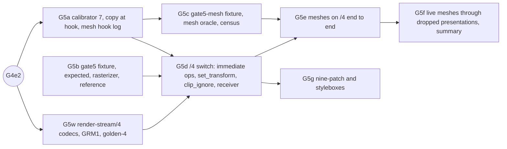

# Gate 5 design: geometry and broader 2D

Status: contract for gate 5, written 2026-10-10 while G4e2 (MSDF on render-stream/3, which switches
every runner to /3) is in flight. Nothing here is implemented yet. Hand it out piecewise. Each
increment below (G5a, G5b, G5c, G5w, G5d, G5e, G5g, G5f) is one verified commit on `main`,
implemented by one agent in its own worktree. Gate 5 needs a new wire version, `render-stream/4`,
specified here as a delta in Q4 and finalized by G5w (D1). The documents this extends are
[gate4-design.md](gate4-design.md), [gate3-design.md](gate3-design.md),
[gate2-design.md](gate2-design.md) and [gate1-design.md](gate1-design.md); the current wire is
[render-stream-3.md](render-stream-3.md) over [render-stream-2.md](render-stream-2.md). Background
is in [docs/handoff-headless-render-stream.md](../../../docs/handoff-headless-render-stream.md):
the gate 5 row, "Evidence to reuse" and "Capture and receiver contract".

Source citations are `path:line` in the pinned `../godot-4.5.1-stable` checkout (commit
`f62fdbde15035c5576dad93e586201f4d41ef0cb`), relative to its root. Every cited line was re-read
when this contract was written. Abbreviations: `rcc` is
`servers/rendering/renderer_canvas_cull.cpp`, `rcr` is
`servers/rendering/renderer_canvas_render.{h,cpp}`, `gles3c` is
`drivers/gles3/rasterizer_canvas_gles3.cpp`, `gles3m` is `drivers/gles3/storage/mesh_storage.cpp`,
`rs.cpp`/`rs.h` are `servers/rendering_server.{cpp,h}`, `rsd.h` is
`servers/rendering/rendering_server_default.h`, `dms` is
`servers/rendering/dummy/storage/mesh_storage.{h,cpp}`, `ci.cpp` is `scene/main/canvas_item.cpp`.
Slot numbers come from `capture/tools/calibrate.py` `parse_virtuals` over the pinned header with
the release define set plus the measured Object prefix 23. That derivation reproduces every
committed slot gate 5 builds on (`mesh_create` 71, `mesh_add_surface` 82, the two region updates
86/87, `mesh_set_custom_aabb` 94, `mesh_clear` 100, `canvas_item_add_line` 462 …
`canvas_item_add_clip_ignore` 479, `free` 549).

**No contract probe was run.** Every engine statement below is read from source. Every count,
step set and census in Q6 is a prediction that the increments check by running; a run that
disagrees is a finding to explain from source before anything changes.

## What gate 5 proves

The handoff's gate 5 row:

> Lines, polygons, textured triangles, then persistent mutable meshes. Change vertices, indices
> and color data over multiple frames and through dropped presentations. Include a synthetic
> geoclip-like deforming mesh and resource recreation. Add nine-patch/stylebox coverage needed by
> the combined scene.

Gate 5 keeps the three independent roles (rendered reference, headless capture host, receiver
that never sees the fixture) and adds the following:

1. **Every immediate 2D draw op as a supported command** on `render-stream/4`: `add_line`,
   `add_polyline`, `add_multiline`, `add_circle`, `add_primitive`, `add_polygon`,
   `add_triangle_array`, `add_nine_patch`, plus the two command-list state ops `add_set_transform`
   and `add_clip_ignore`. Each travels as the engine's call arguments, copied at the hook. The
   server-side lowering (feathers, line quads, circle tessellation, triangulation) runs again in
   the receiver's own engine and is never re-implemented by the capture (D3).
2. **Persistent mutable meshes as content-addressed resources.** `mesh_create`,
   `mesh_create_from_surfaces`, `mesh_add_surface`, the four region updates, `mesh_surface_remove`,
   `mesh_clear`, `mesh_set_custom_aabb` and `free` maintain a mesh table whose surfaces are
   whole, versioned, SHA-256-addressed payloads. The capture's copy at the hook is the only place an
   updated mesh exists on a headless host: dummy storage discards region updates (Q1j).
3. **A mesh that changes without its item redrawing.** A raw `canvas_item_add_mesh` drawn once,
   then mutated by region updates, must change pixels on the receiver with the item's
   `content_version` unchanged. This is the spine-godot pattern seen on the target game
   (65 571 vertex-region updates in gate −0.25) reduced to its essence.
4. **A synthetic geoclip-like deforming mesh** (grid, UVs into a texture, per-frame vertex and
   attribute region updates, a custom AABB per frame, `clear` + `add_mesh` per frame, then
   recreation with a different vertex count), with no Spine dependency, and the same mesh carried
   live **through dropped presentations**: a stalled receiver gets only the newest whole version.
5. **Independent expectations that do not replay the capture** (D12): script-argument equality,
   a hand coverage model rasterized by a TypeScript reference rasterizer with exact pixels where
   the geometry is integer-aligned, opaque and not antialiased, a reference-side mesh oracle that
   reads the reference's own GPU buffers back, a hand resource census, and presence and freshness
   per region.
6. **Nine-patch and stylebox coverage** for gate 6's combined scene: `NinePatchRect` in all three
   axis modes, `StyleBoxTexture`, `StyleBoxFlat` sharp, bordered, rounded, shadowed and skewed, the
   default theme's `Panel`, a flipped stylebox (the `TabBar` pattern), and a focused
   `RichTextLabel` (`clip_ignore`).
7. **Two gate 3/4 leftovers flip to `success`**: G3d's `clip-ignore` variant and every G4d
   `RichTextLabel` leg (unsupported only because of `add_set_transform`).

What gate 5 does **not** do: multimesh, GPU particles, animation slices, skeletons and skinning,
blend shapes, 3D-vertex meshes in 2D and compressed attributes (all typed `unsupported`, D16),
materials and shaders (gate 5.5), mesh deltas and hash-at-publish (gate 6), browser receivers
(gate 7), late-join adoption of meshes made before arming (gate 8), and headless `CanvasTexture`
(still refused, D11).

## Decisions

| #   | Question                          | Decision |
| --- | --------------------------------- | -------- |
| D1  | Protocol version                  | **`render-stream/4`.** Gate 5 adds eleven command ops, a new block type (`i32`, for indices), a mesh table, a mesh payload format and new reasons: each is a new version under /3 "Versioning". /4 also carries `add_clip_ignore`, which gate3-design.md D4 (as amended by G4e1) assigned to this bump. As with /3 (memory g4e1-rs3-version-switch-pattern), **/4 is a version parameter on the existing modules**, not a fork: `capture/src/rs2_codec.*`, `rs2_diff.*`, `scripts/lib/render-stream-2.ts` and `receiver/rs2_decoder.gd` gain `version: 2 \| 3 \| 4`. The mesh payload codec is new code in its own files (Q4). `golden-2/` and `golden-3/` keep passing unchanged. G5d switches the capture, the receiver and every runner to /4; from then on /3 decoding remains only for `golden-3/`. |
| D2  | Hooks                             | **Calibrator 7: eight new optional slots** (Q2): `canvas_item_add_multiline` 464, `canvas_item_add_particles` 477, `canvas_item_add_animation_slice` 480, `canvas_item_attach_skeleton` 485, `mesh_create_from_surfaces` 70, `mesh_surface_update_skin_region` 88, `mesh_surface_update_index_region` 89 and `mesh_surface_remove` 99. Gate −1 goes from 56 to 64 hooks. Two of these close silent holes today: `draw_multiline` and `draw_dashed_line` (RichTextLabel's dotted underline) reach an unhooked slot and vanish from the capture, and a loaded `ArrayMesh` is created through `mesh_create_from_surfaces`, which never calls the hooked `mesh_create`/`mesh_add_surface` (`rsd.h:332-356`). |
| D3  | What travels for immediate ops    | **The RenderingServer call, argument for argument, never its lowering.** `add_line` with `width ≥ 0` becomes a quad, and with `antialiased` eight feather quads (`rcc:717-900`); polylines become strips (`rcc:945-1206`); `add_multiline` with `width ≥ 0` calls `add_line` per segment inside the server (`rcc:1238-1255`), so the hook sees one call; `add_circle` tessellates 64 segments (`rcc:1422-1511`); `add_polygon` triangulates by ear clipping (`rcc:1712`). Each receiver's engine repeats this from the same arguments on the same binary, so the result is identical by construction, and a call the engine rejects (`ERR_FAIL_*`) is rejected identically on both sides. The capture records the call, not whether the server accepted it (the hook cannot see that). Q4 lists the rejection rules gate 7 must reproduce. |
| D4  | Immediate geometry on the wire    | **Inline, in the transaction**: floats in `cmd_f32`, indices in a new `cmd_i32` block. The hook copies every element (not the 64 that `counters.json` keeps) on the calling thread. Immediate geometry is item content: it is re-sent only when its item redraws, which the patch encoding already makes free otherwise. A `StyleBoxFlat` redraw is about 5.6 KB (108 points, 318 indices at gate −0.25). Content-addressing immediate geometry is a gate 6 measurement (Deferred). |
| D5  | Mesh identity and payloads        | **A mesh table** beside the texture table, with its **own per-session id counter** (from 1, never reused), so no texture id in gates 2–4 moves. `version` starts at 1 and is +1 per accepted mutating call. **Each surface version is one canonical `render-stream-mesh/1` payload** (`GRM1`, Q4): its geometry header (AABB, `uv_scale`) and its four buffers exactly as the engine stores them. Its SHA-256 is its content address. Surfaces travel and cache like textures: store directory in recordings, HTTP GET by hash live, inline under the threshold. **Whole surface versions, no deltas**, as gate4-design.md D9 for atlases: a stalled receiver therefore never needs an intermediate version (D14). |
| D6  | When mesh bytes are copied        | **At the hook, on the calling thread, before forwarding** (gate2-design.md D3). `mesh_add_surface` and `mesh_create_from_surfaces` copy every buffer of the `SurfaceData`. A region update copies `p_data` and applies it to a copy-on-write copy of the surface's current payload, then hashes the whole surface, with `copy_ns` and `hash_ns` recorded. Two updates of one surface in a frame give two hook versions and one wire version. Hashing at publication instead is the same gate 6 measurement as for textures. |
| D7  | Mesh format policy                | **`ok` only for surfaces receivers and checkers can decode**: `ARRAY_FLAG_USE_2D_VERTICES` positions (always `float32 × 2`, never compressed, `rs.cpp:426-449`, `:1079-1080`), optional `COLOR` (RGBA8 unorm), `TEX_UV` (float32 × 2), `INDEX` (u16 or u32), and `BONES`+`WEIGHTS` (an opaque skin buffer), no `ARRAY_FLAG_COMPRESS_ATTRIBUTES`, no blend-shape data, primitive one of the five. Anything else is `unsupported` with `mesh-format` or `mesh-blend-shapes`, typed, not copied. Compression is off on every 2D path: `ArrayMesh.add_surface_from_arrays` defaults to flags 0 (`scene/resources/mesh.h:342`), `Polygon2D` passes only `USE_2D_VERTICES` (`scene/2d/polygon_2d.cpp:396`), and spine-godot passes only `USE_DYNAMIC_UPDATE` (README "spine-godot's draw path"). The 4.x default compression belongs to the 3D scene importer, and even with the flag set 2D positions stay float32; only UVs would compress (`rs.cpp:729-739`, `:1096-1098`). |
| D8  | Whose mesh semantics              | **GLES3's, the reference's, not the dummy's.** Region updates out of bounds, of an empty array, or of a surface index out of range are rejected by GLES3 (`gles3m:536-594`); the mirror rejects them identically (logged `rejected`, no version). The surface AABB is fixed at `mesh_add_surface` and region updates never move it (`gles3m:352`, `:423-425`); `mesh_get_aabb` prefers a non-zero custom AABB (`gles3m:691-697`). Dummy storage keeps creation-time surfaces only and answers `AABB()` (`dms.h:75-127`), so the host's engine state is never consulted. |
| D9  | `canvas_item_add_set_transform`   | **Supported, as an ordered command; no mirror or receiver transform state.** GLES3 keeps one draw transform per item, reset to identity at the start of the item's command list (`gles3c:837`), **replaced, not composed**, by each transform command (`gles3c:1255-1258`), and applied to every later command (`gles3c:892-895`; meshes `base × draw × mesh transform`, `:1191`). The item rect follows the same rule (`rcr.cpp:105-119`). A receiver that replays commands in order reproduces it exactly. Every independent derivation must implement it: `clip-derive.ts` (gate 3's bounds), `geometry-raster.ts` (Q6c), and gate 7's browser receivers. It never leaks to child items. G5d measures how many such commands a plain `RichTextLabel` emits (Q1g). |
| D10 | `canvas_item_add_clip_ignore`     | **Supported in /4** (`{"op":"add_clip_ignore","ignore":bool}`, no floats), replayed in order. GLES3 drops the scissor between `true` and `false` only while the item has a clip owner (`gles3c:1260-1274`), and the item rect ignores the command (`rcr.cpp:111-114`). G3d's `clip-ignore` variant and G5g's focused `RichTextLabel` (`scene/gui/rich_text_label.cpp:2472-2476`) prove it. |
| D11 | `RID()` textures on geometry ops  | **`tex: null` unless the session has created a canvas texture on a headless host.** On a headless host `RID()` is ambiguous between "no texture" and a `CanvasTexture` (canvas-texture-headless.md). /2 refuses every `RID()` texture-rect draw there, which is right for texture rects but would refuse every untextured polygon, `StyleBoxFlat` and `Line2D` (they all pass `RID()`: `ci.cpp:954-955`, `scene/resources/style_box_flat.cpp:646`, `scene/2d/line_2d.cpp:294-312`). The `canvas_texture_create` hook already sees every headless canvas-texture creation (logged `canvas-texture-headless`). So for the /4 ops: while none has been created this session, `RID()` is unambiguous and becomes `tex: null`; from the first one on, it is sticky-ambiguous, and every /4 op naming `RID()` becomes `unsupported` with `canvas-texture-headless`. A rendered host always writes `null`. The texture-rect and MSDF ops keep /2's stricter rule. **Consequence for gate 8:** spine-godot draws its meshes with a `CanvasTexture` (README "spine-godot's draw path"), so STS2's spine draws stay typed `unsupported` on a headless host until the shim experiment of canvas-texture-headless.md lands, even though gate 5 supports the geometry. |
| D12 | Independent expectations          | **Six, none of them a replay of the capture.** (1) **Script arguments**: every passthrough draw (`draw_line` → `add_line`, …) must reach the wire with the fixture's own arguments, float32-exact, and every computed one (`draw_rect` unfilled, `draw_circle` unfilled, `draw_dashed_line`) within 2 ulp of `make_expected.py`'s recomputation. (2) A **hand coverage model** in `make_expected.py`, rasterized by `scripts/lib/geometry-raster.ts` (Q6c): exact pixels where D13 says so. (3) A **reference-side mesh oracle** (Q6e) that reads the reference's own GPU buffers back through `RenderingServer.mesh_get_surface` (`gles3m:614-669`, a `glMapBufferRange` read) and hashes them as `GRM1`: `mesh-hash-parity` against the capture's published hashes. (4) A **hand resource census**: mesh creates, surface adds, region updates, removals, clears, frees and versions per frame, from the fixture script, against the hook log and the wire. (5) **Engine-lowering predictions** where they are hand-derivable (vertex and index counts of `Line2D` and `StyleBoxFlat`, `Polygon2D`'s clear-and-add pattern), checked on the capture. (6) **Presence and freshness** per region and sub-shape. The coverage model and the census must agree with the oracle before the capture is compared with any of them. |
| D13 | Pixel exactness and budgets       | **Exact where the geometry is integer-aligned, opaque, flat-coloured and not antialiased; budgeted where it is not; never relaxed.** Exact class: rects, polygons, primitives, triangle arrays, meshes, wide lines and polylines whose pixel centres all lie at least 1/16 px from every boundary edge (GL guarantees 4 subpixel bits, so a vertex snaps by at most 1/32 px), and nearest-filtered textures mapped 1:1. Fixtures make integer polygons **tie-free** (every non-axis-aligned edge has `dx + dy` odd, so no pixel centre lies on it); `make_expected.py` checks it. Pixels nearer an edge than 1/16 px (curved and rotated edges) are left out of synthesis and compared receiver ↔ reference. Band class, where synthesis checks presence only: antialiased feathers (pixels within `1.25 + 1` px of a feathered edge, `rcc:45`), thin GL lines (`width < 0`, `GL_LINES`/`GL_LINE_STRIP`, `gles3c:1306`, `:1370`; within 1 px of the segment), textures under a non-affine mapping (the deforming mesh). Interpolated vertex colours and `α = .6` blends are synthesized at `maxChannelDelta 1` (gate4-design.md D8). Every band is compared receiver ↔ reference under the budget a same-build reference repeat measures (expected 0). Comparisons are raw per channel, never pixelmatch (memory: pixelmatch-hides-alpha-errors). |
| D14 | Delivery and dropped presentations | **File recordings (full and patch) for G5b–G5e and G5g; live for G5f.** A dropped presentation is the live hub coalescing a stalled receiver's transactions (gate1-design.md Q4): the receiver jumps from an old state to the newest. Because mesh surfaces are whole versions (D5), the jump needs exactly the newest payload of each changed surface and nothing in between. G5f proves it with the deforming mesh updating every frame through a stall, and proves the opposite with `stale-coalesce`. |
| D15 | Result classes                    | **Gate 2's, extended**: `capture-failure` gains `mesh-log-divergence` (the stream's mesh versions or hashes disagree with the hook log); `unsupported` gains any named mesh with `status: "unsupported"`, `unknown-mesh`, `skinned-geometry` and a non-null `canvas_item_attach_skeleton`; `replay-failure`'s `resource-*` reasons cover mesh payloads; `resource-violation` covers a redundant mesh fetch or upload and mesh traffic at a step that has none. Census and parity failures are named checks, not classes. |
| D16 | Typed out of scope                | **Hooked, typed `unsupported`, not supported**: `canvas_item_add_multimesh` (as today), `canvas_item_add_particles`, `canvas_item_add_animation_slice` (an `unsupported` command), `canvas_item_attach_skeleton` with a non-null skeleton (item-level `unsupported-state`), `add_triangle_array` with bones or weights (`skinned-geometry`), and the mesh reasons of D7. Each has an owner in "Deferred". |
| D17 | G4e2 and wave planning            | **Work that touches no codec, runner or receiver may start now** (G5a–G5c, with G5a rebasing its feature-list lines). G5w waits for G4e2 because both edit the codec modules; G5d switches every runner, exactly as G4e2 does now. |

## Q1. What the engine does

### Q1a. From a node or a `_draw` call to a RenderingServer call

| Source                                   | RenderingServer call(s)                                                                                                                                                         | Source lines                                                                     |
| ---------------------------------------- | ------------------------------------------------------------------------------------------------------------------------------------------------------------------------------- | -------------------------------------------------------------------------------- |
| `draw_line`                              | `canvas_item_add_line(from, to, colour, width = -1, antialiased)`, unchanged                                                                                                    | `ci.cpp:733-738`                                                                 |
| `draw_dashed_line`                       | one `add_line` if shorter than a dash, else **`canvas_item_add_multiline`** of the dash endpoints, one colour                                                                   | `ci.cpp:697-731`                                                                 |
| `draw_polyline`, `_colors`, `draw_arc`   | `canvas_item_add_polyline` (one colour, or the given list); `draw_arc` computes its points then calls `draw_polyline`                                                           | `ci.cpp:740-769`                                                                 |
| `draw_multiline`, `_colors`              | `canvas_item_add_multiline`                                                                                                                                                     | `ci.cpp:771-784`                                                                 |
| `draw_rect`                              | filled: `add_rect`; unfilled and `width` ≥ a side: `add_rect` of the grown rect; otherwise `add_polyline` of 5 points (a closed loop)                                            | `ci.cpp:786-813`                                                                 |
| `draw_circle`                            | filled: `add_circle`; unfilled and `width ≥ 2r`: grown `add_circle`; otherwise `add_polyline` of 65 points (64 + the first again)                                               | `ci.cpp:815-849`                                                                 |
| `draw_primitive`                         | `canvas_item_add_primitive(points, colours, uvs, texture)`                                                                                                                      | `ci.cpp:898-904`                                                                 |
| `draw_polygon`, `draw_colored_polygon`   | `canvas_item_add_polygon`; an `AtlasTexture`'s UVs are remapped to its atlas first                                                                                              | `ci.cpp:935-961`                                                                 |
| `draw_mesh`, `MeshInstance2D`            | `canvas_item_add_mesh(mesh RID, transform, modulate, texture)`; `MeshInstance2D` draws with identity and white and **redraws on the mesh's `changed` signal**                  | `ci.cpp:963-969`; `scene/2d/mesh_instance_2d.cpp:45-52`, `:70-87`                |
| `draw_multimesh`, `MultiMeshInstance2D`  | `canvas_item_add_multimesh`                                                                                                                                                     | `ci.cpp:971-976`                                                                 |
| `draw_set_transform`, `_matrix`          | `canvas_item_add_set_transform(Transform2D)`                                                                                                                                    | `ci.cpp:906-920`                                                                 |
| `draw_animation_slice`, `_end_animation` | `canvas_item_add_animation_slice`                                                                                                                                               | `ci.cpp:921-933`                                                                 |
| `draw_style_box`                         | the stylebox's own `draw` (below)                                                                                                                                               | `ci.cpp:889-896`                                                                 |
| `Line2D`                                 | `LineBuilder` → **one `canvas_item_add_triangle_array`** (indices, vertices, colours, UVs, texture). **`antialiased` is stored and never used**: `_draw` never passes it on    | `scene/2d/line_2d.cpp:264-271`, `:273-312`                                       |
| `Polygon2D`                              | **a mesh, not a polygon**: per draw `attach_skeleton` (`RID()` without one), `mesh_clear`, `mesh_create_surface_data_from_arrays(USE_2D_VERTICES)` (vertex, per-vertex colour always, UV if textured, index), `mesh_add_surface`, `add_mesh(identity, white, texture)` on a mesh made in its constructor | `scene/2d/polygon_2d.cpp:109-407` (`:128-133`, `:308-320`, `:358`, `:396-402`), `:727`, `:733-734` |
| `NinePatchRect`                          | `canvas_item_add_nine_patch(Rect2(0, size), region, texture, margins, axis modes, draw_center)`, white modulate                                                                 | `scene/gui/nine_patch_rect.cpp:36-50`                                            |
| `StyleBoxTexture`                        | `canvas_item_add_nine_patch` with its modulate                                                                                                                                  | `scene/resources/style_box_texture.cpp:163-181`                                  |
| `StyleBoxFlat`                           | **one `canvas_item_add_triangle_array(indices, verts, colours, uvs)`**, no texture                                                                                              | `scene/resources/style_box_flat.cpp:456-647`                                     |
| `ArrayMesh`                              | lazy `mesh_create` (+ unhooked blend-shape and path setters); `add_surface_from_arrays` → `mesh_add_surface`; loading (`_set_surfaces`) → **`mesh_create_from_surfaces`**; `surface_update_*_region`, `clear_surfaces` → `mesh_clear`, `surface_remove`, `set_custom_aabb`; destructor → `free` | `scene/resources/mesh.cpp:1576-1583`, `:1679-1691`, `:1781-1838`, `:1977-1993`, `:2016-2041`, `:2361-2366` |
| spine-godot (target game)                | rebuild: `free`, `mesh_create`, `mesh_add_surface_from_arrays(USE_DYNAMIC_UPDATE)`; otherwise per frame `update_vertex_region`, `update_attribute_region`, `set_custom_aabb`; always `clear` + `add_mesh(identity, white, canvas texture)` | README "spine-godot's draw path"                                                 |

`mesh_add_surface_from_arrays` is implemented in `RenderingServer` itself and calls the virtual
`mesh_add_surface` (`rs.cpp:1390-1397`), so it needs no hook of its own. GDScript reaches every
method above through ClassDB binds that call the virtuals (README "spine-godot's draw path").

### Q1b. Server-side lowering of lines, polylines and circles

All of this happens inside `RendererCanvasCull` on every role from the same arguments (D3). It
matters to the checker because it decides which pixels are exact (D13):

- **`add_line`** (`rcc:717-900`). `width < 0` stores a 2-point primitive, which GLES3 draws as
  `GL_LINES` (`:744-753`; `gles3c:1370`). `width ≥ 0` stores the quad `from ± t`, `to ± t` with
  `t = (from − to).orthogonal().normalized() × width / 2` (`:724-743`). An axis-aligned line of
  even width on integer coordinates, or of odd width on a half-integer coordinate, has integer
  edges. `antialiased` adds eight primitives: four border quads and four corner quads fading to
  alpha 0 over `FEATHER_SIZE = 1.25` px, scaled by the width below 1 px (`rcc:45`, `:758-899`).
- **`add_polyline`** (`rcc:945-1206`). `width < 0` is one `PRIMITIVE_LINE_STRIP` polygon and
  ignores `antialiased` with a warning (`:958-984`). Otherwise one triangle strip of `2n` points,
  offset by a bisector clamped to 3× (`:922-943`, `:1166-1205`). A loop is detected by
  `points[0] ≈ points[n−1]` (`:988`). Colours: **index `i < colours.size()` takes `colours[i]`,
  later points hold the last one** (`:1089-1092`, `:1193-1195`), so a two-colour list on four
  points makes segment 0 a gradient and the rest flat. `antialiased` adds two feather strips
  (`:1020-1162`).
- **`add_multiline`** (`rcc:1208-1256`). `width < 0`: one `PRIMITIVE_LINES` polygon. Otherwise one
  internal `add_line` per pair (`:1238-1255`). That internal call goes to `RendererCanvasCull`, not
  to the hooked `RenderingServer`, so the hook sees exactly one `add_multiline`.
- **`add_rect` with `antialiased`** adds the same eight feather primitives around the rect
  (`rcc:1267-1419`). /0 already carries `aa`; gate 5 is the first to draw it.
- **`add_circle`** (`rcc:1422-1511`): a 64-segment triangle fan whose vertices are
  `cosf/sinf(i · TAU/64) × r + pos`, plus a feather strip when `antialiased`. Its vertices are not
  integers, so its edge pixels fall under D13's 1/16 px rule.

### Q1c. Polygons, triangle arrays and primitives

- **`add_polygon`** (`rcc:1701-1720`) triangulates with `Geometry2D::triangulate_polygon`
  (`core/math/geometry_2d.h:355-361`): ear clipping on a counter-clockwise copy, whatever the input
  winding (`core/math/triangulate.cpp:118-139`), relaxed to allow collinear ears as a last resort
  (`:93-101`, `:148-164`). For a **simple** polygon the triangles tile its interior, so the filled
  pixels are the pixel centres inside the polygon whichever ears were cut. A failed triangulation
  stores nothing (`rcc:1712-1713`). Its argument checks are `DEBUG_ENABLED` only (`:1704-1711`),
  so the release template accepts mismatched colour and UV lengths. Fixtures pass only simple
  polygons with consistent arrays. Self-intersecting polygons are not modelled (Deferred).
- **`add_triangle_array`** (`rcc:1722-1741`) stores the indices as given; `count ≥ 0` draws only
  the first `count × 3` indices (`rcr.h:143`). Colours must be empty, one or one per vertex, UVs
  empty or one per vertex, bones and weights empty or `4n` (`rcc:1727-1731`).
- **Polygon buffers in GLES3** (`gles3c:2427-2575`): interleaved float32 positions, float32 RGBA
  colours when there is one per vertex, float32 UVs. A single colour becomes a constant vertex
  attribute (`:2486-2490`, `:1341-1343`). So flat colours are exact floats, and per-vertex colours
  interpolate.
- **`add_primitive`** (`rcc:1672-1699`): 1 to 4 points, colours padded with the first colour (or
  white), drawn by GLES3 as one triangle, or as two triangles `(0,1,2)` and `(0,2,3)` for 4
  points, `GL_LINES` for 2 and `GL_POINTS` for 1 (`gles3c:1123-1176`, `:1370`). **Its colours pass
  through binary16** (`gles3c:1144-1146`, unpacked in `drivers/gles3/shaders/canvas.glsl:162-170`).
  The 0.2 grid survives: 0.2 becomes 0.19995117, and × 255 = 50.988 still rounds to 51.
- Every command's item modulate multiplies in (`gles3c:1109-1112`, `:1242-1245`), and blending is
  straight alpha (gate4-design.md D8).

### Q1d. Meshes: lifecycle and storage

- **Creation.** `mesh_create` allocates an empty mesh. `mesh_add_surface(mesh, SurfaceData)` adds a
  surface: GLES3 makes one GL buffer each for vertex, attribute and skin data
  (`GL_DYNAMIC_DRAW` with `ARRAY_FLAG_USE_DYNAMIC_UPDATE`, else `GL_STATIC_DRAW`) and merges the
  surface AABB into the mesh's (`gles3m:107-252`, `:423-425`). `mesh_create_from_surfaces` is
  overridden in `RenderingServerDefault` to allocate and add every surface **directly in mesh
  storage** (`rsd.h:332-356`): neither `mesh_create` nor `mesh_add_surface` is called through the
  vtable. `ArrayMesh` uses it whenever a mesh resource is loaded (`scene/resources/mesh.cpp:1685-1691`),
  possibly on a loader thread (Q1j).
- **Updates.** `mesh_surface_update_{vertex,attribute,skin,index}_region(mesh, surface, offset,
  bytes)` are `glBufferSubData` into the existing buffer, rejected when empty, out of range or past
  the buffer's end (`gles3m:536-594`). They never touch the AABB. ArrayMesh's wrappers emit
  `changed` (`mesh.cpp:1977-1993`), which redraws a `MeshInstance2D`; a raw `RenderingServer` call
  redraws nothing.
- **Removal and clearing.** `mesh_surface_remove(i)` removes surface `i` and renumbers the rest;
  `mesh_clear` removes all surfaces and zeroes the AABB (`gles3m:845-865`, `:1055-1090`). `free`
  clears and releases the RID (`gles3m:70-88`). A command that still names a freed mesh draws
  nothing: the surface count of an unknown RID is 0 (prediction, checked by G5c step 7).
- **Dummy storage** (`dms.h:38-127`, `dms.cpp`): `mesh_add_surface` keeps the creation-time
  `SurfaceData`, every region update and `mesh_set_custom_aabb` are empty, and `mesh_get_aabb`
  returns `AABB()`. The dummy canvas renderer's `request_polygon` returns 0
  (`servers/rendering/dummy/rasterizer_canvas_dummy.h:37-38`). On a headless host the hook's copy
  is therefore the only record of any updated mesh and of every immediate polygon.
- **Skeletons.** `add_mesh` on an item with a skeleton makes a mesh instance
  (`rcc:1760-1763`); `attach_skeleton` returns early when unchanged (`rcc:1845-1847`), so
  `Polygon2D`'s per-draw `attach_skeleton(RID())` is free. Gate 5 refuses non-null skeletons (D16).

### Q1e. The bytes of a 2D surface

`mesh_create_surface_data_from_arrays` (`rs.cpp:1174-1388`) and `_surface_set_data`
(`rs.cpp:364-921`), with offsets from `mesh_surface_make_offsets_from_format` (`rs.cpp:1050-1172`):

| Buffer      | Content per vertex (2D, uncompressed)                                                                                                                                 | Source                         |
| ----------- | --------------------------------------------------------------------------------------------------------------------------------------------------------------------- | ------------------------------ |
| vertex      | `float32 x, y` (stride 8). A `PackedVector2Array` sets `ARRAY_FLAG_USE_2D_VERTICES`                                                                                   | `rs.cpp:426-449`, `:1196`      |
| attribute   | `COLOR`: RGBA8 unorm, **truncated** `uint8(clamp(c × 255))`; then `TEX_UV`: float32 × 2 (unorm16 × 2 only with compression); then UV2 and custom, which D7 refuses  | `rs.cpp:706-746`, `:1093-1101` |
| skin        | bones u16 × 4, weights unorm16 × 4 (8 of each with `USE_8_BONE_WEIGHTS`)                                                                                             | `rs.cpp:834-890`, `:1134-1142` |
| index       | u16 when `vertex_count ≤ 65536`, else u32                                                                                                                             | `rs.cpp:892-916`, `:1143-1155` |

- The AABB is `Rect2(v0, SMALL_VEC2)` expanded by every vertex (`rs.cpp:441-449`).
- Format bits (`rs.h:311-352`): `ARRAY_FORMAT_*` in bits 0–12, custom formats from bit 13,
  `ARRAY_COMPRESS_FLAGS_BASE = 25`: `USE_2D_VERTICES` 1<<25, `USE_DYNAMIC_UPDATE` 1<<26,
  `USE_8_BONE_WEIGHTS` 1<<27, `USES_EMPTY_VERTEX_ARRAY` 1<<28, `COMPRESS_ATTRIBUTES` 1<<29, and the
  format version from bit 35 (`ARRAY_FLAG_FORMAT_VERSION_2` = 1<<35, forced at
  `rs.cpp:1270-1271`). Gate −0.25's fixture surface `34460401673` decodes to version 2 | dynamic |
  2D | colour | vertex.
- **Colour truncation and the 0.2 grid.** A float32 multiple of 0.2 is never below its decimal
  value (0.2f = 0.200000003, 0.4f = 0.400000006, 0.6f = 0.600000024, 0.8f = 0.800000012), so
  truncation gives exactly k·51. Any colour off the grid can lose a level: 0.5 becomes 127
  (memory: gate0-route-a-fixture-rule).

### Q1f. Item rect, culling and the mesh AABB

`Item::get_rect` (`rcr.cpp:36-132`) is what culling and clip-without-custom-rect use (gate3-design.md
Q1c). Three quirks matter for meshes:

- a mesh command contributes `mesh_get_aabb`, **ignoring the command's own transform**
  (`rcr.cpp:83-89`), then the current `add_set_transform` (`:117-119`);
- the rect is cached until a command is added or cleared (`rcr.h:426`, `:456`; `rcr.cpp:37-39`), so
  a custom-AABB change on a mesh whose item does not redraw keeps the old rect;
- a freed mesh's AABB is `AABB()`, a zero rect at the item origin.

Receivers reproduce all three by replaying the same calls in the same frames. Fixtures keep every
deforming mesh inside its creation AABB or set a custom AABB on every frame they change it (the
spine pattern), and never change a custom AABB without a redraw. The coalesced live case is
G5f's to measure (Deferred if it diverges).

### Q1g. `add_set_transform` and `add_clip_ignore`: semantics and users

Semantics are D9 and D10. Scene users of `add_set_transform`, all of which /3 refuses today:

- `RichTextLabel`: per glyph and draw step `draw_set_transform_matrix(char_final_xform)`
  (`scene/gui/rich_text_label.cpp:1364-1378`), and a reset to identity after each line's glyphs
  (`:1427`). This is why every G4d leg classified `unsupported`.
- `TabBar` and `FoldableContainer` flip their tab styleboxes with `scale (1, −1)` and reset
  (`scene/gui/tab_bar.cpp:634-638`, `scene/gui/foldable_container.cpp:518-520`).
- `TileMapLayer` and `TileSet` place quadrant cells (`scene/2d/tile_map_layer.cpp:707`, `:1476`,
  `:1652`; `scene/resources/2d/tile_set.cpp:2426`, `:2445`).
- Debug and editor drawing: `Camera2D`, `ShapeCast2D`, `TouchScreenButton`, `GPUParticles2D`,
  `CPUParticles2D` and the skeleton modification stack.
- Any user `_draw` calling `draw_set_transform`.

`add_clip_ignore` is emitted only around the focus styleboxes of `RichTextLabel`, `Tree` and
`ItemList` (gate3-design.md D4).

### Q1h. Nine-patch and styleboxes

- **`add_nine_patch`** (`rcc:1651-1670`) stores rect, source, margins, axis modes, `draw_center`
  and modulate. GLES3 draws it as one instanced quad (`gles3c:1027-1092`). The fragment shader maps
  each axis (`canvas.glsl:521-558`): inside a margin 1:1 in texels; in the centre `STRETCH`
  (ratio), `TILE` (`mod`) or `TILE_FIT` (an integer repeat count, at least 1); with
  `draw_center == false` the centre's alpha is 0 (`:529-531`, `:586-588`). A `source` of `Rect2()`
  means the whole texture (`gles3c:1050-1057`). Nearest filtering makes it exact where every
  sampled texel centre is at least 1/16 texel from a texel edge, or where the sampled texels share
  a colour; fixtures use uniform-colour margins and centres except where they test tiling.
- **`StyleBoxFlat`** (`style_box_flat.cpp:456-647`). Antialiasing is on only for rounded corners or
  skew, and only with `anti_aliased` (default true, `style_box_flat.h:49`), at `aa_size` (default 1,
  `:54`) divided by the root's stretch scale (`:497-512`; 1 here). Sharp boxes are therefore not
  antialiased and, on integer rects, exact. Vertex counts follow `draw_rounded_rectangle`
  (`:313-434`): a filled pass has `(d + 1) × 4` vertices and `(2(d+1) − 1) × 6` indices, a ring
  `(d + 1) × 8` and `(d + 1) × 24`, with `d = corner_detail` (default 8, `:51`) when rounded, else 1.
  A sharp filled box is 8 vertices and 18 indices; adding a border ring makes 24 and 66
  (predictions). Shadows always fade to alpha 0 (`:528-544`) and are band. The default theme's
  boxes are rounded (radius 3) and antialiased, with `corner_detail = min(⌈4.5⌉, 6) = 5`
  (`scene/theme/default_theme.cpp:55-71`).
- **`StyleBoxTexture`** is a nine-patch with modulate and expand margins.

### Q1i. What GLES3 rasterizes, and what can be exact

- Godot renders canvas items upside down and flips at the blit (gate3-design.md Q1d), so GL's
  tie-breaking rule is mirrored vertically in canvas space. Gate 5 never depends on it: exact
  fixtures are tie-free (D13), and near-edge pixels are excluded.
- MSAA is off (`msaa_2d = 0`), `snap_2d_vertices_to_pixel` and `snap_2d_transforms_to_pixel` are
  off by default (gate3-design.md "Deferred"), and no material is set.
- Flat colours are exact on every path: float32 in polygons, unorm8 in meshes (Q1e), binary16 in
  primitives (Q1c). Gradients (per-vertex colours, feathers, shadows) are interpolated by the GPU
  and rounded to UNORM8 in an implementation-defined way (D13's delta 1).
- Thin lines are not exact anywhere: GL line rasterization leaves the implementation latitude.

### Q1j. Headless and threads

Canvas draw commands are emitted during `MessageQueue::flush()`, which still runs headless (memory:
rs-interposition-megadot-facts), and every hook fires on the calling thread. `RenderingServerDefault`
pushes a non-server-thread call onto its command queue (gate2-design.md Q1b), but the hook sits in
front of that, so it sees the call when it is made, with CoW-shared argument buffers that a later
caller write cannot change. `ArrayMesh` loading on a `ResourceLoader` thread reaches
`mesh_create_from_surfaces` on that thread (`rsd.h:335-353`): the hook log records it as thread
`other`, and the mirror's lock makes it safe.

## Q2. Hooks: calibrator 7

| RenderingServer method                                     | Slot | Before gate 5                                     | Gate 5                                                     |
| ---------------------------------------------------------- | ---- | ------------------------------------------------- | ---------------------------------------------------------- |
| `canvas_item_add_line`                                     | 462  | typed `unsupported` (calibrator 2)                | /4 `add_line` (G5d)                                        |
| `canvas_item_add_polyline`                                 | 463  | typed `unsupported`                               | /4 `add_polyline`                                          |
| `canvas_item_add_multiline`                                | 464  | **unhooked: silently dropped**                    | **calibrator 7**; typed (G5a), then /4 `add_multiline`     |
| `canvas_item_add_rect`                                     | 465  | supported, `aa` carried                           | unchanged; feathers first exercised                        |
| `canvas_item_add_circle`                                   | 466  | typed `unsupported`                               | /4 `add_circle`                                            |
| `canvas_item_add_nine_patch`                               | 471  | typed `unsupported`                               | /4 `add_nine_patch`                                        |
| `canvas_item_add_primitive`, `_polygon`, `_triangle_array` | 472–474 | typed `unsupported`                            | /4 ops                                                     |
| `canvas_item_add_mesh`                                     | 475  | typed `unsupported` (mesh RID by reference)       | /4 `add_mesh` (G5e)                                        |
| `canvas_item_add_multimesh`                                | 476  | typed `unsupported`                               | unchanged                                                  |
| `canvas_item_add_particles`                                | 477  | unhooked                                          | **calibrator 7**, typed `unsupported`                      |
| `canvas_item_add_set_transform`                            | 478  | typed `unsupported`                               | /4 `add_set_transform`                                     |
| `canvas_item_add_clip_ignore`                              | 479  | typed `unsupported` (calibrator 6)                | /4 `add_clip_ignore`                                       |
| `canvas_item_add_animation_slice`                          | 480  | unhooked                                          | **calibrator 7**, typed `unsupported`                      |
| `canvas_item_attach_skeleton`                              | 485  | unhooked                                          | **calibrator 7**, item state (`unsupported-state` when set) |
| `mesh_create_from_surfaces`                                | 70   | **unhooked: loaded meshes unknown**               | **calibrator 7**, mesh create with surfaces                |
| `mesh_create`                                              | 71   | count (calibrator 2)                              | mesh table                                                 |
| `mesh_add_surface`                                         | 82   | `SurfaceData` prefix only                         | whole-surface copy (G5a)                                   |
| `mesh_surface_update_vertex_region`, `_attribute_region`   | 86, 87 | first 64 bytes                                  | whole `p_data` copy (G5a)                                  |
| `mesh_surface_update_skin_region`, `_index_region`         | 88, 89 | unhooked                                        | **calibrator 7**, whole copy                               |
| `mesh_set_custom_aabb`                                     | 94   | AABB                                              | mesh field                                                 |
| `mesh_surface_remove`                                      | 99   | unhooked                                          | **calibrator 7**                                           |
| `mesh_clear`                                               | 100  | count                                             | mesh table                                                 |
| `free`                                                     | 549  | items, canvases, textures                         | + meshes                                                   |

Signatures, copied into `hooks.cpp` with their header lines as before: `RID
mesh_create_from_surfaces(const Vector<SurfaceData> &, int)` (`rs.h:396`), the two new region
updates `(RID, int, int, const Vector<uint8_t> &)` (`rs.h:431-432`), `mesh_surface_remove(RID,
int)` (`rs.h:449`), `canvas_item_add_multiline(RID, const Vector<Point2> &, const Vector<Color> &,
float, bool)` (`rs.h:1580`), `canvas_item_add_particles(RID, RID, RID)` (`rs.h:1593`),
`canvas_item_add_animation_slice(RID, double, double, double, double)` (`rs.h:1596`) and
`canvas_item_attach_skeleton(RID, RID)` (`rs.h:1603`). Every new slot is pure in the abstract table
and implemented in `RenderingServerDefault` (`mesh_create_from_surfaces` inline, `rsd.h:332`); the
calibrator's own check enforces it.

**`SurfaceData` past the prefix.** `abi.h` reads the leading members up to `aabb` (offset 92).
Gate 5 also reads `blend_shape_data` (refusal), `uv_scale` and, for evidence, `material`. Computed
offsets for `rs.h:366-394` (Vector = two 8-aligned words, `Transform3D` = 48 bytes, 4-aligned):
`lods` 120, `bone_aabbs` 136, `mesh_to_skeleton_xform` 152, `blend_shape_data` 200, `uv_scale` 216,
`material` 232, `sizeof` 240. G5a pins each with a `static_assert` and cross-checks it with
`offsetof` probes compiled against the pinned header, as the prefix was. `mesh_create_from_surfaces`
walks its `Vector<SurfaceData>` with element size 240.

`fixtures/spike/` calls each new hook after arming (G3d's pattern), so gate −1's counts are
positive: a `draw_dashed_line`, `RenderingServer.canvas_item_add_particles` with
`particles_create()`, `draw_animation_slice`, `attach_skeleton(RID())`, a
`mesh_create_from_surfaces` of one surface, a skin-region and an index-region update on a mesh with
bones and indices, and a `mesh_surface_remove`.

## Q3. Capture

### Q3a. Copy at the hook

- **Immediate ops.** Every array argument (`Vector<Point2>`, `Vector<Color>`, `Vector<int>`,
  `Vector<float>`) is read whole through the two-word `Vector` ABI (memory:
  godot-vector-abi-two-words) and stored in the mirror command. `counters.json` keeps its 64-element
  truncation; checks read the wire.
- **Surfaces.** `mesh_add_surface` and each surface of `mesh_create_from_surfaces` are classified
  against D7. An `ok` surface is copied into a new immutable `GRM1` payload (Q4) and hashed. A
  refused one is described (format, primitive, counts) and not copied.
- **Region updates.** The `p_data` bytes are copied, bounds-checked as GLES3 does (D8), and applied
  to a copy of the surface's current payload, which becomes the new version; the whole payload is
  hashed again. A rejected update is logged `rejected` and changes nothing.
- Retained mesh payloads count against `GRC_RESOURCE_BUDGET_BYTES` and
  `GRC_RESOURCE_MAX_PAYLOAD_BYTES` exactly as texture payloads do.

### Q3b. Mirror

Commands (G5d; omit-op names are the RS method names, and each bumps `content_version`):

| Tap                                                      | Recorded command                                                                                                                                   |
| -------------------------------------------------------- | -------------------------------------------------------------------------------------------------------------------------------------------------- |
| `add_line`, `add_circle`                                 | the arguments                                                                                                                                      |
| `add_polyline`, `add_multiline`                          | width, `aa`, every point and every colour as given                                                                                                 |
| `add_primitive`, `add_polygon`                           | every point, colour and UV as given; texture per D11 (a RID never seen created → `unsupported` `unknown-texture`)                                  |
| `add_triangle_array`                                     | indices, points, colours, UVs, `count`, texture; non-empty bones or weights → `unsupported` `skinned-geometry`                                     |
| `add_nine_patch`                                         | rect, source, texture, margins, axis modes, `draw_center`, modulate                                                                                |
| `add_set_transform`, `add_clip_ignore`                   | the transform / the bool, in order (D9, D10)                                                                                                       |
| `add_mesh` (G5e)                                         | mesh id (unknown RID → `unsupported` `unknown-mesh`), transform, modulate, texture                                                                  |
| `add_particles`, `add_animation_slice`, `add_multimesh`  | `unsupported` `unsupported-op`                                                                                                                     |
| `attach_skeleton`                                        | item field; non-null → item-level `{"op":"canvas_item_attach_skeleton","reason":"unsupported-state"}` (not `content_version`)                     |

Meshes (G5e). New engine-free state under the mirror mutex: `meshes_` (id → `{rid, status, reason,
version, surfaces: [{payload (shared_ptr<const>), primitive, format, vertex_count, index_count,
aabb}], custom_aabb}`), `mesh_by_rid_`, `next_mesh_id_`.

| Tap                                        | Effect                                                                                                                                                         |
| ------------------------------------------ | -------------------------------------------------------------------------------------------------------------------------------------------------------------- |
| `mesh_create(rid)`                         | new id, `ok`, version 1, no surfaces, custom AABB zero                                                                                                         |
| `mesh_create_from_surfaces(rid, surfaces)` | new id, version 1, every surface added; one refused surface makes the entry `unsupported` with its reason                                                      |
| `mesh_add_surface(mesh, sd)`               | surface appended, version + 1; refused → entry `unsupported` (the surface count is kept so later indices still line up)                                        |
| `mesh_surface_update_*_region`             | accepted (D8): new payload, version + 1; rejected: nothing; on an `unsupported` entry: version + 1 only                                                       |
| `mesh_surface_remove(mesh, i)`             | in range: surface removed, later ones renumbered, version + 1                                                                                                  |
| `mesh_clear(mesh)`                         | no surfaces, version + 1; an `unsupported` entry whose refused surfaces are all gone becomes `ok` again                                                        |
| `mesh_set_custom_aabb(mesh, aabb)`         | field set, version + 1                                                                                                                                         |
| `free(rid)` (mesh)                         | named by a command → `freed` tombstone, payloads released; otherwise the id leaves the table. A tombstone leaves at the first snapshot in which nothing names it |
| unknown mesh RID in any mesh tap           | counted (`mesh_unknown`), nothing changes                                                                                                                      |

Snapshots copy the table with `shared_ptr` payloads, which pins them exactly as textures are
pinned (gate2-design.md D7).

### Q3c. `perturb-vertex` (host sabotage, /4)

From `GRC_SABOTAGE_FRAME` on, the mirror adds +1.0 to the x of the first point of every
`add_line` (`from`), `add_polyline`, `add_multiline`, `add_primitive`, `add_polygon` and
`add_triangle_array` it records (G5d), and to the first vertex's x of every surface payload it
creates or updates (G5e). The engine still gets the true arguments. As with `perturb-glyph`
(memory: rs-g4e2-msdf-facts), only commands recorded and payloads made from that frame on move:
an item that never redraws and a mesh that never changes never mismatch, and `make_expected.py`
predicts per region from its first re-recording.

### Q3d. Hook log

`evidence/resources.jsonl` gains one line per mesh call after the forward, `kind: "mesh"`, with
`id` the mesh wire id, `version`, `status`, `reason`, `hash` (the surface's new payload hash, or
null) and `copy_ns`/`hash_ns`, plus trailing keys `surface`, `buffer`
(`vertex|attribute|skin|index`), `offset`, `bytes`, `primitive`, `format`, `vertex_count`,
`index_count` and `outcome` (`applied|rejected|unknown`). The store and inline publisher lines
apply to `GRM1` payloads unchanged. omit-op on a mesh call writes its line with
`"sabotage":true,"omitted":true` and keeps it out of the log's registry, so the sabotage shows as
pixels and not as `mesh-log-divergence` (memory: rs-g2b2-texture-wire-facts). The checker's ground
truth for "what happened to meshes and when" is this log, never the stream.

## Q4. Delivery and wire: render-stream/4

/4 is /3 with exactly these changes. G5w writes them as `protocol/render-stream-4.md`, a delta
document like render-stream-3.md.

- **Magic** `47 52 53 34 0D 0A 1A 0A` (`GRS4`), subprotocol `render-stream.4`, hello
  `"protocol":"render-stream/4"`. Decoders configured for /4 refuse `GRS3` with `bad-magic`.
- **Block type `i32`**: `4 × count` bytes of little-endian two's-complement int32. It is legal only
  as a transaction's fourth block, `cmd_i32`. Transaction blocks become `[item_f32, canvas_f32,
  cmd_f32, cmd_i32, mesh_f32]`.
- **Commands.** `f` is as /2 over `cmd_f32`; `i` is the same rule over `cmd_i32` for commands with
  ints (`cmd-int-offset`). Counts are the call's own array lengths, not normalized.

| Op                   | Meta keys (besides `op`, `f`)                                                                                    | `cmd_f32` layout                                                     |
| -------------------- | ---------------------------------------------------------------------------------------------------------------- | -------------------------------------------------------------------- |
| `add_line`           | `aa`                                                                                                             | from (2), to (2), colour (4), width = 9                              |
| `add_polyline`       | `aa`, `n` points, `colors` count                                                                                 | width, then 2n points, then 4·colors                                 |
| `add_multiline`      | as `add_polyline`                                                                                                | as `add_polyline`                                                    |
| `add_circle`         | `aa`                                                                                                             | position (2), radius, colour (4) = 7                                 |
| `add_primitive`      | `tex`, `n`, `colors`, `uvs`                                                                                      | 2n points, 4·colors, 2·uvs                                           |
| `add_polygon`        | `tex`, `n`, `colors`, `uvs`                                                                                      | as `add_primitive`                                                   |
| `add_triangle_array` | `tex`, `n`, `colors`, `uvs`, `indices`, `count` (int, −1 = all), `i`                                             | as `add_primitive`; `indices` int32 in `cmd_i32` from `i`            |
| `add_nine_patch`     | `tex`, `x_axis`, `y_axis` (`stretch\|tile\|tile_fit`), `draw_center`                                             | rect (4), source (4), top-left (2), bottom-right (2), modulate (4) = 16 |
| `add_mesh`           | `mesh` (id), `tex`                                                                                               | transform (6), modulate (4) = 10                                     |
| `add_set_transform`  | —                                                                                                                | transform (6): x.x, x.y, y.x, y.y, origin.x, origin.y                |
| `add_clip_ignore`    | `ignore` (no `f`)                                                                                                | —                                                                    |

- `unsupported` reasons gain `unknown-mesh` and `skinned-geometry`. `canvas-texture-headless`
  applies to the /4 ops under D11's rule.
- **Mesh table.** `meshes:[<mesh>]` in every transaction, `removed_meshes:[]` in patches, both with
  exactly the texture table's full/patch/resolve semantics and `patch-removed` rule:

```
{"id":<int>,"origin":"created","status":"ok"|"unsupported"|"freed","reason":null|<mesh reason>,
 "version":<int>=1>,"f":<int>|null,
 "surfaces":[{"hash":<64 hex>,"payload_bytes":<int>,"primitive":<primitive>,"format":<int>,
              "vertex_count":<int>,"index_count":<int>}...]}
```

  `f` indexes six floats in `mesh_f32`, the custom AABB (position, size; all zero = none), counted
  over the entries in table order (`mesh-offset`); it is null exactly for `freed`. `surfaces` is
  `[]` for `unsupported` and `freed`. `<primitive>` is `points|lines|line_strip|triangles|
  triangle_strip`. Mesh reasons: `mesh-format`, `mesh-blend-shapes`, `payload-too-large`.
- **Derived item-level entries**: an `add_mesh` naming an `unsupported` mesh adds
  `{"op":"canvas_item_add_mesh","item","reason":"unsupported-mesh"}`; a /4 op naming an
  `unsupported` texture adds `unsupported-texture` under its RS method name, as /2's rule.
- **Mesh payload `render-stream-mesh/1`:**

```
magic      8 bytes   47 52 4D 31 0D 0A 1A 0A   ("GRM1\r\n\x1a\n")
u32le      meta_len
meta       canonical JSON: {"type":"mesh-surface","primitive":<primitive>,"format":<int>,
           "vertex_count":<int>,"index_count":<int>,"vertex_bytes":<int>,"attribute_bytes":<int>,
           "skin_bytes":<int>,"index_bytes":<int>}
geometry   40 bytes: AABB (6 × f32le: position x, y, z, size x, y, z), uv_scale (4 × f32le)
data       vertex, attribute, skin, index bytes, concatenated, exactly as SurfaceData held them
```

  The hash is the SHA-256 of the whole payload. `payload-size` checks the buffer lengths against
  D7's layout: vertex `8n`; attribute `n × (4·COLOR + 8·TEX_UV)`; skin `16n` with bones and
  weights, else 0; index `index_count × (2 if n ≤ 65536 else 4)`, and 0 with `index_count` 0
  without `INDEX`. Errors: `payload-magic`, `payload-meta`, `payload-length`, `payload-size`, as
  for textures. Store files are `<store>/sha256/<hash>.grm`; `index.jsonl` lines gain `"type"`
  (`texture-2d|mesh-surface`). HTTP is unchanged: GET by hash.
- **Session.** `protocol` `render-stream/4`; `resources.payload` becomes `resources.payloads`:
  `["render-stream-mesh/1","render-stream-texture/1"]`. `features.ops` gains the eleven ops (fifteen,
  sorted); `features.observed_unsupported_ops` loses the ten that became ops and keeps or gains
  `canvas_item_add_animation_slice`, `canvas_item_add_lcd_texture_rect_region`,
  `canvas_item_add_multimesh`, `canvas_item_add_particles`, `canvas_item_attach_skeleton` and
  `canvas_item_set_material`; `features.resources` gains `mesh`; `features.unobserved` gains
  `viewport_set_snap_2d_transforms_to_pixel` and `viewport_set_snap_2d_vertices_to_pixel`
  (gate3-design.md "Deferred"). Decoders accept `unsupported-state` for `canvas_item_attach_skeleton`
  as well as `canvas_item_set_material`.
- **Sabotage kind** `perturb-vertex` (Q3c); `op` is null.
- **New invariants**: `mesh-entry` (the field table above), `mesh-ref` (an `add_mesh` names an entry
  of the same resolved state; a tombstone counts), `mesh-version` (monotonic per id, equal versions
  identical but for `freed`), `mesh-offset`, `cmd-int-offset`, and `id-reused` and
  `resource-missing` / `resource-payload` extended to meshes.
- **Resolved forms** are the commands with named arrays: `{"op":"add_polyline","aa","width",
  "points":[[x,y]…],"colors":[[r,g,b,a]…]}`, `{"op":"add_triangle_array","tex","count","points",
  "colors","uvs","indices"}`, `{"op":"add_nine_patch","tex","rect","source","margins":[l,t,r,b],
  "x_axis","y_axis","draw_center","modulate"}`, `{"op":"add_mesh","mesh","tex","transform",
  "modulate"}`, `{"op":"add_set_transform","transform"}`, `{"op":"add_clip_ignore","ignore"}`, and
  so on for each op; the state gains `"meshes":[<entry, with "custom_aabb":[6] for f>]`.
- **Golden vectors `protocol/golden-4/`** (`make_golden.py --check`, stdlib only): /3's seven states
  re-encoded as /4; state 8, an item with one of every new immediate op (a polyline with a
  hold-last colour list, a triangle array with `count`, a nine-patch in `tile_fit`, a
  `set_transform`, a `clip_ignore` pair); state 9, two meshes (one with two surfaces), an `add_mesh`
  with a texture, then a mesh version change with no item change (the patch carries only the mesh
  entry); state 10, a named `freed` mesh tombstone, an `unsupported` (`mesh-format`) mesh named by a
  command with its derived entry, and an `unknown-mesh` command. `full.rs4`, `patch.rs4`,
  `inline.rs4` resolve to one `resolved.json` (with gate 2's exceptions). `invalid/`: `bad-magic`
  (GRS3), `cmd-offset` across mixed /4 float counts, `cmd-int-offset`, `mesh-entry`, `mesh-ref`,
  `mesh-version`, `mesh-offset`, `unsupported-mismatch` (missing `unsupported-mesh`),
  `patch-removed` (a mesh), `meta-schema` (an `i32` block in the wrong slot), `resource-payload`
  (GRM1 meta disagreeing with its entry). `payload-invalid/` gains one GRM1 vector per payload code.
- **Engine rejection table** (informative, for gate 7): `add_polyline` with fewer than 2 points;
  `add_multiline` with an odd or empty point list, or colours neither 1 nor `n/2`; `add_primitive`
  with 0 or more than 4 points; `add_polygon` whose triangulation fails; `add_triangle_array` with
  no points or mismatched colour, UV, bone or weight lengths, or `count × 3` above the index count;
  `add_mesh` of `RID()` (`rcc:946`, `:1209-1210`, `:1674`, `:1713`, `:1727-1731`, `:1755`;
  `rcr.h:144`).

## Q5. Receiver

- **Replay.** `rs_applier.gd` records each /4 command with `RenderingServer.canvas_item_add_*`
  using the wire's floats, ints and counts unchanged (PackedVector2Array/PackedColorArray/
  PackedInt32Array built from the blocks). It never computes geometry.
- **Apply order** (gate2-design.md Q5, with meshes as step 3b): `needed` also holds every `ok` mesh
  named by a command of the resolved state that is not resident, or resident with a different
  surface hash list or custom AABB. Its payloads are fetched, verified and decoded like textures.
  Then, per needed mesh: a new one gets `mesh_create`, one `mesh_add_surface(mesh, {primitive,
  format, vertex_data, attribute_data, skin_data, vertex_count, index_data, index_count, aabb,
  uv_scale})` per surface (the Dictionary bind, `rs.cpp:1937-2009`) and `mesh_set_custom_aabb`. A
  resident one whose surface layout (count, primitive, format, counts, buffer lengths, AABB) is
  unchanged gets `mesh_surface_update_{vertex,attribute,skin,index}_region(mesh, s, 0, buffer)` for
  each changed buffer, which is exactly what the host's engine did; any layout change gets
  `mesh_clear` and every surface again. The receiver's RID for a mesh id never changes. Entries that
  left the table or became `freed` are freed; a command naming a `freed` mesh is skipped and
  recorded (the engine would draw nothing, Q1d). Residency is lazy, as for textures.
- **`applied.json` `render-stream-receiver-applied/4`**: `/3`'s shape; each transaction's
  `resources` gains `meshes_created`, `meshes_rebuilt`, `surface_updates`, `mesh_upload_bytes` and
  `skipped_mesh_commands`; `resources_summary` gains mesh totals.
- **Receiver sabotages** (`RS_RECEIVER_SABOTAGE`): `ignore-set-transform` (skips
  `add_set_transform`, G5d), `ignore-clip-ignore` (skips `add_clip_ignore`, G5d),
  `drop-mesh-surface` (never adds a surface at index 1, G5e), `stale-mesh` (ignores in-place payload
  changes of a resident surface, G5e) and `ignore-nine-patch-axis` (records every nine-patch as
  `stretch`, G5g). Each exists only to fail checks.
- Receiver apply order for clipping items is G3b's.

## Q6. Fixtures

Every gate 5 fixture uses gate 3's project settings: 640×360, stretch `disabled`,
`gl_compatibility`, `msaa_2d=0`, `hdr_2d=false`, clear colour `(0.2,0.2,0.4,1)`, the `[debug]`
warning keys and the `GrcLoader` autoload. The main-scene root is a plain `Node`. **Every
CanvasItem, mesh and texture is created in `_ready`** (memory: gate0-route-a-fixture-rule), and
every capture uses `GRC_ROOT_SIZE=enforce-min-size`. Colour components are in {0, .2, …, 1};
alphas are 1 except where a row says `.6`. Every textured item sets `texture_filter = NEAREST`.
S = 1, N = 10, settle at +7, a `Marker` per step, the capture quitting at 400 (gate4-design.md
G4a amendment) and `RS_FIXTURE_VARIANT` all follow gate 4. Regions are disjoint, each on the dark
background and with room for step 9's `(8,4)` canvas shift.

### Q6a. Textures

`TEX16`: 16×16 RGBA8, four 8×8 quadrants of four grid colours. `TEX9`: 12×12 RGBA8 with a 4-texel
uniform border colour and a uniform 4×4 centre. `TEXG`: 32×16 RGBA8 checker of 4×4 cells
(G5c). All are `ImageTexture.create_from_image` in `_ready`, so the census includes them beside
the engine's 800×6 hue strip (memory: rs-g2a-texture-census-facts).

### Q6b. `fixtures/gate5/` (G5b): immediate geometry

Each region is one `Node2D` (or `Control`) whose `_draw` issues the listed calls in local
coordinates; `make_expected.py` owns the exact numbers and checks the tie-free rule.

| Region `[x0,y0,x1,y1)` | Node                     | Content (local)                                                                                                                                                                                                                                         | Class                              |
| ---------------------- | ------------------------ | ------------------------------------------------------------------------------------------------------------------------------------------------------------------------------------------------------------------------------------------------------- | ---------------------------------- |
| `LN` `[16,16,168,100)`   | `Node2D` (16,16)         | L1 `draw_line((8,8.5),(136,8.5),(1,1,1),1)`; L2 `((8,20),(136,20),(1,.8,.2),2)`; L3 vertical `((140.5,4),(140.5,76),(.4,1,.4),3)`; L4 thin `((8,32.5),(136,32.5),(.6,1,.6))`; L5 `draw_dashed_line((8,44),(136,44),(1,.6,.6),2,8)` (→ multiline, dashes at integers); L6 `((8,56),(64,72),(1,1,.2),4,true)` | L1–L3, L5 exact; L4, L6 band       |
| `PL` `[168,16,320,100)`  | `Node2D` (176,16)        | P1 `draw_polyline` L-shape `[(8,8),(64,8),(64,40)]` width 4 (miter corner); P2 `draw_rect((80,8,48,32),(1,.4,.8),false,2)` (closed loop); P3 `draw_polyline_colors` 4 points, 2 colours, width 4 (hold-last)                                          | exact; P3 segment 0 delta 1        |
| `PG` `[320,16,472,100)`  | `Node2D` (336,16)        | G1 concave arrow `draw_colored_polygon` (tie-free, e.g. `[(8,16),(40,16),(40,8),(64,25),(40,42),(40,33),(8,33)]`); G2 triangle, three vertex colours; G3 textured square, `TEX16`, UVs 1:1                                                              | G1, G3 exact; G2 delta 1           |
| `PR` `[472,16,576,100)`  | `Node2D` (472,16)        | R1 `draw_primitive` triangle `[(8,8),(40,8),(8,41)]`; R2 4-point quad; R3 raw `canvas_item_add_triangle_array`, two quads (8 vertices, 12 indices) with `count = 2`: only the first is drawn                                                            | exact                              |
| `CI` `[16,112,168,196)`  | `Node2D` (16,112)        | C1 filled `draw_circle` r 24; C2 antialiased r 16; C3 unfilled r 12 width 2 (65-point polyline)                                                                                                                                                       | C1, C3 exact off-edge; C2 band     |
| `ST` `[168,112,320,196)` | `Node2D` (176,112) + child | rect A; `draw_set_transform((32,0),0,(2,2))`, rect B; `draw_set_transform_matrix` exact 90° (`x=(0,1)`, `y=(−1,0)`, origin (88,8)), rect C; `draw_set_transform_matrix(translate(0,40))`, rect D (**replace, not compose**); child `STC` draws rect E untransformed (per-item state) | exact                              |
| `CG` `[320,112,472,196)` | `Control` (344,120) 64×48, `clip_contents` | `draw_rect` full; `add_clip_ignore(true)`; rect overhanging right-bottom (drawn unclipped); `add_clip_ignore(false)`; rect overhanging top-left (clipped)                                                                                | exact                              |
| `NP` `[472,112,608,196)` | `Node2D` (472,112)       | raw `canvas_item_add_nine_patch` with `TEX9`, margins 4, `stretch`/`stretch`, 56×40; a second one `tile`, `draw_center = false`                                                                                                                       | exact (uniform texel colours)      |
| `RA` `[16,208,168,292)`  | `Node2D` (16,208)        | `draw_rect((8,8,48,32),(1,1,1),true,-1,true)` (antialiased rect)                                                                                                                                                                                      | interior exact; feather band       |
| `BL` `[168,208,320,292)` | `Node2D` (176,208)       | a white panel, then a polygon at `(.2,.4,1,.6)` over it and over the background                                                                                                                                                                      | delta 1                            |
| `L2` `[320,208,472,292)` | `Line2D` (328,216)       | 3 points, width 6, joint `sharp`, no caps, default colour (1,.6,.2); prediction: one triangle array                                                                                                                                                  | exact off-edge                     |
| `Marker` `[584,8,632,56)` | as gate 3               | per step                                                                                                                                                                                                                                                | exact                              |

| step | change (frame `S+N·k`)                                             | redraws (`content_version`) | proves                                                               |
| ---- | ------------------------------------------------------------------ | --------------------------- | -------------------------------------------------------------------- |
| 0    | initial                                                            | all                         | every op, its lowering and its exactness class                       |
| 1    | L2 width 2 → 4                                                     | `LN`                        | an argument change re-records the item                               |
| 2    | G1 moves by (0,8)                                                  | `PG`                        | moved vertices                                                       |
| 3    | P1 colour → (1,.8,.2); `L2.antialiased = true`                     | `PL`, `L2`                  | colour change; **`Line2D.antialiased` changes no byte and no pixel** |
| 4    | R3 `count` 2 → 4                                                   | `PR`                        | `count` decides what draws                                           |
| 5    | B's scale 2 → 3                                                    | `ST`                        | transform-command arguments                                          |
| 6    | C1 radius 24 → 20                                                  | `CI`                        | tessellated geometry                                                 |
| 7    | `CG.position += (16,8)`                                            | marker only                 | clip and clip-ignored content move without a redraw                 |
| 8    | L6 `antialiased` off                                               | `LN`                        | feathers disappear; the diagonal becomes exact off-edge              |
| 9    | `canvas_transform = Transform2D(0, (8,4))`                         | marker only                 | transform only                                                       |

Sabotage predictions (G5d; `make_expected.py` recomputes them):

- `freeze-frame` at frame 11: steps {1..9}.
- `perturb-vertex` at frame 21: `LN` {8,9}, `PL` {3..9}, `PG` {2..9}, `PR` {4..9}, `CI` {6..9} (C3's
  polyline; `add_circle` is out of its scope), `L2` {3..9}; nothing else, because nothing else
  re-records a geometry op from frame 21.
- `omit-op canvas_item_add_polygon` from frame 21: `PG` {2..9} only (`BL`'s polygon is from frame 1).
- receiver `ignore-set-transform`: `ST` {0..9}; receiver `ignore-clip-ignore`: `CG` {0..9}.

Variant `canvas` (D11): one `CanvasTexture` created in `_ready`. On the headless capture every /4
op naming `RID()` becomes `unsupported` `canvas-texture-headless`; a gamescope capture host writes
`tex: null`.

### Q6c. `expected.json` and `scripts/lib/geometry-raster.ts`

`make_expected.py --check` (stdlib only) emits `render-stream-gate5-expected/1`: gate 4's keys
(`regions`, `creation_order`, `fixture`, per-step `background`, `fresh`, `marker_rgba8`,
`engine_textures`, `predictions`) plus, per step and region, `calls` (the RS calls the scripts make,
with their float32 arguments: passthrough exact, computed ones flagged `ulp: 2`), `coverage` (the
hand model: flat-colour shapes as polygons in canvas pixels after every transform, textured shapes
with their texel mapping, band shapes with their band rule), and `lowering_predictions` (vertex and
index counts). It never reads the engine. It checks the colour rule, disjoint regions and
tie-freeness.

`geometry-raster.ts` exports `rasterizeGate5(expected, step) → {rgba, exact, band}`: a pixel is
covered by a flat shape when its centre lies inside it at least 1/16 px from every boundary edge
(edges between equal-colour triangles of one shape are not boundaries), `exact` marks pixels whose
every covering shape and its neighbours are decided that way, `band` marks D13's band pixels, and
straight-alpha blending runs in float with UNORM8 rounding. Nearest texture sampling is
`floor(uv × size)` at the pixel centre, decided only at least 1/16 texel from a texel edge. It
implements D9's draw-transform rule and gate 3's clip derivation (via `clip-derive.ts`, which G5d
extends with D9 and D10). `scripts/test/self-test-gate5.ts` checks it on hand cases: a tie-free
triangle, a near-edge pixel, a set-transform replace, a clip-ignore span.

### Q6d. `fixtures/gate5-mesh/` (G5c): meshes

| Item       | Kind, origin                         | Mesh                                                                                                                                                                                   | Region `[x0,y0,x1,y1)` |
| ---------- | ------------------------------------ | -------------------------------------------------------------------------------------------------------------------------------------------------------------------------------------- | ---------------------- |
| `MI`       | `MeshInstance2D` (40,40)             | `ArrayMesh` `AM1`: triangles, vertex + colour (1,.6,0) + index, a 64×48 quad (4 vertices, 6 indices)                                                                                   | `[24,24,144,112)`      |
| `RM`       | raw item (176,40), drawn **once**    | `RMS` via `mesh_create` + `mesh_add_surface`, `USE_DYNAMIC_UPDATE`, quad (tie-free diagonal), colour (.2,.8,.4)                                                                        | `[160,24,256,112)`     |
| `M2`       | raw item (288,40)                    | two surfaces: square (1,1,1) and triangle (.4,.4,1)                                                                                                                                    | `[272,24,368,112)`     |
| `DF`       | raw item (400,40), spine pattern     | **geoclip-like**: 9×5 grid over 128×64 px, UVs into `TEXG`, white; per frame from S column c moves by `W[(frame + c) mod 8]` px in y, `W = [0,1,2,1,0,−1,−2,−1]`                     | `[384,24,544,124)`     |
| `P2`       | `Polygon2D` (40,160)                 | concave tie-free polygon (.6,.2,1): its own mesh, clear + add per redraw                                                                                                               | `[24,144,144,232)`     |
| `LD`       | raw item (176,160)                   | `RenderingServer.mesh_create_from_surfaces([dict])`, one quad (.8,.8,.2)                                                                                                               | `[160,144,256,232)`    |
| `FR`       | raw item (288,160)                   | `FM`: `mesh_create` + quad (1,.4,.6)                                                                                                                                                  | `[272,144,368,232)`    |
| `Marker`   | as gate 3                            | —                                                                                                                                                                                      | `[584,8,632,56)`       |

`DF` runs every frame in `_process`, in spine-godot's order (README): `update_vertex_region(0, 0,
all)`, `update_attribute_region(0, 0, all)` (bytes unchanged except at step 3), `set_custom_aabb`,
`canvas_item_clear`, `canvas_item_add_mesh(identity, white, TEXG)`. Displacements are integers, but
the texture mapping is non-affine once deformed, so `DF` is band (D13): its exactness is proven by
bytes (`mesh-hash-parity` every step) and by receiver ↔ reference equality.

| step | change (frame `S+N·k`)                                                                                    | mesh calls besides `DF`'s per-frame three                    | proves                                                         |
| ---- | --------------------------------------------------------------------------------------------------------- | ------------------------------------------------------------ | -------------------------------------------------------------- |
| 0    | initial                                                                                                   | 6 `mesh_create`, 1 `from_surfaces`, 7 `add_surface`, 1 `mesh_clear` (P2) | creation census                                                |
| 1    | `AM1.surface_update_vertex_region`: quad +8 px in x                                                      | 1 vertex region; `MI` redraws (`changed`)                    | node path: update + redraw                                     |
| 2    | raw `update_vertex_region(RMS)`: new positions                                                            | 1 vertex region; **no redraw**                               | **pixels change with `content_version` unchanged**             |
| 3    | raw `update_attribute_region(RMS)`: colour (1,.2,.2); `DF`'s colours → (.8,.8,1)                         | 1 attribute region                                           | colour data                                                    |
| 4    | raw `update_index_region(RMS)`: the second triangle degenerate                                            | 1 index region                                               | index data                                                     |
| 5    | `DF` recreated: 5×3 grid, `free` + `mesh_create` + `mesh_add_surface`                                     | 1 free, 1 create, 1 add                                      | **recreation: new id, old id leaves in the same transaction** |
| 6    | raw `mesh_surface_remove(M2 mesh, 0)`                                                                     | 1 remove; no redraw                                          | renumbered surfaces                                            |
| 7    | `free(FM)` with `FR` not cleared; `P2.polygon` changed                                                     | 1 free; P2: 1 clear + 1 add (same RID)                       | **a named `freed` tombstone draws nothing**; Polygon2D pattern |
| 8    | `canvas_item_clear(FR)`; `AM1.clear_surfaces()` + `add_surface_from_arrays` (6 vertices)                   | 1 clear + 1 add                                              | tombstone leaves; layout change → receiver rebuild            |
| 9    | `canvas_transform = Transform2D(0, (8,4))`                                                               | none                                                         | transform only                                                 |

The census (`make_expected.py`): mesh ids in creation order, per-frame hook versions and wire
versions per id, and zero non-`DF` mesh lines in every other frame. `fresh` is true for `RM` at 2,
3, 4 with its `content_version` constant over the whole run (`fresh-without-redraw`), for `M2` at 6,
for `FR` at 7, and for `DF` at every step.

Sabotage predictions (G5e):

- `freeze-frame` at frame 11: {1..9}.
- `omit-op mesh_surface_update_vertex_region` from frame 21: `RM` {2..9} and `DF` {2..9} (after
  step 5's fresh surface its later updates are dropped too); `MI` is unaffected (its frame-11 update
  precedes the omission; step 8 is a clear and an add).
- `perturb-vertex` at frame 21: `RM` {2..9}, `DF` {2..9}, `P2` {7..9}, `MI` {8,9}; `M2`, `LD`, `FR`
  never get a new payload from frame 21 on.
- receiver `drop-mesh-surface`: `M2` {0..5} only; at step 6 the remaining surface is index 0, the
  receiver rebuilds it and matches from then on.
- receiver `stale-mesh`: `MI` {1..7} (rebuilt at 8), `RM` {2..9}, `DF` {0..9} (no settle frame's
  displacement equals the creation frame's: `8 + 10k ≢ 1 mod 8`); `P2` per `make_expected.py`'s rule
  (a polygon change moves the AABB, which is a layout change).

### Q6e. The mesh oracle (`mesh_oracle.gd`, `render-stream-gate5-meshes/1`)

Enabled by `RS_FIXTURE_MESH_LOG=<abs path>`, **only on reference legs** (refused with exit 2 when
any `GRC_*` is set). At each settle frame, after drawing, it writes one JSON line: `step`, `frame`,
and per fixture mesh (by fixture name, in creation order) `surface_count`, the custom AABB, and per
surface `{primitive, format, vertex_count, index_count, sha256}`, where `sha256` is the `GRM1` hash
of what `RenderingServer.mesh_get_surface` returns: the reference's GPU buffers read back
(`gles3m:614-669`). `reference-armed` runs with it off, so `armed-transparent` stays a comparison
of the fixture with and without the extension. `reference` and `reference-repeat` both run it.

### Q6f. `fixtures/gate5-style/` (G5g): nine-patch and styleboxes (outline; G5g owns the tables)

- `NinePatchRect` × 3 with a 16×16 texture (4-texel margins, a 2×2-texel checker centre): `stretch`,
  `tile`, `tile_fit` at sizes where every sampled texel centre is decided (Q1h); one with
  `draw_center = false`; a step that resizes them.
- `StyleBoxTexture` with modulate (.6,.6,1) and expand margins.
- `StyleBoxFlat`: sharp filled (prediction 8 vertices / 18 indices, exact), sharp with borders
  (2,4,6,8) (24 / 66, exact), rounded radius 8 antialiased (band edges, exact interior), shadow size 4
  offset (2,2) (band), skew (0.2,0) (antialiased, band); a step changing a colour and one changing a
  border width.
- A `Panel` with the default theme's box (radius 3, `corner_detail` 5, antialiased): the combined
  scene's most common draw.
- A custom `Control` drawing a bordered box flipped by `draw_set_transform((0,h),0,(1,−1))` and reset,
  `TabBar`'s pattern (`tab_bar.cpp:634-638`): exact.
- A focused `RichTextLabel` (`grab_focus()` in `_ready`, then `release_focus()` at a step): its focus
  box between `clip_ignore` commands, drawn outside its own clip.

### Q6g. Gate 3 and gate 4 fixtures on /4

G5d re-runs G3d's `clip-ignore` variant (its receiver leg now `success`, no mismatch in `ri`) and
G4d's `gate4-rich` legs and `underline` variant (now `success`; the underline is a wide `add_line`).
Their contracts' "As built" notes get one amendment line each.

## Q7. Runner, legs, checks, report

```
experiments/render-stream/scripts/run-gate5.sh --extension <abs> --calibration <abs> \
    [--binary <abs>] [--out <abs dir>] [--legs g5b,g5c,g5d,g5e,g5f,g5g]
mise exec -- pnpm render-stream:gate5 -- …
```

The runner works as gates 2–4: `--out` defaults to `artifacts/render-stream/gate5/<UTC>/`, it uses
`scripts/lib/legs.sh` and shared gamescope sessions, unselected groups are `not-run`, and it imports
`receiver/` (memory: receiver-needs-import-before-script). `GS_STRIP_VARS` gains
`RS_FIXTURE_MESH_LOG` and every new `RS_RECEIVER_*` value. The report is
`render-stream-gate5-report/1`: gate 4's shape plus `geometry` (per fixture and step, command counts
per op and the bytes of `cmd_f32`/`cmd_i32`), `meshes` (per mesh id: hook and wire versions, surface
payload bytes, `copy_ns`/`hash_ns`, fetches and receiver uploads) and `budgets` (per region and band
class, the measured reference-against-repeat maxima and pixel counts). Every image path it quotes
names a file under the run directory. Sabotage step sets are `make_expected.py`'s predictions, and
a sabotage leg is judged by its own `leg-class-<leg>` check with its expected class and exact step
and region sets (memory: rs-g4b-receiver-checker-facts for `requestedShotSeqs`). Class precedence is
gate 2's with D15's additions.

## Increments

Each increment is one commit on `main`, squashed from its branch: `feat(render-stream): …` or
`test(render-stream): …` with `Changelog: none`. Before committing each re-runs
`build-capture.sh` (all ctests), gate −1 (28/28; 56 hooks before G5a, 64 after), gates 0–4 for
every group landed, `pnpm render-stream:gate5 -- --legs <groups landed>`, and the pure self-tests
(`golden-2/`, `golden-3/` and, from G5w on, `golden-4/` `make_golden.py --check`). Run biome only on
touched files (memory: preexisting-check-failures).

### Waves



| Increment | Model  | Wave | May start before G4e2 lands?                                                                     | Waits for              |
| --------- | ------ | ---- | ------------------------------------------------------------------------------------------------ | ---------------------- |
| G5a       | sonnet | 1    | **yes**; it rebases its `rs_publish` feature-list and render-stream-3.md lines onto G4e2 to land | G4e2 (to land only)    |
| G5b       | opus   | 1    | **yes**: new files only; capture runs on whatever wire `main` speaks                            | —                      |
| G5c       | opus   | 1–2  | **yes** for fixture, oracle and reference legs; its capture census needs G5a's mesh log          | G5a (census checks)    |
| G5w       | sonnet | 2    | no: edits the codec modules G4e2 edits                                                           | G4e2                   |
| G5d       | opus   | 3    | no: switches every runner, the mirror, the publisher and the receiver                           | G5w, G5a, G5b          |
| G5e       | opus   | 4    | no                                                                                               | G5d, G5c               |
| G5g       | sonnet | 4    | its fixture and reference legs could, but it lands after G5d                                      | G5d                    |
| G5f       | sonnet | 5    | no                                                                                               | G5e                    |

Gate 5 passes when all eight have landed and `pnpm render-stream:gate5` is green across g5b–g5g.

---

### G5a — calibrator 7, whole copies at the hook, mesh hook log (sonnet)

**Files**: `capture/tools/calibrate.py` (eight `WANTED_SLOTS`, `CALIBRATOR_VERSION` 7) and the
regenerated `calibration/godot-4.5.1-stable-linux-release.json`; `capture/src/hooks.cpp` (the eight
hooks; whole-array capture for the two existing region hooks and `mesh_add_surface`);
`capture/src/abi.h` (Q2's `SurfaceData` tail, with `static_assert`s and the `abi_decode` test);
`capture/src/rs_mesh_payload.{h,cpp}` (GRM1 encoder, D7 classification, SHA-256) with
`capture/test/rs_mesh_payload_test.cpp`; `rs_resource_log.*` (Q3d mesh lines; no mirror table yet:
ids come from the log's own registry, as gate 2's log did before G2b2); `rs_mirror.*` (multiline,
particles and animation slice through the generic unsupported tap; `attach_skeleton` as
`unsupported-state`); `rs_publish.cpp` feature lists and a render-stream-3.md "Features" amendment
(observed_unsupported_ops gains `canvas_item_add_animation_slice`, `canvas_item_add_multiline`,
`canvas_item_add_particles`, `canvas_item_attach_skeleton`); `fixtures/spike/` (Q2's calls); README
"Hooked slots" rows; gate −1's checker at 64 hooks. Grep every new mirror test into `main()` (memory:
rs-g4e2-msdf-facts).

**Checks**: gate −1 28/28 with 64 hooks and positive counts for all eight; `old-record` still arms
(8 hooks, the rest `null`); the spike's mesh lines in `resources.jsonl` carry whole-surface hashes
that equal a Python recomputation of the GRM1 bytes the spike passed.

**Pass criteria**: gates −1 to 4 green; the README gains "Gate 5a result".

---

### G5b — immediate-geometry fixture, expected, rasterizer, reference legs (opus)

**Files**: `fixtures/gate5/` (`project.godot`, `loader.gd`, `gate5.tscn`, `gate5.gd`, the region
scripts, `make_expected.py`, `expected.json`, `README.md`; variants `canvas` and none else),
`scripts/lib/geometry-raster.ts`, `scripts/lib/gate5-expected.ts`, `scripts/run-gate5.sh`,
`scripts/check-gate5.ts`, `scripts/lib/gate5-checks.ts`, `scripts/test/self-test-gate5.ts`,
`package.json` `render-stream:gate5`, a `scripts/README.md` "Gate 5" section.

**Legs (group `g5b`)**: `import`; `capture` (headless, `GRC_MODE=arm`, full + patch sinks + store,
quit 400, strace + maps) classifying `unsupported` on /3, with every geometry op typed; `reference`,
`reference-repeat`, `reference-armed` (gamescope).

**Checks**: gate 4's capture checks (`capture-armed`, `headless-no-gpu`, `recording-decodes`,
`patch-resolves-to-full`, `step-alignment`, `no-draw-index-ties`); `expected-self-consistent`
(colour rule, disjoint regions, tie-freeness, census columns); `geometry-hook-census`
(`counters.json` counts per op equal the expected calls over the run: one per redraw); 
`expected-image-reference` (exact on `exact` pixels, every shot); `presence-reference` (every
sub-shape, band included, covers at least half its expected area with non-background pixels);
`freshness-reference`; `reference-repeat-budget` (expected 0 everywhere, measured per band);
`armed-transparent`; `leg-class-capture`.

**Pass criteria**: `--legs g5b` green; "Gate 5b result" with the run directory, image paths and the
measured band budgets.

**As built (G5b, 2026-10-10).** Every prediction G5b can observe held on the first run: the hook
census per op (Q6b's redraw schedule: `add_rect` 24, `add_line` 15, `add_polyline` 8,
`add_circle` 4, `add_polygon` 7, `add_primitive` 4, `add_triangle_array` 4, `add_nine_patch` 2,
`add_set_transform` 6, `add_clip_ignore` 2, three texture creates; `add_multiline` 3 predicted,
unhooked before G5a), the capture's class (`unsupported`, exactly those nine ops typed, every
item's typed commands in call order at every settle frame), every reference pixel the model
decides (the server lowering of Q1b/Q1c re-derived in float32 by `make_expected.py`, rasterized by
pixel centre; flat colours exact, gradients and the `.6` blend within 1), Q6b's freshness rows
(`Line2D.antialiased` changes no pixel) and a band budget of 0 (reference-repeat identical in every
region and class, feathers and the thin line included). Amendments: (1) `expected.json` keeps each
recorded command list once in `op_lists` (items name a key), regions are `[x0, y0, x1, y1)`, and
the step marker is its own region. (2) The 1/16 px rule leaves a pixel undecided on **either**
side of a boundary edge, and boundary edges are found after welding vertices within 1e-3 px (a
closed polyline and a circle fan repeat their first vertex through another float path). Even
tie-free edges have centres 0.5/|edge| px away, so a few dozen pixels per step are left out. (3)
Sampling is decided only where every texel within 1/16 texel agrees, so the stretched nine-patch's
centre pixels next to its margins (110 per step) are compared leg to leg only. (4)
`presence-reference` counts pixels that differ from the raster's own underlay over a shape's
covered and band pixels, against half its covered centre count (a thin line counts its length);
a `draw_center = false` centre is not covered. (5) `leg-class-capture` also checks the typed
command sequences, and `geometry-hook-census` reports an op the record does not hook yet and
requires it once `hooks_planned` names it, so G5a landing changes no check. (6) No oracle runs on
G5b's reference legs (G5c's mesh oracle is the first). The `canvas` variant exists and runs; its
capture leg is G5d's.

---

### G5c — mesh fixture, mesh oracle, census, reference legs (opus)

**Files**: `fixtures/gate5-mesh/` (as G5b's set, plus `mesh_oracle.gd`), group `g5c` in the runner
and checks, `gate5-mesh` expected derivation.

**Legs**: `capture-mesh` (as G5b; `unsupported` on /3); `reference-mesh` and `-repeat` (oracle on),
`-armed` (oracle off).

**Checks**: `oracle-agrees` (surface counts, vertex and index counts, custom AABBs per step equal
`expected.json`; both reference legs give byte-identical oracle lines); `mesh-census` (G5a's hook
log: creates, adds, region updates per buffer, removes, clears, frees and versions per frame equal
Q6d's table, `DF` three per frame, everything else silent); `mesh-hook-hash-parity` (each settle
step's last hook hash per surface equals the oracle's GPU readback hash: headless copies equal the
reference's GPU buffers, before any wire exists); `expected-image-reference` on the exact regions;
`presence-reference`; `freshness-reference` including `fresh-without-redraw` for `RM`;
`reference-repeat-budget`; `armed-transparent`; `leg-class-capture-mesh`.

**Pass criteria**: `--legs g5b,g5c` green; "Gate 5c result" with the census as measured.

**As built (G5c, 2026-10-10).** Every prediction held on the first engine run: the hook log's mesh
lines equal Q6d's census frame by frame (step 0: 6 `mesh_create`, 1 `mesh_create_from_surfaces`, 7
`mesh_add_surface`, 1 `mesh_clear`; then exactly the rows of the step table, `DF` three lines a
frame, every version), on the headless capture and on the armed rendered reference, and at every
settle step every live surface's GRM1 hash is one value three ways: the hook's copy, the oracle's
GPU readback and `make_expected.py`'s byte model. The model goes past Q6e's counts: it packs each
surface as `mesh_create_surface_data_from_arrays` does (float32 AABB from `Rect2(v0, CMP_EPSILON)`,
truncated RGBA8, `Polygon2D`'s indices from a port of `core/math/triangulate.cpp`), so every hash
is predicted, `P2` included. Amendments: (1) **`mesh_create_from_surfaces` with exactly one surface
now logs it** (surface 0, hash, format, counts, copy/hash cost) as a `mesh_add_surface` line does
(`rs_resource_log.cpp`; G5a's line carried no hash, so a loaded mesh's bytes were named nowhere in
the log); with several surfaces the line still names none, and G5e's mesh table carries them. (2)
`DF`'s rebuild frame (step 5's) follows spine-godot: `free`, `mesh_create`, `mesh_add_surface`
**instead of** that frame's three updates, and its build frame 1 has none, so `DF` logs exactly three
lines on every frame from 2 (Q6d's "besides DF's per-frame three" read literally would double the
rebuild frame). (3) `LD` is a loaded `ArrayMesh` resource, `ld_mesh.tres` (written by
`make_expected.py`), which reaches the same hooked slot through `ArrayMesh::_set_surfaces` as Q1a's
loading row says, rather than a script's raw `mesh_create_from_surfaces([dict])`. (4) `Polygon2D`'s
mesh RID is private: the oracle derives it from the RID allocator (`rid_owner.h:160-175`: the
constructor's `mesh_create` follows `canvas_item_create`, so validator + 1, and the previous fixture
mesh's slot + 1) and verifies it on every line against the polygon's own vertex bytes. (5)
`counters.json` counts the whole armed session, so `canvas_item_attach_skeleton` is 3: two
`Polygon2D` draws and its destructor at teardown (`polygon_2d.cpp:729-734`, frame quit + 1, as the
six teardown frees). (6) A command naming a freed mesh draws nothing, as Q1d predicted, and the
rendered reference prints `ERROR: Parameter "mesh" is null.` once per frame while it is recorded
(frames 71 to 80, ten lines; the item rect is cached, so the error is the draw's surface count). So
`FR` is not fresh at 8 (its clear removes nothing visible) nor at 9 (nothing to move). (7) `MI`'s
step-1 region update moves its quad 8 px past its creation AABB, against Q1f's fixture rule as Q6d
itself specifies it; on screen it is harmless (the AABB only feeds culling), but the item rect a
receiver derives stays the creation AABB. (8) `DF` is band as D13 says; each of its 9x5 cells maps
onto one 4x4-texel checker cell, so its pixels are in fact flat per cell, but synthesis leaves the
region to the leg comparison, whose budget measured 0.

---

### G5w — render-stream/4 codecs, mesh payload, goldens (sonnet, after G4e2)

**Files**: `protocol/render-stream-4.md` (Q4 as a delta document), the version-parameterized codecs
(D1), `scripts/lib/render-stream-mesh.ts` and `receiver/rs_mesh_payload.gd` (GRM1 decode), a C++
golden check of G5a's encoder, `protocol/golden-4/` with `make_golden.py`, self-test cases in the
existing suites (`runSuite(dir, version)`), and gate4-design.md's Deferred line on `clip_ignore`
pointed here. Verify inline `record_index` values by decoding, never by counting (memory:
g4e1-rs3-version-switch-pattern). The capture and the receiver keep speaking /3.

**Pass criteria**: `golden-2/`, `golden-3/` and `golden-4/` pass `--check` and both decoders'
self-tests; all gates unchanged.

**As built (G5w, 2026-10-10).** Implemented as a version-parameterized extension of
`rs2_codec.*`/`rs2_diff.*`/`render-stream-2.ts`/`rs2_decoder.gd`, exactly as D1 says, plus one new
file per side for the mesh payload format (`scripts/lib/render-stream-mesh.ts`,
`receiver/rs_mesh_payload.gd`) and a new `rs4_codec_test.cpp` (paralleling `rs3_codec_test.cpp`,
registered in CMakeLists.txt with `GRC_GOLDEN4_DIR`) that is itself the "C++ golden check" this
section's file list names -- it checks the hand-built encoder path against `golden-4/`, standing
in for G5a's mirror-driven encoder until G5d wires it up. `Transaction`/`Snapshot` gained their
own `version` field (mirroring `Session::version`) so `encode_transaction()`/`make_full()`/
`make_patch()` know whether to emit the mesh table and `cmd_i32`/`mesh_f32` blocks; V2 and V3
stay byte-identical in transaction shape, as before.

Q4's golden-4 states were predicted as three new states (8, 9, 10). Building state 9 to cover
both "two meshes created" and "a mesh version change with no item change" turned out to conflate
two independent proof points in one transaction once a third mesh needed to go `"unsupported"`
and a fourth command needed to name an unknown mesh in the same breath. Implemented as four new
states instead: 8 (item 7, one of every immediate op), 9 (meshes 1 and 2 created, item 8 draws
mesh 1), 10 (ONLY mesh 2's surface changes -- version 2, no item/canvas/texture entries at all),
11 (mesh 1 freed with item 8's `add_mesh` unchanged, mesh 3 created `"unsupported"` and named by a
new item 9, item 10 names mesh id 999). `full.rs4`/`patch.rs4`/`inline.rs4` therefore carry eleven
transactions, not ten; `golden-4/` is 1.4 MB, the same order of magnitude as `golden-3/`'s 0.8 MB.

Two GDScript-only pitfalls cost a run each (memory rs-gate5-g5w-gdscript-facts): a ternary
expression's untyped `[]` branch assigned into an `Array[int]`-declared `var` compiles clean but
throws "Trying to assign an array of type Array to a variable of type Array[int]" at runtime, not
parse time, and is silently swallowed by the calling `accept()`/`_accept_transaction()` chain
(every transaction "succeeds" with empty errors while leaving `canvases`/`items`/`textures`
untouched) -- every such ternary needed an explicit `if/else` instead. Separately, a `continue`
inside an `elif` branch shared with a later independent check in the same loop iteration skipped
that later check whenever the `elif`'s own early-exit fired (here: an untextured `add_mesh`'s
`tex == null` skipped the unrelated mesh-unsupported-entry detection for that same command) --
fixed by folding the early-exit into the `elif`'s own condition instead of a `continue`.

---

### G5d — render-stream/4: immediate ops, `set_transform`, `clip_ignore`, receiver (opus)

**Files**: `rs_mirror.*` (Q3b's command taps, D11's ambiguity flag, `perturb-vertex` for commands),
`rs_mirror_test.cpp`, `rs_publish.cpp` (/4 magic and features), `entry.cpp` (V4),
`receiver/rs_applier.gd` and `receiver.gd` (replay, `ignore-set-transform`, `ignore-clip-ignore`),
`scripts/lib/clip-derive.ts` (D9 and D10), every runner and checker switched to /4 (the
`manifest-present` arrays included), group `g5d`.

**Legs (group `g5d`)**: `capture` and `receiver`, `receiver-patch` on `fixtures/gate5` (now
`success`), `receiver-headless-trace`, `capture-canvas` (`unsupported`, `canvas-texture-headless`
on every `RID()` op), `sabotage-freeze`, `sabotage-perturb-vertex`, `sabotage-omit-polygon`,
`sabotage-receiver-ignore-set-transform`, `sabotage-receiver-ignore-clip-ignore`; and Q6g's re-runs.

**Checks**: `geometry-commands` (both sinks' settle transactions equal `expected.json` `calls`:
passthrough float32-exact, computed within 2 ulp, every op in order, set-transform and clip-ignore
included); `lowering-predictions` on the capture (`Line2D` one triangle array with the predicted
counts; `L2`'s bytes identical across step 3); `receiver-vs-reference` (exact on every pixel, every
shot, budgets 0 as measured); `expected-image-receiver`; `presence-receiver`;
`clip-rects-derived` on `CG` with clip-ignore; `rich-*-leg-class` = `success` for G4d's legs and
`leg-class-receiver-clip-ignore` = `success` for G3d's; the sabotage `leg-class-*` checks with
Q6b's sets; `receiver-typed-clean`.

**Pass criteria**: gates −1 to 4 green on /4 (G3d and G4d amended to `success`), `--legs g5b,g5c,g5d`
green; "Gate 5d result", including the measured count of `add_set_transform` commands per
`RichTextLabel` line.

**As built (G5d, 2026-10-10).** Every prediction G5d can observe held on the first run, against
`expected.json` and never against the capture: all 760 settle-frame commands of both sinks equal
the fixture's calls as /4 commands, and none needed the 2-ulp allowance (every computed argument
`make_expected.py` flags `ulp: 2` — unfilled rect and circle, dashes, `draw_set_transform`'s
matrix, Line2D's strip — was float32-exact); the lowering counts (Line2D 6 vertices / 12 indices /
count −1, 16 dash points, the 5- and 65-point closed polylines, L2 unchanged across step 3); both
receivers equal the reference
at every pixel (budget 0); `deriveClipRects` gives CG its scissor and exactly its one clip-ignored
command at every step, on both sinks and on the receiver's own state dumps; and every sabotage
mismatches in exactly Q6b's regions and steps. `RichTextLabel` (Q1g, measured on G4d's fixture)
emits **two `add_set_transform` per glyph per text and outline pass** — `char_final_xform` before
the glyph and `Transform2D()` after it, both identity without `[fx]`, spaces and the paragraph's
trailing break glyph included — so a plain line of n glyphs is 2n commands (30 to 112 per settle
step on G4d's `RTL`), not one reset per line as G4d's note had it. Amendments:
(1) **`add_mesh` stays a typed `unsupported-op` until G5e.** /4 carries it, but the capture has no
mesh table yet, so `canvas_item_add_mesh` keeps the generic refusal while `features.ops` lists
`add_mesh` (the feature list describes the version); the receiver skips an `add_mesh` command and
records it `mesh-not-replayed` (only `golden-4/` has any), and its cache accepts inline GRM1
records so `golden-4/inline.rs4` replays. `applied.json` stays `render-stream-receiver-applied/3`,
and the receiver's state dumps carry every /4 command but no `meshes` (both G5e's). (2) **D11's
flag counts a `canvas_texture_create` that returned `RID()`**: on the headless host that is the
only kind there is, so the mirror sets "a canvas texture exists" before it drops a zero RID.
(3) **Gate 0's `unsupported` variant had to change**: its marker circle (`add_circle`) is a command
on /4, so the circle is now wrapped in a whole-period `draw_animation_slice` (still typed); see
gate0-design.md's amendment. (4) `clip-derive.ts`'s `itemRect` models every /4 op whose rect needs
no server lowering (rects, nine-patches, primitives, polygons, triangle arrays, a non-antialiased
line's quad, thin polylines) and leaves antialiased lines, wide polylines and multilines, circles
and meshes unknown; D10's spans are reported as `DerivedClip.ignored`. (5) `make_expected.py`'s
`lowering_predictions` gained `item`/`index`, and `predictions` gained `capture-canvas` (the five
refused (item, op) pairs: BL's and PG's polygons, PR's primitives and triangle array, Line2D's
triangle array). (6) `golden-4/` state 8's `add_triangle_array` (`count` 3 over 6 indices) is one
the engine refuses (`count × 3` exceeds the indices, `renderer_canvas_render.h:144`): harmless to
the codecs, but a receiver replaying it logs an engine error; gate 7's conformance notes should
say so. (7) g5d needs g5b's capture and reference in the same run.

---

### G5e — meshes on render-stream/4 end to end (opus)

**Files**: `rs_mirror.*` (Q3b's mesh table, tombstones, `perturb-vertex` on payloads),
`rs_resource_store.*` and the publisher (GRM1 store files, inline records, pins),
`rs_mirror_test.cpp`, `receiver/rs_applier.gd`, `rs_resource_cache.gd`, `rs_resource_fetcher.gd`
(Q5's mesh residency, `drop-mesh-surface`, `stale-mesh`), group `g5e`.

**Legs**: `capture-mesh`, `receiver-mesh`, `receiver-mesh-patch`, `receiver-mesh-inline` (inline
delivery: `GRC_RESOURCE_INLINE_MAX_BYTES` and `GRC_RESOURCE_MAX_PAYLOAD_BYTES` both raised, memory:
rs-g2b2-texture-wire-facts), `sabotage-mesh-freeze`, `sabotage-mesh-omit-vertex-region`,
`sabotage-mesh-perturb-vertex`, `sabotage-mesh-receiver-drop-surface`,
`sabotage-mesh-receiver-stale`.

**Checks**: `mesh-hash-parity` (every settle step: each oracle surface hash equals the published hash
of exactly one wire surface, and the pairing is stable for a mesh's lifetime); `mesh-versions-current`
(wire versions and hashes equal the hook log's last per frame); `mesh-census` on the wire (ids, the
step-5 recreation leaving and arriving in one transaction, the step-7 tombstone and its removal at
8); `fresh-without-redraw` on the wire and the receiver; `store-complete` for GRM1;
`resource-quiet` (no mesh fetch or upload outside the census, `DF` excepted);
`receiver-vs-reference` exact everywhere including `DF`; `receiver-mesh-uploads` (in-place updates
at 1–4, rebuilds at 5 and 8, exactly as Q5 predicts from the layouts); the sabotage `leg-class-*`
checks with Q6d's sets.

**Pass criteria**: `--legs …,g5e` green; "Gate 5e result" with mesh bytes and copy/hash cost per
step.

---

### G5g — nine-patch and stylebox coverage (sonnet, after G5d)

**Files**: `fixtures/gate5-style/` (Q6f; its tables are this increment's), group `g5g`,
`ignore-nine-patch-axis` in the receiver.

**Legs**: capture, reference × 3, receiver × 2, `sabotage-style-receiver-ignore-axis` (mismatch only
in the `tile` and `tile_fit` regions, every step).

**Checks**: G5b's and G5d's on this fixture, plus `stylebox-lowering` (Q1h's vertex and index counts
on the capture for every `StyleBoxFlat`), `nine-patch-args` (rect, source, margins, modes,
`draw_center`, modulate per draw), and the `clip_ignore` pair present exactly while the
`RichTextLabel` has focus.

**Pass criteria**: `--legs …,g5g` green; "Gate 5g result" with the stylebox band budgets.

---

### G5f — live meshes through dropped presentations (sonnet, after G5e)

**Files**: group `g5f` (live legs on `fixtures/gate5-mesh` with gate 1's live timeline), checks.

**Legs**: `live-mesh` (cold cache), `live-mesh-warm`, `live-mesh-stall` (`RS_RECEIVER_STALL` long
enough that `DF` changes for at least 60 frames and a non-`DF` step lands inside the stall; re-derive
the margins as memory rs-g1d-stall-facts and rs-g2c2-live-resource-facts describe),
`sabotage-mesh-stale-coalesce`.

**Checks**: gate 2's live checks for GRM1 (pins before send, retirement, HTTP 200/304/404, bearer
when set); `mesh-fetches-latest-only` (during the stall no `DF` hash is fetched except the coalesced
target's, and the first post-stall applied state's `DF` surface hash equals the host's newest);
`receiver-vs-reference` at every settle shot outside the stall window; `stale-coalesce` classifies
`pixel-mismatch` exactly at the first post-stall shot in the regions that changed during the stall.

**Pass criteria**: `--legs g5b,g5c,g5d,g5e,g5f,g5g` green; the README gains "Gate 5f result" and,
last, "Gate 5 summary": run directories, image paths, per-leg classes, census, parity and budget
tables, mesh bytes and copy/hash cost per step, and an explicit "what this does not prove" list.

## Deferred, with owners

- **Multimesh** (typed `unsupported`): gate 8's census of the target game decides; `CPUParticles2D`
  draws through it.
- **GPU particles and animation slices** (typed): the effects track and gate 6, if the combined
  scene uses them (`TileMapLayer` animated tiles use slices).
- **Skeletons, skinning and blend shapes** (`attach_skeleton` non-null, `skinned-geometry`,
  `mesh-blend-shapes`): gate 8 if the census finds them; spine-godot skins on the CPU and never
  attaches a skeleton.
- **3D-vertex and compressed surfaces in 2D** (`mesh-format`, e.g. a `PrimitiveMesh` in a
  `MeshInstance2D`): gate 6 if the combined scene needs one.
- **Headless `CanvasTexture`**, and with it STS2's spine draws (D11): the opt-in shim experiment in
  canvas-texture-headless.md, before gate 8.
- **Mesh region deltas, hash-at-publish and content-addressed immediate geometry** (D4–D6): gate 6
  measures them with gate 4's atlas numbers, from gate 5's per-step mesh bytes and copy/hash costs.
- **Custom-AABB changes without a redraw under coalescing** (Q1f): G5f records whether the receiver
  diverges; if it does, gate 6 decides whether the mesh entry must carry the item-rect epoch.
- **Self-intersecting polygons**: the receiver replays the same ear clipping, so nothing diverges, but
  no expectation models the result; gate 7 needs one for browser receivers.
- **Browser receivers' geometry**: gate 7, with `geometry-raster.ts`, D9's transform rule, Q4's
  rejection table, the binary16 primitive colours and unorm8 mesh colours as its conformance notes,
  and the three gate 5 fixtures as its conformance set.
- **Late-join adoption of meshes made before arming**: gate 8. `RenderingServer.mesh_get_surface`
  reads them back, but only on a real renderer: dummy storage holds creation-time bytes only.
- **Materials and shaders on geometry** (`canvas_item_set_material`): gate 5.5.
- **Snap-to-pixel viewport settings**: declared `unobserved` in /4; gate 6's feature list decides.

What was known before this contract and holds: every draw op on the gate −0.25 path is hooked, the
spine path is `add_mesh` plus region updates, and dummy storage discards region updates and polygon
arrays. Five things were not known and change the design: `draw_multiline` and
`draw_dashed_line` reach an unhooked slot and are silently lost today; a loaded `ArrayMesh` bypasses
both hooked mesh creators through `mesh_create_from_surfaces`; `Polygon2D` draws through a mesh
recreated on every redraw; `Line2D.antialiased` has no effect in 4.5.1; and `RID()` texture
arguments make the headless `CanvasTexture` refusal reach every untextured geometry op unless D11's
ambiguity rule applies. The census tables, sabotage sets, lowering counts and the RichTextLabel
transform count are predictions, checked by running. There are no open design forks for the user in
this gate.
