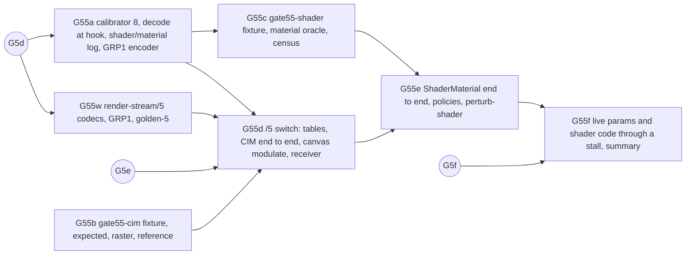

# Gate 5.5 design: materials and canvas shaders

Status: contract for gate 5.5, written 2026-10-10 while gate 5 is in flight (G5a, G5b and G5w
are on `main`; G5c and G5d are in flight; G5e, G5g and G5f follow). Nothing here is
implemented yet. Hand it out piecewise. Each increment below (G55a, G55b, G55c, G55w, G55d, G55e,
G55f) is one verified commit on `main`, implemented by one agent in its own worktree. Gate 5.5
needs a new wire version, `render-stream/5`, specified here as a delta in Q4 and finalized by G55w
(D1). The documents this extends are [gate5-design.md](gate5-design.md) and, through it, gates
4 to 1. The wire it builds on is [render-stream-4.md](render-stream-4.md). Background is in
[docs/handoff-headless-render-stream.md](../../../docs/handoff-headless-render-stream.md): the gate
5.5 row and "Configuration for other games".

Source citations are `path:line` in the pinned `../godot-4.5.1-stable` checkout (commit
`f62fdbde15035c5576dad93e586201f4d41ef0cb`), relative to its root. Every cited line was re-read
when this contract was written. Abbreviations, in addition to gate5-design.md's (`rcc`, `gles3c`,
`rs.h`, `rsd.h`, `ci.cpp`): `cim.cpp` is `scene/resources/canvas_item_material.cpp`, `mat.cpp` is
`scene/resources/material.cpp`, `shader.cpp` is `scene/resources/shader.cpp`, `g3ms` is
`drivers/gles3/storage/material_storage.{cpp,h}`, `dmat` is
`servers/rendering/dummy/storage/material_storage.{cpp,h}`, `iu.cpp` is
`servers/rendering/instance_uniforms.cpp`, `canvas.glsl` is `drivers/gles3/shaders/canvas.glsl`.
Slot numbers come from `capture/tools/calibrate.py` `parse_virtuals` over the pinned header with
the release define set plus the measured Object prefix 23. That derivation reproduces every
committed slot this gate builds on (`shader_create_from_code` 54, `shader_set_code` 55,
`material_set_param` 66, `canvas_item_set_material` 488, `free` 549).

**One contract probe was run** (headless, official 4.5.1 `linux_release` template, a scratch
project; nothing committed). It confirmed five dummy-storage facts that Q1f cites: `shader_get_code`
returns `""`, `material_get_param` returns `null`, `get_shader_parameter_list` still works,
RS-level code containing `@@>`/`@@<` include markers compiles with no include file present, and a
broken shader prints `SHADER ERROR` and `Shader compilation failed.` from `dmat.cpp:190` on the
capture host. Every other engine statement below is read from source. Every count, step set and
census in Q6 is a prediction that the increments check by running. A run that disagrees is a
finding to explain from source before anything changes.

## What gate 5.5 proves

The handoff's gate 5.5 row:

> Canvas-item material blend and light modes, then a shader material with captured source and
> live parameters. Native and web-export receivers compile the captured source; the GSW browser
> receiver transpiles its supported subset and reports the rest as typed unsupported.
> Pixel-compare each supported case.

Gate 5.5 keeps the three independent roles and adds the following:

1. **Shaders as content-addressed source resources.** The code that reaches the RenderingServer
   is copied at the hook (`shader_create_from_code`, `shader_set_code`, and the new
   `shader_create`), wrapped in a `render-stream-shader/1` payload (`GRP1`) and delivered like a
   texture: store, HTTP by hash, or inline. The receiver compiles it through its own
   RenderingServer exactly as the engine's `Shader` resource does. The capture never compiles,
   parses or rewrites shader code. It only scans tokens to type the refused dependencies (D11).
2. **Materials as a table with typed live parameters.** `material_create`,
   `material_create_from_shader`, `material_set_shader`, `material_set_param` and `free` maintain
   a material table whose parameters are exact Variant values (type plus float64 components, D8).
   Parameter changes travel without any item redrawing.
3. **Item and canvas material state**: `canvas_item_set_material`,
   `canvas_item_set_use_parent_material`, `canvas_item_set_instance_shader_parameter` and
   `canvas_set_modulate`.
4. **`CanvasItemMaterial` blend and light modes** (mix, add, sub, mul, premul_alpha, disabled;
   normal, unshaded, light_only) by the same path. They are engine-generated shaders, recognized
   and described on the wire (D7). Light modes are proven against a `CanvasModulate`, the only
   light-mode-visible state without lights (Q1d).
5. **A `ShaderMaterial` with captured source and live parameters**: parameter changes across steps,
   a parameter changed every frame and carried through a stall (only the newest value reaches a
   stalled receiver), code changes, an include, texture and default-texture parameters, instance
   parameters, and material and shader recreation.
6. **The shader-source policy** of the handoff (`source`, `params`, `exclude`), declared in the
   session manifest, with a `params` receiver that compiles from an operator-local library keyed by
   hash (D4).
7. **Typed refusal** of everything a native receiver cannot reproduce from the stream: `TIME`,
   screen texture, SDF, global uniforms, non-`canvas_item` shaders, unsupported parameter types,
   unknown shaders and materials, and `Light2D`.
8. **Independent expectations that do not replay the capture** (D12): fixture-script arguments, a
   hand pixel model of every synthetic shader and of GL's blend equations, a reference-side
   material oracle that reads the reference's own shader code and parameters back through the
   RenderingServer, and a hand census.

What gate 5.5 does **not** do: shader `TIME`, screen texture and back-buffer copies, `CanvasGroup`
and clip-children, SDF and `Light2D` lighting, global shader uniforms, sampler arrays and
`Array`/`String` parameters, late-join adoption of materials made before arming, and the
browser receivers (all typed or deferred with owners in "Deferred").

## Decisions

| #   | Question                         | Decision |
| --- | -------------------------------- | -------- |
| D1  | Protocol version                 | **`render-stream/5`, a version parameter on the existing modules.** Not folded into /4: /4 is frozen by `golden-4/` (G5w, 94e72e8b), G5d's switch to it has been measured green on its branch, and G5e/G5g/G5f build on it. Folding would reopen `golden-4/` and every /4 consumer while three increments are in flight. /5 is /4 plus two tables, an `f64` block, item and canvas fields and reasons, which is a version change under /3's "Versioning" rule. As with /3 and /4 (memory: g4e1-rs3-version-switch-pattern), `rs2_codec.*`, `rs2_diff.*`, `render-stream-2.ts` and `rs2_decoder.gd` gain `version: 2 \| 3 \| 4 \| 5`. The shader payload codec gets its own files, as GRM1 did. `golden-2/` to `golden-4/` keep passing unchanged. |
| D2  | Hooks                            | **Calibrator 8: nine new optional slots** (Q2): `shader_create` 53, `shader_set_default_texture_parameter` 60, `material_create` 63, `material_create_from_shader` 64, `material_set_shader` 65, `canvas_set_modulate` 438, `canvas_item_set_use_parent_material` 489, `canvas_item_set_instance_shader_parameter` 490 and `canvas_light_attach_to_canvas` 503. Gate −1 goes from 64 to 73 hooks. The four existing material hooks (54, 55, 66, 488) start decoding their `String`, `StringName` and `Variant` arguments. Without calibrator 8, three holes are silent: every material's shader (63, 64 and 65 unhooked: `ShaderMaterial` creates its material with the shader inside, `mat.cpp:494-517`), every `CanvasItemMaterial` shader (made by the unhooked `shader_create`, `cim.cpp:140-147`), and inherited materials (`use_parent_material` is neither hooked nor declared). |
| D3  | What travels                     | **The code string exactly as the RenderingServer received it, and the call arguments; never a compiled or lowered form.** The `Shader` resource runs the preprocessor in the scene layer (`shader.cpp:98-108`), so the server sees fully preprocessed code: no `#include` or `#define`, only `@@>`/`@@<` include markers that the shader tokenizer consumes (`servers/rendering/shader_language.cpp:658-700`). `ShaderInclude` therefore never reaches the server and needs no hook, and the receiver compiles code whose include files it never has (probe-confirmed on the dummy compiler). The path hint is not carried. It only labels errors. |
| D4  | Shader-source policy             | **`GRC_SHADER_POLICY=source\|params\|exclude`, default `source`, declared in the session (`materials.shader_policy`).** `source`: code travels as a `GRP1` payload under the resource policy. `params`: shader entries carry `source:"withheld"` with the hash and size the payload would have, so no code byte reaches the stream, the store or HTTP. A receiver compiles only from an operator-local library (`RS_RECEIVER_SHADER_LIBRARY`, `sha256/<hash>.grp`) and reports `shader-withheld` otherwise. `exclude`: shader entries are `unsupported` (`shader-excluded`). Engine-generated `CanvasItemMaterial` code (D7) is engine content and travels under every policy. Captured shader source follows the asset rule: never committed, published or served from shared infrastructure. Recordings stay under ignored `artifacts/`. Live serving is the operator's own hub with its bearer token (gate 2). Fixture shaders are synthetic and written for the fixtures (Q6). |
| D5  | Identity                         | **A shader table and a material table, each with its own per-session id counter** (from 1, never reused), so no texture or mesh id moves. `version` starts at 1 and is +1 per accepted mutating call. **No tombstones.** GLES3 unreferences on free: freeing a shader sets every material that uses it to no shader (`g3ms.cpp:2184-2198`), and freeing a material makes the canvas reset every item that names it (`g3ms.cpp:2394-2411` `deleted_notify`, `rcc:61-67`). The mirror applies the same rule, so nothing can name a freed entry. |
| D6  | Whose semantics                  | **GLES3's, the reference's, not the dummy's**, as gate5-design.md D8. Parameters live in a per-material map that survives shader changes and is filtered by the shader's uniforms only when uploaded (`g3ms.cpp:2456-2472`, `:755-772`). `NIL` erases a parameter (`:2460-2461`). An `OBJECT` value is rejected (`:2463`) and logged `rejected`. Instance parameters live on the item, survive material changes, and are kept even before a material declares them (`iu.cpp:110-124`). `next_pass` and `render_priority` have no canvas effect (`g3ms.h:186-187`) and are not carried. |
| D7  | `CanvasItemMaterial`             | **No special capture path: it is a shader plus a material, recognized on the wire.** Its constructor calls `material_create` and three `material_set_param`s (`cim.cpp:279-290`). At the next idle callback (`scene/register_scene_types.cpp:855`, same frame, before the frame callback) `_update_shader` generates code (`cim.cpp:80-136`), calls `shader_create` and `shader_set_code`, and calls `material_set_shader` (`:139-147`). The capture recognizes the code by exact comparison against the 36 templates (6 blend × 3 light × particles on/off) after the version comment line. A recognized shader carries `builtin:{"kind":"canvas_item_material","blend_mode","light_mode","particles_animation"}`, so gate 7 needs no GLSL parser for it. **Trap for gate 8:** the shader cache is process-global and keyed by mode (`cim.cpp:37`, `:72-76`). A material whose key was first used before arming names a pre-arm shader and becomes `unknown-shader`. |
| D8  | Parameter values on the wire     | **The Variant type by name plus every numeric component as float64**, in a new block `param_f64` (type `f64`). Float64 keeps `FLOAT` (a double) and `INT` exact. GLES3 converts by the uniform's type at upload (`g3ms.cpp:49-350`), so the receiver must rebuild the same type and value. Supported: `nil bool int float vector2 vector2i rect2 rect2i vector3 vector3i transform2d vector4 vector4i plane quaternion aabb basis transform3d projection color rid` and the numeric packed arrays (`int32 int64 float32 float64 vector2 vector3 vector4 color`). `rid` carries `tex` (a texture-table id) and no floats. `int` beyond ±2^53 is `param-range`; any other type is `param-type`. The capture decodes through the GDExtension interface (`variant_get_type`, the to-type constructors, the two-word Vector ABI for packed arrays, memory: godot-vector-abi-two-words, `string_to_utf8_chars`), on the calling thread, before forwarding. |
| D9  | Item state                       | **`material`, `use_parent_material` and `instance_params` are item state, never `content_version`.** Setting a material does not redraw (`ci.cpp:1169-1177`). The *effective* material follows the parent chain while `use_parent_material` is set (`rcc:309-313`, `:2514-2525`). The derived item-level entry `unsupported-material` uses the effective material (Q4). |
| D10 | Canvas modulate, lights          | **`canvas_set_modulate` is a canvas field**: `canvas_f32` grows from 6 to 10 floats per canvas. Without lights, a material's light mode is visible only through it. Normal items multiply by the canvas modulate, `unshaded` items do not, and `light_only` items get alpha 0 (`canvas.glsl:713-717`, `:865-866`; lighting is disabled with no lights, `gles3c:878-883`). **`Light2D` is typed**: `canvas_light_attach_to_canvas` to a non-null canvas adds the sticky session-level entry `{"op":"canvas_light_attach_to_canvas","item":null,"reason":"canvas-light"}`. Occluders, light masks and normal or specular canvas textures follow `Light2D` (Deferred). |
| D11 | `TIME`, screen texture, SDF, globals | **Typed `unsupported` on the shader, found by a token scan of the code** (identifiers outside comments, not after `.`): `TIME` → `shader-time`. It is the receiver's own rasterizer time (`drivers/gles3/rasterizer_gles3.cpp:96-106`), and the dummy has none. `hint_screen_texture` → `shader-screen-texture` (back-buffer copies, `gles3c:423-436`). `texture_sdf`, `texture_sdf_normal`, `sdf_to_screen_uv`, `screen_uv_to_sdf` → `shader-sdf` (`servers/rendering/shader_types.cpp:309-326`). `global uniform` → `shader-global-uniform`: values come from project settings loaded before arming. A `shader_type` other than `canvas_item` → `shader-mode`: GLES3 draws such a material as none (`g3ms.h:651-658`). `uses` lists every match, and `reason` is the first in that order. The handoff makes time and screen-texture dependencies later work. Owners are in "Deferred". |
| D12 | Independent expectations         | **Five, none of them a replay of the capture.** (1) **Script arguments**: every `set_shader_parameter`, `set_instance_shader_parameter`, blend or light mode and `CanvasModulate` colour the fixture sets reaches the wire with that Variant type and value. (2) A **hand pixel model** in `make_expected.py`: a Python twin of each synthetic shader's `fragment()`, GL's blend equations (`gles3c:741-799`) and the canvas-modulate rule (D10), rasterized by `geometry-raster.ts`. (3) A **reference-side material oracle** (Q6e) that reads the reference's own `shader_get_code` (GLES3 keeps the code, `g3ms.cpp:2288-2292`), `material_get_param` and `canvas_item_get_instance_shader_parameter`. Checks: `shader-hash-parity` and `param-parity`. (4) A **hand census** of shader and material calls per frame. (5) **Presence and freshness** per region, including fresh-without-redraw. |
| D13 | Pixel exactness and budgets      | **Exact where the output is opaque, flat and computed without a product of two non-trivial grid values; delta 1 where a product or `α = .6` is involved; never relaxed.** Exact: `mix`, `add`, `sub`, `premul_alpha` and `disabled` at α 1 on 0.2-grid colours (sums and differences of `k·0.2f` round to `k·51`, clamped), synthetic shaders that output a uniform, an integer-derived `k·0.2`, or a nearest-sampled texel, and a canvas modulate whose components are 0 or 1 (the product is exact). Delta 1: `mul`, any `α = .6` strip, and grid × grid modulation (gate4-design.md D8). Receiver against reference is exact everywhere, under the budget a same-build reference repeat measures (expected 0). Comparisons are raw per channel, alpha included (`disabled` writes source alpha into the render target), never pixelmatch. |
| D14 | Delivery and dropped presentations | **File recordings for G55b–G55e, live for G55f.** Parameters and shader payloads are whole values per version, never deltas. A stalled receiver jumps to the newest parameter values and fetches only the newest `GRP1` hash. G55f proves it with a parameter written every frame and a code change inside the stall, and proves the opposite with `stale-coalesce`. |
| D15 | Result classes                   | **Gate 5's, extended.** `capture-failure` gains `material-log-divergence`. `unsupported` gains every `unsupported-material`, `unknown-material`, `param-type` (instance) and `canvas-light` entry. `replay-failure`'s `resource-*` reasons cover `GRP1`, and a receiver shader compile error is `replay-failure` / `shader-compile`. `resource-violation` covers a redundant shader fetch. Census and parity failures are named checks, not classes. |
| D16 | Typed out of scope               | Hooked, typed `unsupported`, not supported: D11's five shader reasons, `param-type`/`param-range`, `unknown-shader`, `unknown-material`, `unknown-texture` on a parameter, `shader-excluded`/`shader-withheld` by policy, and `canvas-light`. Declared `unobserved` (not hooked, no visible effect while D11 refuses their users): `canvas_item_set_copy_to_backbuffer`, the `global_shader_parameter_*` setters, `material_set_next_pass`, `material_set_render_priority` and `shader_set_path_hint`. |
| D17 | Waves against gate 5             | **Work that touches no codec, runner, mirror or receiver may start now** (G55a, G55b and G55c reference legs). G55w may start now and lands after G5d, since both change the version defaults. G55d waits for G5e, which edits the same mirror, store, publisher and receiver files. |

## Q1. What the engine does

### Q1a. From a node to RenderingServer calls

| Source                                       | RenderingServer call(s), in order                                                                                                                                                       | Source lines                                    |
| -------------------------------------------- | ------------------------------------------------------------------------------------------------------------------------------------------------------------------------------------------ | ----------------------------------------------- |
| `Shader.code = …`                            | preprocess in the scene layer; **lazy RID**: the first `get_rid()` calls `shader_create_from_code(preprocessed, path)`; later `set_code` calls `shader_set_code(rid, preprocessed)`     | `shader.cpp:54-60`, `:85-135`, `:207-212`       |
| `Shader.set_default_texture_parameter`       | forces the RID, then `shader_set_default_texture_parameter(rid, name, tex RID or RID(), index)`                                                                                            | `shader.cpp:214-235`                            |
| `Shader` destructor                          | `free(rid)` if it was ever created                                                                                                                                                         | `shader.cpp:294-299`                            |
| `ShaderMaterial` (lazy)                      | first `get_rid()`: `material_create_from_shader(next_pass, priority, shader RID)`, then one `material_set_param` per cached parameter (a texture as its `RID`)                          | `mat.cpp:494-517`, `:561-563`                   |
| `ShaderMaterial.shader = …`                  | `shader->get_rid()` (may create the shader), then `material_set_shader` if the material exists                                                                                           | `mat.cpp:416-443`                               |
| `set_shader_parameter(name, v)`              | `NIL` → `material_set_param(name, NIL)`; an `OBJECT` → its `RID`, or `NIL` for none; anything else as given                                                                                | `mat.cpp:448-480`                               |
| `Material` destructor                        | `free(material)`                                                                                                                                                                           | `mat.cpp:183-188`                               |
| `CanvasItemMaterial.new()`                   | `material_create`; `material_set_param` × 3 (`particles_anim_h_frames` 1, `_v_frames` 1, `_loop` false); dirty-list entry                                                                | `cim.cpp:279-290`, `:199-220`                   |
| idle flush (`CanvasItemMaterial`)            | per dirty material: old key's users −1, `free(shader)` at 0; then reuse (`material_set_shader`) or `shader_create` + `shader_set_code(code)` + `material_set_shader`                     | `cim.cpp:55-148`, `:150-157`                    |
| `blend_mode` / `light_mode` setters          | queue the dirty flush above (same frame: idle callbacks run in `SceneTree::process`, `scene/main/scene_tree.cpp:726`)                                                                      | `cim.cpp:171-183`                               |
| `CanvasItemMaterial` destructor              | users −1 (`free(shader)` at 0), `material_set_shader(RID())`, then `Material`'s `free(material)`                                                                                           | `cim.cpp:292-307`                               |
| `CanvasItem.material = m`                    | **assigns the `Ref` first** (an old unshared material is destroyed here, so `free` precedes the new set), then `m->get_rid()`, then `canvas_item_set_material(item, rid)`; no redraw | `ci.cpp:1169-1177`                              |
| `CanvasItem.use_parent_material`             | `canvas_item_set_use_parent_material`                                                                                                                                                      | `ci.cpp:1180-1184`                              |
| `set_instance_shader_parameter(name, v)`     | `NIL` → the server's default for it; an `OBJECT` → its `RID`; else as given → `canvas_item_set_instance_shader_parameter`                                                                 | `ci.cpp:1186-1200`                              |
| `CanvasModulate`                             | `canvas_set_modulate(canvas, colour)` when it becomes the active one; white when the last one hides; `set_color` while active                                                              | `scene/2d/canvas_modulate.cpp:43`, `:53-55`, `:108` |

### Q1b. Server side: creation and storage

- `shader_create` allocates and initializes (`rsd.h:247-255`). `shader_create_from_code` allocates,
  initializes, **sets the code and path hint directly in storage** (`rsd.h:257-275`): the hooked
  `shader_set_code` never sees that code, so the create hook must copy it.
- `material_create` is `FUNCRIDSPLIT(material)` (`rsd.h:291`). `material_create_from_shader` sets
  next pass, priority and **shader directly in storage** (`rsd.h:293-313`): `material_set_shader`
  is not called through the vtable.
- GLES3 `shader_set_code` stores the code, derives the mode from `shader_type`, rebuilds the
  shader data, and re-queues every owner material (`g3ms.cpp:2200-2276`). A canvas shader's
  compile (`CanvasShaderData::set_code`, `g3ms.cpp:2588-2672`) records the blend mode from
  `render_mode` (`:2617-2622`), `uses_time` (`:2625`) and `uses_screen_texture` (`:2638`). A
  compile error leaves it invalid (`:2631`), and the item then draws with the default shader
  (`gles3c:630-633`).
- Material parameters: as D6. Textures are resolved per sampler uniform at update. Screen, depth
  and normal-roughness hints are skipped (`g3ms.cpp:852-856`). An unset sampler falls back to the
  shader's default texture (`g3ms.cpp:2302-2326`), then to the hint's default.

### Q1c. Canvas: which material an item draws with

- **Effective material.** During culling, an item with `use_parent_material` and an owner from
  its parent takes that owner, otherwise it becomes its own owner (`rcc:309-313`). The renderer
  draws `material_owner ? owner->material : item->material` (`gles3c:607`), and dependencies
  follow the same parent walk (`rcc:2514-2525`).
- **Blend.** The batch blend mode is the shader's, or `MIX` without a valid shader (`gles3c:643`).
  The GL state per mode (`gles3c:741-799`, non-transparent target): mix `(SRC_ALPHA,
  ONE_MINUS_SRC_ALPHA | ZERO, ONE)`; add `(SRC_ALPHA, ONE)`; sub `REVERSE_SUBTRACT (SRC_ALPHA,
  ONE)`; mul `(DST_COLOR, ZERO)`; premul_alpha `(ONE, ONE_MINUS_SRC_ALPHA)`; disabled: blending
  off, so the fragment's alpha is written into the target (`:733-739`).
- **Material changes are not content.** `canvas_item_set_material`, `_use_parent_material` and
  `_instance_shader_parameter` queue a dependency update only (`rcc:1920-1941`). A shader or
  parameter change reaches the item through the dependency tracker (`rcc:49-58`). No
  `content_version` moves.
- **Instance parameters** are allocated from the global uniform buffer per item once a material
  declares them (`iu.cpp:46-101`), and drawn through `instance_uniforms_ofs` (`gles3c:914`).
  Prediction, checked by G55c: canvas `instance uniform` renders in Compatibility 4.5.1.
- **Time.** A material whose shader uses `TIME` makes the canvas request a redraw every frame
  (`gles3c:441-443`, `:563-565`). `TIME` is the rasterizer's accumulated frame step
  (`drivers/gles3/rasterizer_gles3.cpp:96-106`). The reference, the receiver and the headless
  host (which has no rasterizer) each have their own.

### Q1d. Light modes without lights

`canvas.glsl:713-717`: `light_only` starts `light_only_alpha` at 0, `unshaded` skips the canvas
modulation, and everything else does `color *= canvas_modulation`. `:865-866`: `light_only`
multiplies alpha by the accumulated light alpha. With no lights, `DISABLE_LIGHTING` is set
(`gles3c:878-883`), so a `light_only` item is fully transparent, and `unshaded` differs from
`normal` exactly where the canvas modulate is not white. The canvas modulate comes from
`canvas_set_modulate` (`rcc:542-545`) and is per canvas (`rcc:498`). Extra canvases
(`CanvasLayer`) are still `extra-canvas` (render-stream-0.md), so the gate 5.5 fixtures modulate
the root canvas, which also modulates the step marker and every non-`unshaded` region (Q6b).

### Q1e. `CanvasItemMaterial` code

```
// NOTE: Shader automatically converted from <GODOT_VERSION_NAME> <GODOT_VERSION_FULL_CONFIG>'s CanvasItemMaterial.

shader_type canvas_item;
render_mode blend_<mix|add|sub|mul|premul_alpha|disabled>[,unshaded|,light_only];
[particles block: three uniforms and a vertex() function]
```

(`cim.cpp:80-136`). `BLEND_MODE_DISABLED` exists in the enum but not in the property hint
(`scene/resources/canvas_item_material.h:39-46`, `cim.cpp:260`). The first line carries the build
string (`core/version.h:69-71`), so recognition matches that line by pattern (`// NOTE: Shader
automatically converted from ` … `'s CanvasItemMaterial.`) and the rest by exact text. A modified
engine whose template differs simply yields unrecognized `source` shaders.

### Q1f. Headless: what dummy storage keeps and drops

| Call                                   | Dummy behaviour                                                                                                                        | Consequence                                     |
| -------------------------------------- | -------------------------------------------------------------------------------------------------------------------------------------- | ----------------------------------------------- |
| `shader_set_code`                      | compiles with the real shader compiler to keep the **uniform list only** (`dmat.cpp:161-191`); `shader_get_code` returns `""` (`dmat.h:97`) | code exists only in the hook's copy; compile errors print on the host |
| `shader_set_default_texture_parameter` | no-op (`dmat.h:100`)                                                                                                                   | copy at the hook                                |
| `material_set_param`                   | no-op; `material_get_param` returns `Variant()` (`dmat.h:120-121`)                                                                    | copy at the hook                                |
| `material_set_shader`, `_next_pass`    | kept (`dmat.cpp:244-258`)                                                                                                              | —                                               |
| `material_set_render_priority`         | no-op (`dmat.h:117`)                                                                                                                   | not carried (D6)                                |
| `material_update_dependency`           | no-op (`dmat.h:130`)                                                                                                                   | the headless host never resets an item's freed material; the mirror does (D5) |
| global parameters                      | types only; `set`/`get` no-ops (`dmat.h:74-80`, `dmat.cpp:82-144`)                                                                   | D11                                             |
| instance parameters                    | held by `RendererCanvasCull`, not storage (`iu.cpp:110-124`)                                                                          | copy at the hook anyway                         |
| RIDs                                   | shader and material RIDs are valid (`dmat.cpp:146-152`, `:233-239`), unlike canvas textures                                          | no headless ambiguity                           |

### Q1g. Threads

Every hook fires on the calling thread before forwarding. `shader_create_from_code` and
`material_create_from_shader` may run on loader threads (`rsd.h:258-274`, `:295-311` branch on
the server thread). The hook log records them as thread `other`, and the mirror lock makes that
safe (gate5-design.md Q1j).

## Q2. Hooks: calibrator 8

| RenderingServer method                          | Slot | Header (`rs.h`) | Before gate 5.5                       | Gate 5.5                                                         |
| ----------------------------------------------- | ---- | --------------- | ------------------------------------- | ---------------------------------------------------------------- |
| `shader_create`                                 | 53   | 230             | **unhooked: CIM shaders unknown**     | **calibrator 8**, shader table                                   |
| `shader_create_from_code`                       | 54   | 231             | RID only                              | + code `String` decoded and copied (G55a)                        |
| `shader_set_code`                               | 55   | 233             | RID only                              | + code decoded and copied (G55a)                                 |
| `shader_set_default_texture_parameter`          | 60   | 239             | unhooked                              | **calibrator 8**, shader field                                   |
| `material_create`                               | 63   | 262             | **unhooked**                          | **calibrator 8**, material table                                 |
| `material_create_from_shader`                   | 64   | 263             | **unhooked: ShaderMaterials unknown** | **calibrator 8**, material with shader                           |
| `material_set_shader`                           | 65   | 265             | **unhooked**                          | **calibrator 8**                                                 |
| `material_set_param`                            | 66   | 267             | RID only                              | + `StringName` and `Variant` decoded (G55a)                      |
| `canvas_set_modulate`                           | 438  | 1528            | declared `unobserved`                 | **calibrator 8**, canvas field                                   |
| `canvas_item_set_material`                      | 488  | 1608            | item `unsupported-state`              | item field (G55d)                                                |
| `canvas_item_set_use_parent_material`           | 489  | 1610            | **unhooked, undeclared**              | **calibrator 8**, item field                                     |
| `canvas_item_set_instance_shader_parameter`     | 490  | 1612            | declared `unobserved`                 | **calibrator 8**, item field                                     |
| `canvas_light_attach_to_canvas`                 | 503  | 1645            | unhooked                              | **calibrator 8**, typed `canvas-light`                           |
| `free`                                          | 549  | 1770            | items, canvases, textures, meshes     | + shaders, materials                                             |

ABIs, by the existing aliases in `hooks.cpp`: 53 and 63 `FnCreate`; 65 and 503 `FnSetMaterial`;
438 `FnSetModulate`; 489 `FnRidBool`; 490 `FnMaterialSetParam` (`(RID, const StringName *, const
Variant *)`); 60 is new, `void (*)(void *, RID, const void *name, RID, int)`; 64 is new,
`RID (*)(void *, RID next_pass, int priority, RID shader)`. Every new slot is pure in the abstract
table and implemented in `RenderingServerDefault`, which the calibrator's own check enforces.
Slots 56 (`shader_set_path_hint`), 68 and 69 (`material_set_render_priority`, `_next_pass`), 484
(`canvas_item_set_copy_to_backbuffer`) and 540–548 (global parameters) stay unhooked and are
declared `unobserved` (D16).

**Decoding.** A `String` (code) is converted with `string_to_utf8_chars` (`iface.h` already
resolves it). A `StringName` is converted through the builtin `String(StringName)` constructor
(`variant_get_ptr_constructor`), then the same call. A `Variant` uses `variant_get_type` and
`get_variant_to_type_constructor`, with packed arrays read through the Vector ABI and destroyed
with `variant_get_ptr_destructor`. Each decode records `decode_ns`. Decoding never calls the
RenderingServer and never takes an engine lock. `counters.json` keeps counts and RIDs only.
Names, values and code go to the hook log and the mirror, never to `counters.json`.

`fixtures/spike/` already makes a `Shader`, `ShaderMaterial` and parameter (`spike.gd:209-219`).
G55a adds, after arming, a `CanvasItemMaterial` with a mode change, a
`set_default_texture_parameter`, `use_parent_material` on a child, an instance parameter, a
`CanvasModulate`, and a raw `canvas_light_create` + `canvas_light_attach_to_canvas`, so gate −1's
counts are positive for all nine.

## Q3. Capture

### Q3a. Copy and classify at the hook

- **Code.** `shader_create_from_code` and `shader_set_code` (and `shader_set_code` on a
  `shader_create`d RID) copy the code as UTF-8. Then they build the `GRP1` payload (Q4) and hash
  it, classify (D7 builtin, D11 scan, D4 policy) and record `copy_ns`, `hash_ns` and `scan_ns`.
  Code containing invalid code points makes the shader `unsupported` (`payload-unavailable`).
- **The token scan** (D11) skips `//` and `/* */` comments, reads identifiers
  `[A-Za-z_][A-Za-z0-9_]*`, ignores an identifier right after `.`, and takes the mode from the
  first `shader_type <id>;`. It also lists `instance_uniform` and `light` (a `light` function) in
  `uses`, for information only. It is not a compiler. A difference against the reference oracle's
  behaviour is a finding.
- **Parameters** (D8): decoded into an owned value, never a reference into engine memory. A `rid`
  is mapped to the texture table (an unknown RID marks the material `unknown-texture`).

### Q3b. Mirror

New engine-free state under the mirror mutex: `shaders_` (id → `{rid, status, reason, version,
mode, source, payload (shared_ptr<const>), hash, builtin, uses, default_textures}`),
`materials_` (id → `{rid, status, reason, version, shader id, params (sorted by name)}`),
`shader_by_rid_`, `material_by_rid_`, per-item `material`, `use_parent_material`,
`instance_params`, per-canvas `modulate`, and the session `canvas-light` flag.

| Tap                                               | Effect                                                                                                                                  |
| ------------------------------------------------- | --------------------------------------------------------------------------------------------------------------------------------------- |
| `shader_create(rid)`                              | new id, `ok`, version 1, no code (`mode` and `source` null)                                                                             |
| `shader_create_from_code(code)` (after forward)   | new id, version 1, code classified                                                                                                      |
| `shader_set_code(rid, code)`                      | new payload and classification, version + 1                                                                                             |
| `shader_set_default_texture_parameter`            | `default_textures` entry set (`tex` id) or removed for `RID()`, version + 1                                                             |
| `material_create(rid)`                            | new id, `ok`, version 1, shader null, no params                                                                                         |
| `material_create_from_shader(next, prio, shader)` | new id, version 1, shader set (an unknown shader RID → `unsupported` `unknown-shader`)                                                  |
| `material_set_shader(m, s)`                       | shader set or null, version + 1; status recomputed                                                                                      |
| `material_set_param(m, name, v)`                  | `NIL` erases, `OBJECT` rejected (logged, no change), else set; version + 1 when accepted; an unsupported type → entry `unsupported`     |
| `free(rid)` (shader)                              | every material naming it → shader null, version + 1; the id leaves the table                                                            |
| `free(rid)` (material)                            | every item naming it → `material: null`; the id leaves the table                                                                        |
| `canvas_item_set_material(item, m)`               | item field (an unknown non-null RID → `material: null` plus item-level `unknown-material`)                                              |
| `canvas_item_set_use_parent_material`             | item field                                                                                                                              |
| `canvas_item_set_instance_shader_parameter`       | item `instance_params[name]` set (`NIL` kept as type `nil`, replayed as such; `OBJECT` rejected, `iu.cpp:112`)                          |
| `canvas_set_modulate(canvas, c)`                  | canvas field                                                                                                                            |
| `canvas_light_attach_to_canvas(l, c)`             | `c` non-null → sticky session entry `canvas-light`                                                                                      |

A material's `status` is recomputed from its own parameters only. A material whose shader is
`unsupported`, or which names an unsupported texture, stays `ok`. The item-level derived entry
(Q4) reports it, as `unsupported-texture` already does for texture draws. The omit-op names are
the RS method names. Snapshots copy both tables, and `shared_ptr` payloads pin shader code exactly
as texture payloads are pinned.

### Q3c. `perturb-shader` (host sabotage, /5)

From `GRC_SABOTAGE_FRAME` on, every code the mirror records for a non-builtin shader that contains
the identifier `fragment` and ends (ignoring whitespace) with `}` is recorded with
`\tCOLOR.rgb = vec3(1.0) - COLOR.rgb;\n` inserted before that last `}`. The engine still gets the
true code. Fixture shaders keep `fragment()` last, so the perturbed code compiles. As with
`perturb-glyph` and `perturb-vertex`, only code recorded from that frame on moves. A shader whose
code was set before the frame never mismatches, and `make_expected.py` predicts per region.

### Q3d. Hook log

`evidence/resources.jsonl` gains `kind: "shader"` lines (`id`, `version`, `call`, `status`,
`reason`, `hash`, `payload_bytes`, `mode`, `source`, `builtin`, `uses`, `copy_ns`/`hash_ns`/
`scan_ns`, `outcome`) and `kind: "material"` lines (`id`, `version`, `call`, `shader`, `param`,
`type`, `n`, `decode_ns`, `outcome` `applied|rejected|unknown`). It also gains `kind:
"item-material"` lines for the four item and canvas taps. Under `params` and `exclude` no line
carries code. omit-op lines are written with `"sabotage":true,"omitted":true` and kept out of the
registry (memory: rs-g2b2-texture-wire-facts). This log is the checker's ground truth for the
material census, never the stream.

## Q4. Delivery and wire: render-stream/5

/5 is /4 with exactly these changes. G55w writes them as `protocol/render-stream-5.md`, a delta
document like render-stream-4.md.

- **Magic** `47 52 53 35 0D 0A 1A 0A` (`GRS5`), subprotocol `render-stream.5`, hello
  `"protocol":"render-stream/5"`. A decoder configured for /5 refuses `GRS4` with `bad-magic`.
- **Block type `f64`**: `8 × count` bytes, little-endian IEEE 754 binary64. It is legal only as
  a transaction's sixth block, `param_f64`. Transaction blocks: `[item_f32, canvas_f32, cmd_f32,
  cmd_i32, mesh_f32, param_f64]`.
- **Session.** `resources.payloads` gains `"render-stream-shader/1"` (sorted). A new key
  `materials:{"shader_policy":"source"|"params"|"exclude"}` follows `resources`.
  `features.resources` gains `material` and `shader`. `features.item_state` gains
  `instance_params`, `material` and `use_parent_material`. A new `features.canvas_state: ["modulate","transform"]`.
  `observed_unsupported_ops` loses `canvas_item_set_material` and gains
  `canvas_light_attach_to_canvas`. `unobserved` loses `canvas_item_set_instance_shader_parameter`
  and `canvas_set_modulate` and gains D16's list.
- **Canvas.** `canvas_f32` is 10 floats per canvas: transform (6), modulate (4). The resolved
  canvas gains `"modulate":[4]`.
- **Item.** Keys gain `"material":<id>|null`, `"use_parent_material":<bool>` and
  `"instance_params":[<param>]`, in that order, before `content_version`.
- **Shader table** `shaders:[…]`, `removed_shaders:[]` (patches), the texture table's full,
  patch and resolve rules:

```
{"id":<int>,"origin":"created","status":"ok"|"unsupported","reason":null|<shader reason>,
 "version":<int>=1>,"mode":null|"canvas_item"|"spatial"|"particles"|"sky"|"fog",
 "source":null|"payload"|"withheld","hash":<64 hex>|null,"payload_bytes":<int>,
 "builtin":null|{"kind":"canvas_item_material","blend_mode":"mix"|"add"|"sub"|"mul"|
                 "premul_alpha"|"disabled","light_mode":"normal"|"unshaded"|"light_only",
                 "particles_animation":<bool>},
 "uses":[<"global_uniform"|"instance_uniform"|"light"|"screen_texture"|"sdf"|"time">…],
 "default_textures":[{"name":<str>,"index":<int>,"tex":<int>}…]}
```

  `source` is null exactly for a shader with no code yet (`mode` null, `hash` null,
  `payload_bytes` 0). Shader reasons: `shader-mode`, `shader-screen-texture`, `shader-sdf`,
  `shader-time`, `shader-global-uniform`, `shader-excluded`, `payload-too-large`,
  `payload-unavailable`. `default_textures` are sorted by `(name, index)`.
- **Material table** `materials:[…]`, `removed_materials:[]`:

```
{"id":<int>,"origin":"created","status":"ok"|"unsupported","reason":null|<material reason>,
 "version":<int>=1>,"shader":<int>|null,"params":[<param>…]}
<param> = {"name":<str>,"type":<variant type>,"n":<int>,"tex":<int>|null,"f":<int>}
```

  `params` are sorted by name (byte order). `n` is 1 for non-array types and the element count for
  packed arrays. `tex` is non-null exactly for `rid`. `f` is the running offset into `param_f64`
  over materials in table order and then items in item order (`param-offset`). The float count is
  `n ×` the type's components (bool, int, float 1; vector2/2i 2; vector3/3i 3; rect2/2i, vector4/4i,
  plane, quaternion, color 4; transform2d, aabb 6; basis 9; transform3d 12; projection 16; nil
  and rid 0), in Godot's member order (`transform2d` as /0's xforms; `basis` row-major;
  `projection` by column). Material reasons: `unknown-shader`, `unknown-texture`, `param-type`,
  `param-range`.
- **Derived item-level entries.** An item whose effective material (D9) is `unsupported`, names an
  `unsupported` shader, or names a texture parameter or default texture whose entry is
  `unsupported` adds `{"op":"canvas_item_set_material","item":<id>,"reason":"unsupported-material"}`.
  An unknown material RID adds `{"op":"canvas_item_set_material","item":<id>,"reason":"unknown-material"}`.
  An instance parameter of an unsupported type adds
  `{"op":"canvas_item_set_instance_shader_parameter","item":<id>,"reason":"param-type"}`. /4's
  `unsupported-state` for `canvas_item_set_material` no longer occurs, and /5 decoders reject it.
- **Session-level entry** `{"op":"canvas_light_attach_to_canvas","item":null,"reason":"canvas-light"}`,
  sticky, ordered by first observation as /0's.
- **Shader payload `render-stream-shader/1`:**

```
magic   8 bytes   47 52 50 31 0D 0A 1A 0A   ("GRP1\r\n\x1a\n")
u32le   meta_len
meta    canonical JSON: {"type":"shader-code","code_bytes":<int>}
data    the code, UTF-8, exactly the String the RenderingServer received
```

  The hash is the SHA-256 of the whole payload. A `withheld` entry's hash is the hash this payload
  would have. Errors: `payload-magic`, `payload-meta`, `payload-length`, plus `payload-utf8`
  (invalid UTF-8). Store files are `<store>/sha256/<hash>.grp`. `index.jsonl` `"type"` gains
  `"shader-code"`. HTTP is unchanged.
- **Sabotage kind** `perturb-shader` (Q3c), `op` null.
- **New invariants**: `shader-entry`, `material-entry`, `param-entry` (type spelling, `n`, `tex`
  iff `rid`), `param-offset`, `shader-ref` (a material's `shader` names an entry of the same
  resolved state), `material-ref` (an item's `material` likewise), `shader-version` and
  `material-version` (monotonic, equal versions identical), `canvas-offset` (10 floats), and
  `id-reused`, `resource-missing`, `resource-payload` and `patch-removed` extended to both tables.
- **Resolved forms**: params become `{"name","type","value"}`, with `value` a number, an array of
  numbers, an array of arrays (packed vector types) or `{"tex":<id>}`. State gains `"shaders"` and
  `"materials"`.
- **Golden vectors `protocol/golden-5/`** (`make_golden.py --check`, stdlib only): golden-4's
  eleven states re-encoded as /5 (white canvas modulate, no materials). State 12: a builtin CIM
  shader (`add`) and a custom `source` shader, three materials (the CIM with its two int parameters
  and one bool, a custom one with every supported Variant type including each packed array and a `rid`,
  and one with shader null), items naming them, a `use_parent_material` child, instance
  parameters and a non-white canvas modulate. State 13: one parameter change only (the patch
  carries one material entry). State 14: a code change only (one shader entry, a new hash).
  State 15: a `shader-time` shader with its derived `unsupported-material`, an `unknown-material`
  item, a `param-type` material, an instance `param-type`, and the `canvas-light` session entry.
  `full.rs5`, `patch.rs5`, `inline.rs5` resolve to one `resolved.json`. `params.rs5` (policy
  `params`) resolves to `resolved-params.json` with `withheld` entries and no shader resources.
  `invalid/` covers each new invariant, `bad-magic` (GRS4), `unsupported-mismatch` (missing
  `unsupported-material`), `meta-schema` (an `f64` block in the wrong slot) and `resource-payload`
  (GRP1 meta against the entry). `payload-invalid/` gains one GRP1 vector per code. As with
  golden-4, more states are allowed when proof points interact (memory:
  rs-gate5-g5w-gdscript-facts). Verify inline `record_index` values by decoding (memory:
  g4e1-rs3-version-switch-pattern).

## Q5. Receiver

- **Native compile, exactly as the engine.** A shader entry becomes
  `RenderingServer.shader_create()` plus `shader_set_code(rid, code)` (`servers/rendering_server.cpp:2317-2318`). That is the same
  storage path `shader_create_from_code` takes (`rsd.h:257-275`), minus the path hint, which only
  labels errors. The receiver never goes through a `Shader` resource, because that would run the
  preprocessor a second time over already preprocessed text. A new version calls `shader_set_code`
  on the same RID, as `Shader.code =` does. `default_textures` call
  `shader_set_default_texture_parameter` (`:2324`). `withheld` code comes from
  `RS_RECEIVER_SHADER_LIBRARY/sha256/<hash>.grp`, verified by hash, or the shader is skipped and
  recorded as `shader-withheld`.
- **Materials**: `material_create()`, `material_set_shader`, and `material_set_param` per changed
  parameter, with `null` for a removed one (`:2336-2338`). Values are rebuilt as the exact Variant
  type: `float` and `int` from float64, `real_t` types narrowed back to float32, which is exact
  because they were float32. A `rid` uses the receiver's texture RID.
- **Items and canvases**: `canvas_item_set_material`, `canvas_item_set_use_parent_material`,
  `canvas_item_set_instance_shader_parameter` (`:3329-3332`) and `canvas_set_modulate` (`:3264`)
  on the receiver's root canvas.
- **Apply order** (gate2-design.md Q5): textures, meshes (G5e), then shaders (3c), then materials
  (3d), then items. Residency is lazy. `needed` holds every shader and material reachable from a
  named item's effective material, plus default and parameter textures. Payload fetch and verify
  are as for textures. A receiver shader compile error (the engine's `SHADER ERROR` print) makes
  the leg `replay-failure` / `shader-compile`.
- **`applied.json` `render-stream-receiver-applied/5`**: /4's shape. Each transaction's
  `resources` gains `shaders_created`, `shader_code_sets`, `shader_payload_fetches`,
  `materials_created`, `param_sets` and `instance_param_sets`.
- **Receiver sabotages** (`RS_RECEIVER_SABOTAGE`): `ignore-material` (never calls
  `canvas_item_set_material`, G55d), `ignore-canvas-modulate` (G55d), `stale-param` (applies a
  material's parameters only when it creates the material, G55e). Each exists only to fail checks.
- **Web export** (gate 7) runs this receiver unchanged and compiles the same code in WebGL 2.

## Q6. Fixtures

Every gate 5.5 fixture uses gate 5's project settings and rules: 640×360, stretch `disabled`,
`gl_compatibility`, `msaa_2d=0`, `hdr_2d=false`, clear colour `(0.2,0.2,0.4,1)`, the `[debug]`
warning keys, `GrcLoader`, a plain `Node` root, **every CanvasItem, material, shader and texture
created in `_ready`**, `GRC_ROOT_SIZE=enforce-min-size` on every capture, colour components in
{0, .2, …, 1}, alpha 1 except the `.6` strips, `texture_filter = NEAREST` where textured, S = 1,
N = 10, settle at +7, a `Marker` per step, the capture quitting at 400, and `RS_FIXTURE_VARIANT`.
Every shader is synthetic, written for its fixture, and committed. No game shader appears anywhere.

### Q6a. Shared

`TEX16` and `TEX16B`: 16×16 RGBA8, four 8×8 grid-colour quadrants, different colours. Colours
in this section are written `(r,g,b)`.

### Q6b. `fixtures/gate55-cim/` (G55b): `CanvasItemMaterial`

Each blend region has an underlay item `U` with no material, drawing rect `(8,8,56,48)` in
`(.4,.6,.2)`. It also has an overlay item `O` with its own `CanvasItemMaterial`, drawing an
opaque rect `(24,16,56,24)` and an `α = .6` rect `(24,44,56,16)` in `(.4,.2,.6)`. Each overlay
covers underlay and background.

| Region `[x0,y0,x1,y1)`  | Content                                                                                                     | Class (step 0)                     |
| ----------------------- | ----------------------------------------------------------------------------------------------------------- | ---------------------------------- |
| `BM` `[16,16,104,96)`   | blend `mix`                                                                                                 | opaque exact (equals no material)  |
| `BA` `[104,16,192,96)`  | blend `add` (shares the add shader with `UP` and later `RI`)                                                | opaque exact; strip delta 1        |
| `BS` `[192,16,280,96)`  | blend `sub` (shares with `RI`)                                                                              | opaque exact (clamped at 0)        |
| `BU` `[280,16,368,96)`  | blend `mul`                                                                                                 | delta 1                            |
| `BP` `[368,16,456,96)`  | blend `premul_alpha`                                                                                        | opaque exact; strip delta 1        |
| `BD` `[456,16,544,96)`  | blend `disabled`: the strip writes α 153 into the target                                                    | opaque exact; strip rgb exact, α 153 |
| `LN` `[16,112,104,192)` | rect `(.6,.4,1)`, no material                                                                               | exact                              |
| `LM` `[104,112,192,192)`| as `LN`, CIM `mix`/`normal`                                                                                 | exact                              |
| `LU` `[192,112,280,192)`| as `LN`, CIM `unshaded`                                                                                     | exact                              |
| `LO` `[280,112,368,192)`| as `LN`, CIM `light_only`: background only                                                                 | exact                              |
| `UP` `[16,208,152,288)` | base `UB` (no material) rect `(.4,.4,.4)`; parent `UP` (CIM `add`) rect `(.2,.2,.2)` over its left half; child `UC` (own no material, `use_parent_material` false) rect `(.2,.2,.2)` over its right half | exact |
| `RC` `[168,208,256,288)`| underlay `(.4,.4,.4)`; item `RI` with CIM `sub` drawing `(.2,.2,.2)` over it                                | exact                              |
| `Marker` `[584,8,632,56)` | as gate 3                                                                                                 | exact                              |

| step | change (frame `S+N·k`)                                                    | material calls (prediction)                                                    | proves                                                              |
| ---- | ------------------------------------------------------------------------- | ------------------------------------------------------------------------------ | ------------------------------------------------------------------- |
| 0    | initial                                                                   | 11 `material_create`, 33 `material_set_param`, 8 `shader_create` + `shader_set_code`, 11 `material_set_shader`, 11 `canvas_item_set_material` | creation census; one shader per key |
| 1    | `BD` blend `disabled` → `mix`                                             | `material_set_shader`; `free` (disabled shader, last user)                     | mode change; shared-shader free                                     |
| 2    | `LO` light `light_only` → `normal`                                        | `material_set_shader`; `free` (light_only shader)                              | `light_only` was the only thing hiding `LO`                         |
| 3    | `LU` light `unshaded` → `light_only`                                      | `free` (unshaded); `shader_create` + `set_code` (new light_only id); `set_shader` | a key recreated gets a new shader id                              |
| 4    | `RI.material = null`                                                      | `material_set_shader(RID())`, `free` (material), `canvas_item_set_material(RID())` | material leaves; the sub shader survives (`BS`)                  |
| 5    | `RI.material` = new CIM `add`                                             | `material_create`, 3 params, `canvas_item_set_material`, `material_set_shader` | **recreation: a new material id**                                   |
| 6    | `UC.use_parent_material = true`                                           | `canvas_item_set_use_parent_material`                                          | inheritance; the child changes with `content_version` unchanged     |
| 7    | `BA`'s overlay moves by (4,0)                                             | none                                                                           | transform only; no material traffic                                 |
| 8    | `UP` blend `add` → `sub`                                                  | `material_set_shader` (shared sub)                                             | `UC` follows its parent's material                                  |
| 9    | `canvas_transform = Transform2D(0, (8,4))`                                | none                                                                           | transform only                                                      |

Variant `modulate`: a `CanvasModulate` on the root canvas, `(1,1,0)` at step 0, `(0,1,1)` at
step 2 (`set_color`), hidden at step 8 (white, `canvas_modulate.cpp:53-55`). The components are
0 or 1, so every product stays exact (D13), including the marker. `make_expected.py` checks that
the step markers stay distinct under each step's modulation. `LN`/`LM` are modulated, `LU` is not
(until step 3), and `LO` is invisible until step 2. All three light modes are pixel-proven (Q1d).

Sabotage predictions (G55d; `make_expected.py` recomputes them):

- `freeze-frame` at 11: the marker {1..9}, every region at 9 (the canvas shift), and from the
  first step where its pixels change: `BD` {1..9}, `LO` {2..9}, `LU` {3..9}, `RC` {4..9}, `UP`
  {6..9}, `BA` {7..9}.
- `omit-op material_set_shader` from 21 (inclusive; a mode change flushes in its own frame, Q1a):
  `LO` {2..9} (stays `light_only`), `LU` {3..9} (its old shader is freed on the wire, the new one
  never bound, so it draws as `normal`), `RC` {5..9} (the new material has no shader), `UP` {8,9}
  (with `UC`). `BD` (frame 11) is unaffected.
- receiver `ignore-material`: `BA`, `BS`, `BU`, `BP`, `BD` (step 0 only, then `mix`), `LO`
  {0,1}, `LU` {3..9} (`light_only`), `UP`, `RC` minus the steps where the material is null.
  **`BM` and `LM` never mismatch**: a `mix`/`normal` CIM draws exactly like no material.
- variant `modulate`, receiver `ignore-canvas-modulate`: every region and the marker {0..7}, with
  two exceptions: `LU` never mismatches (`unshaded`, then invisible), and `LO` mismatches only in
  {2..7} (it is invisible before). Everything is exact from 8 on. Shots are aligned by requested
  sequence, not by marker colour (memory: rs-g4b-receiver-checker-facts).

### Q6c. `fixtures/gate55-shader/` (G55c): `ShaderMaterial`

Shaders (`fixtures/gate55-shader/shaders/`; `fragment()` last in each, for Q3c):

| Shader          | Source (abridged)                                                                                                                                                     | Used by          |
| --------------- | --------------------------------------------------------------------------------------------------------------------------------------------------------------------- | ---------------- |
| `tint`          | `#include "res://inc/common.gdshaderinc"` (`vec4 grid(vec4 c) { return vec4(c.rgb, 1.0); }`); `uniform vec4 tint = vec4(1.0); uniform float gain = 1.0;` `COLOR = grid(tint * gain);` | `TI`, `RM` |
| `tint_b`        | step-3 replacement code of the `tint` `Shader`: `COLOR = grid(vec4(tint.bgr * gain, 1.0));`                                                                         | `TI`, `RM`       |
| `pal`           | `uniform sampler2D pal : filter_nearest; uniform vec4 mul = vec4(1.0);` `COLOR = texture(pal, UV) * mul;`; default texture `pal` = `TEX16`                           | `PA`             |
| `inst`          | `instance uniform vec4 inst_color = vec4(1.0);` `COLOR = vec4(inst_color.rgb, 1.0);`                                                                                | `I1`, `I2`       |
| `types`         | `uniform bool on; uniform int k; uniform float f; uniform vec2 v2; uniform vec3 v3; uniform ivec2 iv; uniform float lv[4];` `COLOR = on ? vec4(v2.x, v3.y, lv[k], 1.0) : vec4(f, float(iv.y) * 0.2, 0.0, 1.0);` | `TY` |
| `phase`         | `uniform int phase;` `int p = phase % 6; COLOR = vec4(float(p) * 0.2, float(5 - p) * 0.2, 0.4, 1.0);`                                                               | `PH`             |
| `sh_a` / `sh_b` | `COLOR = vec4(0.2, 0.8, 0.4, 1.0);` / `COLOR = vec4(0.8, 0.2, 0.6, 1.0);` (two `Shader` resources)                                                                   | `SH`             |

| Region `[x0,y0,x1,y1)`   | Content                                                                                                     | Class |
| ------------------------ | ----------------------------------------------------------------------------------------------------------- | ----- |
| `TI` `[16,16,104,96)`    | rect 56×48; material `MT` (`tint`), `tint (.2,.4,.6,1)`, `gain` 0.5 (float)                                 | exact |
| `PA` `[104,16,192,96)`   | `draw_texture_rect(TEX16, (8,8,32,32))`; material `MP` (`pal`), `pal` unset (default texture), `mul` white  | exact (texel centres decided) |
| `IN` `[192,16,328,96)`   | `I1` and `I2` share material `MI` (`inst`); `I1` `inst_color (.2,.8,.4,1)`, `I2` unset                     | exact |
| `TY` `[328,16,416,96)`   | material `MY` (`types`): `on` false, `k` 1, `f` 0.6, `v2 (.4,0)`, `v3 (0,.8,0)`, `iv (0,3)`, `lv` `PackedFloat32Array[.2,.4,.6,.8]` | exact |
| `PH` `[416,16,504,96)`   | material `MPh` (`phase`), `phase` = the fixture frame counter, set every frame in `_process`               | exact per frame |
| `RM` `[16,112,104,192)`  | material `MR` (`tint`), `tint (.8,.8,.2,1)`                                                                 | exact |
| `SH` `[104,112,192,192)` | material `MS` with `sh_a`                                                                                   | exact |
| `Marker`                 | as gate 3                                                                                                   | exact |

| step | change (frame `S+N·k`)                                                    | calls (prediction)                                                       | proves                                                                |
| ---- | ------------------------------------------------------------------------- | ------------------------------------------------------------------------ | --------------------------------------------------------------------- |
| 0    | initial                                                                   | 6 `shader_create_from_code`, 1 `shader_set_default_texture_parameter`, 6 `material_create_from_shader`, initial params, 1 instance param, 7 `canvas_item_set_material` | census; include markers compile on the receiver |
| 1    | `MT.tint` → `(.8,.6,.2,1)`                                                | 1 `material_set_param`                                                   | **live parameter, `content_version` unchanged**                        |
| 2    | `I2.inst_color` → `(.8,.2,.6,1)`                                          | 1 instance parameter                                                     | per-item value on a shared material                                   |
| 3    | `tint.code` = `tint_b`                                                    | 1 `shader_set_code`                                                      | code change: new hash, same id; `TI` and `RM` both change              |
| 4    | `MT.gain` → `null`                                                        | 1 `material_set_param` (`NIL`)                                           | erase → the code's default (1.0)                                      |
| 5    | `RM.material` = new `ShaderMaterial` (`tint`), `tint (.2,.8,.8,1)`        | `free` (old), `material_create_from_shader`, 1 param, `canvas_item_set_material` | **recreation: a new material id, the shader shared**           |
| 6    | `MP.pal` = `TEX16B`                                                       | 1 `material_set_param` (`rid`)                                           | texture parameter over the default                                    |
| 7    | `MY.on` → true, `MY.k` → 3                                                | 2 `material_set_param`                                                   | bool and int; array indexing                                          |
| 8    | `MS.shader = sh_b`                                                        | `shader_create_from_code`, `material_set_shader`, `free` (`sh_a`)        | **shader replaced and freed**                                         |
| 9    | `canvas_transform = Transform2D(0, (8,4))`                                | none                                                                     | transform only                                                        |

`PH` writes `phase` every frame, so `make_expected.py` predicts its colour at each settle frame
(`8 + 10k`) from the fixture's own counter.

Variant `refused`: four more regions with `TIME`, `hint_screen_texture`, `texture_sdf` and
`global uniform` shaders (the project defines `shader_globals/g_tint`), and a `shader_type
spatial` material on a canvas item. Its capture classifies `unsupported` with exactly those five
reasons and their derived entries. Its receiver draws those items without the material and
classifies `unsupported`. Variants `policy-params` and `policy-exclude` are capture settings, not
scene changes (G55e).

Sabotage predictions (G55e; `make_expected.py` recomputes them):

- `freeze-frame` at 11: the marker {1..9}, every region at 9, `TI` {1..9}, `IN` {2..9}, `RM`
  {3..9}, `PA` {6..9}, `TY` {7..9}, `SH` {8,9}, and `PH` at every step whose settle-frame phase
  differs from frame 10's.
- `omit-op material_set_param` from 21: `TI` {4..9}, `RM` {5..9} (the new material's parameters
  are omitted too), `PA` {6..9}, `TY` {7..9}, and `PH` where `phase` at its settle frame `mod 6`
  differs from frame 20's (`20 mod 6 = 2`: steps {2,4,5,7,8}; 38, 68 and 98 match).
- `perturb-shader` at 21: `TI` and `RM` {3..9} (code set at 31), `SH` {8,9}. Shaders created at
  frame 1 never move.
- receiver `ignore-material`: every region {0..9} except the marker.
- receiver `stale-param`: `TI` {1..9} (steps 1 and 4 are parameter changes; step 3's code change
  still applies), `PA` {6..9}, `TY` {7..9}, `PH` by phase from its first applied value, and
  `RM` never (its step 5 parameters belong to a new material, applied at creation).

### Q6d. `expected.json` and the raster

`make_expected.py --check` (stdlib only) emits `render-stream-gate55-expected/1`: gate 5's keys,
plus per step and region `material_calls` (the fixture's calls with exact Variant values),
`census` (Q6b/Q6c columns), `builtin` (blend and light mode per CIM per step, G55b) and
`coverage` with per-shape colours computed by the Python shader twins, the blend equations and
the modulate rule, in float32 with UNORM8 rounding. `geometry-raster.ts` gains a blend-mode
parameter per shape (D13's classes). It never reads the engine.

### Q6e. The material oracle (`material_oracle.gd`, `render-stream-gate55-materials/1`)

Enabled by `RS_FIXTURE_MATERIAL_LOG=<abs path>`, **only on reference legs** (exit 2 when any
`GRC_*` is set), G55c's fixture only. At each settle frame it writes one JSON line per fixture
`Shader`: the GRP1 hash of `RenderingServer.shader_get_code(shader.get_rid())`. GLES3 holds the
preprocessed code (`g3ms.cpp:2204`, `:2288-2292`), so this independently reproduces what the
capture should have copied, include markers and all. Per material, it writes the type and value of
`material_get_param` for the fixture's declared names. Per item, it writes
`canvas_item_get_instance_shader_parameter`. Textures are named by fixture name, by matching
RIDs. `reference` and `reference-repeat` run it, and `reference-armed` does not. The `params`
policy leg builds its receiver library from these dumps, never from the capture.

## Q7. Runner, legs, checks, report

```
experiments/render-stream/scripts/run-gate55.sh --extension <abs> --calibration <abs> \
    [--binary <abs>] [--out <abs dir>] [--legs g55b,g55c,g55d,g55e,g55f]
mise exec -- pnpm render-stream:gate55 -- …
```

The runner works as gates 2–5. `--out` defaults to `artifacts/render-stream/gate55/<UTC>/`. It
uses `scripts/lib/legs.sh` and shared gamescope sessions, imports `receiver/` (memory:
receiver-needs-import-before-script), and adds `RS_FIXTURE_MATERIAL_LOG`, `GRC_SHADER_POLICY`,
`RS_RECEIVER_SHADER_LIBRARY` and the new `RS_RECEIVER_SABOTAGE` values to `GS_STRIP_VARS`. The
report is `render-stream-gate55-report/1`: gate 5's shape plus `materials` (per fixture and step:
shader and material counts, code payload bytes, `param_f64` bytes, `copy_ns`/`hash_ns`/`scan_ns`/
`decode_ns`, fetches and receiver calls) and `budgets`. Every image path it quotes names a file
under the run directory. Each sabotage leg is judged by its own `leg-class-<leg>` with its exact
step and region sets (memory: rs-g4b-receiver-checker-facts). Class precedence is gate 2's plus
D15. New checks on every capture leg: `capture-shader-log-clean` (the host's dummy compile
printed no `SHADER ERROR`, Q1f) and `shader-policy-respected` (no code byte in the stream, store
or log under `params`/`exclude`).

## Increments

Each increment is one commit on `main`, squashed from its branch: `feat(render-stream): …` or
`test(render-stream): …` with `Changelog: none`. Before committing, each re-runs
`build-capture.sh` (all ctests), gate −1 (73 hooks from G55a on), gates 0–5 for every group landed,
`pnpm render-stream:gate55 -- --legs <groups landed>` and the pure self-tests (`golden-2/` to
`golden-4/` and, from G55w on, `golden-5/`). Run biome only on touched files (memory:
preexisting-check-failures).

### Waves



| Increment | Model  | Wave | May start before G5d/G5e land?                                                                              | Waits for                         |
| --------- | ------ | ---- | ---------------------------------------------------------------------------------------------------------- | --------------------------------- |
| G55a      | sonnet | 1    | **yes**: hooks, decode, log and encoder change no wire byte; it rebases `hooks.cpp`/README onto G5d to land | G5d (to land only)                |
| G55b      | opus   | 1    | **yes**: new files only; its capture leg runs on whatever wire `main` speaks (`unsupported` until G55d)     | —                                 |
| G55c      | opus   | 1–2  | **yes** for fixture, oracle and reference legs; its census checks need G55a's log                          | G55a (census checks)              |
| G55w      | sonnet | 1    | **yes**, but it lands after G5d: both change the codecs' version defaults                                  | G5d (to land)                     |
| G55d      | opus   | 2    | no: mirror, publisher, store, receiver and every runner, the same files as G5e                             | G5e, G55w, G55a, G55b             |
| G55e      | opus   | 3    | no                                                                                                         | G55d, G55c                        |
| G55f      | sonnet | 4    | no                                                                                                         | G55e, G5f                         |

Gate 5.5 passes when all seven have landed and `pnpm render-stream:gate55` is green across
g55b–g55f.

---

### G55a — calibrator 8, decoding at the hook, shader and material log (sonnet)

**Files**: `capture/tools/calibrate.py` (nine `WANTED_SLOTS`, `CALIBRATOR_VERSION` 8) and the
regenerated `calibration/godot-4.5.1-stable-linux-release.json`; `capture/src/hooks.cpp` (nine
hooks, decoding in 54/55/66 and the new ones); `capture/src/iface.*` (the interface functions
of Q2); new `capture/src/rs_variant.{h,cpp}` (D8 decode, types, components) and
`capture/src/rs_shader_payload.{h,cpp}` (GRP1 encoder, SHA-256, D11 token scan, D7 template
recognizer) with their tests; `rs_resource_log.*` (Q3d lines, ids from the log's own registry, no
mirror table yet); `fixtures/spike/` (Q2's calls); README "Hooked slots"; gate −1's checker at 73
hooks. No mirror, publisher or wire change.

**Checks**: gate −1 28/28 with 73 hooks and positive counts for all nine; `old-record` still arms;
the spike's shader lines carry hashes equal to a Python GRP1 recomputation of the code the spike
passed (its own constants); the CIM line has the expected `builtin`; a `TIME` test string scans
as `shader-time`; and every Variant type of D8 round-trips in `rs_variant_test`.

**Pass criteria**: gates −1 to 5 green; README "Gate 5.5a result".

---

### G55b — `CanvasItemMaterial` fixture, expected, raster, reference legs (opus)

**Files**: `fixtures/gate55-cim/` (Q6b, variant `modulate`), `scripts/run-gate55.sh`,
`scripts/check-gate55.ts`, `scripts/lib/gate55-checks.ts`, `scripts/lib/gate55-expected.ts`,
blend support in `geometry-raster.ts`, `scripts/test/self-test-gate55.ts`, `package.json`
`render-stream:gate55`, a `scripts/README.md` "Gate 5.5" section.

**Legs (group `g55b`)**: `import`; `capture` and `capture-modulate` (headless, classifying
`unsupported` on the current wire); `reference`, `-repeat`, `-armed` for both scenes (gamescope).

**Checks**: gate 5's capture checks; `expected-self-consistent` (colour rule, regions, marker
distinctness under modulation); `expected-image-reference` (exact and delta-1 classes, every
shot); `presence-reference`; `freshness-reference` (`UC` at 6 with no redraw); the
`reference-repeat-budget`; `armed-transparent`; `leg-class-capture`; and, once G55a has landed,
`material-census` against the hook log.

**Pass criteria**: `--legs g55b` green; "Gate 5.5b result" with the measured budgets and the `BD`
alpha prediction confirmed or explained.

---

### G55c — `ShaderMaterial` fixture, material oracle, census, reference legs (opus)

**Files**: `fixtures/gate55-shader/` (Q6c, `material_oracle.gd`, variants `refused`,
`policy-params`, `policy-exclude`), group `g55c`.

**Legs**: `capture-shader` and `capture-refused`; `reference-shader`, `-repeat` (oracle on) and
`-armed` (oracle off); `reference-refused`.

**Checks**: `oracle-agrees` (the oracle's parameter values per step equal `expected.json`, and
both reference legs write byte-identical oracle lines); `shader-hook-hash-parity` (each settle
step's last hook hash per shader equals the oracle's `shader_get_code` hash, which proves that the
headless copy equals the reference's own code before any wire exists); `material-census`;
`capture-shader-log-clean`; the refused variant's hook-log `uses` equal to the five predicted
reasons; and G55b's image, presence, freshness (`TI` at 1 with `content_version` constant),
budget and transparency checks.

**Pass criteria**: `--legs g55b,g55c` green; "Gate 5.5c result" with the census as measured
(including whether canvas `instance uniform` rendered, Q1c).

---

### G55w — render-stream/5 codecs, GRP1, goldens (sonnet)

**Files**: `protocol/render-stream-5.md` (Q4 as a delta), the version-parameterized codecs (D1),
new `scripts/lib/render-stream-shader.ts` and `receiver/rs_shader_payload.gd` (GRP1 decode),
`capture/test/rs5_codec_test.cpp`, `protocol/golden-5/` with `make_golden.py`, and self-test cases
via `runSuite(dir, version)`. The capture and the receiver keep speaking /4. Avoid ternaries with
an untyped `[]` branch in GDScript (memory: rs-gate5-g5w-gdscript-facts).

**Pass criteria**: `golden-2/` to `golden-5/` pass `--check` and both decoders' self-tests; all
gates unchanged.

---

### G55d — render-stream/5: tables, `CanvasItemMaterial` end to end, receiver (opus)

**Files**: `rs_mirror.*` (Q3b's tables, item and canvas fields, derived entries, `canvas-light`,
`perturb-shader`, `GRC_SHADER_POLICY`), `rs_mirror_test.cpp` (grep new tests into `main()`,
memory: rs-g4e2-msdf-facts), `rs_publish.cpp` (/5 magic, features, `materials`), the store and
inline publisher for GRP1, `entry.cpp` (V5, stamping `Snapshot::version`, memory:
rs-g5d-rs4-switch-facts), `receiver/rs_applier.gd`, `rs_resource_cache.gd`,
`rs_resource_fetcher.gd`, `receiver.gd` (Q5, `ignore-material`, `ignore-canvas-modulate`), every
runner and checker switched to /5, group `g55d`.

**Legs**: `capture`, `receiver`, `receiver-patch`, `receiver-inline` on `gate55-cim` (now
`success`); the same on variant `modulate`; `sabotage-freeze`,
`sabotage-omit-material-set-shader`, `sabotage-receiver-ignore-material`,
`sabotage-receiver-ignore-canvas-modulate`.

**Checks**: `material-commands` (both sinks' tables equal the hook log's last state per frame);
`builtin-modes` (each material's shader `builtin` equals the fixture's blend and light mode per
step); `material-census` on the wire (the step 3 new shader id, the step 4 removal and the step 5
recreation in one transaction each); `fresh-without-redraw` for `UC`; `resource-quiet` (no shader
traffic at 7 and 9); `receiver-vs-reference` exact on every pixel; `expected-image-receiver`; the
sabotage `leg-class-*` checks with Q6b's sets; `receiver-typed-clean`. Grep the earlier fixtures
for materials before switching (memory: rs-g5d-rs4-switch-facts). None was found at contract time,
and the spike only counts.

**Pass criteria**: gates −1 to 5 green on /5, `--legs g55b,g55c,g55d` green; "Gate 5.5d result".

---

### G55e — `ShaderMaterial` end to end, policies, `perturb-shader` (opus)

**Files**: mirror and receiver extensions found missing by the shader fixture (instance
parameters, default textures, packed arrays, `stale-param`, `RS_RECEIVER_SHADER_LIBRARY`), group
`g55e`.

**Legs**: `capture-shader`, `receiver-shader`, `-patch`, `-inline`; `capture-refused` +
`receiver-refused` (`unsupported`, five reasons); `capture-policy-params` + `receiver-params-nolib`
(`unsupported`, `shader-withheld`) + `receiver-params-lib` (library built from the oracle dumps;
`success`, exact); `capture-policy-exclude` (`unsupported`, `shader-excluded`);
`sabotage-shader-freeze`, `-omit-param`, `-perturb-shader`, `-receiver-ignore-material`,
`-receiver-stale-param`.

**Checks**: `shader-hash-parity` (each oracle hash equals the wire hash of exactly one shader per
step, and the pairing is stable over a shader's lifetime); `param-parity` (wire type and value
equal the oracle's for every declared parameter and instance parameter, every step);
`shader-policy-respected`; `receiver-vs-reference` exact everywhere; the sabotage `leg-class-*`
checks with Q6c's sets.

**Pass criteria**: `--legs g55b,g55c,g55d,g55e` green; "Gate 5.5e result" with code bytes,
parameter bytes and decode, copy and hash cost per step.

---

### G55f — live parameters and code through a stall (sonnet)

**Files**: group `g55f` (live legs on `gate55-shader` with gate 1's live timeline), checks.

**Legs**: `live-shader` (cold cache), `live-shader-warm`, `live-shader-stall` (an
`RS_RECEIVER_STALL` during which `PH` changes for at least 60 frames and step 3's code change
lands; derive the margins as memories rs-g1d-stall-facts and rs-g2c2-live-resource-facts
describe), `sabotage-shader-stale-coalesce`.

**Checks**: gate 2's live checks for GRP1 (pins before send, retirement, HTTP 200/304/404, bearer);
`params-latest-only` (the first post-stall applied state's `phase` and `tint` code hash equal the
host's newest, and only the newest GRP1 hash is fetched); `receiver-vs-reference` at every settle
shot outside the stall; `stale-coalesce` classifies `pixel-mismatch` exactly at the first
post-stall shot in `PH` and `TI`.

**Pass criteria**: `--legs g55b,g55c,g55d,g55e,g55f` green. The README gains "Gate 5.5f result"
and, last, "Gate 5.5 summary": run directories, image paths, per-leg classes, census, parity and
budget tables, material bytes and costs, and an explicit "what this does not prove" list.

## Deferred, with owners

- **The GSW browser receiver's shader path: gate 7.** It transpiles its supported subset through
  `packages/effects` and reports the rest as typed `unsupported`. Its inputs are the `builtin`
  descriptor (CIM blend and light modes need no GLSL parser), the `uses` list, the typed parameter
  values and, under `params`, a hand-written effect keyed by shader hash. Its conformance set is
  this gate's two fixtures, and `geometry-raster.ts`'s blend modes are its reference.
- **The web-export receiver** compiling the captured source in WebGL 2: gate 7, with Q5 unchanged.
- **Shader `TIME`** (`shader-time`): the handoff's later capability "shader time and
  screen-texture dependencies", after gate 6. A design must carry host time per transaction and
  make the receiver use it, because `TIME` is the receiver rasterizer's own (Q1c) and the
  headless host has none.
- **Screen texture, `BackBufferCopy`, `CanvasGroup` and clip-children** (`shader-screen-texture`;
  the canvas-group materials are engine shaders on `hint_screen_texture`, `gles3c:2841-2890`):
  the same capability and the handoff's "CanvasGroup/masks".
- **`Light2D`, occluders, SDF, light masks, normal and specular maps** (`canvas-light`,
  `shader-sdf`, `canvas-texture-channel`): a lighting capability after gate 6, if gate 6's
  feature list or gate 8's census needs it.
- **Global shader uniforms** (`shader-global-uniform`): gate 6 if the combined scene uses them,
  else gate 8's census. They need the project-settings values, which load before arming.
- **Sampler arrays, `Array`, `String` and `Dictionary` parameters** (`param-type`): gate 8's
  census.
- **Late join**: materials and shaders made before arming (`unknown-material`, `unknown-shader`),
  including the process-global CIM shader cache (D7): gate 8. A rendered host could read them
  back (`shader_get_code`, `material_get_param`), but dummy storage keeps neither (Q1f), so
  headless adoption must come from the scene's `Shader` and `Material` resources.
- **STS2's inline `ShaderMaterial`s**: gate 8 picks the game's `GRC_SHADER_POLICY` and measures
  per-frame `material_set_param` decode cost (D8) against gate 5.5's numbers.
- **Parameter deltas, hashing parameters, and per-frame decode cost at scale**: gate 6.

Known before this contract, and still true: `canvas_item_set_material`, `shader_create_from_code`,
`shader_set_code` and `material_set_param` were hooked at tier 2 for counts only, and a material
made an item `unsupported-state`. Five facts were not known, and they change the design:

1. Neither `ShaderMaterial` nor `CanvasItemMaterial` calls a hooked creator for its material or
   (CIM) its shader.
2. `shader_create_from_code` sets its code where the `shader_set_code` hook cannot see it.
3. `use_parent_material` was a silent, undeclared hole.
4. Light modes are invisible without a canvas modulate or lights, and `light_only` hides an item
   completely.
5. The CIM shader cache is process-global, which matters for any game whose materials load before
   arming.

The open user-visible choice is the default shader policy. This contract sets it to `source`, so
fixtures and native receivers work out of the box. Flipping it to `params` changes only the
default.
